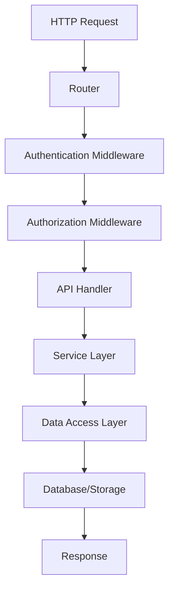
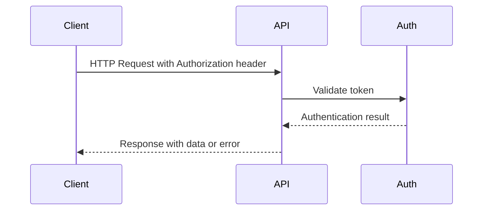
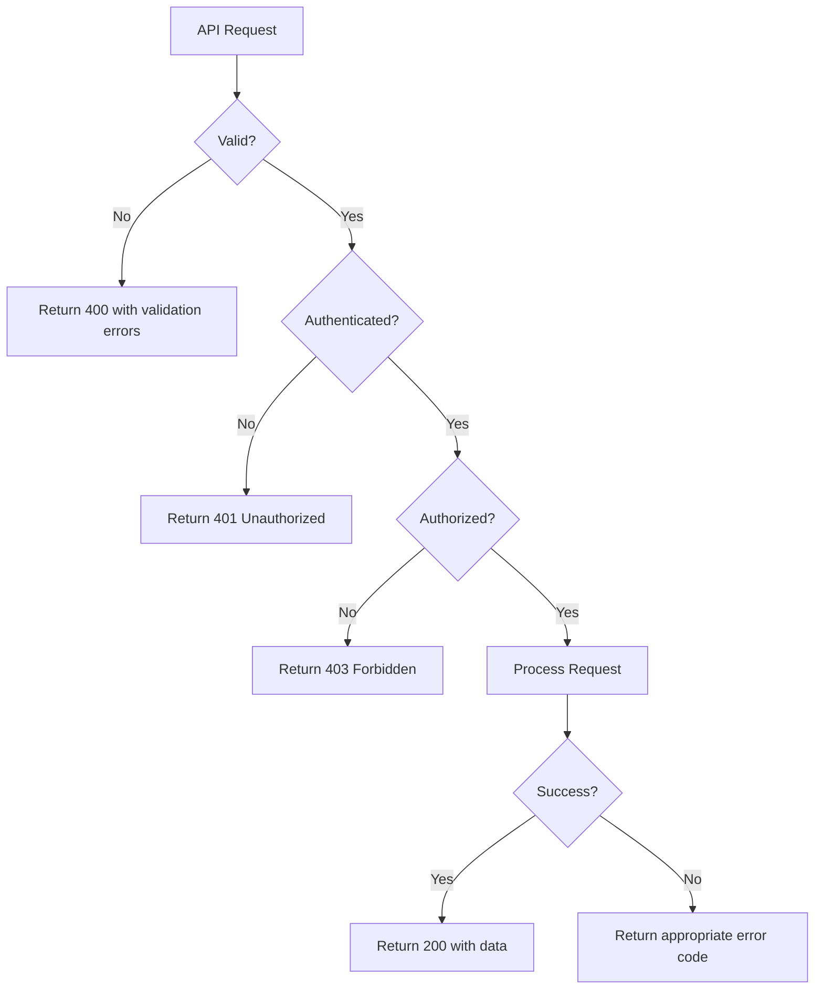
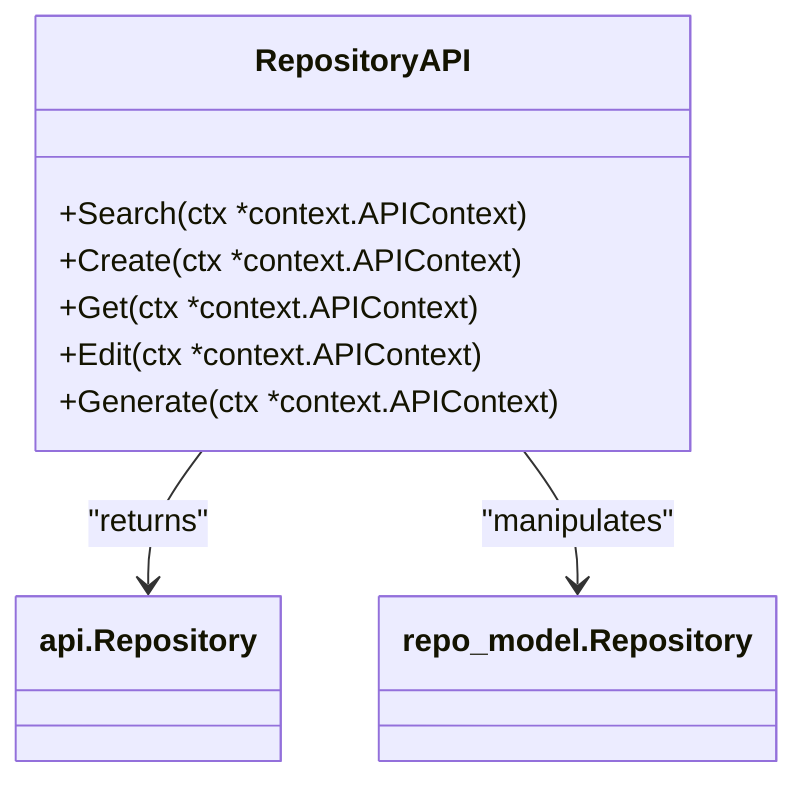
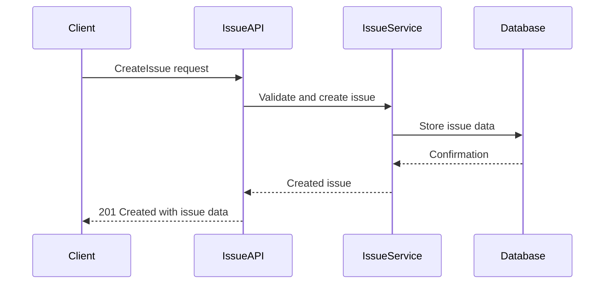
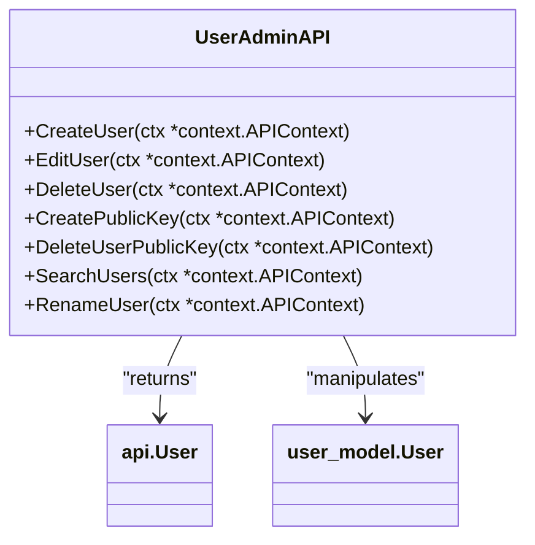
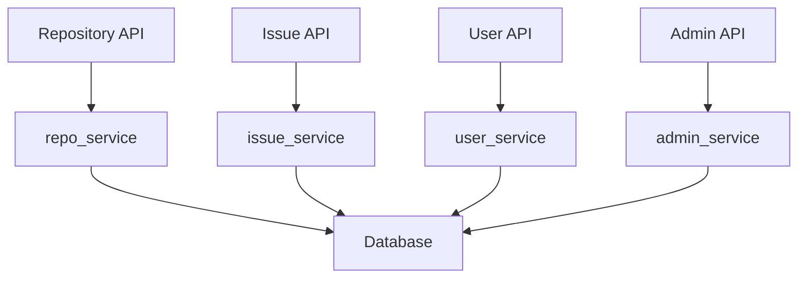

# API Reference

<cite>
**Referenced Files in This Document**   
- [api.go](file://routers/api/v1/api.go)
- [repo.go](file://routers/api/v1/repo/repo.go)
- [issue.go](file://routers/api/v1/repo/issue.go)
- [user.go](file://routers/api/v1/user/user.go)
- [admin/user.go](file://routers/api/v1/admin/user.go)
- [doc.go](file://modules/structs/doc.go)
</cite>

## Table of Contents
1. [Introduction](#introduction)
2. [API Architecture and Implementation](#api-architecture-and-implementation)
3. [Authentication Methods](#authentication-methods)
4. [Rate Limiting](#rate-limiting)
5. [API Versioning](#api-versioning)
6. [Error Handling](#error-handling)
7. [Repository Management](#repository-management)
8. [Issue Tracking](#issue-tracking)
9. [User Administration](#user-administration)
10. [API Groups and Services Relationship](#api-groups-and-services-relationship)
11. [Common Issues](#common-issues)
12. [Performance Considerations](#performance-considerations)
13. [Best Practices](#best-practices)

## Introduction
Gitea provides a comprehensive RESTful API that enables automation and integration with external tools. The API system is designed to expose Gitea's functionality programmatically, allowing developers to manage repositories, issues, users, and other resources through HTTP requests. This documentation covers the implementation details of API endpoints in routers/api/v1 and data structures in modules/structs, including authentication methods, rate limiting, versioning, and error handling.

## API Architecture and Implementation
The Gitea API is implemented in the routers/api/v1 package, with endpoints organized by resource type such as admin, repo, user, and org. The API follows RESTful principles with resources identified by URLs and manipulated using standard HTTP methods. Each API endpoint is implemented as a handler function that processes requests and returns appropriate responses.

The API architecture separates concerns between routing, authentication, and business logic. The api.go file in routers/api/v1 contains middleware functions for authentication, authorization, and request validation that are applied to API endpoints. These middleware functions handle cross-cutting concerns such as sudo access, repository assignment, and permission checking.

**Diagram sources**
- [api.go](file://routers/api/v1/api.go)

**Section sources**
- [api.go](file://routers/api/v1/api.go)

## Authentication Methods
Gitea's API supports multiple authentication methods to accommodate different use cases and security requirements. The authentication system is defined in the SecurityDefinitions section of the API documentation in api.go.

The primary authentication methods include:
- **BasicAuth**: Standard HTTP Basic Authentication using username and password
- **AuthorizationHeaderToken**: API tokens provided in the Authorization header with "token" prefix
- **Token**: API tokens provided as a query parameter (deprecated)
- **AccessToken**: API tokens provided as a query parameter (deprecated)

The AuthorizationHeaderToken method is recommended for new integrations as it is more secure than query parameter-based authentication. The deprecated Token and AccessToken methods will be removed in future versions.

Two-factor authentication is supported through the TOTPHeader security definition, which requires a time-based one-time password when two-factor authentication is enabled for a user account.

**Diagram sources**
- [api.go](file://routers/api/v1/api.go)

**Section sources**
- [api.go](file://routers/api/v1/api.go)

## Rate Limiting
Gitea implements rate limiting to prevent abuse and ensure fair usage of API resources. While the specific rate limiting implementation details are not visible in the provided code, the API is designed to handle high volumes of requests while protecting server resources.

Rate limiting is typically applied at the middleware level, where incoming requests are tracked and limited based on client identity (IP address or API token). When a client exceeds the rate limit, the API returns a 429 Too Many Requests status code with appropriate headers indicating the rate limit status.

The rate limiting system helps prevent denial-of-service attacks and ensures that the API remains available for all users. Administrators can configure rate limiting settings to balance security and usability requirements.

## API Versioning
Gitea's API uses a versioned endpoint structure with the v1 prefix in the URL path (routers/api/v1). This versioning approach allows for backward compatibility while enabling the addition of new features and improvements.

The versioning strategy follows semantic versioning principles, where major versions may include breaking changes, minor versions add functionality in a backward-compatible manner, and patch versions include backward-compatible bug fixes.

The current implementation in the v1 API includes deprecation notices for authentication methods that will be removed in future versions, demonstrating a commitment to graceful deprecation and migration paths for API consumers.

## Error Handling
Gitea's API implements comprehensive error handling to provide meaningful feedback to clients. The error handling system uses HTTP status codes to indicate the result of API requests, with corresponding error messages in the response body.

Common error responses include:
- 400 Bad Request: Invalid request parameters
- 401 Unauthorized: Authentication required or failed
- 403 Forbidden: Insufficient permissions
- 404 Not Found: Resource not found
- 422 Unprocessable Entity: Validation errors
- 500 Internal Server Error: Server-side errors

The API uses helper functions like APIError, APIErrorNotFound, and APIErrorInternal to standardize error responses across endpoints. These functions ensure consistent error formatting and appropriate HTTP status codes.

**Diagram sources**
- [api.go](file://routers/api/v1/api.go)

**Section sources**
- [api.go](file://routers/api/v1/api.go)

## Repository Management
The repository management API endpoints are implemented in routers/api/v1/repo/repo.go and provide comprehensive functionality for creating, reading, updating, and deleting repositories.

Key repository management operations include:
- **Search**: Find repositories based on various criteria such as keyword, owner, visibility, and topics
- **Create**: Create new repositories for users or organizations
- **Get**: Retrieve repository information by owner/name or by ID
- **Edit**: Update repository properties such as name, description, visibility, and settings
- **Generate**: Create repositories from templates

The API supports both user and organization repositories, with appropriate permission checks to ensure users can only manage repositories they have access to. Repository creation includes validation for name uniqueness, reserved names, and naming patterns.

**Diagram sources**
- [repo.go](file://routers/api/v1/repo/repo.go)
- [doc.go](file://modules/structs/doc.go)

**Section sources**
- [repo.go](file://routers/api/v1/repo/repo.go)

## Issue Tracking
The issue tracking API endpoints are implemented in routers/api/v1/repo/issue.go and provide functionality for managing issues and pull requests within repositories.

Key issue tracking operations include:
- **SearchIssues**: Search for issues across accessible repositories with various filters
- **ListIssues**: List issues for a specific repository with filtering options
- **GetIssue**: Retrieve a specific issue by index
- **CreateIssue**: Create a new issue with title, description, labels, and assignees
- **EditIssue**: Modify existing issue properties

The issue tracking API supports rich filtering capabilities, allowing clients to search for issues by state, labels, milestones, creation date, and user relationships (created by, assigned to, mentioned, etc.). The API also handles dependencies between issues and enforces repository permissions.

**Diagram sources**
- [issue.go](file://routers/api/v1/repo/issue.go)

**Section sources**
- [issue.go](file://routers/api/v1/repo/issue.go)

## User Administration
The user administration API endpoints are implemented in routers/api/v1/admin/user.go and provide functionality for managing user accounts with administrative privileges.

Key user administration operations include:
- **CreateUser**: Create new user accounts with specified properties
- **EditUser**: Modify existing user properties such as profile, permissions, and authentication settings
- **DeleteUser**: Remove user accounts from the system
- **CreatePublicKey**: Add SSH/GPG keys to user accounts
- **DeleteUserPublicKey**: Remove SSH/GPG keys from user accounts
- **SearchUsers**: Find users based on various criteria
- **RenameUser**: Change a user's username

The user administration API requires site administrator privileges and includes safeguards to prevent deletion of the last admin user and other critical operations. User creation supports integration with external authentication sources through the SourceID parameter.

**Diagram sources**
- [admin/user.go](file://routers/api/v1/admin/user.go)
- [doc.go](file://modules/structs/doc.go)

**Section sources**
- [admin/user.go](file://routers/api/v1/admin/user.go)

## API Groups and Services Relationship
The Gitea API is organized into logical groups that correspond to different resource types and service layers. Each API group interacts with corresponding service components to implement business logic.

The main API groups and their relationships with services include:
- **Repository API**: Interacts with repo_service for repository operations
- **Issue API**: Uses issue_service for issue management
- **User API**: Connects to user_service for user operations
- **Admin API**: Utilizes admin-specific services for user and system management

This separation of concerns allows for modular development and maintenance of API functionality. The service layer abstracts business logic from HTTP request handling, enabling code reuse across different interfaces (API, web UI, etc.).

**Diagram sources**
- [repo.go](file://routers/api/v1/repo/repo.go)
- [issue.go](file://routers/api/v1/repo/issue.go)
- [user.go](file://routers/api/v1/user/user.go)
- [admin/user.go](file://routers/api/v1/admin/user.go)

**Section sources**
- [repo.go](file://routers/api/v1/repo/repo.go)
- [issue.go](file://routers/api/v1/repo/issue.go)
- [user.go](file://routers/api/v1/user/user.go)
- [admin/user.go](file://routers/api/v1/admin/user.go)

## Common Issues
When working with the Gitea API, several common issues may arise:

**Authentication Failures**: These typically occur when using deprecated authentication methods or incorrect token formats. The recommended solution is to use the AuthorizationHeaderToken method with properly formatted tokens.

**Rate Limiting**: Clients may encounter rate limiting when making too many requests in a short period. Implementing exponential backoff and respecting rate limit headers can mitigate this issue.

**Permission Errors**: Users may receive 403 Forbidden responses when attempting operations they don't have permission for. Ensuring proper role assignment and understanding permission hierarchies can resolve these issues.

**Validation Errors**: 422 Unprocessable Entity responses indicate invalid request data. Carefully reviewing API documentation and validating request payloads before submission can prevent these errors.

**Deprecated Endpoints**: Some endpoints may be deprecated or scheduled for removal. Monitoring deprecation notices in the API documentation and updating integrations accordingly is essential.

## Performance Considerations
When using the Gitea API at scale, several performance considerations should be addressed:

**Pagination**: Use pagination parameters (page, limit) to avoid retrieving large result sets that can impact performance. The API supports configurable page sizes with reasonable defaults.

**Caching**: Implement client-side caching for frequently accessed but infrequently changing data to reduce API calls and improve response times.

**Batch Operations**: Where possible, use endpoints that support batch operations to minimize the number of HTTP requests.

**Rate Limit Awareness**: Design applications to respect rate limits and implement retry logic with exponential backoff for rate-limited requests.

**Efficient Filtering**: Use available filtering parameters to retrieve only the data needed, reducing payload sizes and processing time.

**Connection Reuse**: Use persistent HTTP connections to reduce the overhead of establishing new connections for each request.

## Best Practices
To ensure efficient and reliable API consumption, follow these best practices:

**Use Current Authentication Methods**: Always use the recommended AuthorizationHeaderToken method rather than deprecated query parameter-based authentication.

**Handle Errors Gracefully**: Implement comprehensive error handling to manage various error conditions and provide meaningful feedback to users.

**Respect Rate Limits**: Monitor rate limit headers and adjust request patterns to avoid exceeding limits.

**Use Pagination**: Always implement pagination for list endpoints to handle large datasets efficiently.

**Validate Input**: Validate request data before sending to prevent 422 validation errors.

**Keep Dependencies Updated**: Regularly update API client libraries and review deprecation notices to maintain compatibility.

**Secure Credentials**: Store API tokens securely and follow the principle of least privilege when creating tokens with specific scopes.

**Monitor API Changes**: Subscribe to Gitea release notes and API documentation updates to stay informed about changes and improvements.