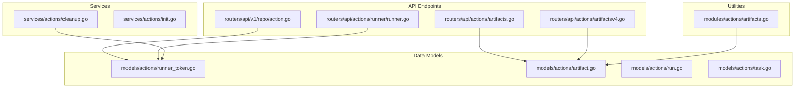
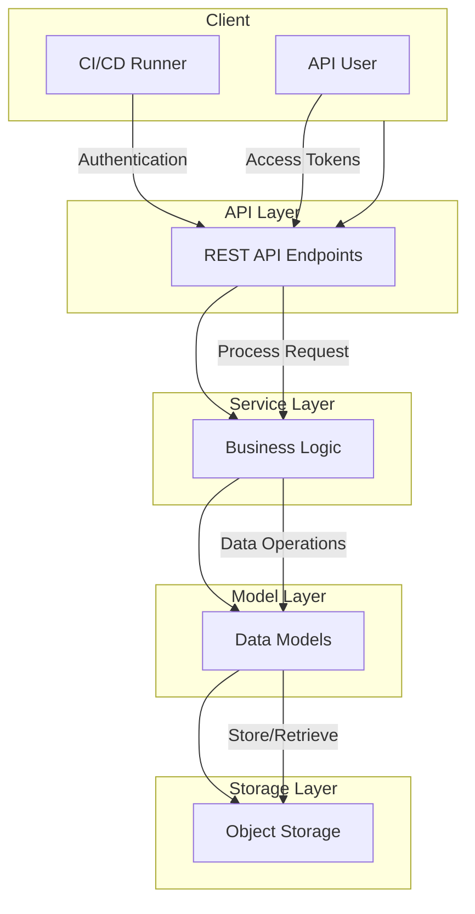
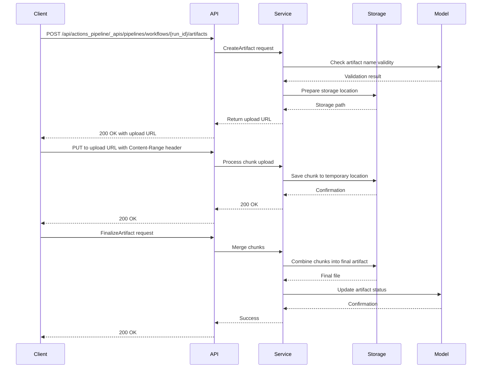
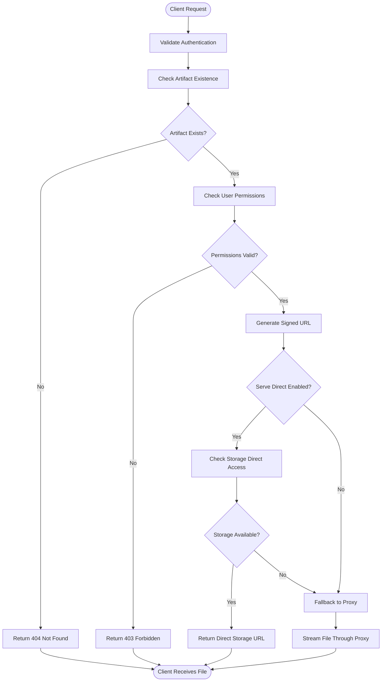
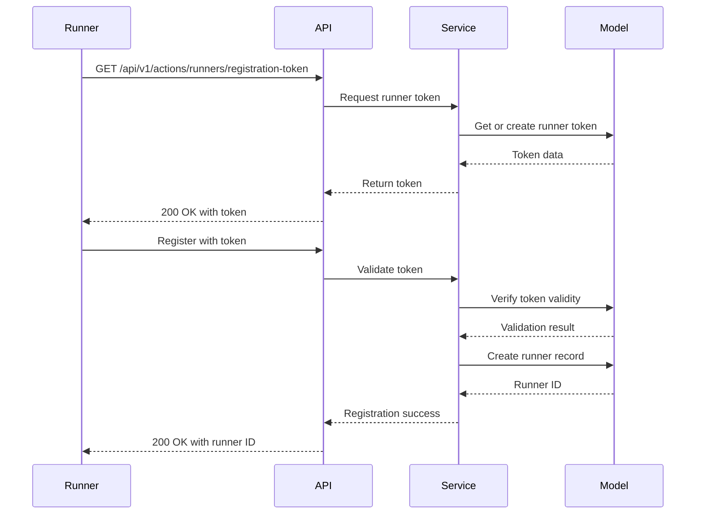
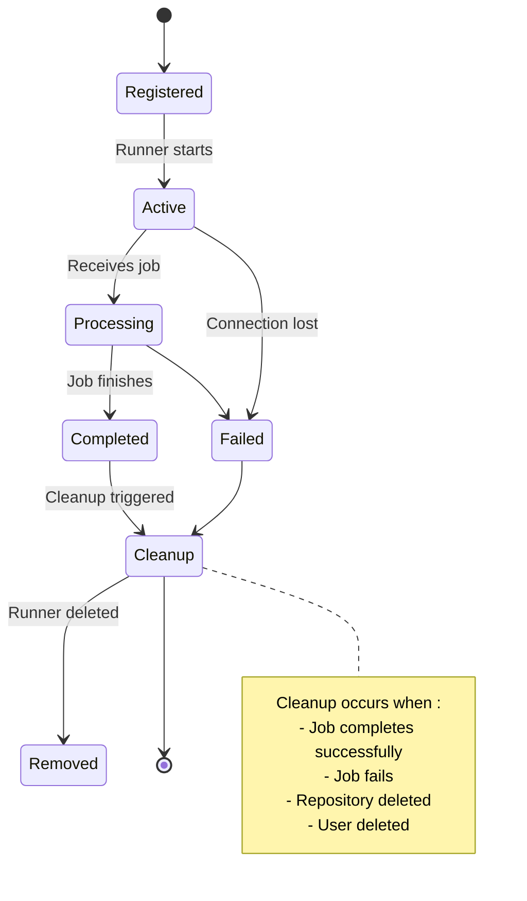
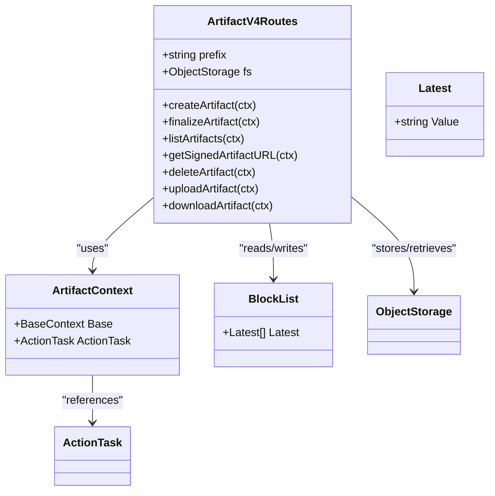
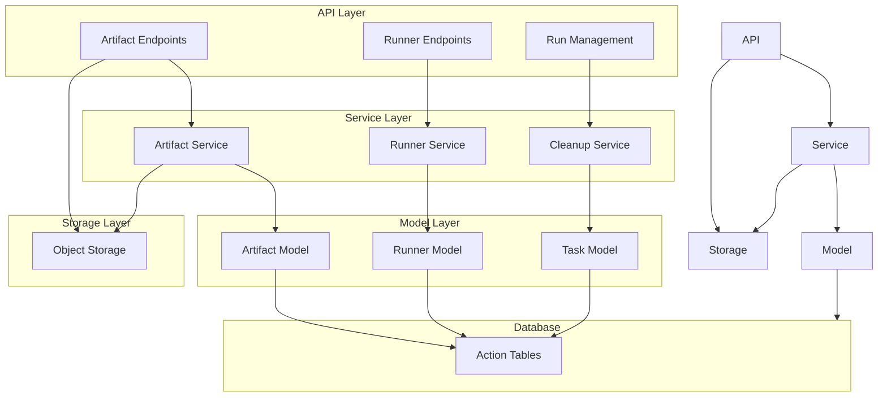

# Actions API

<cite>
**Referenced Files in This Document**   
- [action.go](file://routers/api/v1/repo/action.go)
- [actions_run.go](file://routers/api/v1/repo/actions_run.go)
- [artifacts.go](file://routers/api/actions/artifacts.go)
- [artifacts_chunks.go](file://routers/api/actions/artifacts_chunks.go)
- [artifacts_utils.go](file://routers/api/actions/artifacts_utils.go)
- [artifactsv4.go](file://routers/api/actions/artifactsv4.go)
- [runner.go](file://routers/api/actions/runner/runner.go)
- [runner_token.go](file://models/actions/runner_token.go)
- [artifacts.go](file://modules/actions/artifacts.go)
- [cleanup.go](file://services/actions/cleanup.go)
</cite>

## Table of Contents
1. [Introduction](#introduction)
2. [Project Structure](#project-structure)
3. [Core Components](#core-components)
4. [Architecture Overview](#architecture-overview)
5. [Detailed Component Analysis](#detailed-component-analysis)
6. [Dependency Analysis](#dependency-analysis)
7. [Performance Considerations](#performance-considerations)
8. [Troubleshooting Guide](#troubleshooting-guide)
9. [Conclusion](#conclusion)

## Introduction
This document provides comprehensive documentation for Gitea's Actions (CI/CD) API, covering endpoints for managing workflow runs, jobs, artifacts, and runners. It details artifact upload/download operations with chunked transfer support, run triggering mechanisms, and runner registration. The documentation explains authentication methods using runner tokens and access tokens, describes the artifact storage protocol including the v4 API with improved performance and reliability, and provides examples for uploading build artifacts, downloading workflow logs, and managing ephemeral runners. Common issues such as artifact upload failures, runner connectivity problems, and authentication token expiration are addressed, along with performance considerations for large artifact transfers and best practices for efficient workflow execution monitoring.

## Project Structure
The Gitea Actions API is organized across multiple directories with clear separation of concerns. The API endpoints are primarily located in the `routers/api/v1/repo/` directory for repository-level actions and `routers/api/actions/` for runner-specific operations. Core data models are defined in `models/actions/`, while business logic is implemented in `services/actions/`. Utility functions for handling artifacts are located in `modules/actions/`.

**Diagram sources**
- [action.go](file://routers/api/v1/repo/action.go)
- [artifacts.go](file://routers/api/actions/artifacts.go)
- [artifactsv4.go](file://routers/api/actions/artifactsv4.go)
- [runner.go](file://routers/api/actions/runner/runner.go)
- [runner_token.go](file://models/actions/runner_token.go)
- [artifacts.go](file://modules/actions/artifacts.go)
- [cleanup.go](file://services/actions/cleanup.go)

**Section sources**
- [action.go](file://routers/api/v1/repo/action.go)
- [artifacts.go](file://routers/api/actions/artifacts.go)
- [artifactsv4.go](file://routers/api/actions/artifactsv4.go)
- [runner.go](file://routers/api/actions/runner/runner.go)
- [runner_token.go](file://models/actions/runner_token.go)

## Core Components
The Gitea Actions API consists of several core components that work together to provide CI/CD functionality. These include workflow run management, job execution, artifact storage and retrieval, and runner registration and authentication. The system supports both traditional artifact storage (v3) and the improved v4 protocol with better performance and reliability. Authentication is handled through both access tokens for API operations and runner tokens for secure runner registration.

**Section sources**
- [action.go](file://routers/api/v1/repo/action.go)
- [artifacts.go](file://routers/api/actions/artifacts.go)
- [artifactsv4.go](file://routers/api/actions/artifactsv4.go)
- [runner.go](file://routers/api/actions/runner/runner.go)

## Architecture Overview
The Gitea Actions API follows a layered architecture with clear separation between API endpoints, business logic, data models, and storage. The API layer handles HTTP requests and responses, the service layer implements business logic, the model layer defines data structures and database interactions, and the storage layer manages artifact persistence.

**Diagram sources**
- [action.go](file://routers/api/v1/repo/action.go)
- [artifacts.go](file://routers/api/actions/artifacts.go)
- [artifactsv4.go](file://routers/api/actions/artifactsv4.go)
- [runner.go](file://routers/api/actions/runner/runner.go)
- [runner_token.go](file://models/actions/runner_token.go)

## Detailed Component Analysis

### Artifact Management
The artifact management system in Gitea's Actions API provides comprehensive functionality for uploading, downloading, and managing build artifacts. It supports both chunked uploads for large files and direct uploads for smaller artifacts. The v4 API introduces improved performance and reliability with protobuf-based communication and better error handling.

#### Artifact Upload Process

**Diagram sources**
- [artifacts.go](file://routers/api/actions/artifacts.go)
- [artifacts_chunks.go](file://routers/api/actions/artifacts_chunks.go)
- [artifacts_utils.go](file://routers/api/actions/artifacts_utils.go)

#### Artifact Download Process

**Diagram sources**
- [artifacts.go](file://routers/api/actions/artifacts.go)
- [artifacts_utils.go](file://routers/api/actions/artifacts_utils.go)
- [artifacts.go](file://modules/actions/artifacts.go)

**Section sources**
- [artifacts.go](file://routers/api/actions/artifacts.go)
- [artifacts_chunks.go](file://routers/api/actions/artifacts_chunks.go)
- [artifacts_utils.go](file://routers/api/actions/artifacts_utils.go)
- [artifacts.go](file://modules/actions/artifacts.go)

### Runner Management
The runner management system handles the registration, authentication, and lifecycle of CI/CD runners. It uses secure token-based authentication and supports both persistent and ephemeral runners. The system ensures secure communication between runners and the Gitea server while providing mechanisms for runner cleanup and resource management.

#### Runner Registration Process

**Diagram sources**
- [runner.go](file://routers/api/actions/runner/runner.go)
- [runner_token.go](file://models/actions/runner_token.go)
- [init.go](file://services/actions/init.go)

#### Ephemeral Runner Lifecycle

**Diagram sources**
- [runner.go](file://routers/api/actions/runner/runner.go)
- [runner_token.go](file://models/actions/runner_token.go)
- [cleanup.go](file://services/actions/cleanup.go)

**Section sources**
- [runner.go](file://routers/api/actions/runner/runner.go)
- [runner_token.go](file://models/actions/runner_token.go)
- [cleanup.go](file://services/actions/cleanup.go)

### Artifact Storage Protocol (v4)
The v4 artifact storage protocol represents a significant improvement over previous versions, offering better performance, reliability, and security. It uses protobuf-based communication, signed URLs for secure access, and optimized chunk handling for large file transfers.

#### v4 Artifact Operations

**Diagram sources**
- [artifactsv4.go](file://routers/api/actions/artifactsv4.go)
- [artifacts.go](file://models/actions/artifact.go)

**Section sources**
- [artifactsv4.go](file://routers/api/actions/artifactsv4.go)

## Dependency Analysis
The Gitea Actions API components have well-defined dependencies that ensure proper separation of concerns while maintaining necessary interactions between layers. The API layer depends on the service layer for business logic, which in turn depends on the model layer for data operations. The storage layer is accessed directly by both the API and service layers for artifact management.

**Diagram sources**
- [artifacts.go](file://routers/api/actions/artifacts.go)
- [artifactsv4.go](file://routers/api/actions/artifactsv4.go)
- [runner.go](file://routers/api/actions/runner/runner.go)
- [action.go](file://routers/api/v1/repo/action.go)
- [runner_token.go](file://models/actions/runner_token.go)
- [cleanup.go](file://services/actions/cleanup.go)

**Section sources**
- [artifacts.go](file://routers/api/actions/artifacts.go)
- [artifactsv4.go](file://routers/api/actions/artifactsv4.go)
- [runner.go](file://routers/api/actions/runner/runner.go)
- [action.go](file://routers/api/v1/repo/action.go)
- [runner_token.go](file://models/actions/runner_token.go)
- [cleanup.go](file://services/actions/cleanup.go)

## Performance Considerations
The Gitea Actions API includes several performance optimizations, particularly for handling large artifact transfers. The v4 artifact protocol supports chunked uploads to prevent memory exhaustion and enable resumable transfers. Direct serving of artifacts through storage URLs reduces server load when supported by the storage backend. The system also implements efficient database queries and caching mechanisms for frequently accessed data.

For large artifact transfers, the API recommends using the v4 protocol with chunked uploads to ensure reliability and minimize memory usage. When available, enabling direct serving of artifacts can significantly reduce server load by allowing clients to download directly from the storage backend. The system's cleanup mechanisms for ephemeral runners and completed tasks help maintain optimal performance by removing unused resources.

**Section sources**
- [artifacts.go](file://routers/api/actions/artifacts.go)
- [artifacts_chunks.go](file://routers/api/actions/artifacts_chunks.go)
- [artifactsv4.go](file://routers/api/actions/artifactsv4.go)
- [cleanup.go](file://services/actions/cleanup.go)

## Troubleshooting Guide
This section addresses common issues encountered when using the Gitea Actions API and provides guidance for resolution.

### Artifact Upload Failures
Common causes of artifact upload failures include:
- Invalid artifact names containing forbidden characters (\, /, ", :, <, >, |, *, ?, \r, \n)
- Missing or invalid authentication tokens
- Network interruptions during chunked uploads
- Storage backend issues

To resolve upload failures:
1. Verify the artifact name contains only valid characters
2. Ensure the authentication token has appropriate permissions
3. Check network connectivity between the runner and server
4. Verify the storage backend is accessible and has sufficient space

**Section sources**
- [artifacts_utils.go](file://routers/api/actions/artifacts_utils.go)
- [artifacts_chunks.go](file://routers/api/actions/artifacts_chunks.go)

### Runner Connectivity Problems
Runner connectivity issues may stem from:
- Expired or invalid runner tokens
- Network connectivity problems
- Server-side rate limiting
- Firewall or proxy configurations

To resolve connectivity problems:
1. Regenerate the runner token if it has expired
2. Verify network connectivity and firewall rules
3. Check server logs for error messages
4. Ensure the runner has the correct server URL and credentials

**Section sources**
- [runner_token.go](file://models/actions/runner_token.go)
- [runner.go](file://routers/api/actions/runner/runner.go)

### Authentication Token Expiration
Authentication tokens for runners are designed to be secure and may expire or be invalidated. The system automatically generates new tokens when needed, but administrators should monitor token usage and rotation.

To manage token expiration:
1. Implement token refresh mechanisms in runners
2. Monitor token usage through server logs
3. Use environment variables or files for token storage
4. Regularly rotate tokens for security

**Section sources**
- [runner_token.go](file://models/actions/runner_token.go)
- [init.go](file://services/actions/init.go)

## Conclusion
The Gitea Actions API provides a comprehensive and robust CI/CD solution with well-designed endpoints for managing workflow runs, jobs, artifacts, and runners. The system's architecture ensures separation of concerns while maintaining efficient communication between components. The v4 artifact protocol offers significant improvements in performance and reliability, particularly for large file transfers. Security is prioritized through token-based authentication and secure communication channels. The API's design supports both persistent and ephemeral runners, with automated cleanup mechanisms to maintain system efficiency. With proper configuration and monitoring, the Gitea Actions API can serve as a reliable foundation for continuous integration and deployment workflows.