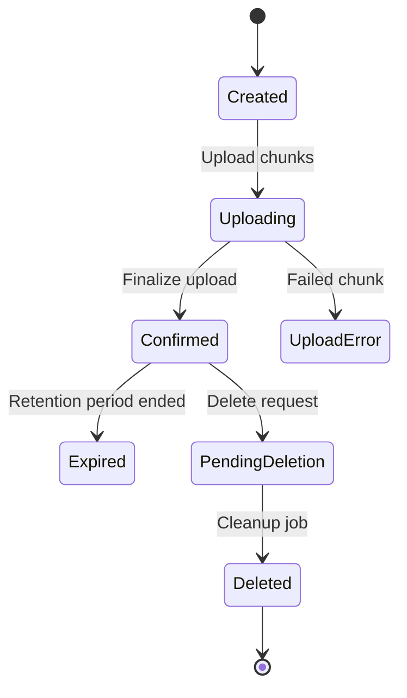
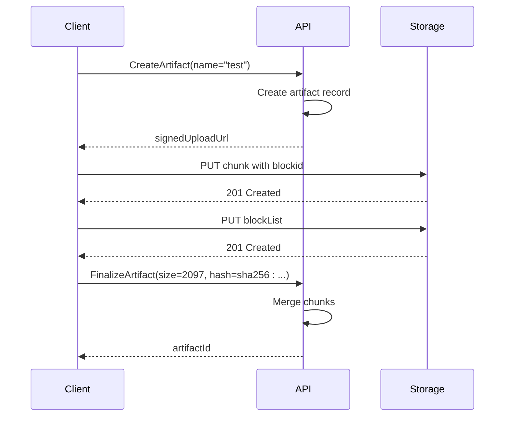
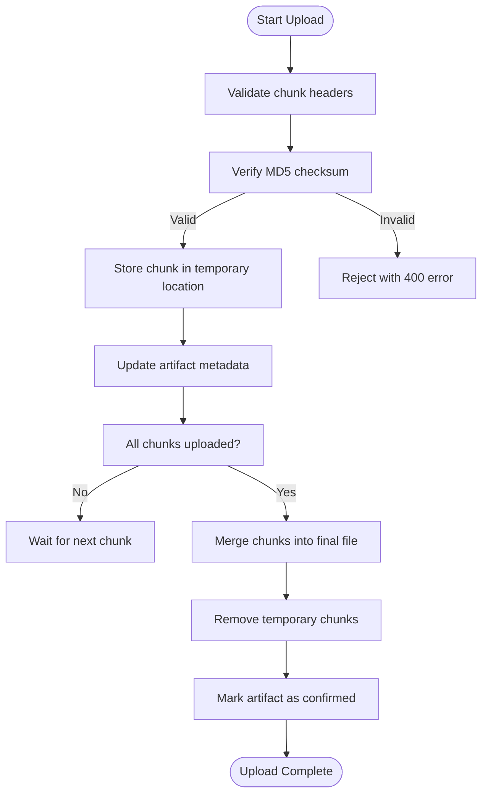
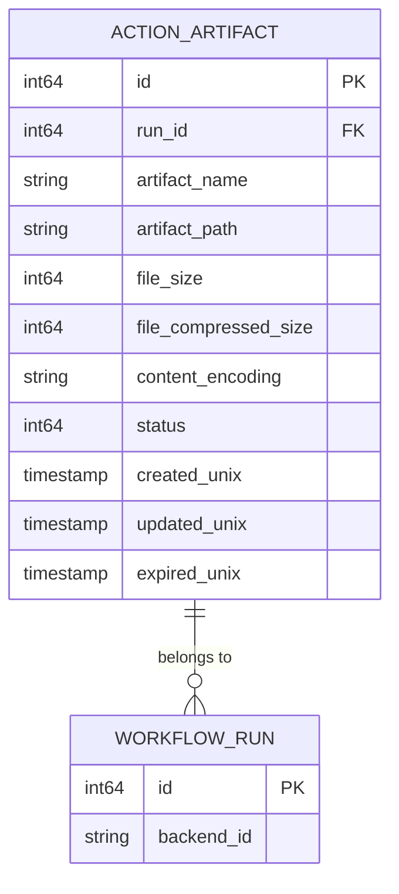

# Artifacts Management

<cite>
**Referenced Files in This Document**   
- [artifact.go](file://models/actions/artifact.go)
- [artifacts.go](file://routers/api/actions/artifacts.go)
- [artifacts_chunks.go](file://routers/api/actions/artifacts_chunks.go)
- [artifacts_utils.go](file://routers/api/actions/artifacts_utils.go)
- [artifactsv4.go](file://routers/api/actions/artifactsv4.go)
- [artifact.proto](file://routers/api/actions/artifact.proto)
- [artifact.pb.go](file://routers/api/actions/artifact.pb.go)
- [artifacts.go](file://modules/actions/artifacts.go)
</cite>

## Table of Contents
1. [Introduction](#introduction)
2. [API Overview](#api-overview)
3. [Artifact Lifecycle Management](#artifact-lifecycle-management)
4. [V4 Artifact API](#v4-artifact-api)
5. [Chunked Uploads and Resumable Transfers](#chunked-uploads-and-resumable-transfers)
6. [Artifact Metadata and Indexing](#artifact-metadata-and-indexing)
7. [Error Handling and Common Issues](#error-handling-and-common-issues)
8. [Performance Considerations](#performance-considerations)
9. [Best Practices for CI/CD Integration](#best-practices-for-cicd-integration)
10. [Storage and Cleanup Policies](#storage-and-cleanup-policies)

## Introduction

Gitea's Artifacts Management API provides a comprehensive system for handling workflow artifacts generated during CI/CD pipeline execution. The API supports both traditional artifact management and the enhanced v4 protocol, offering robust features for uploading, downloading, and managing artifacts with support for chunked transfers and resumable uploads. This documentation details the complete artifact management system, including endpoint specifications, data formats, and integration patterns.

The artifact system is designed to handle large files efficiently, with mechanisms for chunked uploads, integrity verification, and optimized storage. Artifacts are associated with workflow runs and jobs, enabling traceability and proper lifecycle management. The system supports both direct storage access and proxy-based transfers, providing flexibility for different deployment scenarios.

**Section sources**
- [artifact.go](file://models/actions/artifact.go#L1-L214)
- [artifacts.go](file://routers/api/actions/artifacts.go#L1-L504)

## API Overview

The Artifacts Management API provides two main interfaces: the legacy API and the v4 API. The legacy API uses RESTful endpoints with JSON payloads, while the v4 API implements a Twirp-based RPC protocol using Protocol Buffers. Both APIs support artifact creation, upload, download, listing, and deletion operations.

The legacy API endpoints are rooted at `/api/actions_pipeline/_apis/pipelines/workflows/{run_id}/artifacts`, while the v4 API uses the Twirp endpoint `/twirp/github.actions.results.api.v1.ArtifactService`. Authentication is performed using JWT tokens or legacy GITEA_TOKEN values passed in the Authorization header with Bearer scheme.

Key operations include:
- Creating artifact upload URLs
- Uploading artifact chunks with integrity verification
- Finalizing artifact uploads
- Listing available artifacts
- Generating download URLs
- Deleting artifacts

The API supports both single-file and multi-file artifacts, with the v4 API requiring all artifacts to be uploaded as ZIP files. The system handles artifact metadata storage, content encoding, and size tracking automatically.

**Section sources**
- [artifacts.go](file://routers/api/actions/artifacts.go#L1-L504)
- [artifactsv4.go](file://routers/api/actions/artifactsv4.go#L1-L587)

## Artifact Lifecycle Management

The artifact lifecycle consists of several states managed through the API. When an artifact is created, it enters the `ArtifactStatusUploadPending` state. During upload, chunks are stored temporarily, and upon successful completion, the artifact transitions to `ArtifactStatusUploadConfirmed`. Artifacts can also enter error states or be marked for deletion.

The lifecycle begins with artifact creation, where the client requests an upload URL by providing the artifact name and optional retention period. The server responds with a signed URL that grants temporary write access to the storage backend. During upload, chunks are verified for integrity using MD5 checksums before being stored.

After all chunks are uploaded, the client confirms the upload, triggering the merge process where chunks are combined into a single file. The artifact is then marked as confirmed and becomes available for download. Artifacts can be deleted explicitly or automatically when they expire based on the retention policy.

**Diagram sources **
- [artifact.go](file://models/actions/artifact.go#L15-L35)
- [artifacts.go](file://routers/api/actions/artifacts.go#L1-L504)

**Section sources**
- [artifact.go](file://models/actions/artifact.go#L1-L214)
- [artifacts.go](file://routers/api/actions/artifacts.go#L1-L504)

## V4 Artifact API

The v4 Artifact API represents a significant enhancement over the legacy system, providing improved performance, reliability, and storage efficiency. Implemented as a Twirp RPC service, it uses Protocol Buffers for message serialization and follows the GitHub Actions Artifacts V4 specification.

The v4 API requires all artifacts to be uploaded as ZIP files with `application/zip` content encoding. This standardization enables better storage optimization and faster processing. The API uses a block-based upload mechanism that supports parallel and out-of-order chunk uploads, improving upload performance for large files.

Key endpoints include:
- `CreateArtifact`: Initiates artifact creation and returns a signed upload URL
- `UploadArtifact`: Handles chunk uploads with block identifiers
- `FinalizeArtifact`: Completes the upload by providing size and checksum
- `ListArtifacts`: Retrieves available artifacts for a workflow run
- `GetSignedArtifactURL`: Generates a download URL for an artifact
- `DeleteArtifact`: Marks an artifact for deletion

The v4 API implements strict signature verification using HMAC-SHA256 to ensure request authenticity. URLs include expiration timestamps and are valid for 60 minutes by default. The API also supports block lists to ensure proper ordering of chunks when merging.

**Diagram sources **
- [artifactsv4.go](file://routers/api/actions/artifactsv4.go#L1-L587)
- [artifact.proto](file://routers/api/actions/artifact.proto#L1-L74)

**Section sources**
- [artifactsv4.go](file://routers/api/actions/artifactsv4.go#L1-L587)
- [artifact.proto](file://routers/api/actions/artifact.proto#L1-L74)

## Chunked Uploads and Resumable Transfers

The artifact system supports chunked uploads to handle large files efficiently and enable resumable transfers. Both the legacy and v4 APIs implement chunking, but with different approaches. The legacy API uses content-range headers to specify byte ranges, while the v4 API uses block identifiers for more flexible upload patterns.

For the legacy API, chunks are uploaded with the following headers:
- `x-tfs-filelength`: Total file size
- `content-length`: Chunk length
- `x-actions-results-md5`: MD5 checksum of the chunk
- `content-range`: Byte range in format "bytes 0-1023/1024"

Each chunk is verified for integrity before storage. If a chunk fails verification, it is discarded, and the client can retry the upload. The system tracks uploaded chunks and can resume interrupted uploads by checking which ranges have been successfully stored.

The v4 API uses a more sophisticated approach with block identifiers. Clients can upload blocks in any order and even in parallel. A block list is then provided to specify the final order of blocks. This enables better performance for large files and more reliable resumable uploads.

**Diagram sources **
- [artifacts_chunks.go](file://routers/api/actions/artifacts_chunks.go#L1-L302)
- [artifacts.go](file://routers/api/actions/artifacts.go#L1-L504)

**Section sources**
- [artifacts_chunks.go](file://routers/api/actions/artifacts_chunks.go#L1-L302)
- [artifacts_utils.go](file://routers/api/actions/artifacts_utils.go#L1-L95)

## Artifact Metadata and Indexing

Artifact metadata is stored in the database and includes essential information for artifact management and retrieval. The `ActionArtifact` struct defines the schema with fields for identification, size, status, and storage location. Metadata is used for indexing, searching, and enforcing retention policies.

Key metadata fields include:
- `RunID`: Associated workflow run
- `ArtifactName`: User-defined name
- `ArtifactPath`: Path within the artifact
- `FileSize`: Original file size in bytes
- `FileCompressedSize`: Size after compression
- `ContentEncoding`: Content encoding (e.g., gzip, application/zip)
- `Status`: Current status (pending, confirmed, expired, etc.)
- `CreatedUnix`: Creation timestamp
- `ExpiredUnix`: Expiration timestamp

The v4 API uses Protocol Buffers to define message formats for metadata exchange. The `artifact.proto` file defines messages for create, finalize, list, and download operations. These messages ensure consistent data format across the API and enable efficient serialization.

Metadata indexing is optimized for common queries, with database indexes on `run_id`, `artifact_name`, and `status` fields. This enables fast retrieval of artifacts by workflow run or name. The system also supports filtering in list operations to reduce response size.

**Diagram sources **
- [artifact.go](file://models/actions/artifact.go#L45-L100)
- [artifact.proto](file://routers/api/actions/artifact.proto#L1-L74)

**Section sources**
- [artifact.go](file://models/actions/artifact.go#L1-L214)
- [artifact.proto](file://routers/api/actions/artifact.proto#L1-L74)

## Error Handling and Common Issues

The artifact API implements comprehensive error handling to ensure reliable operation. Common issues include storage quota limitations, incomplete chunk uploads, network interruptions, and authentication failures. The system provides specific error codes and messages to help diagnose and resolve issues.

Storage quota limitations are enforced at the repository and instance levels. When a quota is exceeded, uploads fail with a 403 error. Clients should monitor storage usage and implement cleanup policies to prevent quota exhaustion.

Incomplete chunk uploads can occur due to network issues or client crashes. The system detects missing chunks during the finalize phase and rejects the upload. Clients should implement retry logic with exponential backoff to handle transient failures.

Authentication failures occur when tokens are invalid or expired. The API returns 401 errors in these cases. Clients should refresh tokens as needed and handle authentication errors gracefully.

Other common issues include:
- Invalid artifact names containing special characters
- Mismatched content-length and range headers
- Expired signed URLs
- Checksum verification failures
- Concurrent upload conflicts

Clients should implement robust error handling, including retry mechanisms, proper error logging, and user-friendly error messages.

**Section sources**
- [artifacts.go](file://routers/api/actions/artifacts.go#L1-L504)
- [artifacts_utils.go](file://routers/api/actions/artifacts_utils.go#L1-L95)
- [artifacts_chunks.go](file://routers/api/actions/artifacts_chunks.go#L1-L302)

## Performance Considerations

Optimizing artifact transfer performance involves several strategies. For uploads, using the v4 API with parallel block uploads can significantly improve throughput for large files. The block-based approach allows clients to upload multiple chunks simultaneously, maximizing network utilization.

Storage backend selection impacts performance. Object storage systems like S3 or MinIO typically offer better scalability and performance than local file storage. When possible, enable direct serving from the storage backend to reduce server load during downloads.

Chunk size optimization is important for balancing overhead and resilience. The default chunk size should be large enough to minimize request overhead but small enough to enable efficient retries. A chunk size of 4-8MB is typically optimal.

For high-volume scenarios, consider:
- Using the v4 API for better performance
- Implementing client-side compression
- Enabling direct storage access
- Optimizing storage backend configuration
- Monitoring and tuning database performance

The system automatically handles many performance aspects, such as efficient chunk merging and storage path optimization, but proper configuration is essential for optimal results.

**Section sources**
- [artifacts.go](file://routers/api/actions/artifacts.go#L1-L504)
- [artifacts_chunks.go](file://routers/api/actions/artifacts_chunks.go#L1-L302)
- [artifactsv4.go](file://routers/api/actions/artifactsv4.go#L1-L587)

## Best Practices for CI/CD Integration

Integrating artifact management into CI/CD pipelines requires following several best practices. First, always use the v4 API when possible, as it offers better performance and reliability. Implement proper error handling with retry logic for transient failures.

Manage artifact lifecycles carefully by setting appropriate retention periods. Avoid keeping artifacts longer than necessary to conserve storage. Implement cleanup policies to remove obsolete artifacts automatically.

For large artifacts, use streaming uploads and downloads to minimize memory usage. When uploading multiple files, consider combining them into a single archive to reduce overhead.

Security considerations include:
- Using secure authentication tokens
- Validating artifact names to prevent path traversal
- Monitoring storage usage
- Implementing access controls
- Regularly auditing artifact usage

Monitor pipeline performance and adjust chunk sizes and concurrency settings based on observed behavior. Use the API's listing and metadata features to implement artifact dependency management and versioning.

**Section sources**
- [artifacts.go](file://routers/api/actions/artifacts.go#L1-L504)
- [artifactsv4.go](file://routers/api/actions/artifactsv4.go#L1-L587)
- [artifacts_utils.go](file://routers/api/actions/artifacts_utils.go#L1-L95)

## Storage and Cleanup Policies

The artifact system implements automated storage management through retention and cleanup policies. Artifacts are assigned expiration times based on the configured retention period, defaulting to the global setting in `setting.Actions.ArtifactRetentionDays`.

Expired artifacts are not immediately deleted. Instead, they are marked with `ArtifactStatusExpired` and included in cleanup operations. A background job periodically identifies artifacts that need deletion and marks them with `ArtifactStatusPendingDeletion`. Another job processes these artifacts, removing them from storage and updating their status to `ArtifactStatusDeleted`.

The cleanup process is designed to be resilient and efficient, handling large volumes of artifacts without impacting system performance. Temporary chunk files are also cleaned up during the merge process or when uploads are abandoned.

Storage efficiency is improved through several mechanisms:
- Deduplication of identical chunks
- Efficient storage path organization
- Automatic compression
- Direct serving from storage backend

Administrators can configure retention policies at the instance level and override them for specific repositories or workflows as needed.

**Section sources**
- [artifact.go](file://models/actions/artifact.go#L1-L214)
- [artifacts_chunks.go](file://routers/api/actions/artifacts_chunks.go#L1-L302)
- [artifactsv4.go](file://routers/api/actions/artifactsv4.go#L1-L587)