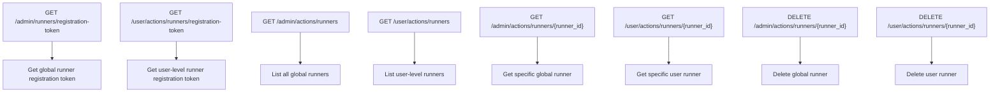
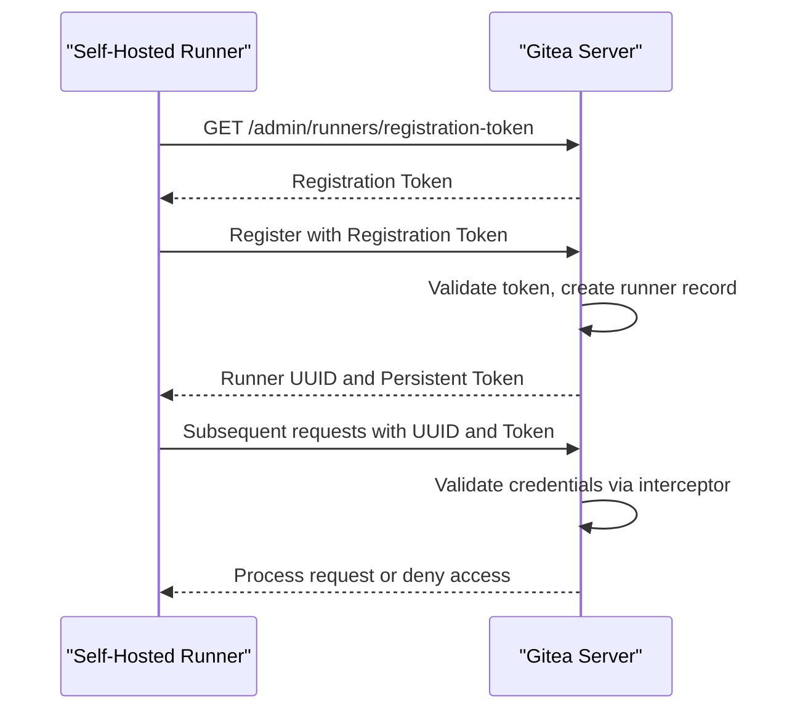
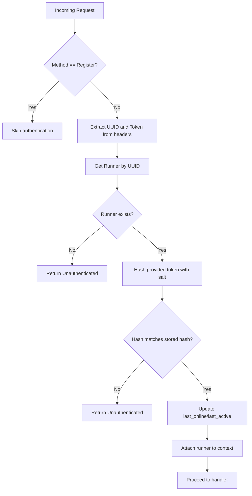
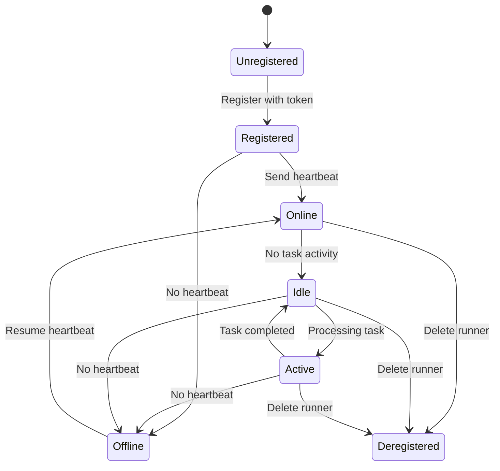
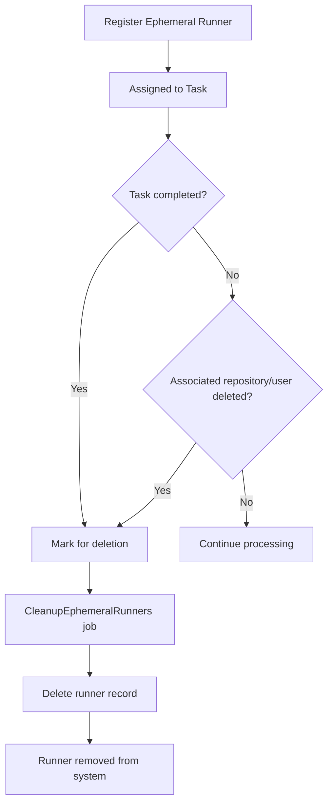

# Runner Management

<cite>
**Referenced Files in This Document**   
- [runner.go](file://models/actions/runner.go)
- [runner_token.go](file://models/actions/runner_token.go)
- [runners.go](file://routers/api/v1/admin/runners.go)
- [runners.go](file://routers/api/v1/user/runners.go)
- [actions.go](file://routers/private/actions.go)
- [interceptor.go](file://routers/api/actions/runner/interceptor.go)
- [cleanup.go](file://services/actions/cleanup.go)
</cite>

## Table of Contents
1. [Introduction](#introduction)
2. [Runner Registration and Management Endpoints](#runner-registration-and-management-endpoints)
3. [Authentication Mechanism](#authentication-mechanism)
4. [Interceptor Pattern for Request Validation](#interceptor-pattern-for-request-validation)
5. [Runner Lifecycle Management](#runner-lifecycle-management)
6. [Ephemeral Runner Management](#ephemeral-runner-management)
7. [Common Issues and Troubleshooting](#common-issues-and-troubleshooting)
8. [Performance Considerations](#performance-considerations)
9. [Best Practices for Securing Runner Communications](#best-practices-for-securing-runner-communications)

## Introduction
The Gitea Runner Management system provides a comprehensive API for managing self-hosted runners that execute CI/CD workflows. This documentation details the endpoints, authentication mechanisms, and management patterns for both persistent and ephemeral runners. The system supports global, organization/user-level, and repository-level runners, each with specific registration, authentication, and lifecycle management capabilities.

## Runner Registration and Management Endpoints

The Runner Management system exposes REST API endpoints for registering, listing, retrieving, and deleting runners at different scopes (global, user, and repository levels). These endpoints follow a consistent pattern across different administrative levels.

**Diagram sources**
- [runners.go](file://routers/api/v1/admin/runners.go#L0-L104)
- [runners.go](file://routers/api/v1/user/runners.go#L0-L104)

**Section sources**
- [runners.go](file://routers/api/v1/admin/runners.go#L0-L104)
- [runners.go](file://routers/api/v1/user/runners.go#L0-L104)

## Authentication Mechanism

The Runner Management system employs a token-based authentication mechanism using runner tokens and JWT-based verification. When a runner registers, it uses a registration token to authenticate with the server. The server then generates a unique runner token that is used for subsequent communication.

The authentication process involves:
1. Generating a registration token via the API
2. Using this token to register a new runner
3. Receiving a persistent runner token upon successful registration
4. Using the runner token in subsequent API calls with UUID for identification

**Diagram sources**
- [actions.go](file://routers/private/actions.go#L0-L92)
- [runner_token.go](file://models/actions/runner_token.go#L37-L123)

**Section sources**
- [actions.go](file://routers/private/actions.go#L0-L92)
- [runner_token.go](file://models/actions/runner_token.go#L37-L123)

## Interceptor Pattern for Request Validation

The system implements an interceptor pattern for request validation and security checks using Connect RPC middleware. This interceptor validates runner credentials on every request (except registration) by checking the runner's UUID and token against stored hashed credentials.

The interceptor performs the following steps:
1. Extracts UUID and token from request headers
2. Retrieves the runner record by UUID
3. Hashes the provided token with the stored salt and compares it with the stored hash
4. Updates the runner's last online/active timestamps
5. Attaches the runner context to the request for downstream handlers

**Diagram sources**
- [interceptor.go](file://routers/api/actions/runner/interceptor.go#L0-L80)

**Section sources**
- [interceptor.go](file://routers/api/actions/runner/interceptor.go#L0-L80)

## Runner Lifecycle Management

The Runner Management system handles the complete lifecycle of runners from registration to deregistration. Runners periodically send heartbeats to maintain their online status, and the system automatically manages their state based on activity.

Key aspects of runner lifecycle management include:
- **Registration**: Creating new runner records with unique tokens
- **Heartbeat**: Updating last_online and last_active timestamps
- **Status determination**: Classifying runners as offline, idle, or active
- **Deregistration**: Removing runner records from the system

**Diagram sources**
- [runner.go](file://models/actions/runner.go#L52-L99)
- [runner.go](file://models/actions/runner.go#L244-L297)

**Section sources**
- [runner.go](file://models/actions/runner.go#L52-L99)
- [runner.go](file://models/actions/runner.go#L244-L297)

## Ephemeral Runner Management

Ephemeral runners are designed for single-use scenarios where a runner is created to execute one job and then automatically removed. The system provides specific management for ephemeral runners, including automatic cleanup after task completion.

The ephemeral runner lifecycle includes:
1. Registration as an ephemeral runner
2. Assignment of a single task
3. Execution of the task
4. Automatic deletion after task completion or when associated resources are deleted

**Diagram sources**
- [cleanup.go](file://services/actions/cleanup.go#L136-L155)
- [runner.go](file://models/actions/runner.go#L299-L345)

**Section sources**
- [cleanup.go](file://services/actions/cleanup.go#L136-L155)
- [runner.go](file://models/actions/runner.go#L299-L345)

## Common Issues and Troubleshooting

### Runner Token Expiration
Runner tokens do not have explicit expiration but are rotated during certain operations. If a runner loses its token, it must be re-registered using the registration token.

**Solution**: Generate a new registration token and re-register the runner.

### Connectivity Problems
Runners may experience connectivity issues due to network configuration, firewall rules, or server unavailability.

**Troubleshooting steps**:
1. Verify network connectivity between runner and server
2. Check firewall rules for required ports
3. Validate server availability and API endpoints
4. Review runner logs for connection errors

### Authentication Failures
Authentication failures typically occur due to invalid tokens, incorrect UUIDs, or timing issues.

**Common causes**:
- Using an expired registration token
- Network latency causing token validation issues
- Incorrect header formatting in requests
- Runner clock skew affecting timestamp validation

**Section sources**
- [interceptor.go](file://routers/api/actions/runner/interceptor.go#L0-L80)
- [runner_token.go](file://models/actions/runner_token.go#L79-L123)

## Performance Considerations

When managing large fleets of runners, consider the following performance optimizations:

- **Database indexing**: Ensure proper indexing on frequently queried fields (UUID, last_online, owner_id, repo_id)
- **Connection pooling**: Configure appropriate database connection pool sizes
- **Caching**: Implement caching for frequently accessed runner information
- **Batch operations**: Use batch updates for runner status changes when possible
- **Cleanup scheduling**: Schedule ephemeral runner cleanup during off-peak hours

For large-scale deployments, monitor:
- Database query performance for runner lookups
- API response times for registration and heartbeat endpoints
- Memory usage during peak runner registration periods
- Network bandwidth for runner communication

**Section sources**
- [runner.go](file://models/actions/runner.go#L244-L297)
- [cleanup.go](file://services/actions/cleanup.go#L136-L155)

## Best Practices for Securing Runner Communications

To minimize the attack surface and ensure secure communication between runners and the server:

1. **Use HTTPS**: Always use encrypted connections for all runner communications
2. **Token protection**: Store runner tokens securely and limit their exposure
3. **Network segmentation**: Isolate runners in a separate network segment
4. **Regular rotation**: Periodically rotate runner tokens for enhanced security
5. **Minimal privileges**: Configure runners with the minimum required privileges
6. **Monitoring**: Implement monitoring for suspicious authentication attempts
7. **Firewall rules**: Restrict runner access to only necessary endpoints
8. **Audit logging**: Enable comprehensive logging for all runner activities

Additionally, consider implementing:
- IP whitelisting for runner connections
- Rate limiting for authentication attempts
- Regular security audits of runner configurations
- Automated vulnerability scanning of runner environments

**Section sources**
- [interceptor.go](file://routers/api/actions/runner/interceptor.go#L0-L80)
- [runner_token.go](file://models/actions/runner_token.go#L37-L123)