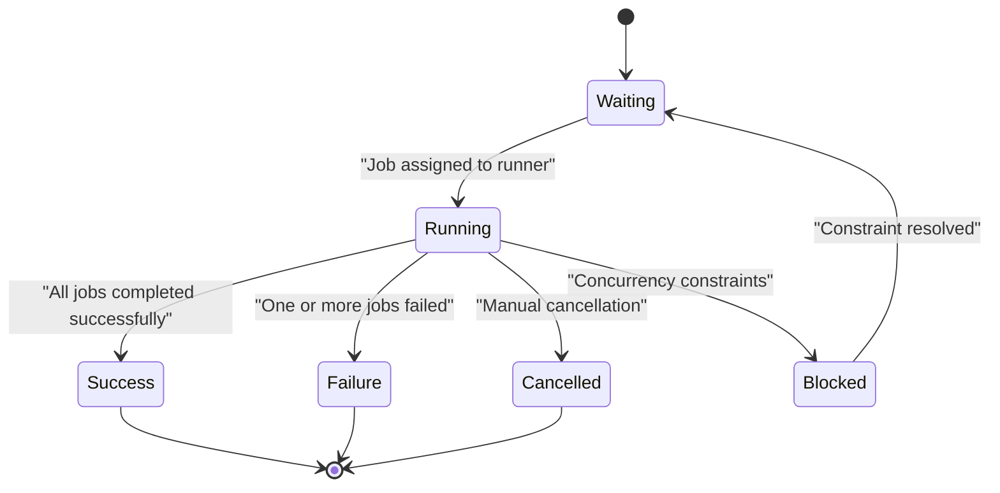
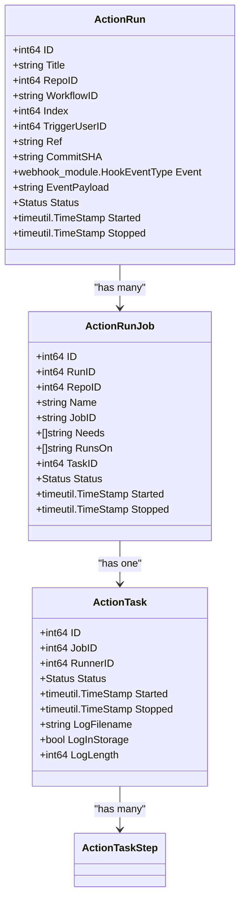
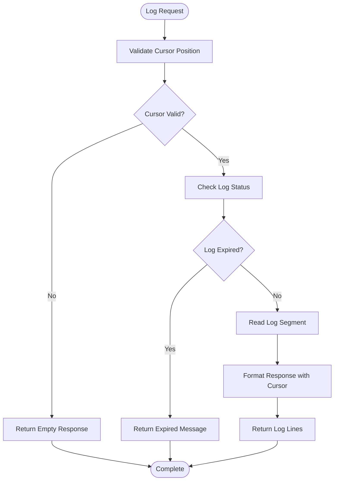
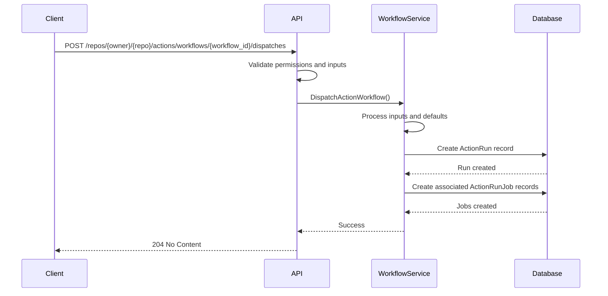
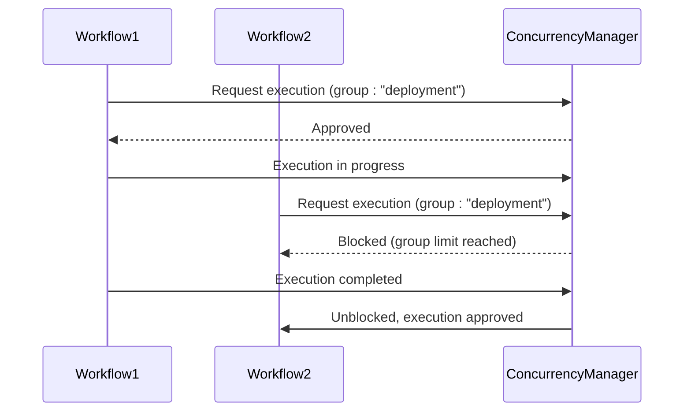
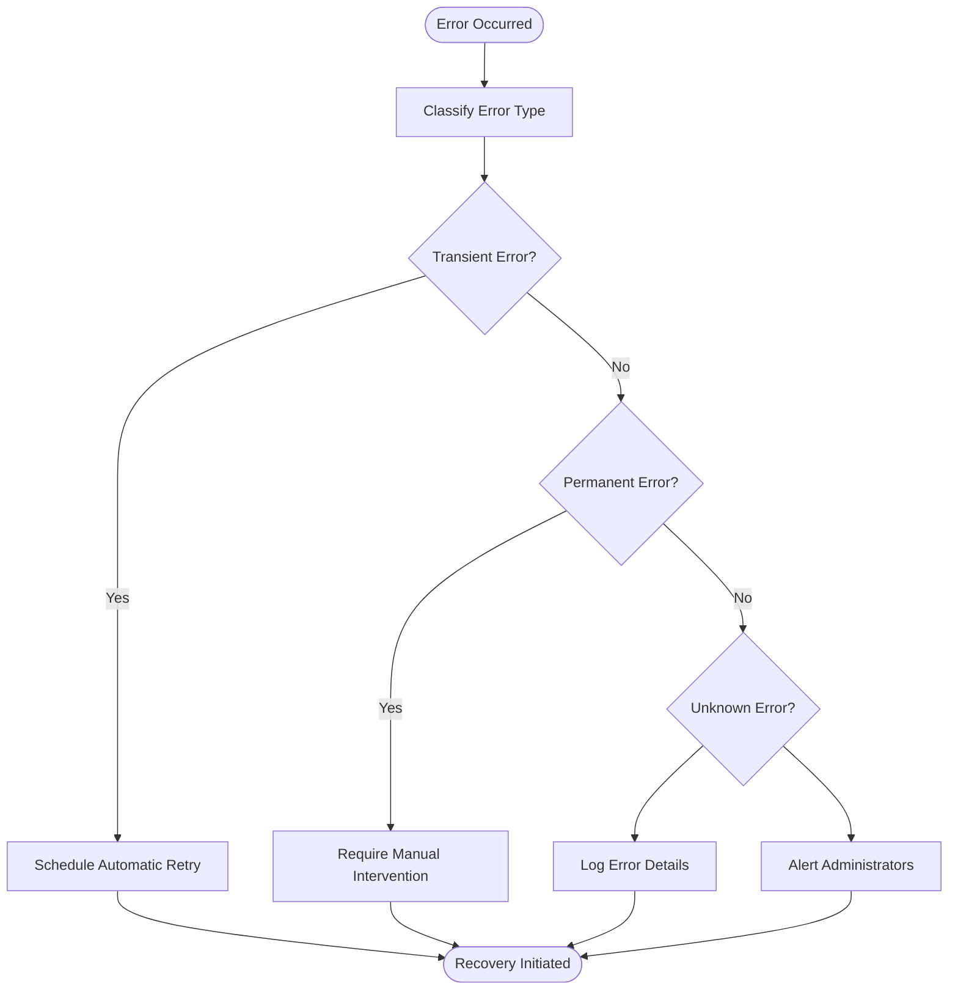

# Workflow Execution

<cite>
**Referenced Files in This Document**   
- [action.go](file://routers/api/v1/repo/action.go)
- [workflow.go](file://services/actions/workflow.go)
- [run.go](file://models/actions/run.go)
- [task.go](file://models/actions/task.go)
- [run_job.go](file://models/actions/run_job.go)
- [status.go](file://models/actions/status.go)
- [actions.go](file://routers/web/repo/actions/actions.go)
- [view.go](file://routers/web/repo/actions/view.go)
- [task_state.go](file://modules/actions/task_state.go)
- [workflows.go](file://modules/actions/workflows.go)
- [clear_tasks.go](file://services/actions/clear_tasks.go)
</cite>

## Table of Contents
1. [Introduction](#introduction)
2. [API Endpoints](#api-endpoints)
3. [Workflow Run Lifecycle](#workflow-run-lifecycle)
4. [Task and Job Management](#task-and-job-management)
5. [Log Retrieval](#log-retrieval)
6. [Manual Dispatch and Event Triggers](#manual-dispatch-and-event-triggers)
7. [Concurrency and Resource Management](#concurrency-and-resource-management)
8. [Performance Considerations](#performance-considerations)
9. [Error Handling and Recovery](#error-handling-and-recovery)
10. [Best Practices](#best-practices)

## Introduction
The Gitea Workflow Execution API provides comprehensive functionality for triggering, monitoring, and managing workflow runs within repositories. This documentation covers the complete lifecycle of workflow executions, including manual dispatch, event-based triggers, run and task states, log retrieval, and job outcome analysis. The API enables automation orchestration, continuous integration workflows, and custom CI/CD pipelines through a robust set of endpoints that support various triggering mechanisms, status monitoring, and execution control.

**Section sources**
- [action.go](file://routers/api/v1/repo/action.go#L0-L1694)
- [workflow.go](file://services/actions/workflow.go#L0-L173)

## API Endpoints
The Workflow Execution API exposes several endpoints for managing workflow runs and related resources. These endpoints follow REST conventions and provide comprehensive functionality for workflow orchestration.

### Workflow Run Management
The API provides endpoints for listing and retrieving workflow runs:

- `GET /repos/{owner}/{repo}/actions/runs` - Lists all workflow runs for a repository with filtering options for event, branch, status, actor, and commit SHA
- `GET /repos/{owner}/{repo}/actions/runs/{run}` - Retrieves a specific workflow run by its ID
- `GET /repos/{owner}/{repo}/actions/workflows` - Lists all workflows in a repository
- `GET /repos/{owner}/{repo}/actions/workflows/{workflow_id}` - Retrieves a specific workflow by ID

### Job and Task Management
For detailed job and task information:

- `GET /repos/{owner}/{repo}/actions/jobs` - Lists all jobs for a repository with optional status filtering
- `GET /repos/{owner}/{repo}/actions/tasks` - Lists all action tasks for a repository
- `GET /user/actions/jobs` - Retrieves user-level workflow jobs
- `GET /orgs/{org}/actions/jobs` - Retrieves organization-level workflow jobs

**Section sources**
- [action.go](file://routers/api/v1/repo/action.go#L810-L1050)
- [action.go](file://routers/api/v1/user/action.go#L411-L441)
- [action.go](file://routers/api/v1/org/action.go#L572-L605)

## Workflow Run Lifecycle
Workflow runs progress through a defined lifecycle with distinct states that represent the execution status. Understanding these states is crucial for monitoring and managing workflow executions effectively.

**Diagram sources **
- [status.go](file://models/actions/status.go#L0-L101)
- [run.go](file://models/actions/run.go#L47-L61)

### Run States
Workflow runs transition through the following states:

- **Waiting**: The workflow is queued and awaiting execution
- **Running**: The workflow is actively executing jobs
- **Success**: All jobs completed successfully
- **Failure**: One or more jobs failed during execution
- **Cancelled**: The workflow was manually cancelled
- **Skipped**: The workflow was skipped based on conditions
- **Blocked**: Execution is blocked by concurrency constraints

The run status is automatically updated based on the aggregate status of its constituent jobs, with the final status determined when all jobs reach a terminal state.

**Section sources**
- [status.go](file://models/actions/status.go#L0-L101)
- [run.go](file://models/actions/run.go#L47-L61)

## Task and Job Management
Tasks and jobs represent the individual units of work within a workflow execution. Each workflow run consists of one or more jobs, which are further broken down into tasks that are executed by runners.

### Job Structure
A job represents a logical unit of work defined in the workflow configuration. Jobs have the following characteristics:

- **Name**: Identifies the job in the workflow
- **Status**: Current execution state (waiting, running, success, failure, etc.)
- **Dependencies**: Other jobs that must complete before this job can start
- **Runner Assignment**: Labels that determine which runners can execute the job

### Task Execution
Tasks are the executable units assigned to runners:

- **Task Creation**: Created when a job transitions from waiting to running
- **Token Authentication**: Each task has a unique authentication token for secure runner communication
- **Step Execution**: Tasks execute workflow steps sequentially
- **Status Updates**: Runners periodically update task status during execution

**Diagram sources **
- [run.go](file://models/actions/run.go#L0-L457)
- [run_job.go](file://models/actions/run_job.go#L0-L269)
- [task.go](file://models/actions/task.go#L0-L507)

**Section sources**
- [run_job.go](file://models/actions/run_job.go#L0-L269)
- [task.go](file://models/actions/task.go#L0-L507)

## Log Retrieval
The API provides comprehensive log retrieval capabilities for monitoring workflow execution and troubleshooting issues.

### Log Structure
Workflow execution logs are organized hierarchically:

- **Run-level logs**: Overall workflow execution information
- **Job-level logs**: Output from individual jobs
- **Step-level logs**: Detailed output from each workflow step

Logs are stored with metadata including timestamps, line numbers, and step boundaries, enabling efficient retrieval and display.

### Log Access Patterns
The system supports efficient log access through:

- **Cursor-based pagination**: Clients can request log segments using cursor positions
- **Step filtering**: Retrieve logs for specific workflow steps
- **Expanded view**: Request complete logs for specific steps
- **Expiration handling**: Expired logs are marked and handled gracefully

**Diagram sources **
- [view.go](file://routers/web/repo/actions/view.go#L330-L368)
- [task_state.go](file://modules/actions/task_state.go#L20-L45)

**Section sources**
- [view.go](file://routers/web/repo/actions/view.go#L296-L335)
- [task_state.go](file://modules/actions/task_state.go#L89-L122)

## Manual Dispatch and Event Triggers
Workflows can be triggered through various mechanisms, including manual dispatch and event-based triggers.

### Manual Workflow Dispatch
Workflows can be manually triggered via API with custom payloads:

**Diagram sources **
- [workflow.go](file://services/actions/workflow.go#L0-L173)
- [action.go](file://routers/api/v1/repo/action.go#L1018-L1050)

### Event-Based Triggers
Workflows can be automatically triggered by repository events:

- **Push events**: Triggered when code is pushed to branches or tags
- **Pull request events**: Triggered when pull requests are created, updated, or merged
- **Schedule events**: Triggered based on cron-like schedules
- **Workflow run events**: Triggered by completion of other workflows

The system detects eligible workflows by examining the `.gitea/workflows` directory in the repository and matching event conditions defined in workflow configurations.

**Section sources**
- [workflows.go](file://modules/actions/workflows.go#L97-L149)
- [workflow.go](file://services/actions/workflow.go#L161-L172)

## Concurrency and Resource Management
The workflow execution system includes robust concurrency control and resource management features to prevent resource exhaustion and ensure predictable execution patterns.

### Concurrency Groups
Workflows and jobs can be assigned to concurrency groups that limit simultaneous execution:

- **Workflow-level concurrency**: Limits concurrent runs of the same workflow
- **Job-level concurrency**: Limits concurrent execution of specific jobs
- **Cancel in-progress**: Option to cancel existing runs when a new run is triggered

**Diagram sources **
- [run.go](file://models/actions/run.go#L47-L61)
- [clear_tasks.go](file://services/actions/clear_tasks.go#L134-L176)

### Resource Constraints
The system enforces various resource constraints:

- **Execution timeouts**: Workflows and jobs have maximum execution durations
- **Log size limits**: Individual log files have size constraints
- **Concurrent job limits**: Maximum number of simultaneously running jobs per repository
- **Runner availability**: Jobs are only assigned to runners with matching labels

**Section sources**
- [run.go](file://models/actions/run.go#L47-L61)
- [clear_tasks.go](file://services/actions/clear_tasks.go#L134-L176)

## Performance Considerations
Monitoring high-frequency workflow executions requires careful consideration of performance implications and optimization strategies.

### Polling Strategies
For monitoring workflow status, implement efficient polling patterns:

- **Exponential backoff**: Increase polling intervals as execution progresses
- **Event-driven updates**: Use webhooks for real-time status updates when possible
- **Batch requests**: Retrieve multiple workflow statuses in a single request
- **Selective polling**: Focus on critical workflows rather than polling all executions

### High-Frequency Execution
For repositories with high workflow execution frequency:

- **Index optimization**: Ensure database indexes support common query patterns
- **Caching strategies**: Cache frequently accessed workflow metadata
- **Asynchronous processing**: Offload non-critical operations to background workers
- **Rate limiting**: Implement appropriate rate limits to prevent system overload

**Section sources**
- [action.go](file://routers/api/v1/repo/action.go#L810-L864)
- [action.go](file://routers/api/v1/repo/action.go#L1099-L1151)

## Error Handling and Recovery
The workflow execution system includes comprehensive error handling and recovery mechanisms.

### Common Error Scenarios
- **Workflow not found**: Specified workflow file does not exist in the repository
- **Permission denied**: User lacks required permissions to trigger the workflow
- **Reference not found**: Specified branch or tag does not exist
- **Disabled workflow**: Workflow has been explicitly disabled in repository settings
- **Concurrency blocked**: Execution blocked by concurrency constraints

### Recovery Strategies
- **Automatic retry**: Failed jobs can be configured to automatically retry
- **Manual rerun**: Users can manually rerun failed workflows or specific jobs
- **Zombie task detection**: Periodically clean up tasks that appear to be stuck
- **Log retention**: Maintain logs for failed executions for troubleshooting

**Diagram sources **
- [workflow.go](file://services/actions/workflow.go#L0-L173)
- [clear_tasks.go](file://services/actions/clear_tasks.go#L134-L176)

**Section sources**
- [workflow.go](file://services/actions/workflow.go#L0-L173)
- [clear_tasks.go](file://services/actions/clear_tasks.go#L134-L176)

## Best Practices
Implementing efficient workflow orchestration and error recovery requires adherence to established best practices.

### Efficient Orchestration
- **Minimize workflow scope**: Create focused workflows that perform specific tasks
- **Use appropriate triggers**: Select triggers that match the intended use case
- **Optimize job dependencies**: Structure jobs to maximize parallel execution
- **Implement proper timeouts**: Set realistic timeouts to prevent hung executions
- **Monitor resource usage**: Track execution metrics to identify bottlenecks

### Error Recovery
- **Implement retry logic**: Configure appropriate retry policies for transient failures
- **Use conditional steps**: Skip non-critical steps when dependencies fail
- **Maintain execution history**: Keep sufficient history for troubleshooting
- **Implement health checks**: Regularly verify runner availability and system health
- **Document recovery procedures**: Maintain clear documentation for common failure scenarios

**Section sources**
- [workflows.go](file://modules/actions/workflows.go#L712-L754)
- [actions.go](file://routers/web/repo/actions/actions.go#L133-L174)