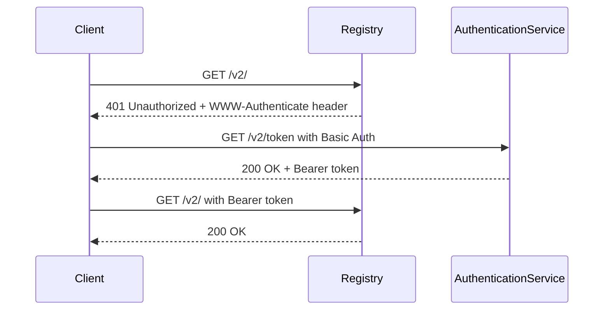
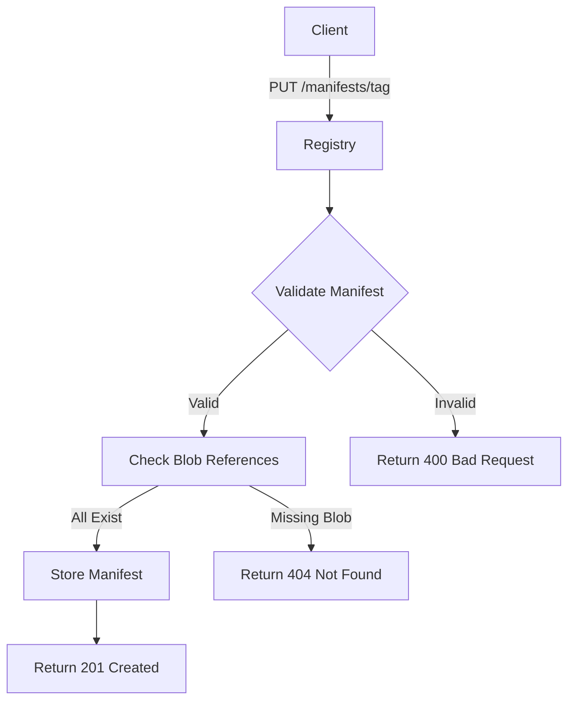
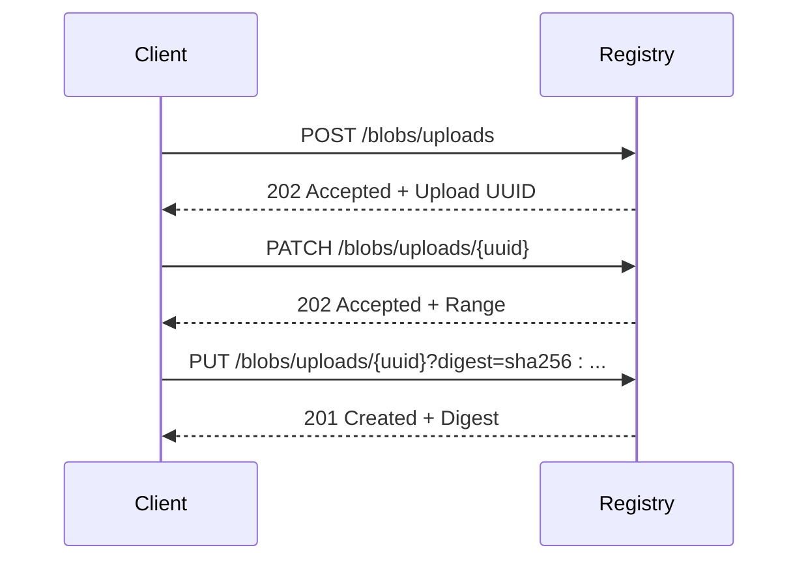

# Container Registry API (OCI)

<cite>
**Referenced Files in This Document**   
- [container.go](file://routers/api/packages/container/container.go)
- [manifest.go](file://routers/api/packages/container/manifest.go)
- [blob.go](file://routers/api/packages/container/blob.go)
- [metadata.go](file://modules/packages/container/metadata.go)
- [const.go](file://modules/packages/container/const.go)
- [common.go](file://services/packages/container/common.go)
- [search.go](file://models/packages/container/search.go)
- [api.go](file://routers/api/packages/api.go)
- [api_packages_container_test.go](file://tests/integration/api_packages_container_test.go)
</cite>

## Table of Contents
1. [Introduction](#introduction)
2. [API Endpoints](#api-endpoints)
3. [Authentication](#authentication)
4. [Repository Naming Convention](#repository-naming-convention)
5. [Manifest Operations](#manifest-operations)
6. [Blob Uploads and Downloads](#blob-uploads-and-downloads)
7. [Repository Management](#repository-management)
8. [Manifest Format Support](#manifest-format-support)
9. [Image Layer Storage](#image-layer-storage)
10. [Common Issues](#common-issues)
11. [Performance Considerations](#performance-considerations)
12. [Examples](#examples)

## Introduction
Gitea provides a Container Registry implementation that follows the Open Container Initiative (OCI) specification. This registry supports standard Docker Registry v2 endpoints for managing container images, including manifest operations, blob uploads/downloads, and repository management. The implementation is designed to be compatible with standard Docker clients and tools.

The Container Registry in Gitea allows users to store and manage container images directly within their Gitea instance, providing a seamless experience for developers who want to host both their source code and container images in the same platform. The registry supports both OCI and Docker v2 manifest formats, ensuring compatibility with a wide range of container tools and workflows.

**Section sources**
- [container.go](file://routers/api/packages/container/container.go#L1-L805)
- [api.go](file://routers/api/packages/api.go#L512-L574)

## API Endpoints
The Gitea Container Registry exposes a comprehensive set of API endpoints that comply with the OCI Distribution Specification. These endpoints are mounted under the `/v2/` path to ensure compatibility with standard container clients.

The main API endpoints include:
- `/v2/` - Root endpoint to determine registry support
- `/v2/token` - Authentication endpoint for obtaining access tokens
- `/v2/_catalog` - Endpoint for listing available repositories
- `/v2/{username}/{image}/blobs/` - Endpoints for blob operations (upload, download, delete)
- `/v2/{username}/{image}/manifests/` - Endpoints for manifest operations (push, pull, delete)
- `/v2/{username}/{image}/tags/list` - Endpoint for listing image tags

Each endpoint follows the OCI specification for request and response formats, status codes, and error handling. The registry supports both monolithic and chunked blob uploads, allowing clients to efficiently transfer large container layers.

```mermaid
graph TB
A[/v2/] --> B[Determine Support]
A --> C[/token]
A --> D[/_catalog]
A --> E[{username}]
E --> F[{image}]
F --> G[blobs/]
F --> H[manifests/]
F --> I[tags/list]
G --> J[Uploads]
G --> K[Downloads]
H --> L[Push]
H --> M[Pull]
H --> N[Delete]
```

**Diagram sources **
- [container.go](file://routers/api/packages/container/container.go#L42-L805)
- [api.go](file://routers/api/packages/api.go#L512-L574)

**Section sources**
- [container.go](file://routers/api/packages/container/container.go#L42-L805)
- [api.go](file://routers/api/packages/api.go#L512-L574)

## Authentication
The Gitea Container Registry uses HTTP basic authentication with API tokens or deploy tokens for client authentication. When a client attempts to access a protected endpoint, the registry responds with a `401 Unauthorized` status code and a `WWW-Authenticate` header that specifies the authentication method.

The authentication flow follows the OCI Distribution Specification's bearer token authentication scheme. Clients must first authenticate to obtain a token, which is then used in subsequent requests. The authentication endpoint (`/v2/token`) accepts basic authentication credentials (username and API token) and returns a bearer token that can be used for authorized access.

For anonymous access, the registry can be configured to allow read-only operations without authentication, depending on the instance's security settings. However, write operations (pushing images) always require authentication with appropriate permissions.



**Diagram sources **
- [container.go](file://routers/api/packages/container/container.go#L128-L161)
- [container.go](file://routers/api/packages/container/container.go#L42-L84)

**Section sources**
- [container.go](file://routers/api/packages/container/container.go#L128-L161)
- [container.go](file://routers/api/packages/container/container.go#L42-L84)

## Repository Naming Convention
In Gitea's Container Registry, repository names follow a specific convention that relates directly to Gitea users and packages. The repository name is constructed as `{username}/{image}`, where `username` is the Gitea username or organization name, and `image` is the container image name.

The image name must conform to specific pattern requirements: it can contain lowercase letters, digits, and the separators `.` (dot), `_` (underscore), and `-` (hyphen). The name must start with a lowercase letter or digit and can include multiple path components separated by forward slashes.

This naming convention ensures that container images are properly scoped to their respective Gitea users or organizations, providing a clear namespace structure. The repository name is stored as a package property in the database, allowing for efficient querying and management of container packages.

**Section sources**
- [container.go](file://routers/api/packages/container/container.go#L42-L84)
- [metadata.go](file://modules/packages/container/metadata.go#L1-L188)

## Manifest Operations
The Gitea Container Registry provides comprehensive support for manifest operations as defined in the OCI Distribution Specification. Manifests are JSON documents that describe container images, including their configuration and layer references.

The registry supports the following manifest operations:
- **Pushing manifests**: Clients can upload manifests using the `PUT /v2/{username}/{image}/manifests/{reference}` endpoint. The reference can be either a tag name or a digest.
- **Pulling manifests**: Clients can retrieve manifests using the `GET /v2/{username}/{image}/manifests/{reference}` endpoint.
- **Checking manifest existence**: Clients can check if a manifest exists using the `HEAD /v2/{username}/{image}/manifests/{reference}` endpoint.
- **Deleting manifests**: Clients can delete manifests using the `DELETE /v2/{username}/{image}/manifests/{reference}` endpoint.

When pushing a manifest, the registry validates the manifest structure, checks that all referenced blobs exist, and ensures that the user has appropriate permissions. The maximum manifest size is limited to 10MB to prevent abuse and ensure performance.



**Diagram sources **
- [manifest.go](file://routers/api/packages/container/manifest.go#L43-L435)
- [container.go](file://routers/api/packages/container/container.go#L560-L603)

**Section sources**
- [manifest.go](file://routers/api/packages/container/manifest.go#L43-L435)
- [container.go](file://routers/api/packages/container/container.go#L560-L603)

## Blob Uploads and Downloads
The Gitea Container Registry supports both monolithic and chunked blob uploads, allowing clients to efficiently transfer container image layers of various sizes. Blobs represent the individual layers of a container image and are identified by their SHA-256 digest.

For blob uploads, the registry provides the following endpoints:
- `POST /v2/{username}/{image}/blobs/uploads/` - Initiates a new upload session
- `PATCH /v2/{username}/{image}/blobs/uploads/{uuid}` - Uploads a chunk of data to an existing session
- `PUT /v2/{username}/{image}/blobs/uploads/{uuid}` - Completes an upload session by uploading the final chunk and digest
- `GET /v2/{username}/{image}/blobs/uploads/{uuid}` - Retrieves the status of an upload session
- `DELETE /v2/{username}/{image}/blobs/uploads/{uuid}` - Cancels an upload session

For blob downloads, the registry provides:
- `HEAD /v2/{username}/{image}/blobs/{digest}` - Checks if a blob exists and retrieves its size
- `GET /v2/{username}/{image}/blobs/{digest}` - Downloads the blob content

The registry also supports blob mounting, which allows clients to copy blobs between repositories without re-uploading the data, improving efficiency when pushing similar images.



**Diagram sources **
- [blob.go](file://routers/api/packages/container/blob.go#L1-L207)
- [container.go](file://routers/api/packages/container/container.go#L309-L559)

**Section sources**
- [blob.go](file://routers/api/packages/container/blob.go#L1-L207)
- [container.go](file://routers/api/packages/container/container.go#L309-L559)

## Repository Management
The Gitea Container Registry provides endpoints for managing repositories and their contents. Repository management includes listing available repositories, retrieving tag information, and deleting manifests.

The `/v2/_catalog` endpoint returns a list of all repositories accessible to the authenticated user. This endpoint supports pagination through the `n` and `last` query parameters, allowing clients to retrieve large repository lists in chunks.

The `/v2/{username}/{image}/tags/list` endpoint returns a list of all tags for a specific repository. Like the catalog endpoint, it supports pagination and can be used to navigate through large tag lists. The response includes the repository name and the list of tags, which can be used by clients to discover available image versions.

Repository management operations are subject to the user's permissions. Users can only access repositories they have permission to view, and write operations require appropriate write permissions.

**Section sources**
- [container.go](file://routers/api/packages/container/container.go#L162-L211)
- [container.go](file://routers/api/packages/container/container.go#L648-L694)

## Manifest Format Support
Gitea's Container Registry supports both OCI (Open Container Initiative) and Docker v2 manifest formats, ensuring compatibility with a wide range of container tools and clients.

The registry recognizes the following media types:
- `application/vnd.oci.image.manifest.v1+json` - OCI Image Manifest
- `application/vnd.docker.distribution.manifest.v2+json` - Docker Image Manifest (v2 Schema 2)
- `application/vnd.oci.image.index.v1+json` - OCI Image Index
- `application/vnd.docker.distribution.manifest.list.v2+json` - Docker Manifest List

When a manifest is pushed to the registry, the media type is validated, and the manifest structure is checked for compliance with the OCI specification. The registry supports manifest lists (indexes) that can reference multiple platform-specific manifests, enabling multi-architecture image support.

For OCI image manifests, the registry extracts metadata such as platform information, layer details, and configuration from the manifest and stores it for efficient retrieval and display in the Gitea web interface.

**Section sources**
- [metadata.go](file://modules/packages/container/metadata.go#L1-L188)
- [manifest.go](file://routers/api/packages/container/manifest.go#L148-L189)

## Image Layer Storage
In Gitea's Container Registry, image layers are stored as package blobs in the database and on the file system. Each layer is identified by its SHA-256 digest and stored in a content-addressable storage system.

When a container image is pushed to the registry, each layer is uploaded as a separate blob. The registry checks if a blob with the same digest already exists before storing the data, enabling efficient storage and deduplication across images. This means that identical layers shared between different images are stored only once, saving disk space.

Layer metadata is stored in the database, including the layer size, media type, and relationship to the manifest that references it. The registry maintains a reference count for each blob to ensure that blobs are not deleted while they are still referenced by manifests.

The storage backend can be configured to use different storage solutions, including local file system, S3-compatible storage, or other supported backends, allowing administrators to optimize storage performance and reliability.

**Section sources**
- [blob.go](file://routers/api/packages/container/blob.go#L1-L207)
- [metadata.go](file://modules/packages/container/metadata.go#L1-L188)

## Common Issues
Users of Gitea's Container Registry may encounter several common issues, which are addressed through specific error codes and handling mechanisms.

**Authentication failures during docker login**: This typically occurs when invalid credentials are provided or when the user lacks the necessary permissions. The registry returns appropriate HTTP status codes (401 Unauthorized or 403 Forbidden) with descriptive error messages to help diagnose the issue.

**Manifest invalid errors**: These occur when a manifest does not comply with the OCI specification or references non-existent blobs. The registry validates manifests upon upload and returns detailed error messages indicating the specific validation failure.

**Storage quota limitations**: Gitea enforces storage quotas at both the system and user levels. When a user exceeds their storage quota, the registry returns a 403 Forbidden status code with an appropriate error message. Administrators can configure quota limits in the Gitea settings.

Other common issues include network timeouts during large uploads, digest mismatches when the calculated digest does not match the expected value, and permission errors when users attempt to access repositories they don't have access to.

**Section sources**
- [container.go](file://routers/api/packages/container/container.go#L560-L603)
- [container.go](file://routers/api/packages/container/container.go#L467-L514)

## Performance Considerations
To optimize performance when using Gitea's Container Registry, several considerations should be taken into account, particularly regarding layer caching and concurrent operations.

**Layer caching**: The registry's content-addressable storage system naturally supports layer caching. Identical layers across different images are stored only once, reducing storage requirements and improving push/pull performance. Clients should leverage layer caching by reusing base images and minimizing changes to existing layers.

**Handling concurrent pushes**: The registry uses database transactions and locks to ensure data consistency during concurrent operations. However, pushing multiple tags of the same image simultaneously may result in conflicts. It's recommended to push tags sequentially or use manifest lists to publish multiple architectures atomically.

**Network optimization**: For large images, using chunked uploads can improve reliability and allow resumption of interrupted transfers. The registry supports resumable uploads through the PATCH method, which can be particularly beneficial in unstable network conditions.

**Storage backend selection**: The choice of storage backend significantly impacts performance. For high-traffic instances, using a distributed storage system like S3 can provide better scalability and reliability compared to local file storage.

**Section sources**
- [blob.go](file://routers/api/packages/container/blob.go#L1-L207)
- [container.go](file://routers/api/packages/container/container.go#L309-L559)

## Examples
This section provides practical examples of using Docker commands with Gitea's Container Registry.

### Docker Login
To authenticate with the Gitea registry, use the docker login command with your Gitea username and API token:

```bash
docker login gitea.example.com
Username: your-username
Password: your-api-token
```

### Docker Push
To push a container image to the Gitea registry:

```bash
# Tag your image with the Gitea registry URL
docker tag my-image gitea.example.com/username/repository:tag

# Push the image
docker push gitea.example.com/username/repository:tag
```

### Docker Pull
To pull a container image from the Gitea registry:

```bash
# Pull the image
docker pull gitea.example.com/username/repository:tag

# Run the container
docker run gitea.example.com/username/repository:tag
```

These examples demonstrate the standard Docker workflow with Gitea's Container Registry, which is fully compatible with the Docker CLI and other container tools that support the OCI Distribution Specification.

**Section sources**
- [api_packages_container_test.go](file://tests/integration/api_packages_container_test.go#L77-L108)
- [container.go](file://routers/api/packages/container/container.go#L128-L161)