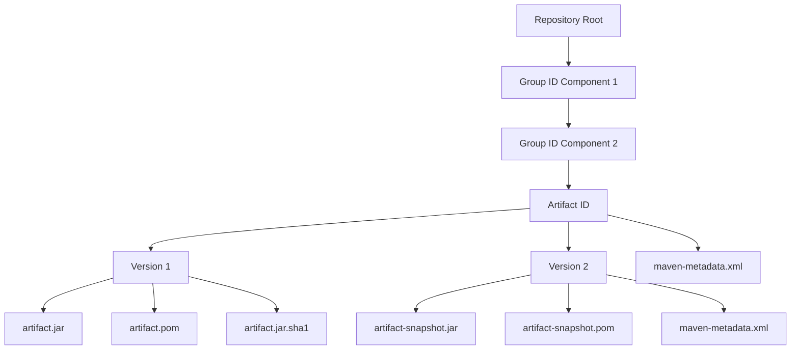
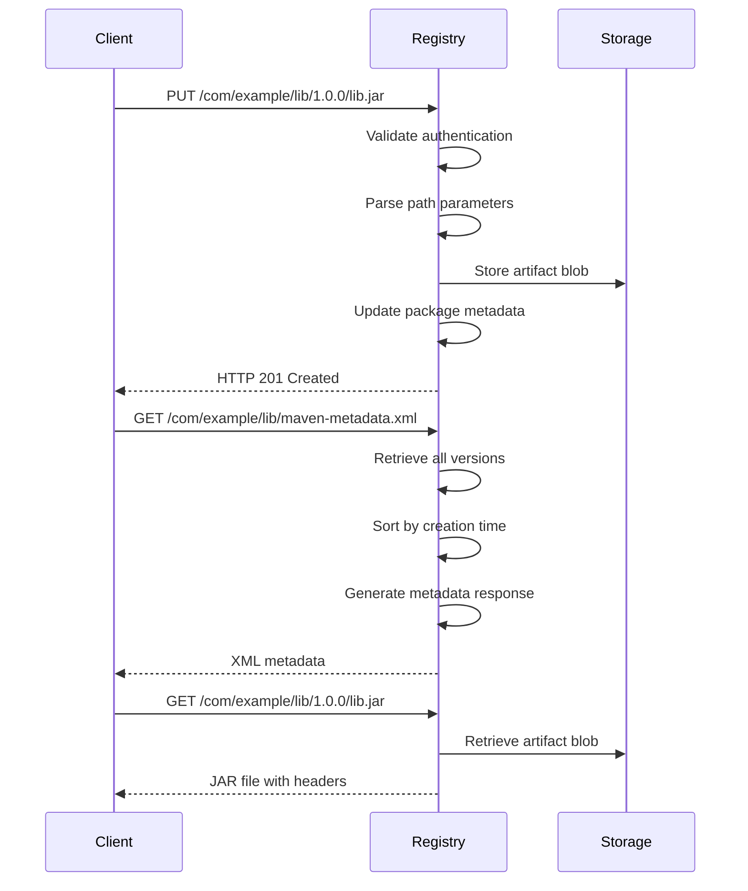
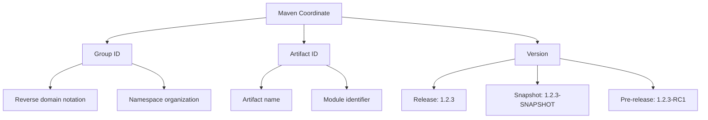
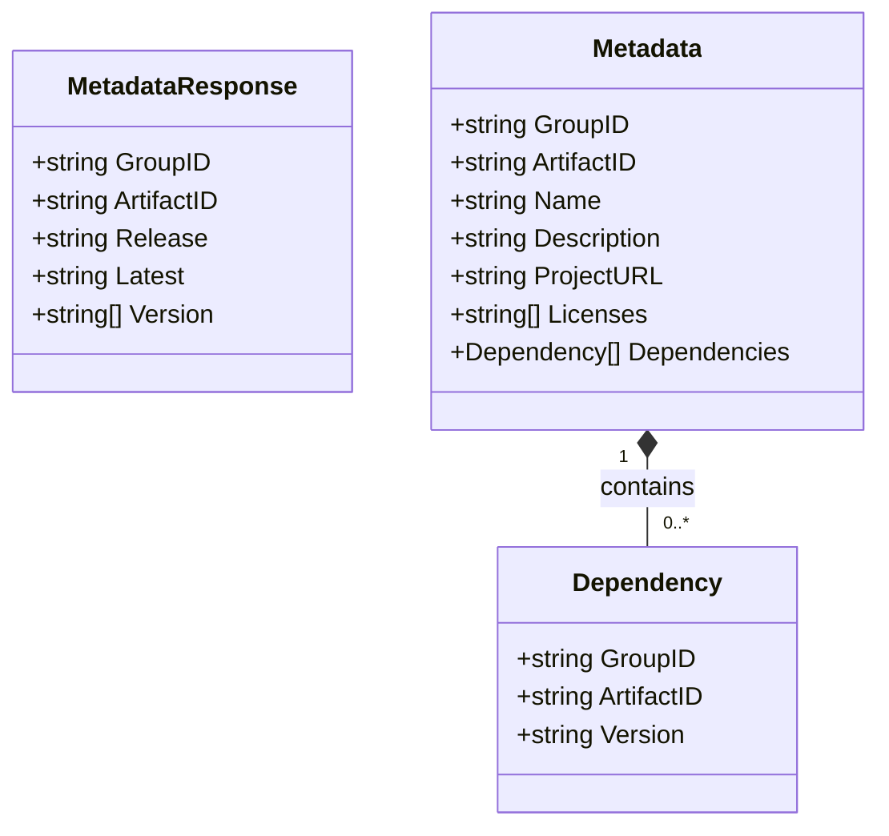
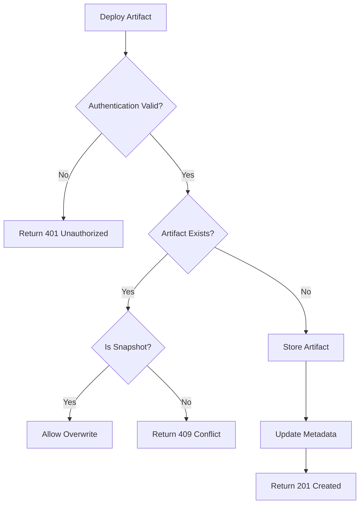

# Maven Registry API

<cite>
**Referenced Files in This Document**   
- [maven.go](file://routers/api/packages/maven/maven.go)
- [api.go](file://routers/api/packages/maven/api.go)
- [metadata.go](file://modules/packages/maven/metadata.go)
- [api.go](file://routers/api/packages/api.go)
- [metadata_test.go](file://modules/packages/maven/metadata_test.go)
- [api_packages_maven_test.go](file://tests/integration/api_packages_maven_test.go)
</cite>

## Table of Contents
1. [Introduction](#introduction)
2. [Repository Structure](#repository-structure)
3. [Endpoints](#endpoints)
4. [Authentication](#authentication)
5. [Maven Coordinates](#maven-coordinates)
6. [Metadata Format](#metadata-format)
7. [Client Configuration](#client-configuration)
8. [Common Issues](#common-issues)
9. [Performance Considerations](#performance-considerations)
10. [Conclusion](#conclusion)

## Introduction

Gitea provides a Maven Registry implementation that allows users to publish and resolve Maven artifacts within their Gitea instance. This registry supports standard Maven repository operations including artifact deployment, dependency resolution, and metadata retrieval. The implementation follows Maven's repository conventions while integrating with Gitea's authentication and package management systems.

The Maven Registry enables organizations to host private Java libraries and dependencies, control access to artifacts, and integrate with existing Maven and Gradle workflows. It supports both snapshot and release versions, proper metadata generation, and dependency resolution based on standard Maven coordinates.

**Section sources**
- [maven.go](file://routers/api/packages/maven/maven.go#L1-L50)
- [api.go](file://routers/api/packages/maven/api.go#L1-L10)

## Repository Structure

The Maven Registry in Gitea follows the standard Maven repository structure where artifacts are organized by group ID, artifact ID, and version. The repository path structure uses the group ID components as directory levels, with the artifact ID as the final directory, and version directories containing the actual artifacts.

For example, an artifact with group ID `com.example.library`, artifact ID `core`, and version `1.2.3` would be stored at:
```
/com/example/library/core/1.2.3/
```

Each version directory contains the artifact file (typically a JAR), its POM file, and optional checksum files (MD5, SHA1, SHA256, SHA512). The root of each artifact's path also contains a `maven-metadata.xml` file that provides information about available versions, the latest version, and the release version.

The registry supports both modern and legacy package naming conventions, automatically handling the transition from the older hyphen-separated format (`groupId-artifactId`) to the current colon-separated format (`groupId:artifactId`).



**Diagram sources**
- [maven.go](file://routers/api/packages/maven/maven.go#L242-L293)
- [api.go](file://routers/api/packages/maven/api.go#L1-L46)

**Section sources**
- [maven.go](file://routers/api/packages/maven/maven.go#L180-L240)
- [api.go](file://routers/api/packages/maven/api.go#L1-L46)

## Endpoints

The Maven Registry provides RESTful endpoints for artifact operations, following standard Maven repository patterns. All endpoints are accessible under the `/api/packages/{owner}/maven/` path, where `{owner}` is the username or organization name hosting the repository.

### Artifact Deployment
- **PUT /api/packages/{owner}/maven/\***: Uploads artifact files to the repository. This endpoint accepts JAR files, POM files, and checksum files. When a POM file is uploaded, its metadata is parsed and stored for dependency resolution.

### Artifact Resolution
- **GET /api/packages/{owner}/maven/\***: Downloads artifact files from the repository. This includes JAR files, POM files, and associated metadata.
- **HEAD /api/packages/{owner}/maven/\***: Retrieves headers for artifact files without downloading the content, useful for checking file existence and metadata.

### Metadata Retrieval
- **GET /api/packages/{owner}/maven/{group}/{artifact}/maven-metadata.xml**: Returns the maven-metadata.xml file for the specified artifact, listing all available versions, the latest version, and the release version.
- **GET /api/packages/{owner}/maven/{group}/{artifact}/{version}/maven-metadata.xml**: Returns version-specific metadata for snapshot artifacts.

The endpoints handle various file extensions including `.jar`, `.pom`, `.md5`, `.sha1`, `.sha256`, and `.sha512`. Checksum files are validated during upload and served from stored hash values rather than recalculating them on each request.



**Diagram sources**
- [maven.go](file://routers/api/packages/maven/maven.go#L55-L92)
- [api.go](file://routers/api/packages/maven/api.go#L1-L46)

**Section sources**
- [maven.go](file://routers/api/packages/maven/maven.go#L55-L92)
- [api.go](file://routers/api/packages/api.go#L354-L385)

## Authentication

The Maven Registry uses HTTP Basic Authentication with API tokens for secure access. Users must authenticate when deploying artifacts or accessing private repositories. The authentication mechanism integrates with Gitea's existing user and token system.

To authenticate, clients should provide the username as the authentication ID and an API token as the password. This approach allows for fine-grained access control and token revocation without changing user credentials.

For Maven clients, authentication is configured in the `settings.xml` file:

```xml
<servers>
  <server>
    <id>gitea-maven</id>
    <username>your-username</username>
    <password>your-api-token</password>
  </server>
</servers>
```

The repository configuration in a project's `pom.xml` references this server ID:

```xml
<distributionManagement>
  <repository>
    <id>gitea-maven</id>
    <url>https://your-gitea-instance/api/packages/username/maven</url>
  </repository>
  <snapshotRepository>
    <id>gitea-maven</id>
    <url>https://your-gitea-instance/api/packages/username/maven</url>
  </snapshotRepository>
</distributionManagement>
```

The registry validates credentials on each request and returns appropriate HTTP status codes for authentication failures (401 Unauthorized) or permission denied scenarios (403 Forbidden).

**Section sources**
- [maven.go](file://routers/api/packages/maven/maven.go#L242-L293)
- [api.go](file://routers/api/packages/maven/api.go#L1-L46)

## Maven Coordinates

The Maven Registry uses the standard Maven coordinate system consisting of three primary components: groupId, artifactId, and version. These coordinates uniquely identify each artifact in the repository.

### Group ID
The group ID typically follows a reverse domain name pattern (e.g., `com.example.project`) and represents the project or organization that produced the artifact. In Gitea's implementation, the group ID is used to create the directory structure in the repository.

### Artifact ID
The artifact ID is the name of the Maven artifact itself (e.g., `core-library`, `web-module`). It should be unique within a group ID and typically follows lowercase naming conventions with hyphens.

### Version
The version follows semantic versioning principles (e.g., `1.2.3`, `2.0.0-RC1`). The registry supports both release versions and snapshot versions (indicated by the `-SNAPSHOT` suffix). Snapshot versions allow for multiple deployments of the same version identifier, with timestamped artifacts.

The coordinate system enables dependency resolution by allowing clients to specify exact versions or version ranges. The registry's metadata service provides information about available versions, including the latest and release versions, to support version resolution in build tools.



**Diagram sources**
- [maven.go](file://routers/api/packages/maven/maven.go#L242-L293)
- [api.go](file://routers/api/packages/maven/api.go#L1-L46)

**Section sources**
- [maven.go](file://routers/api/packages/maven/maven.go#L242-L293)
- [api.go](file://routers/api/packages/maven/api.go#L1-L46)

## Metadata Format

The Maven Registry generates and serves metadata in the standard Maven metadata format (maven-metadata.xml). This XML document provides information about available versions, the latest version, and the release version for each artifact.

The metadata structure follows the Maven repository metadata schema:

```xml
<metadata>
  <groupId>com.example</groupId>
  <artifactId>library</artifactId>
  <versioning>
    <latest>1.2.3</latest>
    <release>1.2.3</release>
    <versions>
      <version>1.0.0</version>
      <version>1.1.0</version>
      <version>1.2.0</version>
      <version>1.2.1</version>
      <version>1.2.2</version>
      <version>1.2.3</version>
    </versions>
  </versioning>
</metadata>
```

Versions are sorted by creation timestamp rather than version string to ensure chronological ordering, which is important for snapshot versions. The latest version is always the most recently created version, while the release version is the most recent non-snapshot version.

For POM files, the registry parses the metadata and stores it for dependency resolution. This includes:
- Project name and description
- Project URL
- License information
- Dependencies (groupId, artifactId, version)
- Inherited metadata from parent POMs

The parsed metadata is stored in the database and can be used for searching and displaying package information in the Gitea web interface.



**Diagram sources**
- [api.go](file://routers/api/packages/maven/api.go#L1-L46)
- [metadata.go](file://modules/packages/maven/metadata.go#L1-L47)

**Section sources**
- [api.go](file://routers/api/packages/maven/api.go#L1-L46)
- [metadata.go](file://modules/packages/maven/metadata.go#L49-L110)
- [metadata_test.go](file://modules/packages/maven/metadata_test.go#L51-L90)

## Client Configuration

Configuring Maven and Gradle to use Gitea's Maven Registry involves setting up repository URLs and authentication credentials in the build configuration files.

### Maven Configuration

In the project's `pom.xml`, add the repository configuration:

```xml
<repositories>
  <repository>
    <id>gitea-maven</id>
    <name>Gitea Maven Repository</name>
    <url>https://your-gitea-instance/api/packages/username/maven</url>
  </repository>
</repositories>

<distributionManagement>
  <repository>
    <id>gitea-maven</id>
    <url>https://your-gitea-instance/api/packages/username/maven</url>
  </repository>
  <snapshotRepository>
    <id>gitea-maven</id>
    <url>https://your-gitea-instance/api/packages/username/maven</url>
  </snapshotRepository>
</distributionManagement>
```

Configure authentication in `~/.m2/settings.xml`:

```xml
<settings>
  <servers>
    <server>
      <id>gitea-maven</id>
      <username>your-username</username>
      <password>your-api-token</password>
    </server>
  </servers>
  
  <profiles>
    <profile>
      <id>gitea</id>
      <repositories>
        <repository>
          <id>gitea-maven</id>
          <url>https://your-gitea-instance/api/packages/username/maven</url>
          <releases><enabled>true</enabled></releases>
          <snapshots><enabled>true</enabled></snapshots>
        </repository>
      </repositories>
    </profile>
  </profiles>
  
  <activeProfiles>
    <activeProfile>gitea</activeProfile>
  </activeProfiles>
</settings>
```

### Gradle Configuration

In `build.gradle`, configure repositories and publishing:

```groovy
repositories {
    maven {
        url "https://your-gitea-instance/api/packages/username/maven"
        credentials {
            username project.findProperty("gitea.username") ?: System.getenv("GITEA_USERNAME")
            password project.findProperty("gitea.token") ?: System.getenv("GITEA_TOKEN")
        }
    }
}

publishing {
    repositories {
        maven {
            name = "gitea"
            url = "https://your-gitea-instance/api/packages/username/maven"
            credentials {
                username = project.findProperty("gitea.username") ?: System.getenv("GITEA_USERNAME")
                password = project.findProperty("gitea.token") ?: System.getenv("GITEA_TOKEN")
            }
        }
    }
}
```

Credentials can be passed via command line:
```bash
./gradlew publish -Pgitea.username=your-username -Pgitea.token=your-api-token
```

Or stored in `~/.gradle/gradle.properties`:
```properties
gitea.username=your-username
gitea.token=your-api-token
```

**Section sources**
- [maven.go](file://routers/api/packages/maven/maven.go#L242-L293)
- [api.go](file://routers/api/packages/maven/api.go#L1-L46)
- [api_packages_maven_test.go](file://tests/integration/api_packages_maven_test.go#L49-L79)

## Common Issues

Several common issues may arise when using Gitea's Maven Registry. Understanding these issues and their solutions can help ensure smooth operation.

### Authentication Failures
Authentication failures during `mvn deploy` typically occur due to incorrect credentials or missing server configuration in `settings.xml`. Ensure that:
- The server ID in `settings.xml` matches the repository ID in `pom.xml`
- The API token has the necessary permissions
- The username and token are correctly specified without extra whitespace
- The token hasn't expired or been revoked

### Repository Not Found Errors
These errors occur when the repository URL is incorrect or the user doesn't have access to the specified package namespace. Verify that:
- The URL follows the correct pattern: `/api/packages/{owner}/maven/`
- The owner (username or organization) exists and is spelled correctly
- The user has write permissions for deployment or read permissions for resolution
- The repository is enabled in the Gitea instance settings

### Artifact Version Conflicts
Attempting to deploy an artifact with a version that already exists will result in a 409 Conflict error. This is intentional behavior to prevent overwriting released artifacts. Solutions include:
- Using snapshot versions (`-SNAPSHOT` suffix) for development artifacts
- Incrementing the version number for new releases
- Configuring the repository to allow overwrites (if supported by the Gitea instance)

### Checksum Verification Issues
The registry validates checksums during upload and serves pre-computed checksums. If clients report checksum mismatches:
- Ensure the client is using the correct checksum algorithm (MD5, SHA1, SHA256, SHA512)
- Verify that the artifact wasn't corrupted during upload
- Check that the client isn't recalculating checksums incorrectly

### Concurrent Upload Issues
When multiple processes attempt to upload the same artifact simultaneously, race conditions may occur. The registry uses global locks to prevent concurrent uploads of the same package, which may cause temporary failures that should be retried.



**Diagram sources**
- [maven.go](file://routers/api/packages/maven/maven.go#L242-L293)
- [api_packages_maven_test.go](file://tests/integration/api_packages_maven_test.go#L123-L160)

**Section sources**
- [maven.go](file://routers/api/packages/maven/maven.go#L242-L293)
- [api_packages_maven_test.go](file://tests/integration/api_packages_maven_test.go#L123-L160)
- [api_packages_maven_test.go](file://tests/integration/api_packages_maven_test.go#L49-L79)

## Performance Considerations

Several performance considerations should be addressed when using Gitea's Maven Registry, particularly for large artifacts and high-volume dependency resolution.

### Large Artifact Handling
The registry efficiently handles large artifact files by:
- Using streaming uploads and downloads to minimize memory usage
- Storing artifacts in chunks when supported by the underlying storage
- Providing HEAD requests to check file existence and size without downloading content
- Supporting resumable uploads for large files

For optimal performance with large artifacts:
- Ensure adequate disk I/O performance on the server
- Configure appropriate timeouts in client settings
- Use reliable network connections for uploads
- Consider using a CDN or proxy for geographically distributed teams

### Metadata Retrieval Optimization
Metadata retrieval is optimized for dependency resolution by:
- Caching frequently accessed metadata
- Sorting versions by creation time for consistent ordering
- Pre-computing and storing checksums rather than calculating them on each request
- Using efficient database queries to retrieve package information

To optimize metadata performance:
- Limit the number of versions per artifact to reduce metadata size
- Use semantic versioning to enable effective version range resolution
- Implement client-side caching of metadata when possible
- Monitor and optimize database performance for package queries

### Concurrent Operations
The registry handles concurrent operations through:
- Global locks on package uploads to prevent race conditions
- Thread-safe database operations for metadata updates
- Efficient blob storage that supports concurrent reads

For high-concurrency environments:
- Distribute artifact deployments across different package names when possible
- Consider using multiple repositories for different project types
- Monitor server resource usage during peak deployment times
- Implement retry logic in clients for temporary failures

**Section sources**
- [maven.go](file://routers/api/packages/maven/maven.go#L180-L240)
- [api_packages_maven_test.go](file://tests/integration/api_packages_maven_test.go#L295-L331)
- [maven.go](file://routers/api/packages/maven/maven.go#L242-L293)

## Conclusion

Gitea's Maven Registry provides a comprehensive solution for hosting and managing Maven artifacts within a self-hosted environment. By implementing standard Maven repository protocols, it enables seamless integration with existing Maven and Gradle workflows while providing the security and access controls of the Gitea platform.

The registry supports the full lifecycle of artifact management, from deployment and versioning to dependency resolution and metadata retrieval. Its implementation follows Maven conventions while adding Gitea-specific features like integrated authentication and user management.

Key advantages of Gitea's Maven Registry include:
- Standard-compliant API for broad client compatibility
- Integrated authentication using Gitea's API tokens
- Support for both release and snapshot versions
- Automatic metadata generation and version management
- Efficient handling of large artifacts and high-concurrency scenarios

By following the configuration guidelines and understanding the common issues and performance considerations outlined in this documentation, teams can effectively leverage Gitea's Maven Registry for their Java and JVM-based projects.