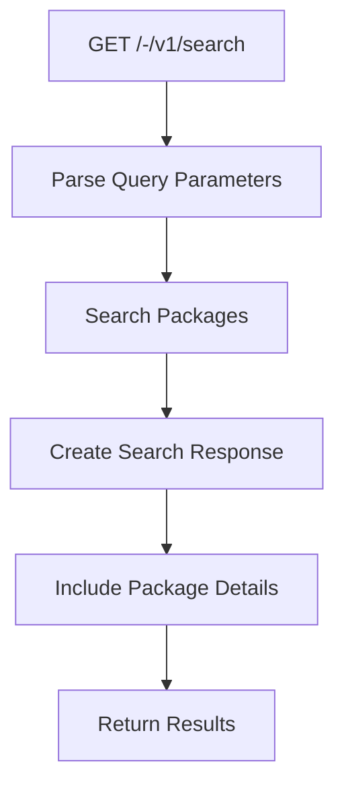
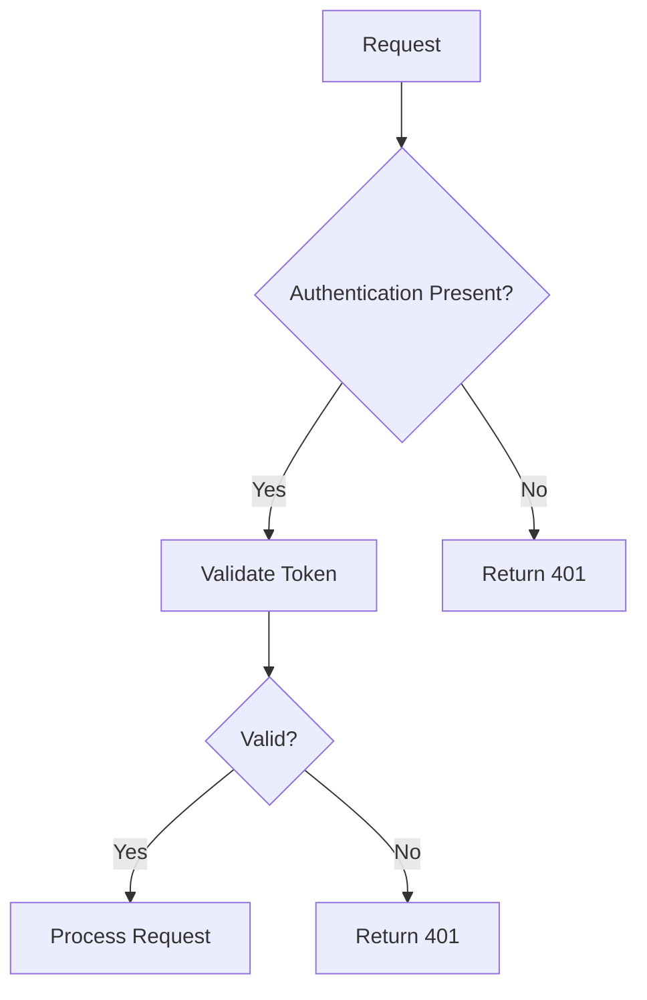
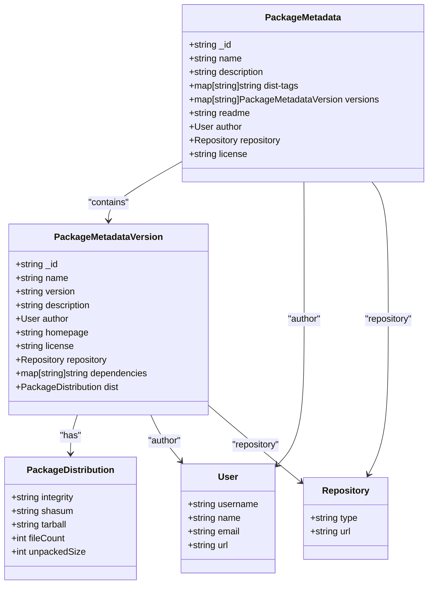
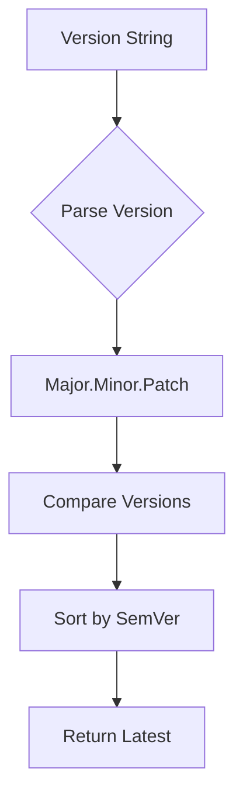
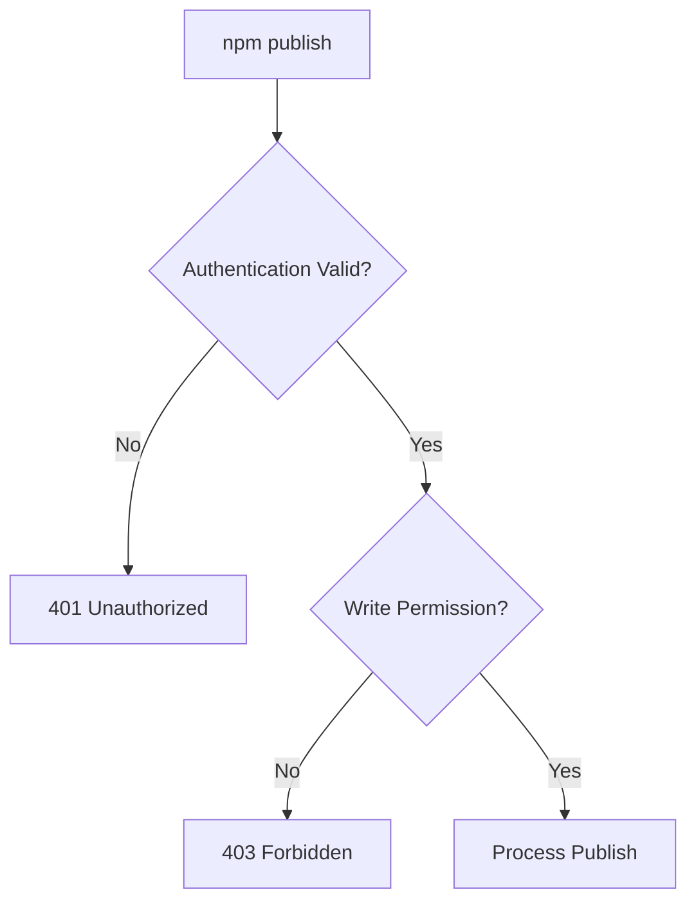
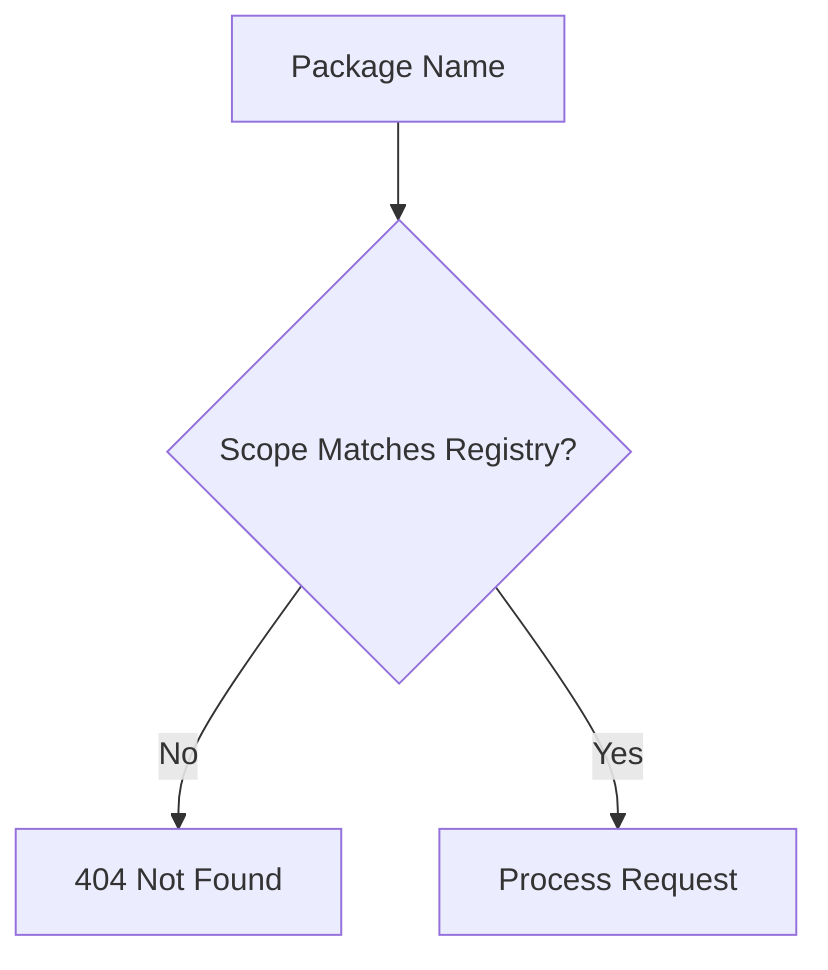
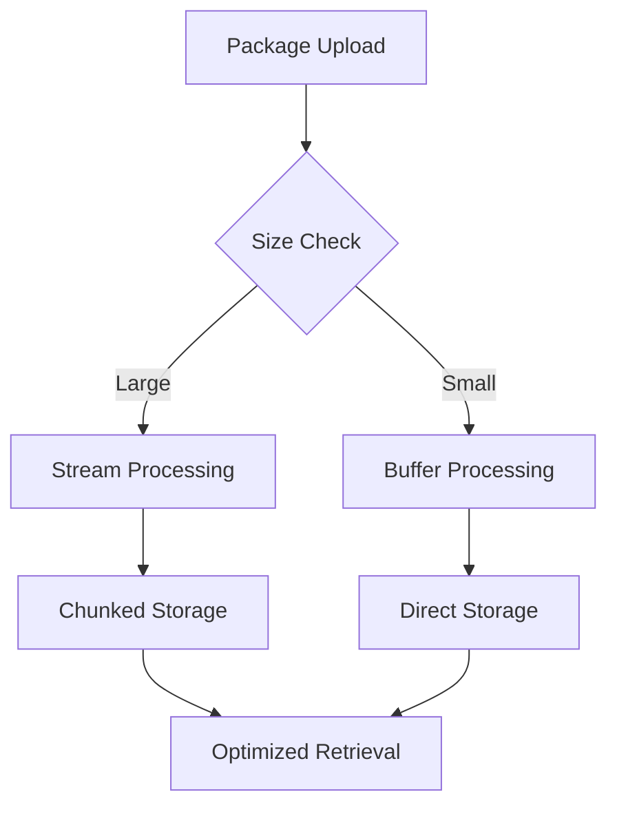
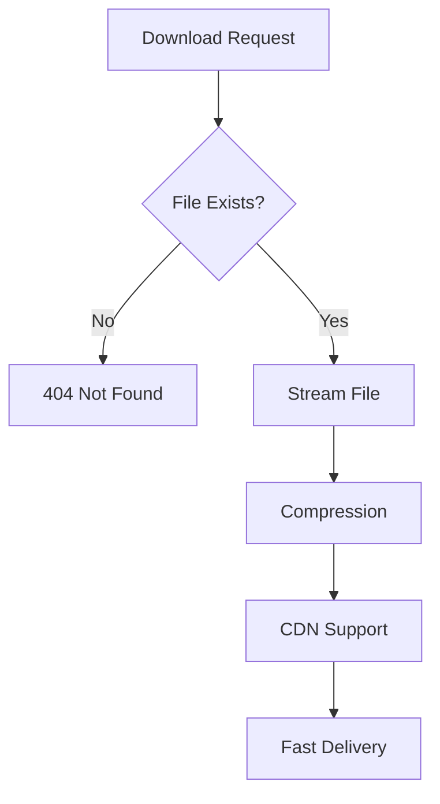

# npm Registry API

<cite>
**Referenced Files in This Document**   
- [api.go](file://routers/api/packages/api.go)
- [npm.go](file://routers/api/packages/npm/npm.go)
- [api.go](file://routers/api/packages/npm/api.go)
- [creator.go](file://modules/packages/npm/creator.go)
- [metadata.go](file://modules/packages/npm/metadata.go)
- [package.json](file://package.json)
</cite>

## Table of Contents
1. [Introduction](#introduction)
2. [API Endpoints](#api-endpoints)
3. [Authentication](#authentication)
4. [Repository URL Structure](#repository-url-structure)
5. [Package Configuration](#package-configuration)
6. [Metadata Format](#metadata-format)
7. [Common Issues](#common-issues)
8. [Performance Considerations](#performance-considerations)

## Introduction
Gitea provides a fully compatible npm registry implementation that allows users to publish, retrieve, and manage npm packages directly within the Gitea ecosystem. This documentation details the API endpoints, authentication mechanisms, repository structure, and configuration requirements for interacting with Gitea's npm registry using standard npm CLI tools.

The npm registry implementation in Gitea follows the npm Registry API specification, ensuring compatibility with existing npm clients and workflows. It supports all essential operations including package publishing, retrieval, metadata access, and search functionality.

**Section sources**
- [api.go](file://routers/api/packages/api.go#L382-L454)
- [npm.go](file://routers/api/packages/npm/npm.go#L52-L84)

## API Endpoints
Gitea's npm registry provides a comprehensive set of endpoints that are compatible with npm CLI tools. These endpoints handle package publishing, retrieval, metadata access, and search operations.

### Package Publishing (PUT)
The registry supports package publishing through PUT requests to specific endpoints. Packages can be published with scoped or unscoped names.

```mermaid
flowchart TD
A[PUT Request] --> B{Scope Check}
B --> |Scoped| C[/npm/@{scope}/{id}]
B --> |Unscoped| D[/npm/{id}]
C --> E[Package Validation]
D --> E
E --> F[Storage]
F --> G[Response 201 Created]
```

**Diagram sources**
- [api.go](file://routers/api/packages/api.go#L382-L414)
- [npm.go](file://routers/api/packages/npm/npm.go#L250-L300)

### Package Retrieval (GET)
Packages can be retrieved using GET requests to download package files or metadata.

```mermaid
flowchart TD
A[GET Request] --> B{Request Type}
B --> |File| C[/npm/{package}/-/{version}/{filename}]
B --> |Metadata| D[/npm/{package}]
B --> |Search| E[/-/v1/search]
C --> F[File Download]
D --> G[Metadata Response]
E --> H[Search Results]
```

**Diagram sources**
- [api.go](file://routers/api/packages/api.go#L382-L414)
- [npm.go](file://routers/api/packages/npm/npm.go#L134-L200)

### Package Metadata (GET)
The registry provides comprehensive metadata for packages, including version information, dependencies, and distribution details.

```mermaid
flowchart TD
A[GET /npm/{package}] --> B[Retrieve Package Versions]
B --> C[Sort by SemVer]
C --> D[Create Metadata Response]
D --> E[Include Dist-Tags]
E --> F[Include Time Stamps]
F --> G[Return JSON Response]
```

**Diagram sources**
- [api.go](file://routers/api/packages/api.go#L382-L414)
- [api.go](file://routers/api/packages/npm/api.go#L0-L50)

### Search Functionality
The registry includes a search endpoint that allows users to discover packages based on various criteria.



**Diagram sources**
- [api.go](file://routers/api/packages/api.go#L414-L454)
- [npm.go](file://routers/api/packages/npm/npm.go#L400-L460)

**Section sources**
- [api.go](file://routers/api/packages/api.go#L382-L454)
- [npm.go](file://routers/api/packages/npm/npm.go#L52-L460)

## Authentication
Gitea's npm registry supports authentication using npm's _auth token or bearer tokens via .npmrc configuration files.

### Authentication Methods
The registry accepts authentication through:
- npm _auth token in .npmrc
- Bearer tokens in Authorization header
- Personal access tokens



**Diagram sources**
- [api.go](file://routers/api/packages/api.go#L0-L574)
- [npm.go](file://routers/api/packages/npm/npm.go#L52-L84)

### .npmrc Configuration
To authenticate with the registry, users must configure their .npmrc file with the appropriate registry URL and authentication token.

```mermaid
flowchart TD
A[.npmrc File] --> B[registry=https://gitea.example.com/api/packages/{username}/npm/]
A --> C[always-auth=true]
A --> D[_auth={token}]
```

**Section sources**
- [api.go](file://routers/api/packages/api.go#L0-L574)
- [package.json](file://package.json#L0-L140)

## Repository URL Structure
The repository URL structure for Gitea's npm registry follows standard npm conventions with specific endpoints for different operations.

### Scoped Packages
Scoped packages use the following URL structure:
```
/api/packages/{username}/npm/@{scope}/{package}
```

### Unscoped Packages
Unscoped packages use the following URL structure:
```
/api/packages/{username}/npm/{package}
```

```mermaid
flowchart TD
A[Base URL] --> B{Package Type}
B --> |Scoped| C[/api/packages/{username}/npm/@{scope}/{package}]
B --> |Unscoped| D[/api/packages/{username}/npm/{package}]
C --> E[Endpoints]
D --> E
E --> F[/-/{version}/{filename}]
E --> G[/-/package/{id}/dist-tags]
E --> H[/-/v1/search]
```

**Diagram sources**
- [api.go](file://routers/api/packages/api.go#L382-L454)
- [npm.go](file://routers/api/packages/npm/npm.go#L52-L84)

**Section sources**
- [api.go](file://routers/api/packages/api.go#L382-L454)

## Package Configuration
Proper package configuration is essential for successful publishing and installation of packages from Gitea's npm registry.

### package.json Configuration
When publishing to Gitea's registry, the package.json file should include appropriate configuration:

```json
{
  "name": "@scope/package-name",
  "version": "1.0.0",
  "publishConfig": {
    "registry": "https://gitea.example.com/api/packages/username/npm/"
  }
}
```

### Publishing Configuration
To publish packages to Gitea's registry, configure the .npmrc file:

```
@scope:registry=https://gitea.example.com/api/packages/username/npm/
//gitea.example.com/api/packages/username/npm/:_authToken=your-access-token
```

### Installation Configuration
To install packages from Gitea's registry, ensure the .npmrc file includes the registry configuration:

```
@scope:registry=https://gitea.example.com/api/packages/username/npm/
```

**Section sources**
- [package.json](file://package.json#L0-L140)
- [creator.go](file://modules/packages/npm/creator.go#L175-L207)

## Metadata Format
Gitea's npm registry uses a standardized metadata format that follows npm's specifications for package information.

### Package Metadata Structure
The metadata format includes comprehensive information about packages and their versions:



**Diagram sources**
- [creator.go](file://modules/packages/npm/creator.go#L48-L127)
- [metadata.go](file://modules/packages/npm/metadata.go#L0-L27)

### Semantic Versioning
Gitea's npm registry follows semantic versioning principles for package versioning:



The registry uses the go-version library to parse and compare semantic versions, ensuring proper version ordering and compatibility with npm's version resolution algorithms.

**Section sources**
- [creator.go](file://modules/packages/npm/creator.go#L48-L127)
- [metadata.go](file://modules/packages/npm/metadata.go#L0-L27)

## Common Issues
This section addresses common issues encountered when working with Gitea's npm registry.

### Authentication Failures
Authentication failures during npm publish operations typically occur due to:
- Invalid or expired access tokens
- Incorrect .npmrc configuration
- Missing write permissions



### Scope Configuration Issues
Incorrect scope configuration can prevent package publishing or installation:



### Public Registry Conflicts
Conflicts with the public npm registry can occur when:
- Package names are already published to the public registry
- Scope names conflict with existing public scopes
- Network connectivity issues prevent registry access

**Section sources**
- [npm.go](file://routers/api/packages/npm/npm.go#L250-L300)
- [api.go](file://routers/api/packages/api.go#L382-L454)

## Performance Considerations
Optimizing performance is crucial when handling large npm packages and ensuring fast download speeds.

### Large Package Handling
Gitea's registry is designed to handle large npm packages efficiently:



### Download Speed Optimization
The registry implements several optimizations to improve download speeds:



Performance considerations include:
- Efficient storage and retrieval of package files
- Support for streaming large files
- Optimized database queries for metadata access
- Caching mechanisms for frequently accessed packages

**Section sources**
- [npm.go](file://routers/api/packages/npm/npm.go#L134-L200)
- [api.go](file://routers/api/packages/api.go#L382-L454)