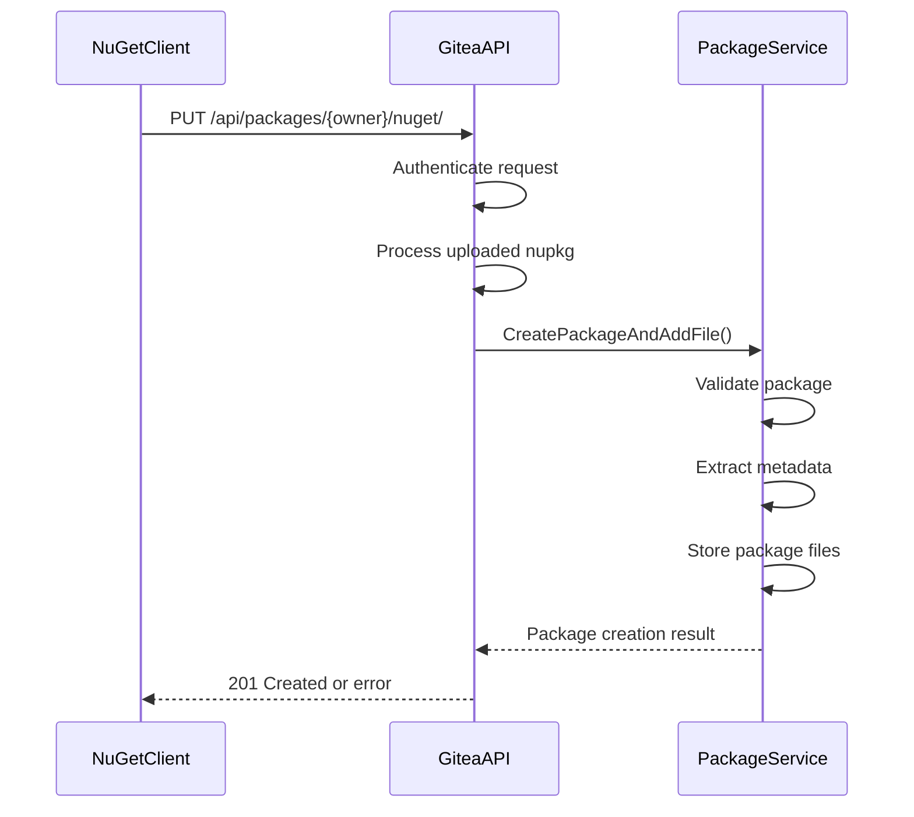
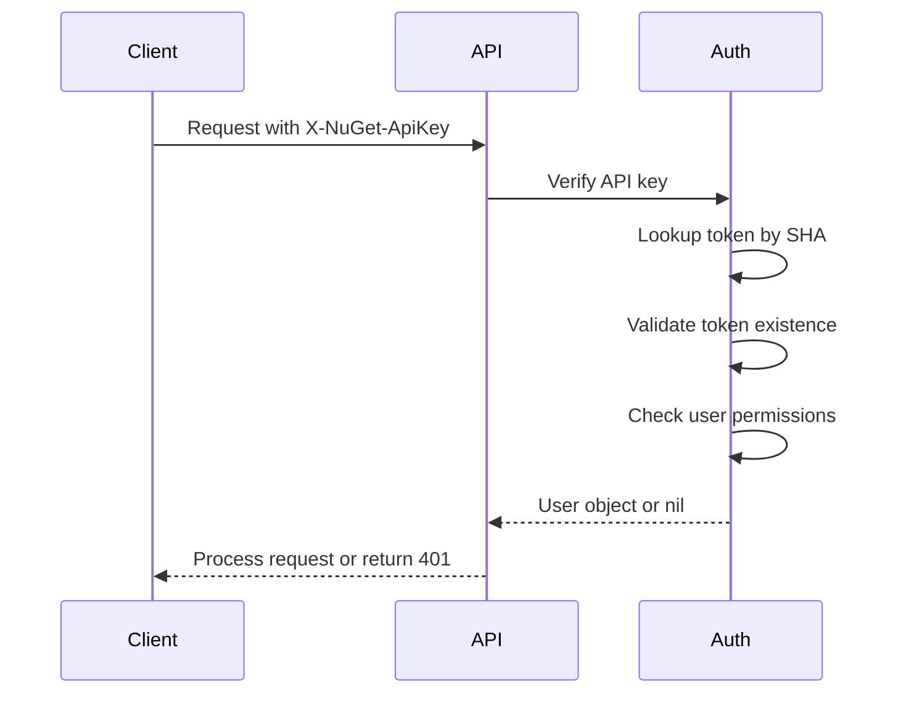
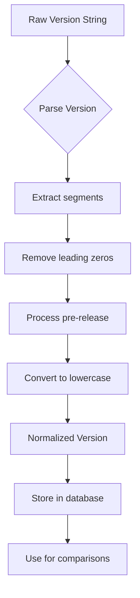
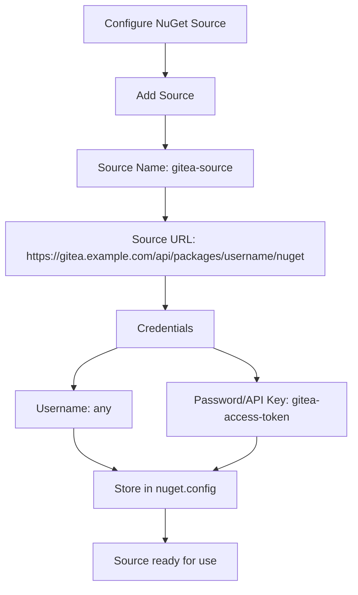
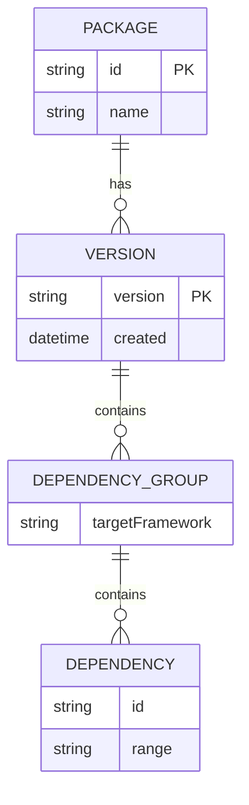
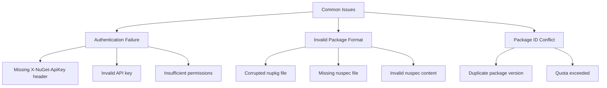
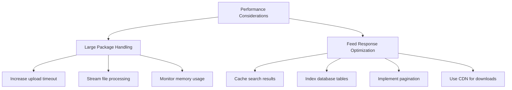

# nuget Registry API

<cite>
**Referenced Files in This Document**   
- [nuget.go](file://routers/api/packages/nuget/nuget.go)
- [api_v3.go](file://routers/api/packages/nuget/api_v3.go)
- [api.go](file://routers/api/packages/api.go)
- [auth.go](file://routers/api/packages/nuget/auth.go)
- [links.go](file://routers/api/packages/nuget/links.go)
- [metadata.go](file://modules/packages/nuget/metadata.go)
- [search.go](file://models/packages/nuget/search.go)
- [api_packages_nuget_test.go](file://tests/integration/api_packages_nuget_test.go)
</cite>

## Table of Contents
1. [Introduction](#introduction)
2. [Service Index Endpoint](#service-index-endpoint)
3. [Package Pushing](#package-pushing)
4. [Package Listing](#package-listing)
5. [Package Downloading](#package-downloading)
6. [Package Searching](#package-searching)
7. [Authentication Methods](#authentication-methods)
8. [Package ID and Versioning Scheme](#package-id-and-versioning-scheme)
9. [NuGet Client Configuration](#nuget-client-configuration)
10. [Metadata Format and Dependency Resolution](#metadata-format-and-dependency-resolution)
11. [Common Issues](#common-issues)
12. [Performance Considerations](#performance-considerations)

## Introduction
Gitea provides a nuget package registry that is compatible with nuget CLI and .NET tools. This documentation details the API endpoints, authentication methods, package management operations, and configuration required to use Gitea as a nuget package repository. The registry supports standard nuget operations including package pushing, listing, downloading, and searching, with proper authentication and authorization controls.

**Section sources**
- [nuget.go](file://routers/api/packages/nuget/nuget.go#L47-L85)
- [api.go](file://routers/api/packages/api.go#L354-L385)

## Service Index Endpoint
The service index endpoint provides a discovery mechanism for nuget clients to identify available resources in the registry. Gitea implements both V2 and V3 service index endpoints that return metadata about the available services.

The V3 service index endpoint returns a JSON response containing various resource types including search query service, registrations base URL, package base address, and package publish endpoints. Each resource includes an ID (URL) and type that clients use to locate and interact with the corresponding service.

```mermaid
flowchart TD
Client --> |GET /api/packages/{owner}/nuget/index.json| ServiceIndexV3
ServiceIndexV3 --> |200 OK| Response
Response --> Version["version: 3.0.0"]
Response --> Resources["resources: array of service endpoints"]
Resources --> SearchQuery["SearchQueryService"]
Resources --> Registrations["RegistrationsBaseUrl"]
Resources --> PackageBase["PackageBaseAddress/3.0.0"]
Resources --> PackagePublish["PackagePublish/2.0.0"]
```

**Diagram sources**
- [nuget.go](file://routers/api/packages/nuget/nuget.go#L47-L85)
- [api.go](file://routers/api/packages/api.go#L354-L385)

**Section sources**
- [nuget.go](file://routers/api/packages/nuget/nuget.go#L47-L85)
- [api.go](file://routers/api/packages/api.go#L354-L385)

## Package Pushing
Package pushing allows users to upload nuget packages to the registry using the `nuget push` or `dotnet nuget push` commands. The upload endpoint accepts PUT requests with the package content and processes the nupkg file to extract metadata and store the package.

When a package is uploaded, Gitea validates the package format, extracts metadata from the nuspec file, and creates the necessary database records for the package, version, and files. The system also handles symbol packages (snupkg) separately through a dedicated symbol package upload endpoint.



**Diagram sources**
- [nuget.go](file://routers/api/packages/nuget/nuget.go#L423-L471)
- [nuget.go](file://routers/api/packages/nuget/nuget.go#L473-L525)

**Section sources**
- [nuget.go](file://routers/api/packages/nuget/nuget.go#L423-L525)
- [api.go](file://routers/api/packages/api.go#L354-L385)

## Package Listing
Package listing endpoints allow clients to retrieve information about available packages and their versions. Gitea implements both V2 and V3 endpoints for enumerating package versions, with different URL patterns and response formats.

The registration index endpoint returns information about all versions of a specific package, including the registration leaf URLs and package content URLs. The response includes pagination information and links to navigate through version pages.

```mermaid
flowchart TD
A[Client] --> B[GET /registration/{id}/index.json]
B --> C{Package Exists?}
C --> |Yes| D[Return RegistrationIndexResponse]
D --> E[Include all version metadata]
D --> F[Include pagination links]
C --> |No| G[Return 404 Not Found]
E --> H[Client can navigate versions]
```

**Diagram sources**
- [nuget.go](file://routers/api/packages/nuget/nuget.go#L217-L261)
- [nuget.go](file://routers/api/packages/nuget/nuget.go#L263-L308)

**Section sources**
- [nuget.go](file://routers/api/packages/nuget/nuget.go#L217-L308)
- [api.go](file://routers/api/packages/api.go#L354-L385)

## Package Downloading
Package downloading is handled through dedicated endpoints that serve the actual package files. Clients can download packages by requesting the package content URL obtained from the registration or enumeration responses.

The download endpoint serves the nupkg file with appropriate content type headers and handles range requests for partial content delivery. The filename in the URL follows the pattern `{packageId}.{version}.nupkg` to ensure compatibility with nuget clients.

```mermaid
flowchart TD
Client --> |GET /package/{id}/{version}/{filename}| DownloadEndpoint
DownloadEndpoint --> |Check permissions| Authorization
Authorization --> |Authorized| ServeFile
Authorization --> |Not Authorized| Return403
ServeFile --> |Stream package content| Client
ServeFile --> |Set Content-Type| application/octet-stream
```

**Diagram sources**
- [nuget.go](file://routers/api/packages/nuget/nuget.go#L394-L421)
- [api.go](file://routers/api/packages/api.go#L354-L385)

**Section sources**
- [nuget.go](file://routers/api/packages/nuget/nuget.go#L394-L421)
- [api.go](file://routers/api/packages/api.go#L354-L385)

## Package Searching
Package searching allows clients to discover packages by name or other metadata. Gitea implements both V2 and V3 search endpoints with different query parameter conventions and response formats.

The V3 search endpoint uses query parameters `q` for search term, `skip` for pagination offset, and `take` for page size. The response includes the total number of hits and a list of search results with package metadata and version information.

```mermaid
flowchart TD
A[Client] --> B[GET /query?q={term}&skip=0&take=10]
B --> C{Authenticate}
C --> |Success| D[SearchPackages]
D --> E[Filter by owner and visibility]
E --> F[Sort by relevance]
F --> G[Return SearchResultResponse]
G --> H[TotalHits and Data array]
G --> I[Pagination via next link]
C --> |Fail| J[Return 401/403]
```

**Diagram sources**
- [nuget.go](file://routers/api/packages/nuget/nuget.go#L127-L172)
- [search.go](file://models/packages/nuget/search.go#L55-L69)

**Section sources**
- [nuget.go](file://routers/api/packages/nuget/nuget.go#L127-L172)
- [search.go](file://models/packages/nuget/search.go#L0-L53)

## Authentication Methods
Authentication for the nuget registry is handled through API keys configured in the nuget sources. The system supports two authentication methods: X-NuGet-ApiKey header and basic authentication.

The X-NuGet-ApiKey header is the preferred method, where the API key value is sent in the header. The system validates the API key against stored access tokens and associates the request with the corresponding user account. Basic authentication using username and password is also supported for compatibility.



**Diagram sources**
- [auth.go](file://routers/api/packages/nuget/auth.go#L0-L47)
- [api.go](file://routers/api/packages/api.go#L354-L385)

**Section sources**
- [auth.go](file://routers/api/packages/nuget/auth.go#L0-L47)
- [api_packages_nuget_test.go](file://tests/integration/api_packages_nuget_test.go#L192-L289)

## Package ID and Versioning Scheme
Gitea's nuget registry follows the standard nuget package ID and versioning scheme. Package IDs are case-insensitive strings that identify a package, while versions follow semantic versioning principles with normalization rules.

The system normalizes version numbers by removing leading zeros from version segments and converting pre-release identifiers to lowercase. For example, version "1.04.5.2.5-rc.1+metadata" is normalized to "1.4.5.2-rc.1" following nuget specifications.



**Diagram sources**
- [metadata.go](file://modules/packages/nuget/metadata.go#L224-L275)
- [nuget.go](file://routers/api/packages/nuget/nuget.go#L263-L308)

**Section sources**
- [metadata.go](file://modules/packages/nuget/metadata.go#L224-L275)
- [api_packages_nuget_test.go](file://tests/integration/api_packages_nuget_test.go#L180-L216)

## NuGet Client Configuration
To use Gitea as a nuget package source, clients must configure the package source with the appropriate URL and API key. The source URL follows the pattern `{gitea_url}/api/packages/{owner}/nuget`, where owner is the username or organization name.

Configuration can be done through nuget CLI, Visual Studio, or .NET CLI tools. The API key must be generated in Gitea's user settings and configured as a nuget source credential.



**Section sources**
- [api_packages_nuget_test.go](file://tests/integration/api_packages_nuget_test.go#L239-L289)
- [auth.go](file://routers/api/packages/nuget/auth.go#L0-L47)

## Metadata Format and Dependency Resolution
Package metadata is extracted from the nuspec file within the nupkg archive. The metadata includes package ID, version, authors, description, dependencies, and other properties defined in the nuget specification.

Dependencies are resolved by parsing the dependencies section of the nuspec file, which can include both direct dependencies and target framework-specific dependency groups. The system stores dependencies with their version ranges and target frameworks for proper resolution.



**Diagram sources**
- [metadata.go](file://modules/packages/nuget/metadata.go#L224-L275)
- [api_v3.go](file://routers/api/packages/nuget/api_v3.go#L52-L72)

**Section sources**
- [metadata.go](file://modules/packages/nuget/metadata.go#L224-L275)
- [api_v3.go](file://routers/api/packages/nuget/api_v3.go#L141-L169)

## Common Issues
Several common issues may occur when using the nuget registry, including authentication failures, invalid package formats, and package ID conflicts.

Authentication failures typically occur when the API key is missing, invalid, or lacks sufficient permissions. Invalid package format errors happen when the nupkg file is corrupted or doesn't contain a valid nuspec file. Package ID conflicts occur when attempting to push a package version that already exists.



**Section sources**
- [nuget.go](file://routers/api/packages/nuget/nuget.go#L423-L471)
- [nuget.go](file://routers/api/packages/nuget/nuget.go#L527-L563)

## Performance Considerations
When handling large nuget packages, several performance considerations should be addressed. The system should be configured with appropriate timeouts and memory limits to handle large file uploads.

For optimizing feed response times, caching strategies should be implemented for frequently accessed endpoints like package search and registration index. Database indexing on package name and version fields improves query performance for package lookups.



**Section sources**
- [nuget.go](file://routers/api/packages/nuget/nuget.go#L423-L471)
- [nuget.go](file://routers/api/packages/nuget/nuget.go#L127-L172)
- [api.go](file://routers/api/packages/api.go#L354-L385)