# Administration

<cite>
**Referenced Files in This Document**   
- [admin.go](file://cmd/admin.go)
- [admin_user_create.go](file://cmd/admin_user_create.go)
- [admin_user_delete.go](file://cmd/admin_user_delete.go)
- [admin_user_list.go](file://cmd/admin_user_list.go)
- [admin_user.go](file://routers/api/v1/admin/user.go)
- [repo.go](file://routers/api/v1/admin/repo.go)
- [cron.go](file://routers/api/v1/admin/cron.go)
- [hooks.go](file://routers/api/v1/admin/hooks.go)
- [runners.go](file://routers/api/v1/admin/runners.go)
- [doctor.go](file://services/doctor/doctor.go)
- [tasks.go](file://services/cron/tasks.go)
- [user.go](file://models/user/user.go)
- [cron.go](file://modules/structs/cron.go)
</cite>

## Table of Contents
1. [Introduction](#introduction)
2. [User Management](#user-management)
3. [Repository Management](#repository-management)
4. [Cron Job Monitoring](#cron-job-monitoring)
5. [System Hooks](#system-hooks)
6. [Runner Management](#runner-management)
7. [Service Layer Integration](#service-layer-integration)
8. [Common Issues and Troubleshooting](#common-issues-and-troubleshooting)
9. [Performance Considerations](#performance-considerations)
10. [Security Best Practices](#security-best-practices)

## Introduction
This document provides comprehensive documentation for Gitea's administrative endpoints in REST API v1. It covers system administration tasks including user management, repository management, organization creation, cron job monitoring, system hooks, and runner management. The documentation includes detailed information about HTTP methods, URL patterns, request/response schemas, and authentication requirements for these administrative endpoints. It also explains the relationship between these API endpoints and their corresponding service layer implementations in cmd/admin and services/doctor, addressing common issues such as permission escalation, system resource limits, and configuration conflicts.

## User Management

The administrative API provides comprehensive endpoints for managing users across the Gitea system. These endpoints allow administrators to create, modify, delete, and search for users, as well as manage their public keys and access tokens.

### User Creation
Administrators can create new users through the API or command-line interface. The creation process requires essential user information and supports various configuration options.

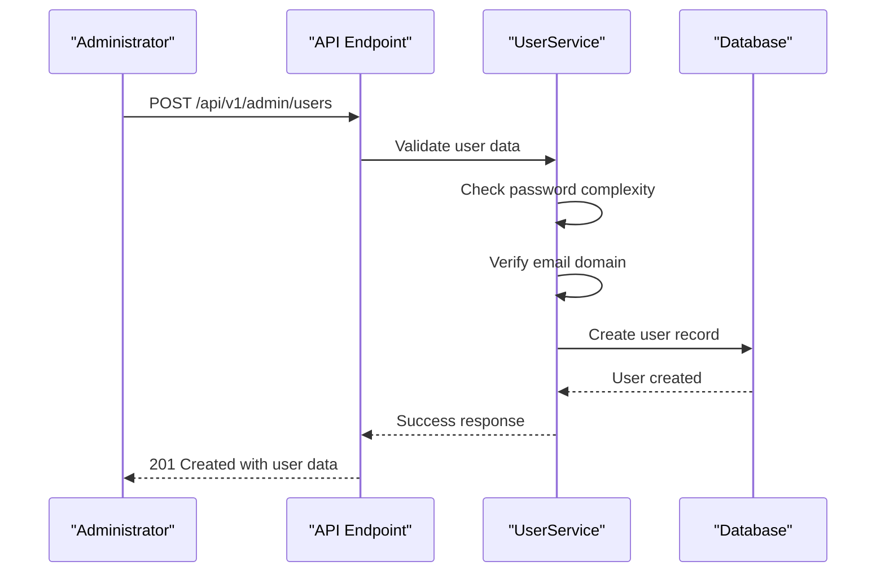

**Diagram sources**
- [admin_user.go](file://routers/api/v1/admin/user.go#L50-L150)
- [admin_user_create.go](file://cmd/admin_user_create.go#L50-L150)

### User Modification
Administrators can modify existing user properties including profile information, authentication settings, and permissions.

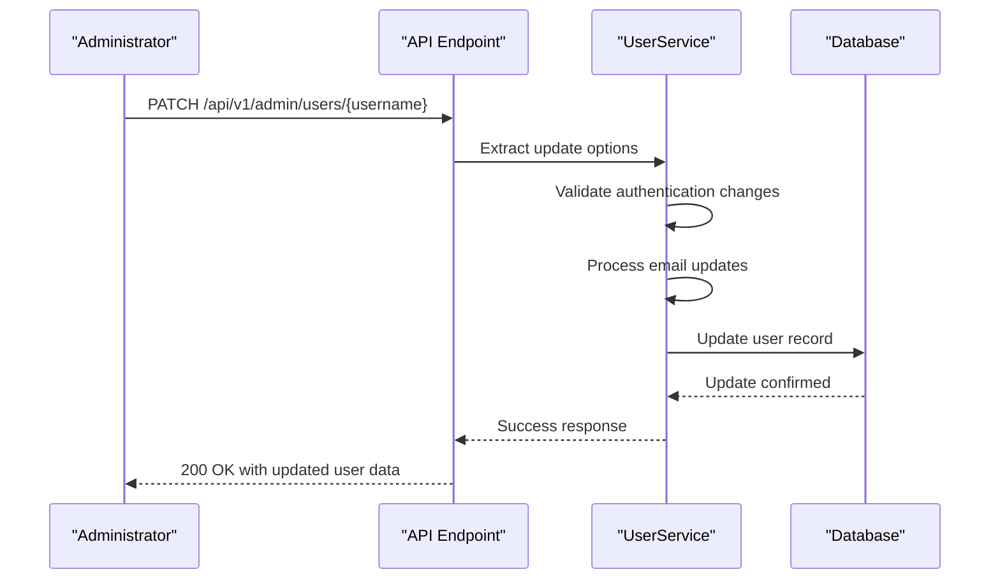

**Diagram sources**
- [admin_user.go](file://routers/api/v1/admin/user.go#L151-L250)
- [admin_user_change_password.go](file://cmd/admin_user_change_password.go#L10-L50)

### User Deletion
The system provides endpoints for safely removing users from the platform, with options for purging associated data.

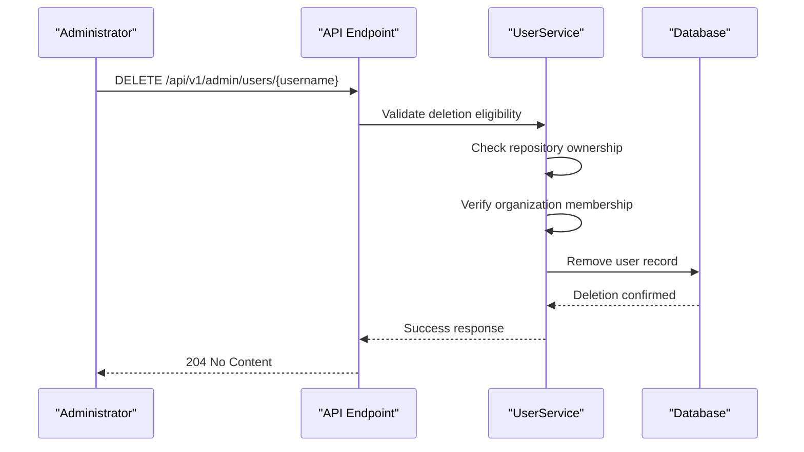

**Diagram sources**
- [admin_user.go](file://routers/api/v1/admin/user.go#L251-L300)
- [admin_user_delete.go](file://cmd/admin_user_delete.go#L10-L50)

**Section sources**
- [admin_user.go](file://routers/api/v1/admin/user.go)
- [admin_user_create.go](file://cmd/admin_user_create.go)
- [admin_user_delete.go](file://cmd/admin_user_delete.go)
- [admin_user_list.go](file://cmd/admin_user_list.go)

## Repository Management

Administrators can create repositories on behalf of users through the administrative API, enabling centralized repository provisioning and management.

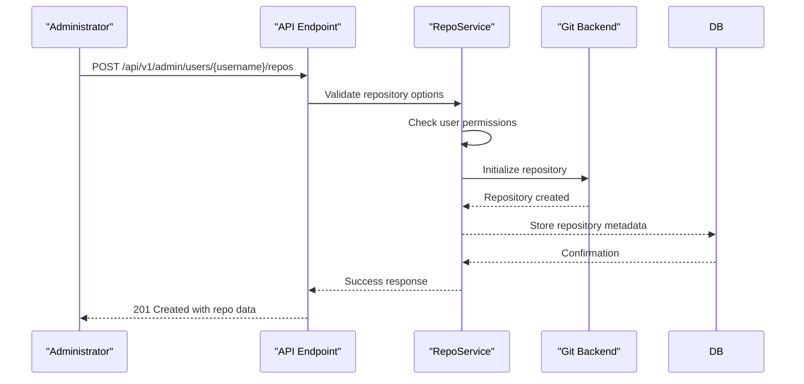

**Diagram sources**
- [repo.go](file://routers/api/v1/admin/repo.go#L10-L30)
- [repo.go](file://services/repository/repo.go#L100-L150)

**Section sources**
- [repo.go](file://routers/api/v1/admin/repo.go)

## Cron Job Monitoring

The administrative API provides endpoints for monitoring and managing scheduled system tasks, allowing administrators to view cron job status and trigger executions.

### Cron Task Listing
Administrators can retrieve information about all configured cron tasks in the system.

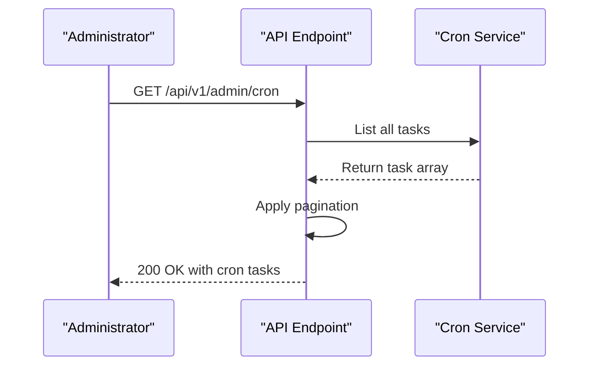

**Diagram sources**
- [cron.go](file://routers/api/v1/admin/cron.go#L10-L40)
- [tasks.go](file://services/cron/tasks.go#L100-L150)

### Cron Task Execution
Administrators can manually trigger the execution of specific cron tasks.

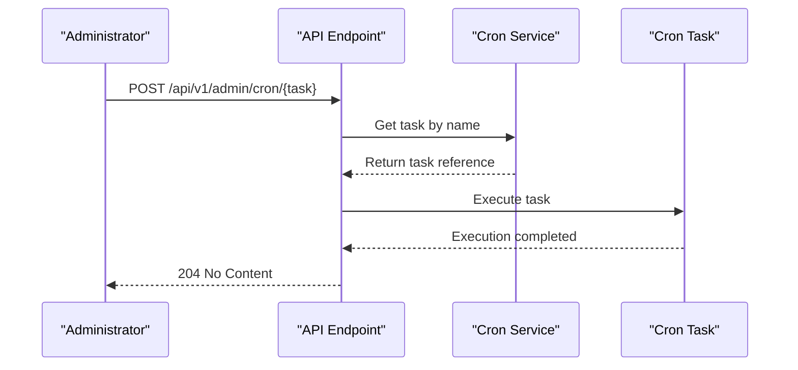

**Diagram sources**
- [cron.go](file://routers/api/v1/admin/cron.go#L41-L80)
- [tasks.go](file://services/cron/tasks.go#L190-L240)

**Section sources**
- [cron.go](file://routers/api/v1/admin/cron.go)
- [tasks.go](file://services/cron/tasks.go)
- [cron.go](file://modules/structs/cron.go)

## System Hooks

Administrative endpoints allow management of system-wide webhooks that trigger on various platform events.

### Hook Management Operations
The API supports creating, listing, updating, and deleting system hooks.

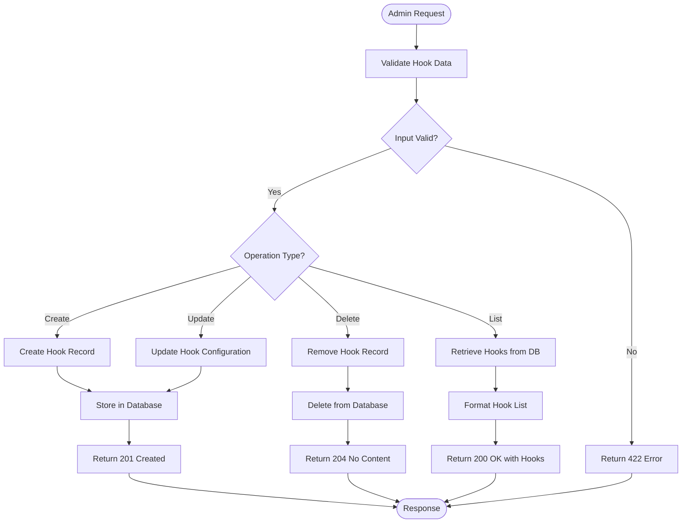

**Diagram sources**
- [hooks.go](file://routers/api/v1/admin/hooks.go#L10-L100)
- [webhook.go](file://models/webhook/webhook.go#L50-L100)

**Section sources**
- [hooks.go](file://routers/api/v1/admin/hooks.go)

## Runner Management

The administrative API provides endpoints for managing global runners used for continuous integration and deployment tasks.

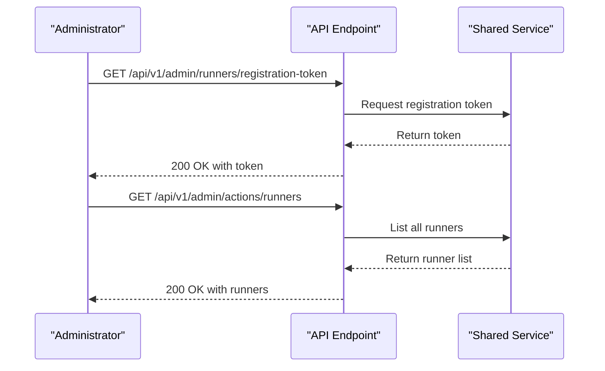

**Diagram sources**
- [runners.go](file://routers/api/v1/admin/runners.go#L10-L60)
- [shared.go](file://routers/api/v1/shared/shared.go#L100-L150)

**Section sources**
- [runners.go](file://routers/api/v1/admin/runners.go)

## Service Layer Integration

The administrative API endpoints are closely integrated with service layer implementations in cmd/admin and services/doctor, providing both HTTP and command-line interfaces to the same underlying functionality.

### Command and API Parallels
Many administrative functions are available through both API endpoints and command-line tools, sharing common service layer implementations.

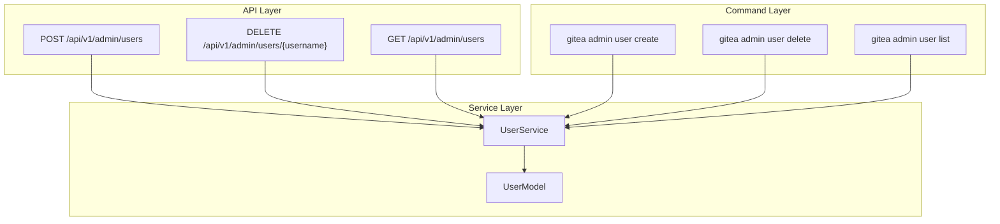

**Diagram sources**
- [admin_user.go](file://routers/api/v1/admin/user.go)
- [admin_user_create.go](file://cmd/admin_user_create.go)
- [admin_user_delete.go](file://cmd/admin_user_delete.go)
- [admin_user_list.go](file://cmd/admin_user_list.go)
- [user_service.go](file://services/user/user_service.go)

### Doctor Service Integration
The doctor service provides system health checks and maintenance operations accessible through both API and command-line interfaces.

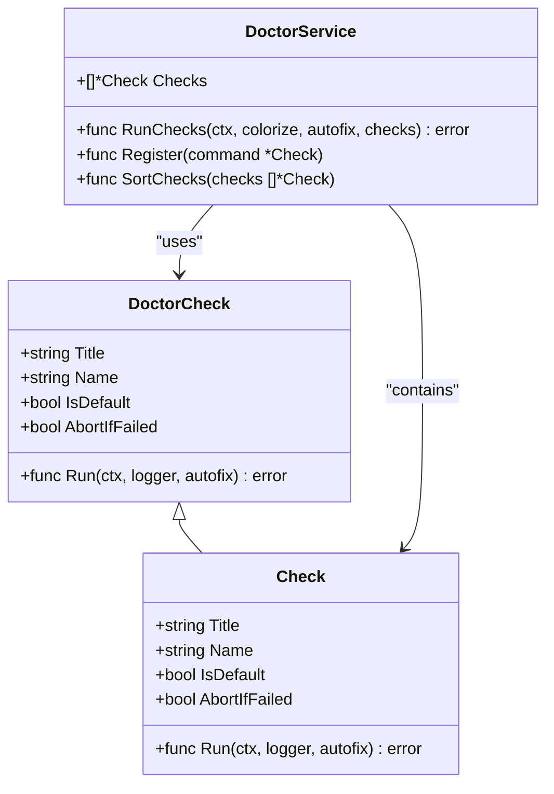

**Diagram sources**
- [doctor.go](file://services/doctor/doctor.go#L10-L100)
- [doctor.go](file://cmd/doctor.go#L10-L50)

**Section sources**
- [doctor.go](file://services/doctor/doctor.go)
- [admin.go](file://cmd/admin.go)

## Common Issues and Troubleshooting

### Permission Escalation
Administrative endpoints require appropriate permissions and are protected against unauthorized access. The system uses token-based authentication with scope validation to prevent permission escalation.

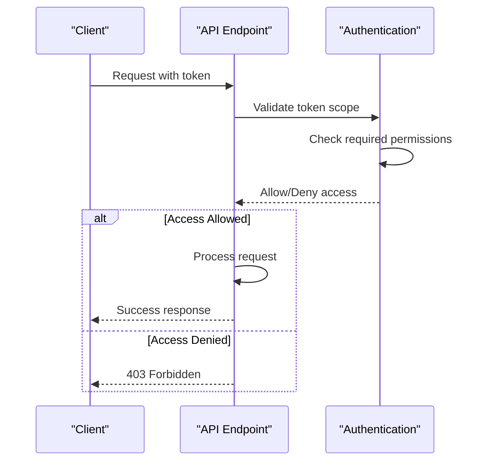

**Diagram sources**
- [api.go](file://routers/api/v1/api.go#L299-L333)
- [auth.go](file://modules/auth/auth.go#L100-L150)

### System Resource Limits
The system enforces various resource limits to prevent abuse and ensure stability. These include password complexity requirements, rate limiting, and storage quotas.

### Configuration Conflicts
When configuration conflicts occur, the system prioritizes security and data integrity. The doctor service can identify and resolve many common configuration issues.

**Section sources**
- [api.go](file://routers/api/v1/api.go#L299-L333)
- [doctor.go](file://services/doctor/doctor.go)

## Performance Considerations

### Bulk Operations
For large installations, bulk operations should be performed during off-peak hours to minimize impact on system performance. The API supports pagination for listing operations to prevent memory exhaustion.

### Caching Strategies
The system implements caching for frequently accessed data such as user information and repository metadata. Administrators should be aware of cache invalidation patterns when making bulk changes.

### Rate Limiting
Administrative endpoints are subject to rate limiting to prevent abuse and ensure system stability. Excessive API calls may result in temporary throttling.

**Section sources**
- [setting.go](file://modules/setting/setting.go#L1000-L1050)
- [cache.go](file://modules/cache/cache.go#L10-L50)

## Security Best Practices

### Endpoint Protection
Administrative endpoints should be protected behind firewalls and accessed only from trusted networks. Use of API tokens with limited scopes is recommended over basic authentication.

### Audit Logging
All administrative actions are logged for audit purposes. These logs should be regularly reviewed and stored securely.

### Token Management
API tokens should have the minimum required permissions and be rotated regularly. Tokens with administrative privileges should be especially protected.

### Input Validation
All input to administrative endpoints is thoroughly validated to prevent injection attacks and data corruption.

**Section sources**
- [api.go](file://routers/api/v1/api.go#L299-L333)
- [log.go](file://modules/log/log.go#L100-L150)
- [auth.go](file://modules/auth/auth.go#L200-L250)