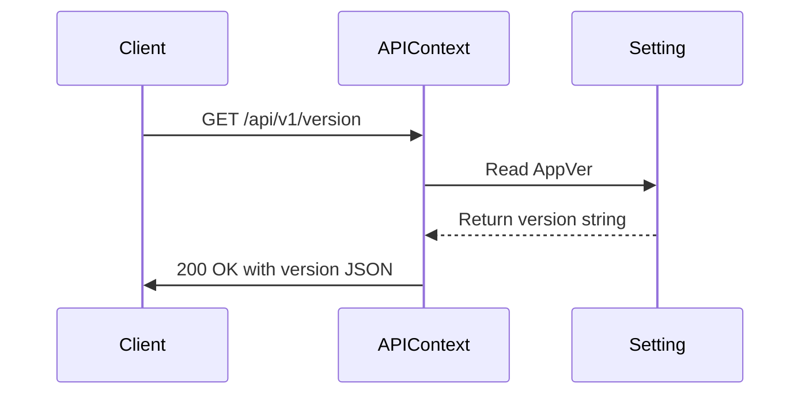
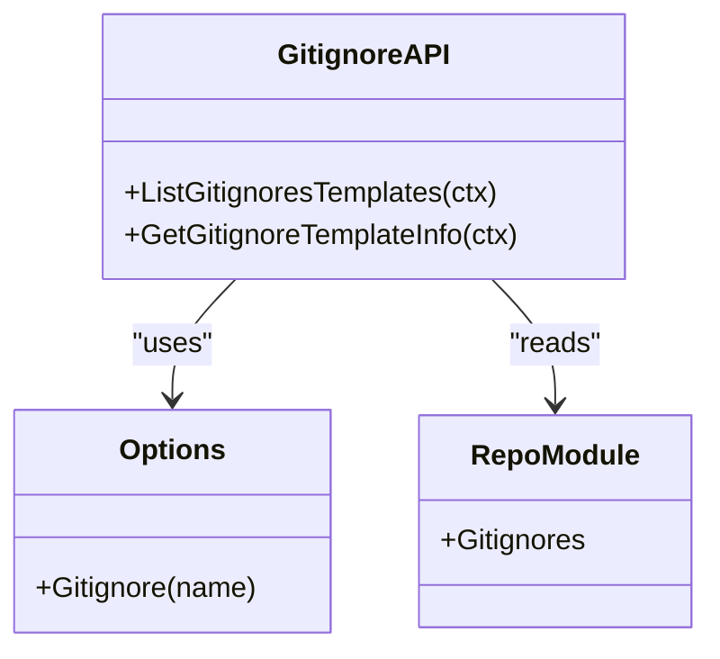
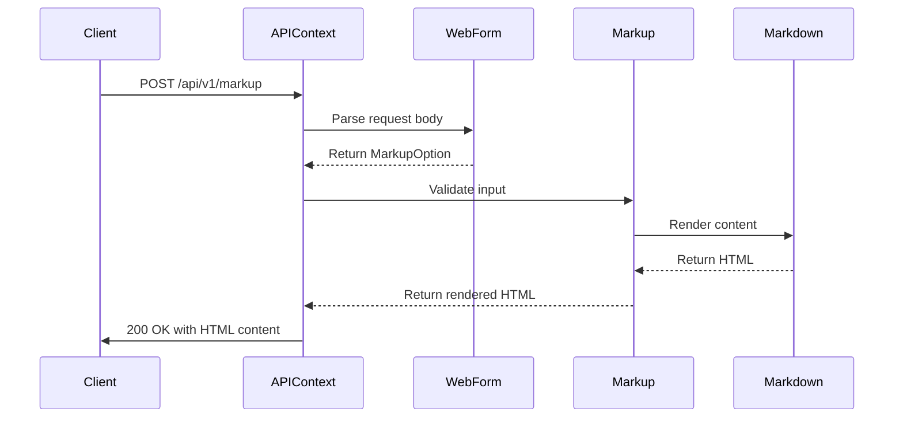
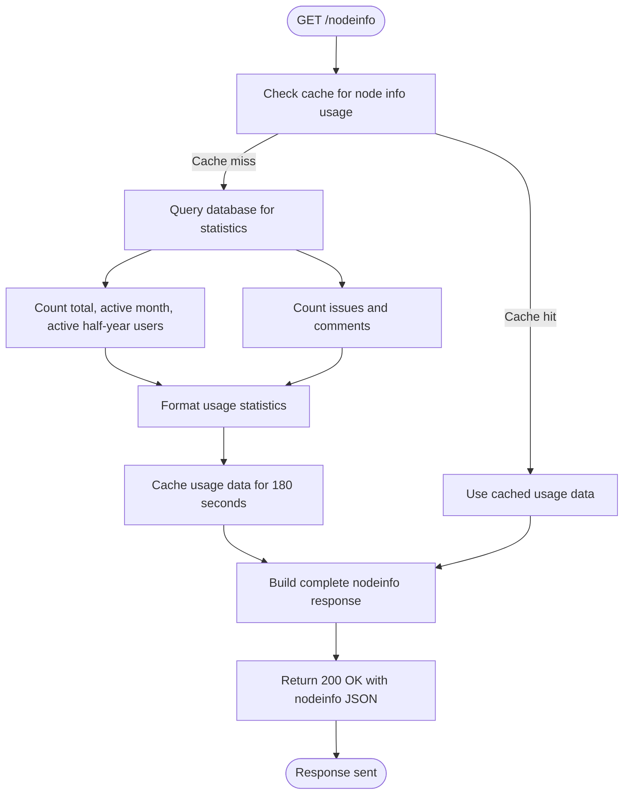
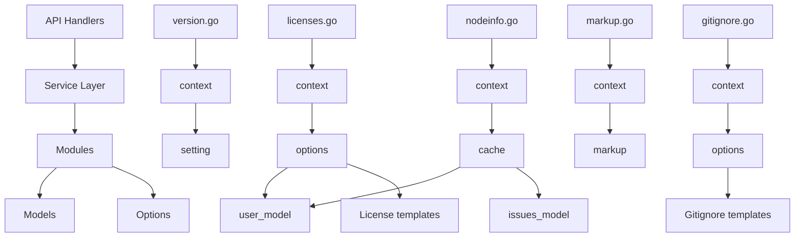

# Miscellaneous

<cite>
**Referenced Files in This Document**   
- [gitignore.go](file://routers/api/v1/misc/gitignore.go)
- [licenses.go](file://routers/api/v1/misc/licenses.go)
- [markup.go](file://routers/api/v1/misc/markup.go)
- [nodeinfo.go](file://routers/api/v1/misc/nodeinfo.go)
- [version.go](file://routers/api/v1/misc/version.go)
- [miscellaneous.go](file://modules/structs/miscellaneous.go)
- [nodeinfo.go](file://modules/structs/nodeinfo.go)
</cite>

## Table of Contents
1. [Introduction](#introduction)
2. [API Endpoints Overview](#api-endpoints-overview)
3. [Retrieve Gitea Version](#retrieve-gitea-version)
4. [List and Retrieve Licenses](#list-and-retrieve-licenses)
5. [Gitignore Templates Management](#gitignore-templates-management)
6. [Markup Rendering](#markup-rendering)
7. [Node Information](#node-information)
8. [Error Handling](#error-handling)
9. [Performance Considerations](#performance-considerations)
10. [Caching Strategies](#caching-strategies)
11. [Implementation Relationships](#implementation-relationships)

## Introduction

The Miscellaneous API endpoints in Gitea's REST API v1 provide essential system-level information and utility functions for clients interacting with the Gitea server. These endpoints enable retrieval of system metadata, license templates, gitignore templates, rendered markup content, and federation node information. This documentation details the complete functionality of these endpoints, including request/response schemas, authentication requirements, and implementation details.

**Section sources**
- [version.go](file://routers/api/v1/misc/version.go#L1-L25)
- [nodeinfo.go](file://routers/api/v1/misc/nodeinfo.go#L1-L78)

## API Endpoints Overview

The Miscellaneous API category includes the following endpoints:

| Endpoint | HTTP Method | Purpose |
|--------|-----------|-------|
| `/version` | GET | Retrieve the current Gitea server version |
| `/licenses` | GET | List all available license templates |
| `/licenses/{name}` | GET | Retrieve specific license template by name |
| `/gitignore/templates` | GET | List all available gitignore templates |
| `/gitignore/templates/{name}` | GET | Retrieve specific gitignore template by name |
| `/markup` | POST | Render markup content to HTML |
| `/markdown` | POST | Render markdown content to HTML |
| `/markdown/raw` | POST | Render raw markdown content to HTML |
| `/nodeinfo` | GET | Retrieve system node information for federation |

All endpoints are accessible without authentication for public instances, though some information may be restricted on private installations.

**Section sources**
- [gitignore.go](file://routers/api/v1/misc/gitignore.go#L1-L56)
- [licenses.go](file://routers/api/v1/misc/licenses.go#L1-L75)
- [markup.go](file://routers/api/v1/misc/markup.go#L1-L106)

## Retrieve Gitea Version

### Endpoint
```
GET /api/v1/version
```

### Request
No parameters required.

### Response Schema
```json
{
  "version": "string"
}
```

### Example Response
```json
{
  "version": "1.20.0+dev-123-gabc1234"
}
```

### Implementation Details
The version endpoint returns the current Gitea server version by accessing the `setting.AppVer` variable, which is populated during the build process. This information is crucial for clients to determine compatibility with specific API features and to provide appropriate user interfaces based on server capabilities.



**Diagram sources**
- [version.go](file://routers/api/v1/misc/version.go#L1-L25)
- [miscellaneous.go](file://modules/structs/miscellaneous.go#L1-L122)

**Section sources**
- [version.go](file://routers/api/v1/misc/version.go#L1-L25)
- [miscellaneous.go](file://modules/structs/miscellaneous.go#L1-L122)

## List and Retrieve Licenses

### List All Licenses
#### Endpoint
```
GET /api/v1/licenses
```

#### Request
No parameters required.

#### Response Schema
Array of license template entries:
```json
[
  {
    "key": "string",
    "name": "string",
    "url": "string"
  }
]
```

#### Example Response
```json
[
  {
    "key": "MIT",
    "name": "MIT",
    "url": "https://gitea.example.com/api/v1/licenses/MIT"
  },
  {
    "key": "Apache-2.0",
    "name": "Apache-2.0",
    "url": "https://gitea.example.com/api/v1/licenses/Apache-2.0"
  }
]
```

### Retrieve Specific License
#### Endpoint
```
GET /api/v1/licenses/{name}
```

#### Parameters
- `name` (path, required): Name of the license template

#### Response Schema
```json
{
  "key": "string",
  "name": "string",
  "url": "string",
  "implementation": "string",
  "body": "string"
}
```

#### Example Response
```json
{
  "key": "MIT",
  "name": "MIT",
  "url": "https://gitea.example.com/api/v1/licenses/MIT",
  "implementation": "Create a text file (typically named LICENSE or LICENSE.txt) in the root of your source code and copy the text of the license into the file",
  "body": "The MIT License (MIT)..."
}
```

#### Error Responses
- `404 Not Found`: When the specified license template does not exist

### Implementation Details
License templates are stored in the Gitea installation's options directory. The API retrieves these templates using the `options.License()` function, which reads the license text from the filesystem. The response includes both the license text and implementation instructions to guide users on proper usage.

```mermaid
flowchart TD
Start([GET /licenses/{name}]) --> ValidateInput["Extract license name from path"]
ValidateInput --> CheckExistence["Check if license exists"]
CheckExistence --> |License found| ReadFile["Read license text from filesystem"]
CheckExistence --> |License not found| Return404["Return 404 Not Found"]
ReadFile --> FormatResponse["Format response with license details"]
FormatResponse --> Return200["Return 200 OK with license JSON"]
Return404 --> End([Response sent])
Return200 --> End
```

**Diagram sources**
- [licenses.go](file://routers/api/v1/misc/licenses.go#L1-L75)
- [miscellaneous.go](file://modules/structs/miscellaneous.go#L1-L122)

**Section sources**
- [licenses.go](file://routers/api/v1/misc/licenses.go#L1-L75)
- [miscellaneous.go](file://modules/structs/miscellaneous.go#L1-L122)

## Gitignore Templates Management

### List All Gitignore Templates
#### Endpoint
```
GET /api/v1/gitignore/templates
```

#### Request
No parameters required.

#### Response Schema
Array of template names:
```json
[
  "string"
]
```

#### Example Response
```json
[
  "Go",
  "Python",
  "Node",
  "Java",
  "VisualStudio"
]
```

### Retrieve Specific Gitignore Template
#### Endpoint
```
GET /api/v1/gitignore/templates/{name}
```

#### Parameters
- `name` (path, required): Name of the gitignore template

#### Response Schema
```json
{
  "name": "string",
  "source": "string"
}
```

#### Example Response
```json
{
  "name": "Go",
  "source": "*.exe\n*.exe~\n*.dll\n*.so\n*.dylib\n..."
}
```

#### Error Responses
- `404 Not Found`: When the specified gitignore template does not exist

### Implementation Details
Gitignore templates are stored in the Gitea installation's options directory. The API exposes these templates through the `repo_module.Gitignores` slice, which contains the names of all available templates. When retrieving a specific template, the API reads the template content from the filesystem using the `options.Gitignore()` function.



**Diagram sources**
- [gitignore.go](file://routers/api/v1/misc/gitignore.go#L1-L56)
- [miscellaneous.go](file://modules/structs/miscellaneous.go#L1-L122)

**Section sources**
- [gitignore.go](file://routers/api/v1/misc/gitignore.go#L1-L56)
- [miscellaneous.go](file://modules/structs/miscellaneous.go#L1-L122)

## Markup Rendering

### Render Markup Content
#### Endpoint
```
POST /api/v1/markup
```

#### Request Body
```json
{
  "text": "string",
  "mode": "string",
  "context": "string",
  "wiki": false,
  "filepath": "string"
}
```

#### Parameters
- `text` (required): Markup content to render
- `mode`: Rendering mode (markdown, comment, wiki, file)
- `context`: URL path for rendering links
- `wiki`: Whether this is a wiki page (deprecated)
- `filepath`: File path for extension detection

#### Response
HTML content with `text/html` content type.

### Render Markdown Content
#### Endpoint
```
POST /api/v1/markdown
```

#### Request Body
```json
{
  "text": "string",
  "mode": "string",
  "context": "string",
  "wiki": false
}
```

#### Parameters
- `text` (required): Markdown content to render
- `mode`: Rendering mode
- `context`: URL path for rendering links
- `wiki`: Whether this is a wiki page

#### Response
HTML content with `text/html` content type.

### Render Raw Markdown
#### Endpoint
```
POST /api/v1/markdown/raw
```

#### Request
Raw markdown text in request body with `text/plain` content type.

#### Response
HTML content with `text/html` content type.

#### Error Responses
- `422 Unprocessable Entity`: When the request body is invalid

### Implementation Details
The markup rendering system uses Gitea's modular markup package to convert various markup formats to HTML. The rendering process considers the context (repository, issue, wiki) to properly resolve relative links, media references, and issue references. The system supports multiple markup formats through pluggable renderers.



**Diagram sources**
- [markup.go](file://routers/api/v1/misc/markup.go#L1-L106)
- [miscellaneous.go](file://modules/structs/miscellaneous.go#L1-L122)

**Section sources**
- [markup.go](file://routers/api/v1/misc/markup.go#L1-L106)
- [miscellaneous.go](file://modules/structs/miscellaneous.go#L1-L122)

## Node Information

### Endpoint
```
GET /api/v1/nodeinfo
```

### Request
No parameters required.

### Response Schema
```json
{
  "version": "string",
  "software": {
    "name": "string",
    "version": "string",
    "repository": "string",
    "homepage": "string"
  },
  "protocols": ["string"],
  "services": {
    "inbound": ["string"],
    "outbound": ["string"]
  },
  "openRegistrations": boolean,
  "usage": {
    "users": {
      "total": integer,
      "activeMonth": integer,
      "activeHalfyear": integer
    },
    "localPosts": integer,
    "localComments": integer
  },
  "metadata": {}
}
```

### Example Response
```json
{
  "version": "2.1",
  "software": {
    "name": "gitea",
    "version": "1.20.0",
    "repository": "https://github.com/go-gitea/gitea.git",
    "homepage": "https://gitea.io/"
  },
  "protocols": ["activitypub"],
  "services": {
    "inbound": [],
    "outbound": ["rss2.0"]
  },
  "openRegistrations": true,
  "usage": {
    "users": {
      "total": 1500,
      "activeMonth": 320,
      "activeHalfyear": 890
    },
    "localPosts": 2500,
    "localComments": 7800
  },
  "metadata": {}
}
```

### Implementation Details
The nodeinfo endpoint provides federation metadata for ActivityPub and other decentralized protocols. Usage statistics are cached for 180 seconds to reduce database load. The endpoint only returns user statistics if `Federation.ShareUserStatistics` is enabled in the server configuration.



**Diagram sources**
- [nodeinfo.go](file://routers/api/v1/misc/nodeinfo.go#L1-L78)
- [nodeinfo.go](file://modules/structs/nodeinfo.go#L1-L62)

**Section sources**
- [nodeinfo.go](file://routers/api/v1/misc/nodeinfo.go#L1-L78)
- [nodeinfo.go](file://modules/structs/nodeinfo.go#L1-L62)

## Error Handling

The Miscellaneous API endpoints implement consistent error handling patterns:

### Common Error Responses
- `404 Not Found`: When a requested resource (license, gitignore template) does not exist
- `422 Unprocessable Entity`: When request data is invalid or malformed
- `500 Internal Server Error`: When an unexpected server error occurs

### Error Response Schema
```json
{
  "message": "string",
  "url": "string"
}
```

### Specific Error Scenarios
- **Markup rendering failures**: Occur when the input text is malformed or contains unsupported syntax. The API returns a 422 error with details about the validation failure.
- **Template not found errors**: When requesting a non-existent license or gitignore template, the API returns a 404 error. Clients should handle this by providing fallback options or user guidance.
- **Version compatibility issues**: While the version endpoint itself rarely causes issues, clients should compare the returned version with their minimum required version and warn users if features may be unavailable.

**Section sources**
- [markup.go](file://routers/api/v1/misc/markup.go#L1-L106)
- [licenses.go](file://routers/api/v1/misc/licenses.go#L1-L75)
- [gitignore.go](file://routers/api/v1/misc/gitignore.go#L1-L56)

## Performance Considerations

### High-Frequency Request Patterns
The Miscellaneous endpoints are typically read-heavy and can experience high request volumes, particularly:
- Version checks during client startup
- License and gitignore template enumeration in repository creation flows
- Markup rendering during issue and comment editing

### Performance Optimization Recommendations
- **Cache aggressively**: Clients should cache license and gitignore template lists to reduce redundant requests.
- **Batch requests**: When multiple templates are needed, retrieve the list first, then fetch specific templates only when required.
- **Limit markup rendering calls**: Cache rendered HTML on the client side when possible, especially for frequently viewed content.
- **Use conditional requests**: Implement ETag or Last-Modified headers if supported to minimize data transfer.

### Server-Side Performance
- The nodeinfo endpoint uses caching to reduce database queries for usage statistics.
- Template endpoints read from the filesystem, which is generally fast but can be affected by disk I/O performance.
- Markup rendering can be CPU-intensive for large documents, so rate limiting may be applied on busy servers.

**Section sources**
- [nodeinfo.go](file://routers/api/v1/misc/nodeinfo.go#L1-L78)
- [markup.go](file://routers/api/v1/misc/markup.go#L1-L106)

## Caching Strategies

### Client-Side Caching
Clients should implement the following caching strategies:

#### Static Content Caching
- **License templates**: Cache indefinitely or until server version changes
- **Gitignore templates**: Cache for 24 hours or until server version changes
- **Server version**: Cache for 1 hour with revalidation

#### Dynamic Content Caching
- **Nodeinfo**: Cache for 2 minutes, respecting the server's cache duration
- **Rendered markup**: Cache for 5 minutes or until content changes

### Cache Invalidation
- Monitor the `ETag` header when available
- Invalidate caches when the server version changes
- Implement cache refresh mechanisms for user-initiated updates

### Example Caching Implementation
```javascript
// Pseudocode for client-side caching
const cache = new Map();
const CACHE_TTL = {
  'version': 3600000, // 1 hour
  'licenses': 86400000, // 24 hours
  'gitignore': 86400000, // 24 hours
  'nodeinfo': 120000, // 2 minutes
  'markup': 300000 // 5 minutes
};

async function getCached(endpoint, ttl) {
  const now = Date.now();
  const cached = cache.get(endpoint);
  
  if (cached && (now - cached.timestamp) < ttl) {
    return cached.data;
  }
  
  const response = await fetch(endpoint);
  const data = await response.json();
  
  cache.set(endpoint, {
    data,
    timestamp: now
  });
  
  return data;
}
```

**Section sources**
- [nodeinfo.go](file://routers/api/v1/misc/nodeinfo.go#L1-L78)
- [version.go](file://routers/api/v1/misc/version.go#L1-L25)

## Implementation Relationships

The Miscellaneous API endpoints are implemented across multiple layers of the Gitea architecture:



The API handlers in the `routers/api/v1/misc/` directory handle HTTP requests and responses, while the actual business logic is implemented in various modules:
- **Version information**: Retrieved from the `setting` module
- **License and gitignore templates**: Served from the `options` module, which manages static files
- **Markup rendering**: Handled by the `markup` module with specialized renderers
- **Node information**: Aggregated from multiple models with caching support

This layered architecture ensures separation of concerns and allows for independent evolution of the API interface and underlying implementations.

**Diagram sources**
- [version.go](file://routers/api/v1/misc/version.go#L1-L25)
- [licenses.go](file://routers/api/v1/misc/licenses.go#L1-L75)
- [gitignore.go](file://routers/api/v1/misc/gitignore.go#L1-L56)
- [markup.go](file://routers/api/v1/misc/markup.go#L1-L106)
- [nodeinfo.go](file://routers/api/v1/misc/nodeinfo.go#L1-L78)

**Section sources**
- [version.go](file://routers/api/v1/misc/version.go#L1-L25)
- [licenses.go](file://routers/api/v1/misc/licenses.go#L1-L75)
- [gitignore.go](file://routers/api/v1/misc/gitignore.go#L1-L56)
- [markup.go](file://routers/api/v1/misc/markup.go#L1-L106)
- [nodeinfo.go](file://routers/api/v1/misc/nodeinfo.go#L1-L78)
- [miscellaneous.go](file://modules/structs/miscellaneous.go#L1-L122)
- [nodeinfo.go](file://modules/structs/nodeinfo.go#L1-L62)