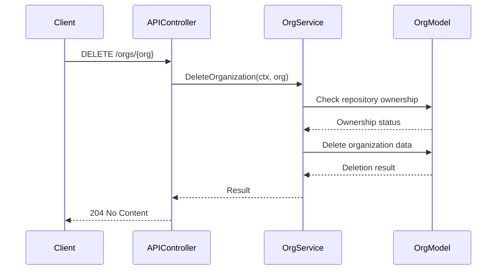
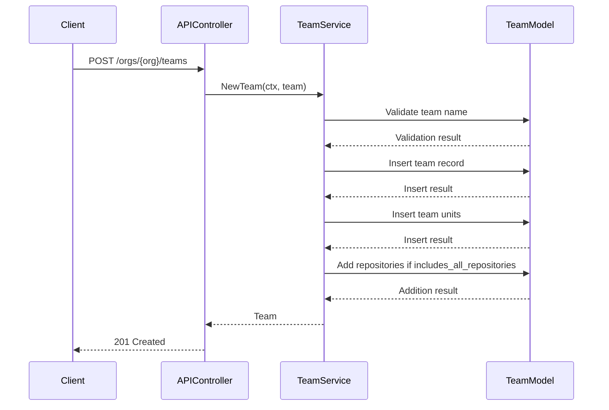
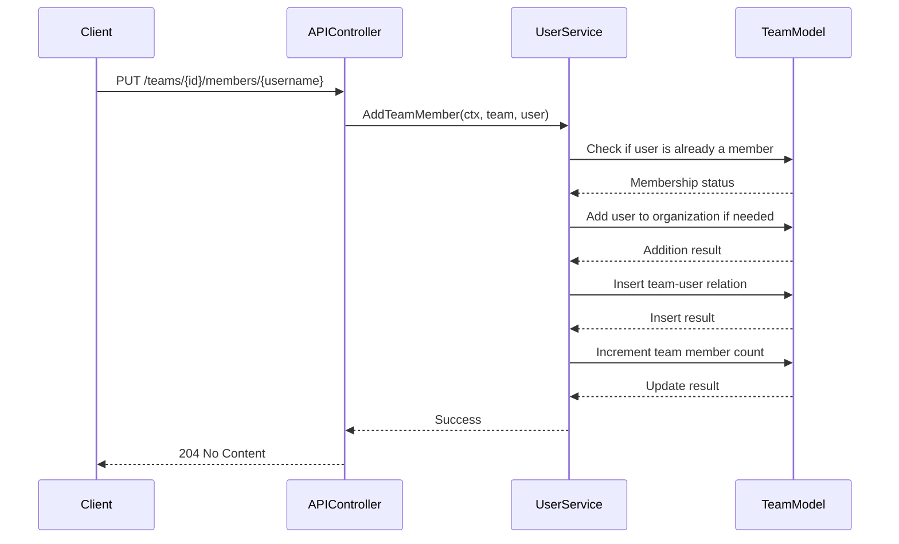

# Organizations

<cite>
**Referenced Files in This Document**   
- [org.go](file://routers/api/v1/org/org.go)
- [team.go](file://routers/api/v1/org/team.go)
- [member.go](file://routers/api/v1/org/member.go)
- [hook.go](file://routers/api/v1/org/hook.go)
- [label.go](file://routers/api/v1/org/label.go)
- [org.go](file://services/org/org.go)
- [team.go](file://services/org/team.go)
- [user.go](file://services/org/user.go)
- [org.go](file://models/organization/org.go)
- [team.go](file://models/organization/team.go)
- [team_user.go](file://models/organization/team_user.go)
- [org.go](file://modules/structs/org.go)
- [org_team.go](file://modules/structs/org_team.go)
- [org_member.go](file://modules/structs/org_member.go)
</cite>

## Table of Contents
1. [Introduction](#introduction)
2. [Organization Management Endpoints](#organization-management-endpoints)
3. [Team Management Endpoints](#team-management-endpoints)
4. [Organization Member Management](#organization-member-management)
5. [Organization Webhooks](#organization-webhooks)
6. [Organization Labels](#organization-labels)
7. [Service Layer Implementation](#service-layer-implementation)
8. [Common Issues and Troubleshooting](#common-issues-and-troubleshooting)
9. [Performance Considerations](#performance-considerations)
10. [Best Practices for Role-Based Access Control](#best-practices-for-role-based-access-control)

## Introduction

This document provides comprehensive API documentation for Gitea's organization-related endpoints in REST API v1. It covers all HTTP methods, URL patterns, request/response schemas, and authentication requirements for managing organizations, teams, members, organization webhooks, and organization labels. The documentation includes detailed examples for creating organizations, managing team memberships, configuring team permissions, and organizing repositories within teams. It also explains the relationship between these API endpoints and their corresponding service layer implementations in services/org, addresses common issues such as permission inheritance conflicts, team membership limits, and webhook configuration errors, and provides performance considerations for organizations with large numbers of teams and repositories.

**Section sources**
- [org.go](file://routers/api/v1/org/org.go#L1-L50)

## Organization Management Endpoints

### Create Organization
Creates a new organization with the specified parameters.

**HTTP Method**: `POST`  
**URL Pattern**: `/orgs`  
**Authentication**: Required

**Request Body Schema**: `CreateOrgOption`

| Parameter | Type | Required | Description |
|---------|------|----------|-------------|
| username | string | true | Username of the organization |
| full_name | string | false | Full display name of the organization |
| email | string | false | Email address of the organization |
| description | string | false | Description of the organization |
| website | string | false | Website URL of the organization |
| location | string | false | Location of the organization |
| visibility | string | false | Visibility level: public, limited, private (default: public) |
| repo_admin_change_team_access | boolean | false | Whether repository administrators can change team access |

**Response Status Codes**:
- `201 Created`: Organization created successfully
- `403 Forbidden`: User not allowed to create organizations
- `422 Unprocessable Entity`: Validation error (e.g., username already exists)

**Example Request**:
```json
{
  "username": "example-org",
  "full_name": "Example Organization",
  "email": "contact@example.com",
  "description": "An example organization",
  "website": "https://example.com",
  "location": "San Francisco",
  "visibility": "public",
  "repo_admin_change_team_access": true
}
```

### Get Organization
Retrieves information about a specific organization.

**HTTP Method**: `GET`  
**URL Pattern**: `/orgs/{org}`  
**Authentication**: Optional

**Path Parameters**:
- `org`: Name of the organization to retrieve

**Response Schema**: `Organization`

**Response Status Codes**:
- `200 OK`: Organization retrieved successfully
- `404 Not Found`: Organization does not exist

### Edit Organization
Updates an organization's information.

**HTTP Method**: `PATCH`  
**URL Pattern**: `/orgs/{org}`  
**Authentication**: Required

**Path Parameters**:
- `org`: Name of the organization to edit

**Request Body Schema**: `EditOrgOption`

**Response Status Codes**:
- `200 OK`: Organization updated successfully
- `404 Not Found`: Organization does not exist

### Delete Organization
Deletes an organization.

**HTTP Method**: `DELETE`  
**URL Pattern**: `/orgs/{org}`  
**Authentication**: Required

**Path Parameters**:
- `org`: Name of the organization to delete

**Response Status Codes**:
- `204 No Content`: Organization deleted successfully
- `404 Not Found`: Organization does not exist

### List Organizations
Retrieves a list of organizations.

**HTTP Method**: `GET`  
**URL Pattern**: `/orgs`  
**Authentication**: Optional

**Query Parameters**:
- `page`: Page number of results to return (1-based)
- `limit`: Page size of results

**Response Schema**: Array of `Organization`

**Response Status Codes**:
- `200 OK`: Organizations retrieved successfully

**Section sources**
- [org.go](file://routers/api/v1/org/org.go#L150-L250)

## Team Management Endpoints

### Create Team
Creates a new team within an organization.

**HTTP Method**: `POST`  
**URL Pattern**: `/orgs/{org}/teams`  
**Authentication**: Required

**Path Parameters**:
- `org`: Name of the organization

**Request Body Schema**: `CreateTeamOption`

| Parameter | Type | Required | Description |
|---------|------|----------|-------------|
| name | string | true | Name of the team |
| description | string | false | Description of the team |
| includes_all_repositories | boolean | false | Whether the team has access to all repositories |
| permission | string | false | Permission level: read, write, admin |
| units | array | false | List of units (deprecated, use units_map) |
| units_map | object | false | Map of unit permissions |
| can_create_org_repo | boolean | false | Whether the team can create repositories |

**Response Status Codes**:
- `201 Created`: Team created successfully
- `404 Not Found`: Organization does not exist
- `422 Unprocessable Entity`: Validation error (e.g., team name already exists)

### List Teams
Retrieves all teams within an organization.

**HTTP Method**: `GET`  
**URL Pattern**: `/orgs/{org}/teams`  
**Authentication**: Required

**Path Parameters**:
- `org`: Name of the organization

**Query Parameters**:
- `page`: Page number of results to return (1-based)
- `limit`: Page size of results

**Response Schema**: Array of `Team`

**Response Status Codes**:
- `200 OK`: Teams retrieved successfully
- `404 Not Found`: Organization does not exist

### Edit Team
Updates a team's information and permissions.

**HTTP Method**: `PATCH`  
**URL Pattern**: `/teams/{id}`  
**Authentication**: Required

**Path Parameters**:
- `id`: ID of the team to edit

**Request Body Schema**: `EditTeamOption`

**Response Status Codes**:
- `200 OK`: Team updated successfully
- `404 Not Found`: Team does not exist

### Delete Team
Deletes a team from an organization.

**HTTP Method**: `DELETE`  
**URL Pattern**: `/teams/{id}`  
**Authentication**: Required

**Path Parameters**:
- `id`: ID of the team to delete

**Response Status Codes**:
- `204 No Content`: Team deleted successfully
- `404 Not Found`: Team does not exist

### Add Team Repository
Adds a repository to a team.

**HTTP Method**: `PUT`  
**URL Pattern**: `/teams/{id}/repos/{org}/{repo}`  
**Authentication**: Required

**Path Parameters**:
- `id`: ID of the team
- `org`: Organization that owns the repository
- `repo`: Name of the repository to add

**Response Status Codes**:
- `204 No Content`: Repository added successfully
- `403 Forbidden`: User does not have admin-level access to the repository
- `404 Not Found`: Team or repository does not exist

### Remove Team Repository
Removes a repository from a team.

**HTTP Method**: `DELETE`  
**URL Pattern**: `/teams/{id}/repos/{org}/{repo}`  
**Authentication**: Required

**Path Parameters**:
- `id`: ID of the team
- `org`: Organization that owns the repository
- `repo`: Name of the repository to remove

**Response Status Codes**:
- `204 No Content`: Repository removed successfully
- `403 Forbidden`: User does not have admin-level access to the repository
- `404 Not Found`: Team or repository does not exist

**Section sources**
- [team.go](file://routers/api/v1/org/team.go#L50-L200)

## Organization Member Management

### List Organization Members
Retrieves all members of an organization.

**HTTP Method**: `GET`  
**URL Pattern**: `/orgs/{org}/members`  
**Authentication**: Required

**Path Parameters**:
- `org`: Name of the organization

**Query Parameters**:
- `page`: Page number of results to return (1-based)
- `limit`: Page size of results

**Response Schema**: Array of `User`

**Response Status Codes**:
- `200 OK`: Members retrieved successfully
- `404 Not Found`: Organization does not exist

### Check Organization Membership
Checks if a user is a member of an organization.

**HTTP Method**: `GET`  
**URL Pattern**: `/orgs/{org}/members/{username}`  
**Authentication**: Required

**Path Parameters**:
- `org`: Name of the organization
- `username`: Username of the user to check

**Response Status Codes**:
- `204 No Content`: User is a member
- `303 See Other`: Redirect to public members endpoint
- `404 Not Found`: User is not a member

### Remove Member from Organization
Removes a member from an organization.

**HTTP Method**: `DELETE`  
**URL Pattern**: `/orgs/{org}/members/{username}`  
**Authentication**: Required

**Path Parameters**:
- `org`: Name of the organization
- `username`: Username of the user to remove

**Response Status Codes**:
- `204 No Content`: Member removed successfully
- `404 Not Found`: Member does not exist

### Add Team Member
Adds a member to a team.

**HTTP Method**: `PUT`  
**URL Pattern**: `/teams/{id}/members/{username}`  
**Authentication**: Required

**Path Parameters**:
- `id`: ID of the team
- `username`: Username of the user to add

**Response Status Codes**:
- `204 No Content`: Member added successfully
- `403 Forbidden`: User is blocked
- `404 Not Found`: Team or user does not exist

### Remove Team Member
Removes a member from a team.

**HTTP Method**: `DELETE`  
**URL Pattern**: `/teams/{id}/members/{username}`  
**Authentication**: Required

**Path Parameters**:
- `id`: ID of the team
- `username`: Username of the user to remove

**Response Status Codes**:
- `204 No Content`: Member removed successfully
- `404 Not Found`: Member does not exist

**Section sources**
- [member.go](file://routers/api/v1/org/member.go#L50-L150)
- [team.go](file://routers/api/v1/org/team.go#L400-L500)

## Organization Webhooks

### List Organization Webhooks
Retrieves all webhooks for an organization.

**HTTP Method**: `GET`  
**URL Pattern**: `/orgs/{org}/hooks`  
**Authentication**: Required

**Path Parameters**:
- `org`: Name of the organization

**Query Parameters**:
- `page`: Page number of results to return (1-based)
- `limit`: Page size of results

**Response Schema**: Array of `Hook`

**Response Status Codes**:
- `200 OK`: Webhooks retrieved successfully
- `404 Not Found`: Organization does not exist

### Create Organization Webhook
Creates a new webhook for an organization.

**HTTP Method**: `POST`  
**URL Pattern**: `/orgs/{org}/hooks`  
**Authentication**: Required

**Path Parameters**:
- `org`: Name of the organization

**Request Body Schema**: `CreateHookOption`

**Response Status Codes**:
- `201 Created`: Webhook created successfully
- `404 Not Found`: Organization does not exist

### Edit Organization Webhook
Updates an organization's webhook.

**HTTP Method**: `PATCH`  
**URL Pattern**: `/orgs/{org}/hooks/{id}`  
**Authentication**: Required

**Path Parameters**:
- `org`: Name of the organization
- `id`: ID of the webhook to update

**Request Body Schema**: `EditHookOption`

**Response Status Codes**:
- `200 OK`: Webhook updated successfully
- `404 Not Found`: Webhook does not exist

### Delete Organization Webhook
Deletes a webhook from an organization.

**HTTP Method**: `DELETE`  
**URL Pattern**: `/orgs/{org}/hooks/{id}`  
**Authentication**: Required

**Path Parameters**:
- `org`: Name of the organization
- `id`: ID of the webhook to delete

**Response Status Codes**:
- `204 No Content`: Webhook deleted successfully
- `404 Not Found`: Webhook does not exist

**Section sources**
- [hook.go](file://routers/api/v1/org/hook.go#L10-L100)

## Organization Labels

### List Organization Labels
Retrieves all labels for an organization.

**HTTP Method**: `GET`  
**URL Pattern**: `/orgs/{org}/labels`  
**Authentication**: Required

**Path Parameters**:
- `org`: Name of the organization

**Query Parameters**:
- `page`: Page number of results to return (1-based)
- `limit`: Page size of results
- `sort`: Sort order for labels

**Response Schema**: Array of `Label`

**Response Status Codes**:
- `200 OK`: Labels retrieved successfully
- `404 Not Found`: Organization does not exist

### Create Organization Label
Creates a new label for an organization.

**HTTP Method**: `POST`  
**URL Pattern**: `/orgs/{org}/labels`  
**Authentication**: Required

**Path Parameters**:
- `org`: Name of the organization

**Request Body Schema**: `CreateLabelOption`

| Parameter | Type | Required | Description |
|---------|------|----------|-------------|
| name | string | true | Name of the label |
| color | string | true | Color of the label (hex code) |
| description | string | false | Description of the label |
| exclusive | boolean | false | Whether the label is exclusive |

**Response Status Codes**:
- `201 Created`: Label created successfully
- `404 Not Found`: Organization does not exist
- `422 Unprocessable Entity`: Validation error (e.g., invalid color)

### Edit Organization Label
Updates an organization's label.

**HTTP Method**: `PATCH`  
**URL Pattern**: `/orgs/{org}/labels/{id}`  
**Authentication**: Required

**Path Parameters**:
- `org`: Name of the organization
- `id`: ID of the label to update

**Request Body Schema**: `EditLabelOption`

**Response Status Codes**:
- `200 OK`: Label updated successfully
- `404 Not Found`: Label does not exist
- `422 Unprocessable Entity`: Validation error

### Delete Organization Label
Deletes a label from an organization.

**HTTP Method**: `DELETE`  
**URL Pattern**: `/orgs/{org}/labels/{id}`  
**Authentication**: Required

**Path Parameters**:
- `org`: Name of the organization
- `id`: ID of the label to delete

**Response Status Codes**:
- `204 No Content`: Label deleted successfully
- `404 Not Found`: Label does not exist

**Section sources**
- [label.go](file://routers/api/v1/org/label.go#L10-L150)

## Service Layer Implementation

The organization-related API endpoints are implemented in the `services/org` package, which provides the business logic for managing organizations, teams, and members. The service layer acts as an intermediary between the API controllers and the data models, ensuring proper validation, authorization, and transaction management.

### Organization Service
The organization service handles operations related to organization creation, deletion, and modification. Key functions include:

- `DeleteOrganization`: Completely deletes an organization and all associated data
- `ChangeOrganizationVisibility`: Changes the visibility of an organization and updates all associated repositories



**Diagram sources**
- [org.go](file://services/org/org.go#L50-L100)
- [org.go](file://models/organization/org.go#L300-L400)

### Team Service
The team service manages team creation, modification, and deletion operations. Key functions include:

- `NewTeam`: Creates a new team with specified permissions and units
- `UpdateTeam`: Updates team information and permissions
- `DeleteTeam`: Deletes a team and cleans up associated data
- `AddTeamMember`: Adds a member to a team
- `RemoveTeamMember`: Removes a member from a team



**Diagram sources**
- [team.go](file://services/org/team.go#L10-L100)
- [team.go](file://models/organization/team.go#L100-L200)

### User Service
The user service handles operations related to organization membership and team membership. Key functions include:

- `RemoveOrgUser`: Removes a user from an organization and cleans up all associated permissions
- `AddTeamMember`: Adds a user to a team and updates repository access permissions
- `RemoveTeamMember`: Removes a user from a team and updates repository access permissions



**Diagram sources**
- [user.go](file://services/org/user.go#L10-L50)
- [team_user.go](file://models/organization/team_user.go#L10-L50)

**Section sources**
- [org.go](file://services/org/org.go#L10-L170)
- [team.go](file://services/org/team.go#L10-L350)
- [user.go](file://services/org/user.go#L10-L98)

## Common Issues and Troubleshooting

### Permission Inheritance Conflicts
When a user belongs to multiple teams with different permission levels for the same repository, Gitea follows a hierarchical permission model where the highest permission level takes precedence. This can lead to unexpected access levels if not properly managed.

**Solution**: Regularly audit team memberships and permissions to ensure they align with organizational policies. Use the API to retrieve a user's effective permissions across all teams.

### Team Membership Limits
There is no explicit limit on the number of members in a team, but performance may degrade with very large teams, especially when repositories are added or removed.

**Solution**: For large organizations, consider creating multiple smaller teams with specific purposes rather than a few large teams. This improves performance and makes permission management more granular.

### Webhook Configuration Errors
Common webhook configuration issues include invalid URLs, authentication failures, and payload size limits.

**Solution**: Validate webhook URLs before creation, ensure proper authentication credentials are provided, and monitor webhook delivery logs for errors. Use the API to test webhook delivery.

### Last Owner Team Member Deletion
Attempting to delete the last member of the owner team will result in an error to prevent orphaning the organization.

**Solution**: Before removing the last owner, first add another user to the owner team or transfer ownership to another user.

**Section sources**
- [team.go](file://services/org/team.go#L250-L300)
- [user.go](file://services/org/user.go#L50-L90)

## Performance Considerations

### Large Organizations with Many Teams
Organizations with a large number of teams can experience performance degradation during operations that require checking team memberships or permissions across multiple teams.

**Optimization Strategies**:
- Implement caching for frequently accessed team membership data
- Use batch operations when adding or removing multiple members
- Limit the number of teams a user belongs to for better performance
- Regularly clean up unused teams to reduce the overall team count

### Repository Access Recalculation
When team permissions are changed or repositories are added/removed from teams, Gitea must recalculate repository access for all team members. This operation can be expensive for large teams or organizations with many repositories.

**Optimization Strategies**:
- Schedule permission changes during low-traffic periods
- Use asynchronous processing for access recalculation when possible
- Implement incremental updates rather than full recalculation when only a subset of permissions has changed

### Database Indexing
Proper database indexing is crucial for maintaining performance with large organizations. Key indexes should be maintained on:
- Team-user relationships (org_id, team_id, uid)
- Team-repository relationships (org_id, team_id, repo_id)
- Organization-user relationships (org_id, uid)

**Section sources**
- [team.go](file://services/org/team.go#L150-L200)
- [org.go](file://services/org/org.go#L100-L150)

## Best Practices for Role-Based Access Control

### Principle of Least Privilege
Assign users the minimum permissions necessary to perform their duties. Avoid granting admin or owner permissions unless absolutely required.

### Team-Based Permissions
Use teams to manage permissions rather than individual user assignments. This simplifies permission management and ensures consistency across similar roles.

### Clear Team Purpose
Create teams with clear, specific purposes (e.g., "frontend-developers", "qa-engineers") rather than generic teams. This makes permission management more intuitive and auditable.

### Regular Permission Audits
Conduct regular audits of team memberships and permissions to ensure they align with current organizational needs and security policies.

### Owner Team Management
Limit membership in the owner team to only those users who require full administrative control over the organization. Consider creating admin teams with specific administrative capabilities instead of adding users to the owner team.

### Repository-Specific Teams
For repositories requiring specialized access controls, create dedicated teams rather than modifying broad organizational teams. This prevents over-privileging users who only need access to specific repositories.

**Section sources**
- [team.go](file://services/org/team.go#L10-L350)
- [org.go](file://models/organization/org.go#L10-L598)
- [team.go](file://models/organization/team.go#L10-L249)