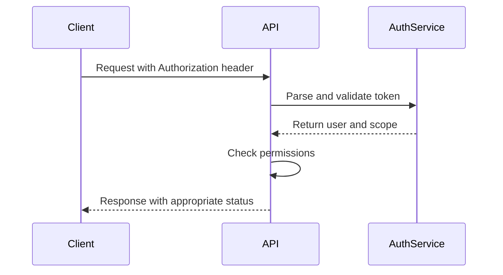
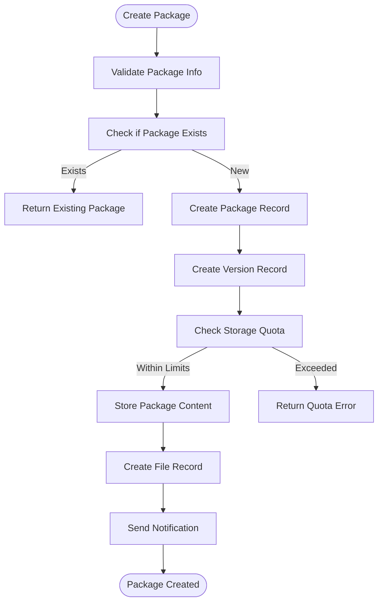
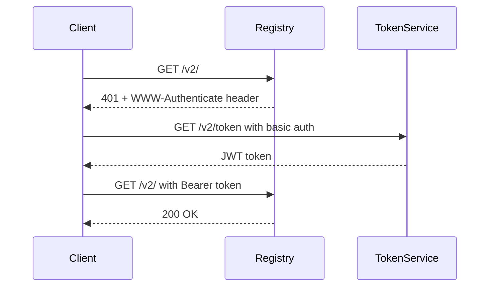

# Packages

<cite>
**Referenced Files in This Document**   
- [package.go](file://models/packages/package.go)
- [packages.go](file://services/packages/packages.go)
- [auth.go](file://services/packages/auth.go)
- [package.go](file://routers/api/v1/packages/package.go)
- [container.go](file://routers/api/packages/container/container.go)
</cite>

## Table of Contents
1. [Introduction](#introduction)
2. [API Endpoints](#api-endpoints)
3. [Authentication](#authentication)
4. [Package Management](#package-management)
5. [Container Registry](#container-registry)
6. [Error Handling](#error-handling)
7. [Performance Considerations](#performance-considerations)
8. [Best Practices](#best-practices)

## Introduction
Gitea provides a comprehensive package registry system that supports multiple package managers through its REST API v1. The package registry allows users to publish, retrieve, and manage packages across various supported package types including container, npm, maven, nuget, and others. This documentation details the API endpoints, authentication mechanisms, and service layer implementations for interacting with Gitea's package registry.

The package registry functionality is implemented across multiple layers of the Gitea architecture, with API endpoints in the routers layer, business logic in the services layer, and data models in the models layer. The system supports both user-scoped and organization-scoped packages, with appropriate access control and permission checks.

**Section sources**
- [package.go](file://models/packages/package.go)
- [packages.go](file://services/packages/packages.go)

## API Endpoints

### Package Operations
Gitea's package registry provides a comprehensive set of REST API endpoints for managing packages. These endpoints follow standard REST conventions and are accessible under the `/api/v1/packages` path.

#### List Packages
Retrieves a list of all packages for a specific owner (user or organization).

- **HTTP Method**: GET
- **URL Pattern**: `/api/v1/packages/{owner}`
- **Authentication**: Required
- **Parameters**:
  - `owner` (path): Owner of the packages
  - `page` (query): Page number for pagination (1-based)
  - `limit` (query): Number of results per page
  - `type` (query): Filter by package type
  - `q` (query): Name filter

#### Get Package
Retrieves information about a specific package version.

- **HTTP Method**: GET
- **URL Pattern**: `/api/v1/packages/{owner}/{type}/{name}/{version}`
- **Authentication**: Required

#### Delete Package
Removes a specific package version.

- **HTTP Method**: DELETE
- **URL Pattern**: `/api/v1/packages/{owner}/{type}/{name}/{version}`
- **Authentication**: Required

#### List Package Files
Retrieves all files associated with a specific package version.

- **HTTP Method**: GET
- **URL Pattern**: `/api/v1/packages/{owner}/{type}/{name}/{version}/files`
- **Authentication**: Required

#### List Package Versions
Retrieves all versions of a specific package.

- **HTTP Method**: GET
- **URL Pattern**: `/api/v1/packages/{owner}/{type}/{name}`
- **Authentication**: Required

#### Get Latest Package Version
Retrieves the latest version of a specific package.

- **HTTP Method**: GET
- **URL Pattern**: `/api/v1/packages/{owner}/{type}/{name}/-/latest`
- **Authentication**: Required

#### Link Package to Repository
Associates a package with a repository.

- **HTTP Method**: POST
- **URL Pattern**: `/api/v1/packages/{owner}/{type}/{name}/-/link/{repo_name}`
- **Authentication**: Required

#### Unlink Package from Repository
Removes the association between a package and a repository.

- **HTTP Method**: POST
- **URL Pattern**: `/api/v1/packages/{owner}/{type}/{name}/-/unlink`
- **Authentication**: Required

**Section sources**
- [package.go](file://routers/api/v1/packages/package.go)

## Authentication

### Token-Based Authentication
Gitea's package registry uses token-based authentication for securing access to package endpoints. The authentication system is implemented in the `services/packages/auth.go` file and follows the JWT (JSON Web Token) standard.

The authentication process involves:
1. Clients sending authentication credentials (API token) in the Authorization header
2. Server validating the token and extracting user information
3. Checking the user's access scope for package operations



**Diagram sources**
- [auth.go](file://services/packages/auth.go#L0-L85)

### Access Scopes
The package registry supports different access scopes that control what operations a token can perform:

- `read:package`: Read-only access to packages
- `write:package`: Full access to publish and manage packages
- `*`: All permissions

Tokens without the appropriate scope will be denied access to package endpoints. The system checks for the presence of `read:package`, `write:package`, or `all` scopes when processing package requests.

**Section sources**
- [auth.go](file://services/packages/auth.go)

## Package Management

### Package Creation and Storage
The package management system in Gitea is implemented in the `services/packages/packages.go` file. The core functionality revolves around creating packages, adding files to packages, and managing package versions.

When a package is created, the system performs the following steps:
1. Validates the package information (owner, type, name, version)
2. Checks for existing packages with the same name and version
3. Creates or retrieves the package record
4. Creates or retrieves the package version record
5. Adds the package file with content storage



**Diagram sources**
- [packages.go](file://services/packages/packages.go#L0-L658)

### Quota Management
Gitea implements several quota limits to prevent abuse of the package registry:

- **Total Count Quota**: Limits the total number of packages an owner can have
- **Type-Specific Size Quota**: Limits the size of individual packages by type
- **Total Size Quota**: Limits the total storage used by all packages for an owner

These quotas are checked before uploading package content. Administrators can configure these limits in the Gitea settings.

```go
// Quota error types
var (
    ErrQuotaTypeSize   = errors.New("maximum allowed package type size exceeded")
    ErrQuotaTotalSize  = errors.New("maximum allowed package storage quota exceeded")
    ErrQuotaTotalCount = errors.New("maximum allowed package count exceeded")
)
```

**Section sources**
- [packages.go](file://services/packages/packages.go)

## Container Registry

### Docker Registry API
Gitea provides a Docker-compatible container registry API that implements the OCI Distribution Specification. The container registry endpoints are available at the `/v2/` path and support standard Docker registry operations.

The container registry implementation is located in `routers/api/packages/container/container.go` and provides the following endpoints:

- `/v2/`: Determine support and get registry capabilities
- `/v2/token`: Authenticate and obtain a bearer token
- `/v2/<name>/manifests/<reference>`: Manage image manifests
- `/v2/<name>/blobs/<digest>`: Manage image layers

### Authentication Flow
The container registry uses a bearer token authentication mechanism:

1. Client makes an unauthenticated request to a registry endpoint
2. Registry responds with a 401 status and WWW-Authenticate header
3. Client requests a token from the token endpoint with basic authentication
4. Registry validates credentials and returns a JWT token
5. Client uses the token in subsequent requests



**Diagram sources**
- [container.go](file://routers/api/packages/container/container.go#L86-L211)

**Section sources**
- [container.go](file://routers/api/packages/container/container.go)

## Error Handling

### Common Issues
The package registry may encounter several common issues that should be handled appropriately:

#### Package Naming Conflicts
When attempting to publish a package with a name that already exists, the system returns a `409 Conflict` status. Clients should handle this by either choosing a different name or updating the existing package.

#### Versioning Errors
Publishing a package with a version that already exists results in a `409 Conflict` status. The system prevents overwriting existing versions by default, requiring clients to use a new version number.

#### Storage Quota Limitations
When a user exceeds their storage quota, the system returns specific error messages:
- `ErrQuotaTypeSize`: Individual package too large
- `ErrQuotaTotalSize`: Total storage quota exceeded
- `ErrQuotaTotalCount`: Too many packages

Clients should monitor their usage and request quota increases if needed.

**Section sources**
- [packages.go](file://services/packages/packages.go)

## Performance Considerations

### Large Package Uploads
For handling large package uploads, consider the following:

- **Chunked Uploads**: Implement resumable uploads for large files
- **Timeout Configuration**: Adjust server timeout settings for large uploads
- **Network Optimization**: Use compression and efficient transfer protocols
- **Storage Backend**: Configure appropriate storage backends (local, S3, etc.)

### Large Package Downloads
For handling large package downloads:

- **Direct Serving**: Enable direct serving from storage when possible
- **CDN Integration**: Use CDN for frequently accessed packages
- **Bandwidth Management**: Implement rate limiting to prevent abuse
- **Caching**: Utilize HTTP caching headers for immutable packages

The system supports direct serving of package blobs when the storage backend supports it, reducing server load during downloads.

**Section sources**
- [packages.go](file://services/packages/packages.go)

## Best Practices

### Securing Package Registries
To secure package registries against unauthorized access:

1. **Use Strong Authentication**: Require API tokens with appropriate scopes
2. **Implement Access Controls**: Use organization and repository permissions
3. **Enable Two-Factor Authentication**: For user accounts with publish rights
4. **Monitor Access Logs**: Track package access and modification
5. **Regular Audits**: Review package contents and access patterns

### Package Management
Recommended practices for package management:

- **Semantic Versioning**: Use semantic versioning for package versions
- **Immutable Versions**: Never overwrite published versions
- **Clear Naming**: Use descriptive and consistent package names
- **Documentation**: Include comprehensive package documentation
- **Deprecation Policy**: Clearly mark deprecated packages

### API Usage
Best practices for using the package registry API:

- **Error Handling**: Implement robust error handling for all API calls
- **Rate Limiting**: Respect rate limits and implement retry logic
- **Caching**: Cache responses when appropriate to reduce server load
- **Pagination**: Use pagination for listing operations
- **Validation**: Validate inputs before making API calls

**Section sources**
- [auth.go](file://services/packages/auth.go)
- [packages.go](file://services/packages/packages.go)