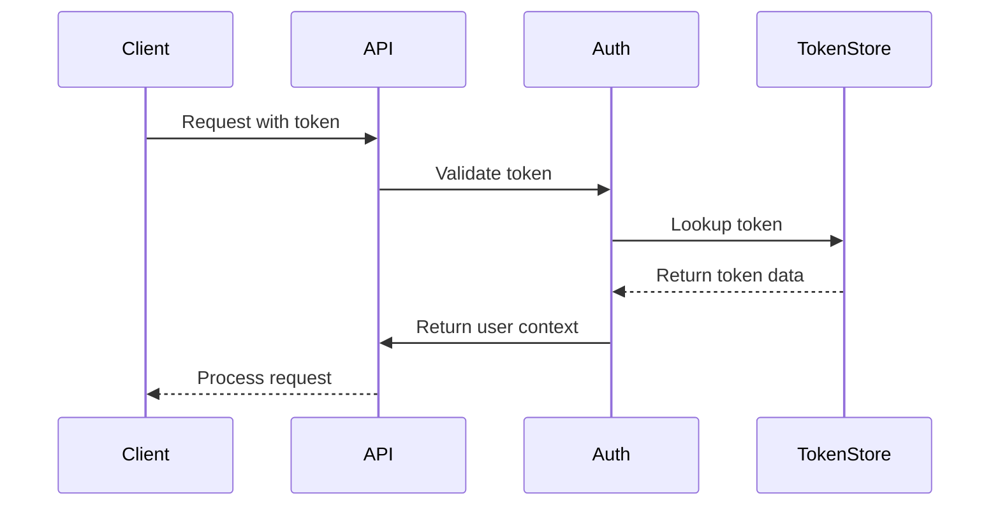
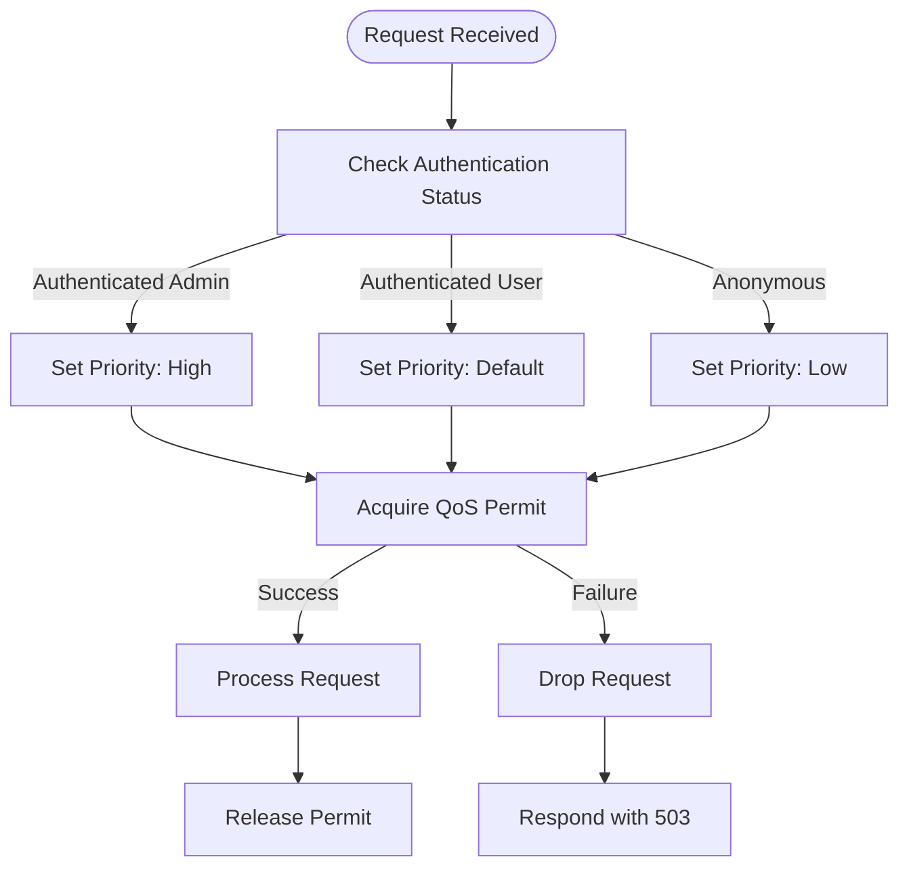
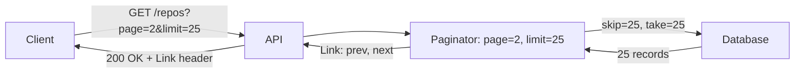
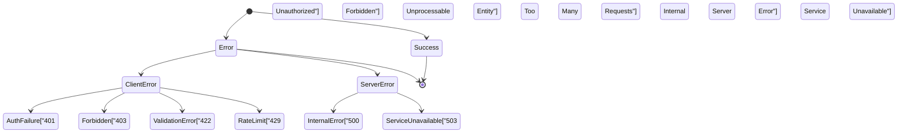
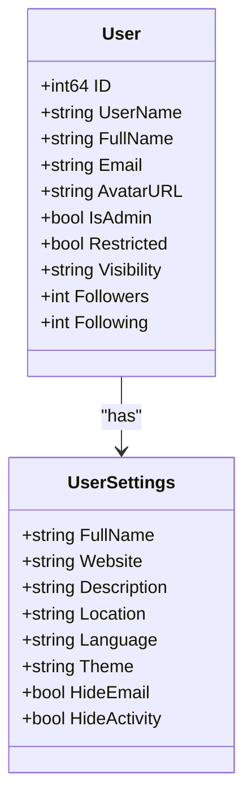
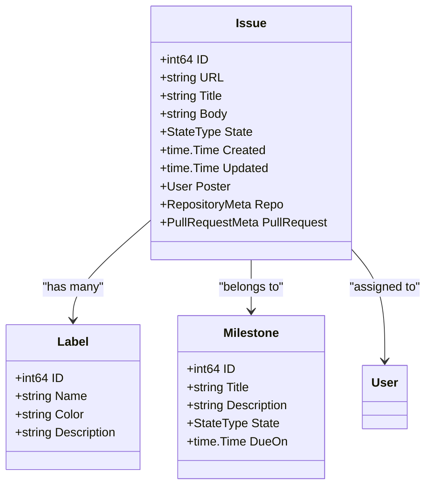

# REST API v1

<cite>
**Referenced Files in This Document**   
- [api.go](file://routers/api/v1/api.go)
- [issue.go](file://modules/structs/issue.go)
- [repo.go](file://modules/structs/repo.go)
- [user.go](file://modules/structs/user.go)
- [org.go](file://modules/structs/org.go)
- [access_token.go](file://models/auth/access_token.go)
- [auth.go](file://services/auth/auth.go)
- [qos.go](file://routers/common/qos.go)
- [paginator.go](file://modules/paginator/paginator.go)
</cite>

## Table of Contents
1. [Introduction](#introduction)
2. [Authentication Methods](#authentication-methods)
3. [Rate Limiting and Quality of Service](#rate-limiting-and-quality-of-service)
4. [Pagination](#pagination)
5. [Error Handling](#error-handling)
6. [Core Endpoints](#core-endpoints)
7. [Repository Management](#repository-management)
8. [User Administration](#user-administration)
9. [Organization Management](#organization-management)
10. [Issue and Pull Request Management](#issue-and-pull-request-management)
11. [API Versioning](#api-versioning)
12. [Performance Considerations](#performance-considerations)
13. [Troubleshooting Guide](#troubleshooting-guide)

## Introduction

The Gitea REST API v1 provides comprehensive programmatic access to Gitea's core functionality, enabling automation of repository management, user administration, issue tracking, and organizational operations. The API follows RESTful principles with predictable URL patterns, standard HTTP methods, and JSON request/response payloads. This documentation covers the complete API surface including authentication mechanisms, error handling patterns, and performance optimization strategies.

The API is organized around key resources including users, repositories, organizations, issues, and pull requests. Each resource supports standard CRUD operations through HTTP methods (GET, POST, PUT, PATCH, DELETE) with consistent request/response schemas. The API endpoints are located under the `/api/v1` path and support both JSON and plain text content types.

**Section sources**
- [api.go](file://routers/api/v1/api.go#L1-L50)

## Authentication Methods

Gitea's API supports multiple authentication methods to accommodate different use cases and security requirements. The primary authentication mechanisms include API tokens, OAuth2, and basic authentication with additional security headers for two-factor authentication.

### API Tokens

API tokens can be used for authentication by including them in requests through several methods:
- Query parameter: `?token=your_api_token`
- Query parameter: `?access_token=your_api_token` 
- Authorization header: `Authorization: token your_api_token`

API tokens are created and managed through the user interface or API endpoints in the `/users/{username}/tokens` path. The token authentication system is implemented in the `auth` package, with token validation handled by the `GetUserByKey` function in the models layer.



**Diagram sources**
- [api.go](file://routers/api/v1/api.go#L299-L333)
- [access_token.go](file://models/auth/access_token.go#L15-L45)

### OAuth2 Authentication

OAuth2 is supported as a standard authentication method, allowing third-party applications to access Gitea resources on behalf of users. The OAuth2 implementation follows the standard authorization code flow and resource owner password credentials flow. OAuth2 tokens are validated through the `oauth2.go` service, which verifies token validity and scope permissions.

### Basic Authentication

Basic authentication is supported with username and password credentials. When two-factor authentication (2FA) is enabled, a TOTP code must be provided in the `X-GITEA-OTP` header. The basic authentication flow is implemented in the `basic.go` file within the auth service, which handles credential validation and 2FA verification.

### Sudo Mode

Administrators can perform API requests on behalf of other users using sudo mode. This can be achieved by including the target username in the `sudo` query parameter or `Sudo` header. Sudo mode requires administrative privileges and is validated through the `sudo()` middleware function.

**Section sources**
- [api.go](file://routers/api/v1/api.go#L150-L250)
- [auth.go](file://services/auth/auth.go#L151-L193)

## Rate Limiting and Quality of Service

Gitea implements a comprehensive quality of service (QoS) system to protect the server from excessive load and ensure fair resource allocation among users. The QoS system prioritizes requests based on user authentication status and request type.

### Request Prioritization

Requests are assigned priorities based on the user's authentication status:
- **High priority**: Authenticated users with administrative privileges
- **Default priority**: Authenticated regular users
- **Low priority**: Anonymous users

The QoS middleware uses a Codel (Controlled Delay) algorithm to manage request queuing and prevent server overload. The system limits both in-flight requests and waiting requests, with configurable thresholds for maximum in-flight requests and target wait time.



**Diagram sources**
- [qos.go](file://routers/common/qos.go#L53-L93)

### Configuration

QoS parameters are configurable through the `app.ini` configuration file:
- `QoS.Enabled`: Enables or disables the QoS system
- `QoS.MaxInFlightRequests`: Maximum number of concurrent requests
- `QoS.MaxWaitingRequests`: Maximum number of queued requests
- `QoS.TargetWaitTime`: Target latency for queued requests

When the QoS system is overwhelmed, requests are dropped with a 503 Service Unavailable response, indicating that the client should retry after a delay.

**Section sources**
- [qos.go](file://routers/common/qos.go#L0-L93)

## Pagination

The Gitea API implements pagination for endpoints that return lists of resources to improve performance and prevent excessive data transfer. Pagination is achieved through limit/offset parameters with configurable defaults.

### Pagination Parameters

Most list endpoints support the following query parameters:
- `page`: Page number to retrieve (default: 1)
- `limit`: Number of items per page (default: 30, maximum: 50)

The pagination system is implemented in the `paginator.go` module, which calculates skip and take values based on the requested page and limit. The paginator also generates Link headers in responses to indicate the availability of previous and next pages.



**Diagram sources**
- [paginator.go](file://modules/paginator/paginator.go#L41-L78)

### Link Header

The API includes a Link header in responses when multiple pages are available, following the RFC 5988 standard. The Link header contains URLs for the first, previous, next, and last pages when applicable:

```
Link: <https://gitea.example.com/api/v1/repos?page=1&limit=25>; rel="first",
      <https://gitea.example.com/api/v1/repos?page=1&limit=25>; rel="prev",
      <https://gitea.example.com/api/v1/repos?page=3&limit=25>; rel="next",
      <https://gitea.example.com/api/v1/repos?page=10&limit=25>; rel="last"
```

### Best Practices

For optimal performance when retrieving large datasets:
1. Use appropriate limit values to balance response size and request frequency
2. Implement exponential backoff when encountering rate limits
3. Cache responses when possible to reduce API calls
4. Use the `since` parameter when available to retrieve only updated resources

**Section sources**
- [paginator.go](file://modules/paginator/paginator.go#L75-L148)

## Error Handling

The Gitea API follows standard HTTP status code conventions for error reporting, with detailed error responses to aid in troubleshooting.

### Error Response Format

Error responses follow a consistent format with two key fields:
- `message`: Human-readable error description
- `url`: Link to relevant documentation (typically the Swagger documentation)

```json
{
  "message": "Repository already exists",
  "url": "https://gitea.example.com/api/swagger"
}
```

The API uses the following HTTP status code ranges:
- **4xx**: Client errors (invalid requests, authentication failures, permission denied)
- **5xx**: Server errors (internal server errors, database failures)

### Common Error Types

#### Authentication Failures (401)
Returned when authentication credentials are missing or invalid:
- Ensure proper authentication method is used
- Verify token validity and permissions
- Check for expired sessions

#### Permission Denied (403)
Returned when the authenticated user lacks required permissions:
- Verify the user has appropriate role/permissions
- Check organization membership and team assignments
- Ensure repository access rights

#### Payload Validation Errors (422)
Returned when request data fails validation:
- Check required fields are present
- Verify data types and formats
- Ensure field length constraints are met

#### Rate Limit Exceeded (429)
Returned when rate limits are exceeded:
- Implement retry logic with exponential backoff
- Cache responses to reduce API calls
- Batch operations when possible

### Error Response Types

The API defines several specific error response types:
- `APIError`: Generic error response
- `APIValidationError`: Validation-related errors
- `APIInvalidTopicsError`: Invalid repository topics
- `APIForbiddenError`: Permission denied errors



**Diagram sources**
- [api.go](file://services/context/api.go#L43-L89)

**Section sources**
- [api.go](file://services/context/api.go#L126-L174)

## Core Endpoints

The Gitea API v1 provides comprehensive endpoints for managing core resources. The API follows a consistent URL pattern: `/api/v1/{resource}/{identifier}`.

### API Structure

The API is organized into the following main categories:
- `/users`: User management and profile operations
- `/repos`: Repository creation and management
- `/orgs`: Organization and team management
- `/issues`: Issue tracking and management
- `/pulls`: Pull request operations
- `/admin`: Administrative operations

Each resource supports standard HTTP methods:
- `GET`: Retrieve resource(s)
- `POST`: Create resource
- `PUT/PATCH`: Update resource
- `DELETE`: Remove resource

### Versioning

The API uses URL-based versioning with the version number included in the path (`/api/v1`). This approach provides clear version identification and allows for parallel operation of multiple API versions. The versioning strategy enables backward compatibility while allowing for the introduction of new features and improvements.

**Section sources**
- [api.go](file://routers/api/v1/api.go#L1-L50)

## Repository Management

Repository management endpoints provide full CRUD operations for repositories, including creation, configuration, and deletion.

### Creating Repositories

Repositories can be created using the `POST /user/repos` endpoint with a request body containing repository options:

```json
{
  "name": "new-repository",
  "description": "A new repository",
  "private": false,
  "auto_init": true,
  "gitignores": "Go",
  "license": "MIT",
  "readme": "Default"
}
```

The `CreateRepoOption` struct defines all available parameters for repository creation, including template usage, default branch configuration, and repository initialization options.

### Repository Configuration

Repository settings can be modified using the `PATCH /repos/{owner}/{repo}` endpoint. The `EditRepoOption` struct supports updating various repository properties:
- Visibility (public/private)
- Feature toggles (issues, wiki, pull requests)
- Merge strategy preferences
- Branch protection settings
- Webhook configurations

### Repository Transfer

Repositories can be transferred between users or organizations using the `POST /repos/{owner}/{repo}/transfer` endpoint. The transfer process requires appropriate permissions and can include team assignments when transferring to an organization.

**Section sources**
- [repo.go](file://modules/structs/repo.go#L0-L426)

## User Administration

The user administration API provides endpoints for managing user accounts, including creation, modification, and deletion.

### User Endpoints

Key user management endpoints include:
- `GET /users/{username}`: Retrieve user information
- `POST /admin/users`: Create new user
- `PATCH /user`: Update current user
- `DELETE /admin/users/{username}`: Delete user
- `POST /admin/users/{username}/tokens`: Create API token

### User Data Model

The `User` struct defines the user data model with properties including:
- Basic profile information (username, full name, email)
- Account status (active, restricted, admin)
- Contact information (website, location)
- Privacy settings (visibility, email hiding)



**Diagram sources**
- [user.go](file://modules/structs/user.go#L0-L138)

### Administrative Operations

Administrative users have access to additional endpoints for user management:
- Creating and deleting users
- Resetting user passwords
- Managing user permissions
- Generating access tokens for users
- Listing all users with filtering options

**Section sources**
- [user.go](file://modules/structs/user.go#L0-L138)

## Organization Management

Organization management endpoints provide comprehensive tools for creating and managing organizations, teams, and memberships.

### Organization Endpoints

Key organization operations include:
- `POST /admin/orgs`: Create organization
- `GET /orgs/{org}`: Retrieve organization information
- `PATCH /orgs/{org}`: Update organization settings
- `DELETE /orgs/{org}`: Delete organization

### Team Management

Teams within organizations can be managed through:
- `GET /orgs/{org}/teams`: List organization teams
- `POST /orgs/{org}/teams`: Create new team
- `PATCH /teams/{id}`: Update team properties
- `DELETE /teams/{id}`: Remove team

### Membership Operations

User membership in organizations and teams can be managed with:
- `PUT /orgs/{org}/members/{username}`: Add user to organization
- `DELETE /orgs/{org}/members/{username}`: Remove user from organization
- `PUT /teams/{id}/members/{username}`: Add user to team
- `DELETE /teams/{id}/members/{username}`: Remove user from team

The organization data model includes properties for visibility levels (public, limited, private) and team permission settings.

**Section sources**
- [org.go](file://modules/structs/org.go#L0-L97)

## Issue and Pull Request Management

The issue tracking system provides comprehensive API endpoints for managing issues, pull requests, comments, and related metadata.

### Issue Operations

Key issue management endpoints:
- `GET /repos/{owner}/{repo}/issues`: List issues
- `POST /repos/{owner}/{repo}/issues`: Create issue
- `GET /repos/{owner}/{repo}/issues/{index}`: Get specific issue
- `PATCH /repos/{owner}/{repo}/issues/{index}`: Update issue
- `DELETE /repos/{owner}/{repo}/issues/{index}`: Close issue

### Pull Request Operations

Pull request endpoints extend the issue functionality:
- `GET /repos/{owner}/{repo}/pulls`: List pull requests
- `POST /repos/{owner}/{repo}/pulls`: Create pull request
- `GET /repos/{owner}/{repo}/pulls/{index}`: Get pull request details
- `PATCH /repos/{owner}/{repo}/pulls/{index}`: Update pull request
- `POST /repos/{owner}/{repo}/pulls/{index}/merge`: Merge pull request

### Issue Data Model

The `Issue` struct defines the comprehensive issue data model:



**Diagram sources**
- [issue.go](file://modules/structs/issue.go#L0-L276)

The issue system supports rich features including labels, milestones, assignees, comments, reactions, and time tracking. Pull requests are implemented as a special type of issue with additional metadata for merge status, base and head branches, and review information.

**Section sources**
- [issue.go](file://modules/structs/issue.go#L0-L276)

## API Versioning

Gitea's API uses a clear versioning strategy to ensure backward compatibility and support for future enhancements.

### Versioning Approach

The API employs URL-based versioning with the version number included in the endpoint path (`/api/v1`). This approach provides several advantages:
- Clear version identification in requests
- Ability to run multiple API versions simultaneously
- Simplified client implementation and debugging
- Explicit version requirements

### Backward Compatibility

Gitea maintains backward compatibility within major API versions. Breaking changes are introduced only in new major versions, with deprecation warnings provided for endpoints that will be removed or modified. Deprecated endpoints are marked in the API documentation and may return warning headers in responses.

### Future Evolution

The versioning strategy allows for the introduction of new features and improvements without disrupting existing integrations. When significant changes are required, a new API version (e.g., v2) will be introduced, allowing clients time to migrate at their convenience.

**Section sources**
- [api.go](file://routers/api/v1/api.go#L1-L50)

## Performance Considerations

Effective API usage requires attention to performance optimization, particularly for operations involving large datasets or frequent requests.

### Bulk Operations

For operations involving multiple resources:
- Use pagination to process large datasets in chunks
- Implement batch processing where available
- Consider using webhooks for event-driven updates instead of polling
- Cache responses when appropriate to reduce API calls

### Rate Limit Awareness

Monitor rate limit headers in API responses:
- `X-RateLimit-Limit`: Total requests allowed in the period
- `X-RateLimit-Remaining`: Requests remaining in the period
- `X-RateLimit-Reset`: Time when the rate limit resets

Implement retry logic with exponential backoff when encountering rate limits:
```python
retry_delay = 1
while True:
    response = api_call()
    if response.status_code == 429:
        time.sleep(retry_delay)
        retry_delay *= 2  # exponential backoff
        if retry_delay > 60:
            retry_delay = 60
    else:
        break
```

### Efficient Querying

Optimize API usage by:
- Using query parameters to filter results on the server side
- Requesting only necessary fields when possible
- Using conditional requests with ETag or Last-Modified headers
- Preferring specific endpoints over broad ones

**Section sources**
- [qos.go](file://routers/common/qos.go#L53-L93)
- [paginator.go](file://modules/paginator/paginator.go#L41-L78)

## Troubleshooting Guide

This section addresses common issues encountered when working with the Gitea API and provides solutions.

### Authentication Failures

**Symptoms**: 401 Unauthorized responses
**Causes and Solutions**:
- Missing or invalid token: Verify token format and validity
- Expired session: Re-authenticate and obtain a new token
- Incorrect authentication method: Use the appropriate method (header, query parameter)
- Two-factor authentication required: Include TOTP code in `X-GITEA-OTP` header

### Payload Validation Errors

**Symptoms**: 422 Unprocessable Entity responses
**Causes and Solutions**:
- Missing required fields: Check API documentation for required parameters
- Invalid data types: Ensure values match expected types (string, integer, boolean)
- Field length exceeded: Verify string length constraints
- Invalid enum values: Use values from specified enumeration

### Rate Limit Exceeded

**Symptoms**: 429 Too Many Requests responses
**Solutions**:
- Implement exponential backoff in retry logic
- Cache responses to reduce API calls
- Batch operations to minimize request frequency
- Monitor rate limit headers to anticipate limits

### Permission Denied

**Symptoms**: 403 Forbidden responses
**Causes and Solutions**:
- Insufficient user permissions: Verify user role and access rights
- Organization membership required: Ensure user is member of organization
- Repository access denied: Check repository visibility and collaboration settings
- Scope limitations: Verify API token has required scopes

### Server Errors

**Symptoms**: 5xx responses
**Actions**:
- Check server logs for detailed error information
- Verify database connectivity and health
- Monitor system resources (memory, disk space)
- Contact administrator for infrastructure issues

**Section sources**
- [api.go](file://services/context/api.go#L126-L174)
- [qos.go](file://routers/common/qos.go#L53-L93)