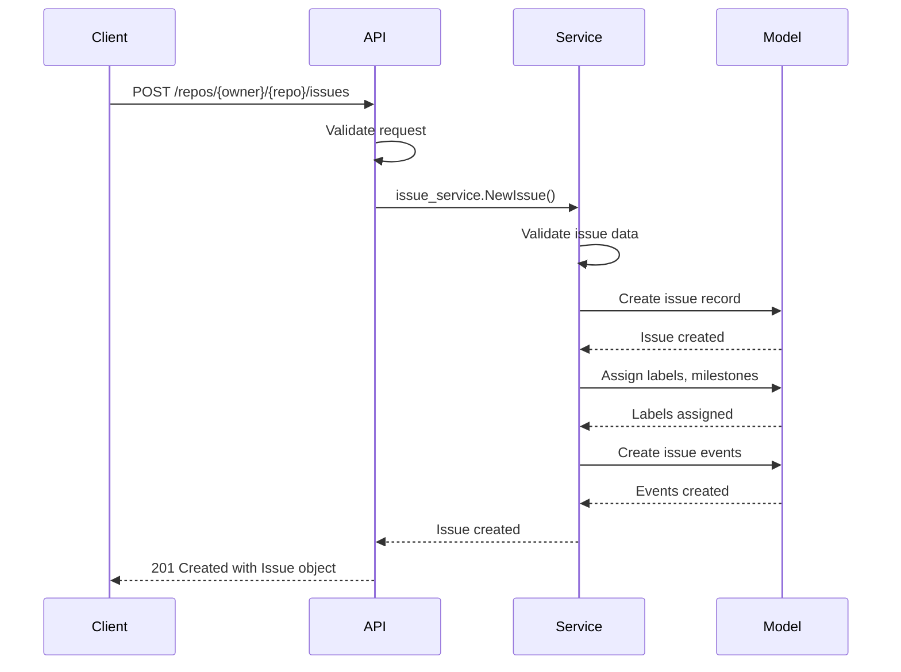

# Repositories

<cite>
**Referenced Files in This Document**   
- [repo.go](file://routers/api/v1/repo/repo.go)
- [branch.go](file://routers/api/v1/repo/branch.go)
- [issue.go](file://routers/api/v1/repo/issue.go)
- [pull.go](file://routers/api/v1/repo/pull.go)
- [release.go](file://routers/api/v1/repo/release.go)
- [hook.go](file://routers/api/v1/repo/hook.go)
- [compare.go](file://routers/api/v1/repo/compare.go)
- [create.go](file://services/repository/create.go)
- [issue.go](file://services/issue/issue.go)
- [issue_test.go](file://services/issue/issue_test.go)
- [issue.go](file://models/issues/issue.go)
- [pull.go](file://models/pull/pull.go)
- [release.go](file://models/repo/release.go)
- [webhook.go](file://models/webhook/webhook.go)
- [issue.go](file://modules/structs/issue.go)
- [pull_request.go](file://modules/structs/pull_request.go)
- [release.go](file://modules/structs/release.go)
- [hook.go](file://modules/structs/hook.go)
</cite>

## Table of Contents
1. [Introduction](#introduction)
2. [Repository Management](#repository-management)
3. [Branch Management](#branch-management)
4. [Issue Management](#issue-management)
5. [Pull Request Management](#pull-request-management)
6. [Release Management](#release-management)
7. [Webhook Configuration](#webhook-configuration)
8. [Repository Comparison](#repository-comparison)
9. [Service Layer Implementation](#service-layer-implementation)
10. [Common Issues and Troubleshooting](#common-issues-and-troubleshooting)
11. [Performance Considerations](#performance-considerations)
12. [Best Practices](#best-practices)

## Introduction

This document provides comprehensive API documentation for Gitea's repository-related endpoints in REST API v1. It covers all HTTP methods, URL patterns, request/response schemas, and authentication requirements for managing repositories, branches, issues, pull requests, releases, webhooks, and repository comparisons. The documentation includes detailed examples for creating repositories, managing branches, creating issues and pull requests, publishing releases, and configuring webhooks. It also explains the relationship between these API endpoints and their corresponding service layer implementations in services/repository and services/issue, addresses common issues such as repository creation conflicts, branch protection violations, and webhook delivery failures, and provides performance considerations and best practices.

**Section sources**
- [repo.go](file://routers/api/v1/repo/repo.go#L1-L1320)

## Repository Management

### Creating Repositories

The repository creation endpoints allow users to create new repositories either directly or from templates.

#### Create Repository
Creates a new repository for the authenticated user.

**Endpoint**: `POST /user/repos`  
**Authentication**: Required  
**Request Body**: `CreateRepoOption`  
**Response**: `201 Created` with Repository object

```json
{
  "name": "new-repo",
  "description": "A new repository",
  "private": false,
  "auto_init": true,
  "gitignores": "Go",
  "license": "MIT",
  "readme": "Default"
}
```

#### Create Organization Repository
Creates a new repository within an organization.

**Endpoint**: `POST /orgs/{org}/repos`  
**Authentication**: Required (user must have permission to create repos in org)  
**Response**: `201 Created` with Repository object

#### Generate Repository from Template
Creates a repository using an existing template repository.

**Endpoint**: `POST /repos/{template_owner}/{template_repo}/generate`  
**Authentication**: Required  
**Request Body**: `GenerateRepoOption`  
**Response**: `201 Created` with Repository object

```json
{
  "name": "generated-repo",
  "description": "Generated from template",
  "private": false,
  "git_content": true,
  "git_hooks": true,
  "webhooks": true,
  "avatar": true,
  "labels": true
}
```

### Repository Retrieval

#### Get Repository by Owner and Name
Retrieves a repository by its owner and name.

**Endpoint**: `GET /repos/{owner}/{repo}`  
**Authentication**: Required for private repositories  
**Response**: `200 OK` with Repository object

#### Get Repository by ID
Retrieves a repository by its numeric ID.

**Endpoint**: `GET /repositories/{id}`  
**Authentication**: Required for private repositories  
**Response**: `200 OK` with Repository object

#### Search Repositories
Searches for repositories based on various criteria.

**Endpoint**: `GET /repos/search`  
**Authentication**: Required  
**Query Parameters**:
- `q`: Search keyword
- `topic`: Limit to repositories with specific topic
- `includeDesc`: Include description in search
- `uid`: User ID to filter by
- `private`: Include private repositories
- `template`: Include template repositories
- `archived`: Filter by archived status
- `mode`: Repository type (fork, source, mirror, collaborative)
- `sort`: Sort order (alpha, created, updated, size, stars, forks, id)
- `order`: Sort direction (asc, desc)
- `page`: Page number
- `limit`: Results per page

**Response**: `200 OK` with SearchResults object

### Repository Modification

#### Edit Repository
Modifies repository properties.

**Endpoint**: `PATCH /repos/{owner}/{repo}`  
**Authentication**: Required (user must have write access)  
**Request Body**: `EditRepoOption`  
**Response**: `200 OK` with updated Repository object

```json
{
  "name": "updated-repo-name",
  "description": "Updated description",
  "website": "https://example.com",
  "private": true,
  "default_branch": "main"
}
```

**Section sources**
- [repo.go](file://routers/api/v1/repo/repo.go#L1-L1320)
- [create.go](file://services/repository/create.go#L1-L500)

## Branch Management

### Branch Operations

#### List Branches
Retrieves all branches of a repository.

**Endpoint**: `GET /repos/{owner}/{repo}/branches`  
**Authentication**: Required for private repositories  
**Query Parameters**:
- `page`: Page number
- `limit`: Results per page

**Response**: `200 OK` with array of Branch objects

#### Get Branch
Retrieves a specific branch of a repository.

**Endpoint**: `GET /repos/{owner}/{repo}/branches/{branch}`  
**Authentication**: Required for private repositories  
**Response**: `200 OK` with Branch object including branch protection information

#### Create Branch
Creates a new branch in a repository.

**Endpoint**: `POST /repos/{owner}/{repo}/branches`  
**Authentication**: Required (user must have write access)  
**Request Body**: `CreateBranchRepoOption`  
**Response**: `201 Created` with Branch object

```json
{
  "branch_name": "feature/new-feature",
  "old_branch_name": "main"
}
```

#### Delete Branch
Deletes a branch from a repository.

**Endpoint**: `DELETE /repos/{owner}/{repo}/branches/{branch}`  
**Authentication**: Required (user must have write access)  
**Response**: `204 No Content`

#### Rename Branch
Renames a repository branch.

**Endpoint**: `PATCH /repos/{owner}/{repo}/branches/{branch}`  
**Authentication**: Required (user must have write access)  
**Request Body**: `RenameBranchRepoOption`  
**Response**: `204 No Content`

```json
{
  "name": "renamed-branch"
}
```

### Branch Protection

#### List Branch Protections
Retrieves all branch protection rules for a repository.

**Endpoint**: `GET /repos/{owner}/{repo}/branch_protections`  
**Authentication**: Required (user must have admin access)  
**Response**: `200 OK` with array of BranchProtection objects

#### Get Branch Protection
Retrieves a specific branch protection rule.

**Endpoint**: `GET /repos/{owner}/{repo}/branch_protections/{name}`  
**Authentication**: Required (user must have admin access)  
**Response**: `200 OK` with BranchProtection object

#### Create Branch Protection
Creates a new branch protection rule.

**Endpoint**: `POST /repos/{owner}/{repo}/branch_protections`  
**Authentication**: Required (user must have admin access)  
**Request Body**: `CreateBranchProtectionOption`  
**Response**: `201 Created` with BranchProtection object

```json
{
  "branch_name": "main",
  "enable_push": true,
  "push_whitelist_usernames": ["user1", "user2"],
  "required_approvals": 2,
  "require_signed_commits": true,
  "block_on_rejected_reviews": true
}
```

#### Edit Branch Protection
Modifies an existing branch protection rule.

**Endpoint**: `PATCH /repos/{owner}/{repo}/branch_protections/{name}`  
**Authentication**: Required (user must have admin access)  
**Request Body**: `EditBranchProtectionOption`  
**Response**: `200 OK` with updated BranchProtection object

**Section sources**
- [branch.go](file://routers/api/v1/repo/branch.go#L1-L1202)

## Issue Management

### Issue Operations

#### List Issues
Retrieves issues from a repository.

**Endpoint**: `GET /repos/{owner}/{repo}/issues`  
**Authentication**: Required for private repositories  
**Query Parameters**:
- `state`: Issue state (open, closed, all)
- `labels`: Comma-separated list of label names
- `q`: Search keyword
- `type`: Filter by type (issues, pulls)
- `since`: Only show issues updated after this time
- `before`: Only show issues updated before this time
- `created_by`: Filter by creator
- `assigned_by`: Filter by assignee
- `mentioned_by`: Filter by mention
- `page`: Page number
- `limit`: Results per page

**Response**: `200 OK` with array of Issue objects

#### Get Issue
Retrieves a specific issue.

**Endpoint**: `GET /repos/{owner}/{repo}/issues/{index}`  
**Authentication**: Required for private repositories  
**Response**: `200 OK` with Issue object

#### Create Issue
Creates a new issue.

**Endpoint**: `POST /repos/{owner}/{repo}/issues`  
**Authentication**: Required (user must have write access to issues)  
**Request Body**: `CreateIssueOption`  
**Response**: `201 Created` with Issue object

```json
{
  "title": "Bug report",
  "body": "Detailed description of the bug",
  "assignee": "username",
  "milestone": 1,
  "labels": [1, 2],
  "closed": false
}
```

#### Edit Issue
Modifies an existing issue.

**Endpoint**: `PATCH /repos/{owner}/{repo}/issues/{index}`  
**Authentication**: Required (user must be issue poster or have write access)  
**Request Body**: `EditIssueOption`  
**Response**: `200 OK` with updated Issue object

```json
{
  "title": "Updated issue title",
  "body": "Updated issue description",
  "milestone": 2,
  "labels": [3, 4],
  "state": "closed"
}
```

### Issue Search

#### Search Issues
Searches for issues across repositories the user has access to.

**Endpoint**: `GET /repos/issues/search`  
**Authentication**: Required  
**Query Parameters**:
- `state`: Issue state
- `labels`: Comma-separated list of label names
- `milestones`: Comma-separated list of milestone names
- `q`: Search keyword
- `type`: Filter by type (issues, pulls)
- `since`: Only show issues updated after this time
- `before`: Only show issues updated before this time
- `assigned`: Filter by authenticated user assignment
- `created`: Filter by authenticated user creation
- `mentioned`: Filter by authenticated user mention
- `review_requested`: Filter by review request to authenticated user
- `reviewed`: Filter by authenticated user review
- `owner`: Filter by repository owner
- `team`: Filter by team (requires organization owner parameter)
- `page`: Page number
- `limit`: Results per page

**Response**: `200 OK` with array of Issue objects

**Section sources**
- [issue.go](file://routers/api/v1/repo/issue.go#L1-L1074)
- [issue.go](file://services/issue/issue.go#L1-L300)
- [issue_test.go](file://services/issue/issue_test.go#L1-L200)

## Pull Request Management

### Pull Request Operations

#### List Pull Requests
Retrieves pull requests from a repository.

**Endpoint**: `GET /repos/{owner}/{repo}/pulls`  
**Authentication**: Required for private repositories  
**Query Parameters**:
- `state`: PR state (open, closed, all)
- `sort`: Sort type (oldest, recentupdate, recentclose, leastupdate, mostcomment, leastcomment, priority)
- `milestone`: Milestone ID
- `labels`: Label IDs
- `poster`: Filter by pull request author
- `base_branch`: Filter by target base branch
- `page`: Page number
- `limit`: Results per page

**Response**: `200 OK` with array of PullRequest objects

#### Get Pull Request
Retrieves a specific pull request.

**Endpoint**: `GET /repos/{owner}/{repo}/pulls/{index}`  
**Authentication**: Required for private repositories  
**Response**: `200 OK` with PullRequest object

#### Get Pull Request by Base and Head
Retrieves a pull request by its base and head branches.

**Endpoint**: `GET /repos/{owner}/{repo}/pulls/{base}/{head}`  
**Authentication**: Required for private repositories  
**Response**: `200 OK` with PullRequest object

#### Create Pull Request
Creates a new pull request.

**Endpoint**: `POST /repos/{owner}/{repo}/pulls`  
**Authentication**: Required (user must have write access)  
**Request Body**: `CreatePullRequestOption`  
**Response**: `201 Created` with PullRequest object

```json
{
  "title": "Feature implementation",
  "body": "Description of the feature",
  "head": "feature/new-feature",
  "base": "main",
  "assignees": ["user1", "user2"],
  "labels": [1, 2],
  "milestone": 1,
  "draft": false
}
```

#### Edit Pull Request
Modifies an existing pull request.

**Endpoint**: `PATCH /repos/{owner}/{repo}/pulls/{index}`  
**Authentication**: Required (user must be pull request poster or have write access)  
**Request Body**: `EditPullRequestOption`  
**Response**: `200 OK` with updated PullRequest object

```json
{
  "title": "Updated PR title",
  "body": "Updated PR description",
  "base": "develop",
  "state": "closed",
  "allow_maintainer_edit": true
}
```

### Pull Request Content

#### Download Pull Request Diff
Retrieves the diff of a pull request.

**Endpoint**: `GET /repos/{owner}/{repo}/pulls/{index}.diff`  
**Authentication**: Required for private repositories  
**Query Parameters**:
- `binary`: Include binary file changes

**Response**: `200 OK` with text diff

#### Download Pull Request Patch
Retrieves the patch of a pull request.

**Endpoint**: `GET /repos/{owner}/{repo}/pulls/{index}.patch`  
**Authentication**: Required for private repositories  
**Query Parameters**:
- `binary`: Include binary file changes

**Response**: `200 OK` with text patch

**Section sources**
- [pull.go](file://routers/api/v1/repo/pull.go#L1-L1631)
- [pull.go](file://models/pull/pull.go#L1-L200)

## Release Management

### Release Operations

#### List Releases
Retrieves releases from a repository.

**Endpoint**: `GET /repos/{owner}/{repo}/releases`  
**Authentication**: Required for private repositories  
**Query Parameters**:
- `draft`: Filter drafts (exclude/include)
- `pre-release`: Filter pre-releases (exclude/include)
- `page`: Page number
- `limit`: Results per page

**Response**: `200 OK` with array of Release objects

#### Get Release
Retrieves a specific release.

**Endpoint**: `GET /repos/{owner}/{repo}/releases/{id}`  
**Authentication**: Required for private repositories  
**Response**: `200 OK` with Release object

#### Get Latest Release
Retrieves the most recent non-prerelease, non-draft release.

**Endpoint**: `GET /repos/{owner}/{repo}/releases/latest`  
**Authentication**: Required for private repositories  
**Response**: `200 OK` with Release object

#### Create Release
Creates a new release.

**Endpoint**: `POST /repos/{owner}/{repo}/releases`  
**Authentication**: Required (user must have write access to releases)  
**Request Body**: `CreateReleaseOption`  
**Response**: `201 Created` with Release object

```json
{
  "tag_name": "v1.0.0",
  "target_commitish": "main",
  "name": "Version 1.0.0",
  "body": "Release notes",
  "draft": false,
  "prerelease": false,
  "tag_message": "Tag message"
}
```

#### Edit Release
Modifies an existing release.

**Endpoint**: `PATCH /repos/{owner}/{repo}/releases/{id}`  
**Authentication**: Required (user must have write access to releases)  
**Request Body**: `EditReleaseOption`  
**Response**: `200 OK` with updated Release object

```json
{
  "tag_name": "v1.0.1",
  "target_commitish": "main",
  "name": "Version 1.0.1",
  "body": "Updated release notes",
  "draft": true
}
```

#### Delete Release
Deletes a release.

**Endpoint**: `DELETE /repos/{owner}/{repo}/releases/{id}`  
**Authentication**: Required (user must have write access to releases)  
**Response**: `204 No Content`

**Section sources**
- [release.go](file://routers/api/v1/repo/release.go#L1-L422)
- [release.go](file://models/repo/release.go#L1-L150)

## Webhook Configuration

### Webhook Operations

#### List Webhooks
Retrieves all webhooks of a repository.

**Endpoint**: `GET /repos/{owner}/{repo}/hooks`  
**Authentication**: Required (user must have read access to webhooks)  
**Query Parameters**:
- `page`: Page number
- `limit`: Results per page

**Response**: `200 OK` with array of Hook objects

#### Get Webhook
Retrieves a specific webhook.

**Endpoint**: `GET /repos/{owner}/{repo}/hooks/{id}`  
**Authentication**: Required (user must have read access to webhooks)  
**Response**: `200 OK` with Hook object

#### Create Webhook
Creates a new webhook.

**Endpoint**: `POST /repos/{owner}/{repo}/hooks`  
**Authentication**: Required (user must have write access to webhooks)  
**Request Body**: `CreateHookOption`  
**Response**: `201 Created` with Hook object

```json
{
  "type": "gitea",
  "config": {
    "url": "https://example.com/webhook",
    "content_type": "json"
  },
  "events": ["push", "pull_request"],
  "branch_filter": "main",
  "active": true
}
```

#### Edit Webhook
Modifies an existing webhook.

**Endpoint**: `PATCH /repos/{owner}/{repo}/hooks/{id}`  
**Authentication**: Required (user must have write access to webhooks)  
**Request Body**: `EditHookOption`  
**Response**: `200 OK` with updated Hook object

```json
{
  "config": {
    "url": "https://example.com/new-webhook",
    "content_type": "json"
  },
  "events": ["push", "pull_request", "issue"],
  "branch_filter": "*",
  "active": false
}
```

#### Test Webhook
Tests a webhook by sending a push payload.

**Endpoint**: `POST /repos/{owner}/{repo}/hooks/{id}/tests`  
**Authentication**: Required (user must have write access to webhooks)  
**Query Parameters**:
- `ref`: The name of the commit/branch/tag to include in the payload

**Response**: `204 No Content`

#### Delete Webhook
Deletes a webhook.

**Endpoint**: `DELETE /repos/{owner}/{repo}/hooks/{id}`  
**Authentication**: Required (user must have write access to webhooks)  
**Response**: `204 No Content`

**Section sources**
- [hook.go](file://routers/api/v1/repo/hook.go#L1-L309)
- [webhook.go](file://models/webhook/webhook.go#L1-L100)

## Repository Comparison

### Repository Comparison

#### Compare Branches or Commits
Compares two branches or commits and returns the differences.

**Endpoint**: `GET /repos/{owner}/{repo}/compare/{basehead}`  
**Authentication**: Required for private repositories  
**Path Parameters**:
- `basehead`: The branches or commits to compare, separated by ".." or "..."

**Query Parameters**:
- `verification`: Include commit verification (default: true)
- `files`: Include file changes (default: true)

**Response**: `200 OK` with Compare object containing commit differences

**Examples**:
- Compare main and develop branches: `/repos/user/repo/compare/main...develop`
- Compare two commits: `/repos/user/repo/compare/abc123...def456`
- Compare with default branch: `/repos/user/repo/compare...feature-branch`

The response includes the total number of commits and detailed information about each commit, including author, committer, message, timestamp, and file changes (added, modified, removed).

**Section sources**
- [compare.go](file://routers/api/v1/repo/compare.go#L1-L96)

## Service Layer Implementation

### Repository Service Layer

The repository-related API endpoints are implemented through the services/repository package, which provides business logic for repository operations.

#### Repository Creation Service
The `CreateRepository` function in `services/repository/create.go` handles repository creation, including:
- Validating repository name and permissions
- Creating the Git repository
- Setting up repository units (issues, wiki, releases, etc.)
- Initializing with README, .gitignore, and license files
- Creating default branches

#### Repository Branch Service
The `services/repository/branch.go` file contains functions for branch management:
- `CreateNewBranchFromCommit`: Creates a new branch from a specific commit
- `DeleteBranch`: Deletes a branch with validation for default and protected branches
- `RenameBranch`: Renames a branch with validation for existing branches

### Issue Service Layer

The issue-related functionality is implemented in the services/issue package.

#### Issue Creation Service
The `NewIssue` function in `services/issue/issue.go` handles issue creation, including:
- Validating issue data and permissions
- Creating the issue record
- Assigning labels, milestones, and assignees
- Creating issue events and notifications

#### Pull Request Service
The `NewPullRequest` function in `services/pull/pull.go` handles pull request creation, including:
- Validating pull request parameters
- Creating the pull request record
- Checking for existing pull requests with the same base and head
- Setting up pull request reviewers and assignees
- Creating pull request events and notifications



**Diagram sources**
- [issue.go](file://services/issue/issue.go#L1-L300)
- [issue.go](file://routers/api/v1/repo/issue.go#L1-L1074)

**Section sources**
- [create.go](file://services/repository/create.go#L1-L500)
- [issue.go](file://services/issue/issue.go#L1-L300)
- [pull.go](file://services/pull/pull.go#L1-L200)

## Common Issues and Troubleshooting

### Repository Creation Conflicts

When creating a repository, the following conflicts may occur:

#### Repository Already Exists
**Error**: `409 Conflict`  
**Cause**: A repository with the same name already exists for the user or organization  
**Solution**: Choose a different repository name or delete the existing repository

#### Invalid Repository Name
**Error**: `422 Unprocessable Entity`  
**Cause**: Repository name contains invalid characters or matches a reserved name  
**Solution**: Use a valid repository name that follows naming conventions

#### Permission Denied
**Error**: `403 Forbidden`  
**Cause**: User does not have permission to create repositories in the organization  
**Solution**: Request appropriate permissions from the organization administrator

### Branch Protection Violations

#### Cannot Delete Default Branch
**Error**: `403 Forbidden` with message "can not delete default branch"  
**Cause**: Attempting to delete the repository's default branch  
**Solution**: Change the default branch first, then delete the original branch

#### Branch Protected
**Error**: `403 Forbidden` with message "branch protected"  
**Cause**: Attempting to delete or modify a protected branch without sufficient permissions  
**Solution**: Modify branch protection rules or use an account with admin privileges

#### Cannot Rename Protected Branch
**Error**: `422 Unprocessable Entity` with message "Cannot rename a branch using the same name or rename to a branch that already exists."  
**Cause**: Attempting to rename a branch to an existing name or using glob-based protection rules  
**Solution**: Choose a unique branch name and ensure it doesn't conflict with protection rules

### Webhook Delivery Failures

#### Webhook Not Triggering
**Possible Causes**:
- Webhook is inactive (active = false)
- Branch filter doesn't match the pushed branch
- Event type not included in webhook configuration
- Network issues preventing connection to webhook URL

**Troubleshooting Steps**:
1. Verify webhook is active in the repository settings
2. Check branch filter pattern matches the branch being pushed
3. Ensure the desired event types are selected
4. Use the "Test Hook" feature to verify connectivity
5. Check server logs for connection errors

#### Webhook Secret Token Issues
**Problem**: Webhook payloads not being verified  
**Solution**: Ensure the secret token is correctly configured in both Gitea and the receiving service. The X-Gitea-Signature header contains the HMAC-SHA256 hash of the payload, which should be compared with a locally computed hash using the shared secret.

**Section sources**
- [repo.go](file://routers/api/v1/repo/repo.go#L1-L1320)
- [branch.go](file://routers/api/v1/repo/branch.go#L1-L1202)
- [hook.go](file://routers/api/v1/repo/hook.go#L1-L309)

## Performance Considerations

### Large Repository Handling

When working with large repositories, consider the following performance optimizations:

#### Pagination
All list endpoints support pagination through `page` and `limit` parameters. Use these to avoid loading large datasets into memory:

```http
GET /repos/user/repo/issues?page=2&limit=50
```

The API returns `Link` headers for navigation and `X-Total-Count` header for total results.

#### Selective Field Retrieval
When retrieving issues, pull requests, or other resources, request only the data you need. Use query parameters to filter results rather than retrieving everything and filtering client-side.

#### Rate Limiting
Gitea enforces rate limiting to prevent abuse. Monitor your request rates and implement exponential backoff for retry logic when receiving `429 Too Many Requests` responses.

### Issue and Pull Request Lists

#### Efficient Filtering
Use available query parameters to filter results server-side:

```http
GET /repos/user/repo/issues?state=open&labels=bug&since=2023-01-01T00:00:00Z
```

This reduces payload size and improves response times compared to retrieving all issues and filtering client-side.

#### Batch Operations
For bulk operations, consider using the API efficiently:
- Retrieve issues in batches using pagination
- Process each batch before requesting the next
- Use asynchronous processing when possible

### Webhook Performance

#### Webhook Queueing
Gitea queues webhook deliveries to prevent blocking API operations. Monitor webhook delivery status through the webhook management interface.

#### Delivery Timeouts
Webhooks have configurable delivery timeouts. Ensure your webhook receiver can process requests within the timeout period to avoid retries and potential delivery failures.

#### Batch Processing
For high-volume events, consider implementing batch processing in your webhook receiver to handle multiple events efficiently.

**Section sources**
- [repo.go](file://routers/api/v1/repo/repo.go#L1-L1320)
- [issue.go](file://routers/api/v1/repo/issue.go#L1-L1074)
- [pull.go](file://routers/api/v1/repo/pull.go#L1-L1631)

## Best Practices

### Webhook Security

#### Use Secret Tokens
Always configure secret tokens for webhooks to ensure payload integrity:

1. Generate a strong, random secret token
2. Configure the same token in both Gitea and your receiving service
3. Verify the `X-Gitea-Signature` header in your webhook handler

```go
// Example webhook signature verification
func verifySignature(payload []byte, signature, secret string) bool {
    mac := hmac.New(sha256.New, []byte(secret))
    mac.Write(payload)
    expected := fmt.Sprintf("sha256=%s", hex.EncodeToString(mac.Sum(nil)))
    return hmac.Equal([]byte(expected), []byte(signature))
}
```

#### Validate Payloads
Always validate incoming webhook payloads before processing:

- Verify the `X-Gitea-Event` header matches expected event types
- Validate required fields in the payload
- Implement proper error handling for malformed payloads

#### Use HTTPS
Always use HTTPS for webhook URLs to encrypt data in transit and prevent man-in-the-middle attacks.

### Repository Management

#### Meaningful Repository Names
Use clear, descriptive names for repositories that reflect their purpose. Follow consistent naming conventions across your organization.

#### Comprehensive READMEs
Include detailed README files with:
- Project description and purpose
- Installation and setup instructions
- Usage examples
- Contribution guidelines
- License information

#### Proper Repository Visibility
Choose appropriate visibility settings:
- Use private repositories for sensitive or internal projects
- Use public repositories for open source projects
- Consider internal repositories for organization-wide but not public projects

### Issue and Pull Request Management

#### Consistent Labeling
Implement a consistent labeling system:
- Use labels to categorize issues (bug, enhancement, question)
- Use labels to indicate priority (critical, high, medium, low)
- Use color coding for visual identification

#### Clear Issue Templates
Create issue templates to ensure consistent issue reporting:
- Include sections for reproduction steps
- Include environment information
- Include expected vs. actual behavior

#### Pull Request Guidelines
Establish clear pull request guidelines:
- Require descriptive titles and descriptions
- Enforce code review requirements
- Use pull request templates to standardize submissions

### Branch Protection

#### Protect Main Branches
Implement branch protection for main development branches:
- Require pull request reviews
- Require status checks to pass
- Restrict direct pushes
- Allow force pushes only for specific users

#### Enforce Signed Commits
For security-critical projects, require signed commits to verify authorship and prevent tampering.

#### Use Required Approvals
Set appropriate approval requirements based on project criticality:
- Critical projects: 2+ approvals
- Standard projects: 1 approval
- Low-risk projects: Optional reviews

**Section sources**
- [repo.go](file://routers/api/v1/repo/repo.go#L1-L1320)
- [branch.go](file://routers/api/v1/repo/branch.go#L1-L1202)
- [issue.go](file://routers/api/v1/repo/issue.go#L1-L1074)
- [pull.go](file://routers/api/v1/repo/pull.go#L1-L1631)
- [hook.go](file://routers/api/v1/repo/hook.go#L1-L309)