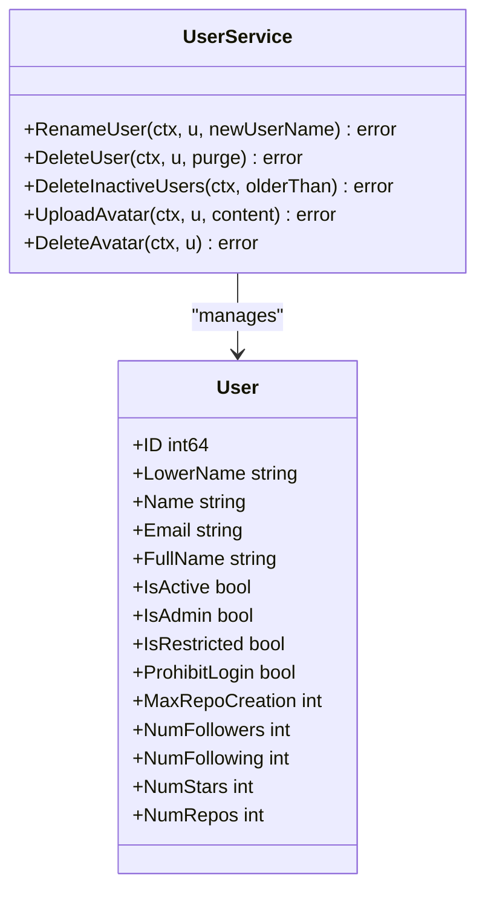
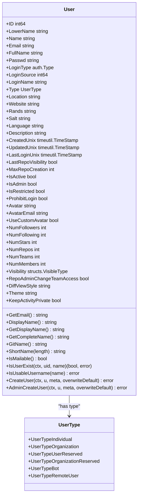
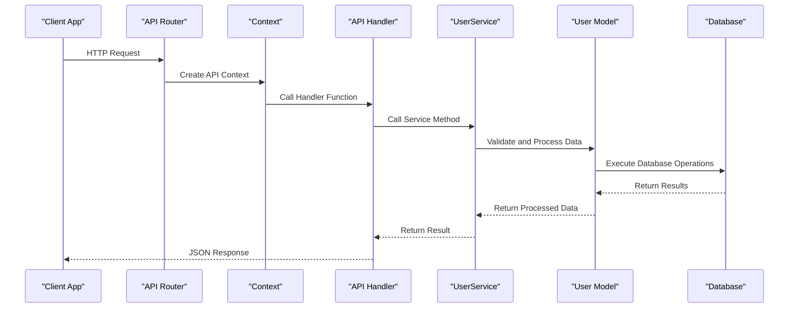

# Users

<cite>
**Referenced Files in This Document**   
- [user.go](file://routers/api/v1/user/user.go)
- [gpg_key.go](file://routers/api/v1/user/gpg_key.go)
- [star.go](file://routers/api/v1/user/star.go)
- [follower.go](file://routers/api/v1/user/follower.go)
- [avatar.go](file://routers/api/v1/user/avatar.go)
- [user.go](file://services/user/user.go)
- [user.go](file://models/user/user.go)
- [structs/user.go](file://modules/structs/user.go)
</cite>

## Table of Contents
1. [Introduction](#introduction)
2. [User Information Endpoints](#user-information-endpoints)
3. [SSH and GPG Key Management](#ssh-and-gpg-key-management)
4. [Repository Starring](#repository-starring)
5. [User Followers and Following](#user-followers-and-following)
6. [User Avatar Management](#user-avatar-management)
7. [Service Layer Implementation](#service-layer-implementation)
8. [Common Issues and Troubleshooting](#common-issues-and-troubleshooting)
9. [Performance Considerations](#performance-considerations)
10. [Best Practices](#best-practices)

## Introduction
This document provides comprehensive documentation for Gitea's user-related endpoints in REST API v1. It covers all HTTP methods, URL patterns, request/response schemas, and authentication requirements for managing user accounts, SSH and GPG keys, starred repositories, followers, and user avatars. The documentation includes detailed examples for retrieving user information, managing SSH and GPG keys, starring repositories, and following users. It also explains the relationship between these API endpoints and their corresponding service layer implementations in services/user, addresses common issues such as key format validation errors, avatar upload limitations, and permission conflicts when managing user resources.

**Section sources**
- [user.go](file://routers/api/v1/user/user.go#L1-L226)

## User Information Endpoints

### Retrieve User Information
The API provides endpoints to retrieve user information for both authenticated users and other users in the system.

#### Get a Specific User
Retrieves information about a specific user by username.

**Endpoint**: `GET /users/{username}`

**Response Schema**: Returns a User object with properties including ID, username, full name, email, avatar URL, and various user settings.

**Authentication**: Not required for public users, but required for private users.

**Example Response**:
```json
{
  "id": 1,
  "login": "username",
  "full_name": "Full Name",
  "email": "user@example.com",
  "avatar_url": "https://example.com/avatar/123",
  "is_admin": false,
  "last_login": "2023-01-01T00:00:00Z",
  "created": "2020-01-01T00:00:00Z"
}
```

#### Get Authenticated User
Retrieves information about the currently authenticated user.

**Endpoint**: `GET /user`

**Response Schema**: Returns the same User object as above, but with additional private information accessible only to the authenticated user.

**Authentication**: Required (via API token or session cookie).

#### Search Users
Searches for users based on a keyword or user ID.

**Endpoint**: `GET /users/search`

**Parameters**:
- `q`: Keyword to search for in usernames, full names, or emails
- `uid`: Specific user ID to search for
- `page`: Page number for pagination
- `limit`: Number of results per page

**Response Schema**: Returns a SearchResults object containing a list of matching users and pagination information.

**Authentication**: Required.

**Section sources**
- [user.go](file://routers/api/v1/user/user.go#L25-L226)

## SSH and GPG Key Management

### GPG Key Endpoints
Gitea provides a comprehensive API for managing GPG keys associated with user accounts.

#### List GPG Keys
Retrieves a list of GPG keys for a specific user.

**Endpoint**: `GET /users/{username}/gpg_keys`

**Response Schema**: Returns an array of GPGKey objects, each containing the key ID, key content, creation time, and associated emails.

#### List Authenticated User's GPG Keys
Retrieves a list of GPG keys for the authenticated user.

**Endpoint**: `GET /user/gpg_keys`

**Authentication**: Required.

#### Create GPG Key
Creates a new GPG key for the authenticated user.

**Endpoint**: `POST /user/gpg_keys`

**Request Body**: Requires a CreateGPGKeyOption object containing the armored GPG key and an optional signature.

**Authentication**: Required.

**Validation**: The API validates that the GPG key format is correct and that the associated emails match verified email addresses of the user.

#### Delete GPG Key
Removes a GPG key from the authenticated user's account.

**Endpoint**: `DELETE /user/gpg_keys/{id}`

**Authentication**: Required.

**Permissions**: Users can only delete their own GPG keys.

#### GPG Key Verification
Gitea implements a verification process for GPG keys to ensure they belong to the user.

**Verification Token**: Users can retrieve a token to sign with their private key.

**Endpoint**: `GET /user/gpg_key_token`

**Verify GPG Key**: After signing the token, users can verify their GPG key.

**Endpoint**: `POST /user/gpg_key_verify`

**Authentication**: Required.

**Section sources**
- [gpg_key.go](file://routers/api/v1/user/gpg_key.go#L1-L311)

## Repository Starring

### Star Management Endpoints
Users can star repositories to bookmark them for later reference.

#### List Starred Repositories
Retrieves a list of repositories starred by a specific user.

**Endpoint**: `GET /users/{username}/starred`

**Response Schema**: Returns an array of Repository objects that the user has starred.

**Visibility**: Users can see their own private starred repositories, but other users can only see public starred repositories.

#### List Authenticated User's Starred Repositories
Retrieves a list of repositories starred by the authenticated user.

**Endpoint**: `GET /user/starred`

**Authentication**: Required.

#### Check if Repository is Starred
Checks whether the authenticated user is starring a specific repository.

**Endpoint**: `GET /user/starred/{owner}/{repo}`

**Response**: Returns 204 No Content if the repository is starred, 404 Not Found if not starred.

**Authentication**: Required.

#### Star a Repository
Adds a repository to the authenticated user's starred repositories.

**Endpoint**: `PUT /user/starred/{owner}/{repo}`

**Authentication**: Required.

**Permissions**: Users must have read access to the repository to star it.

#### Unstar a Repository
Removes a repository from the authenticated user's starred repositories.

**Endpoint**: `DELETE /user/starred/{owner}/{repo}`

**Authentication**: Required.

**Section sources**
- [star.go](file://routers/api/v1/user/star.go#L1-L211)

## User Followers and Following

### Follower Management Endpoints
Gitea provides a social networking feature that allows users to follow other users.

#### List User Followers
Retrieves a list of users following a specific user.

**Endpoint**: `GET /users/{username}/followers`

**Response Schema**: Returns an array of User objects representing the followers.

#### List Authenticated User's Followers
Retrieves a list of users following the authenticated user.

**Endpoint**: `GET /user/followers`

**Authentication**: Required.

#### List Users Being Followed
Retrieves a list of users that a specific user is following.

**Endpoint**: `GET /users/{username}/following`

**Response Schema**: Returns an array of User objects representing the followed users.

#### List Authenticated User's Following
Retrieves a list of users that the authenticated user is following.

**Endpoint**: `GET /user/following`

**Authentication**: Required.

#### Check Following Status
Checks whether the authenticated user is following a specific user.

**Endpoint**: `GET /user/following/{username}`

**Response**: Returns 204 No Content if following, 404 Not Found if not following.

**Authentication**: Required.

#### Follow a User
Starts following a specific user.

**Endpoint**: `PUT /user/following/{username}`

**Authentication**: Required.

**Permissions**: Users cannot follow themselves.

#### Unfollow a User
Stops following a specific user.

**Endpoint**: `DELETE /user/following/{username}`

**Authentication**: Required.

**Section sources**
- [follower.go](file://routers/api/v1/user/follower.go#L1-L263)

## User Avatar Management

### Avatar Endpoints
Users can manage their profile avatars through the API.

#### Update Avatar
Updates the authenticated user's avatar.

**Endpoint**: `POST /user/avatar`

**Request Body**: Requires an UpdateUserAvatarOption object containing the avatar image as a base64-encoded string.

**Authentication**: Required.

**Validation**: The API validates that the image is in a supported format (PNG, JPEG, GIF) and within size limits.

#### Delete Avatar
Removes the authenticated user's custom avatar, reverting to the default avatar.

**Endpoint**: `DELETE /user/avatar`

**Authentication**: Required.

**Section sources**
- [avatar.go](file://routers/api/v1/user/avatar.go#L1-L65)

## Service Layer Implementation

### User Service Architecture
The user-related API endpoints are implemented using a layered architecture with clear separation between the HTTP handlers and the business logic.

#### Service Layer Components
The service layer in `services/user` contains the core business logic for user operations.



**Diagram sources**
- [user.go](file://services/user/user.go#L1-L298)

#### User Model
The User model in `models/user` defines the database schema and provides methods for database operations.



**Diagram sources**
- [user.go](file://models/user/user.go#L1-L799)

#### API Request Flow
The flow of a typical API request from the HTTP handler to the service layer.



**Diagram sources**
- [user.go](file://routers/api/v1/user/user.go#L1-L226)
- [user.go](file://services/user/user.go#L1-L298)
- [user.go](file://models/user/user.go#L1-L799)

**Section sources**
- [user.go](file://services/user/user.go#L1-L298)
- [user.go](file://models/user/user.go#L1-L799)

## Common Issues and Troubleshooting

### Key Format Validation Errors
When adding GPG keys, users may encounter validation errors due to incorrect key formats.

**Common Causes**:
- Invalid armored key format
- Missing required headers in the armored key
- Corrupted key data
- Signature verification failures

**Solutions**:
- Ensure the GPG key is properly exported in ASCII armored format
- Verify the key can be imported locally before uploading
- Use the verification token process to confirm key ownership
- Check that the key's associated emails match verified email addresses

### Avatar Upload Limitations
Avatar uploads may fail due to various limitations.

**Common Issues**:
- File size exceeding limits
- Unsupported image formats
- Base64 encoding errors
- Permission issues for authenticated users

**Solutions**:
- Ensure images are under the maximum file size (typically 5MB)
- Use supported formats: PNG, JPEG, GIF
- Verify base64 encoding is correct and complete
- Confirm the user has proper authentication and permissions

### Permission Conflicts
Users may encounter permission conflicts when managing user resources.

**Common Scenarios**:
- Attempting to delete a user who owns repositories
- Trying to follow a user who has blocked the requester
- Creating GPG keys when the feature is disabled
- Exceeding repository creation limits

**Solutions**:
- Transfer or delete owned repositories before user deletion
- Respect user blocking settings
- Check feature availability in system settings
- Monitor and manage repository creation quotas

**Section sources**
- [gpg_key.go](file://routers/api/v1/user/gpg_key.go#L1-L311)
- [avatar.go](file://routers/api/v1/user/avatar.go#L1-L65)
- [user.go](file://services/user/user.go#L1-L298)

## Performance Considerations

### User Search with Large User Bases
Searching users in installations with large user bases requires careful consideration of performance.

**Optimization Strategies**:
- Implement proper database indexing on searchable fields (username, full name, email)
- Use pagination to limit result sets
- Cache frequent search queries
- Consider full-text search capabilities for complex queries

**API Design**:
- The search endpoint supports pagination through `page` and `limit` parameters
- Results are limited to reduce database load
- Case-insensitive searches are optimized through the `LowerName` field

### Follower and Following Lists
Managing follower relationships at scale requires efficient data structures.

**Database Design**:
- The follow relationship is stored in a dedicated table with indexes on both user ID and follow ID
- Counters are maintained for follower and following counts to avoid expensive COUNT queries
- Pagination is supported to handle users with large numbers of followers

**Section sources**
- [user.go](file://models/user/user.go#L1-L799)
- [follower.go](file://routers/api/v1/user/follower.go#L1-L263)

## Best Practices

### Secure Key Management
Proper management of SSH and GPG keys is critical for account security.

**Recommendations**:
- Regularly rotate SSH keys
- Use strong passphrases for private keys
- Verify GPG key ownership through the token signing process
- Remove unused keys promptly
- Monitor key usage and access patterns

### Rate Limiting and API Usage
To ensure system stability, API usage should follow best practices.

**Guidelines**:
- Implement client-side caching for frequently accessed user data
- Use pagination for large result sets
- Handle rate limiting responses gracefully
- Use webhooks for real-time updates instead of polling
- Authenticate requests properly to avoid anonymous rate limits

### Data Privacy
Respect user privacy settings when accessing user information.

**Considerations**:
- Check user visibility settings before accessing profile data
- Respect email privacy preferences
- Handle placeholder emails appropriately
- Follow data retention policies for inactive users

**Section sources**
- [user.go](file://models/user/user.go#L1-L799)
- [gpg_key.go](file://routers/api/v1/user/gpg_key.go#L1-L311)