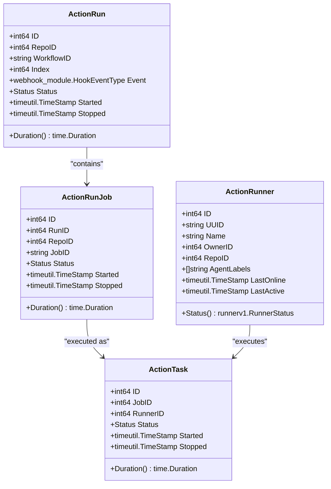
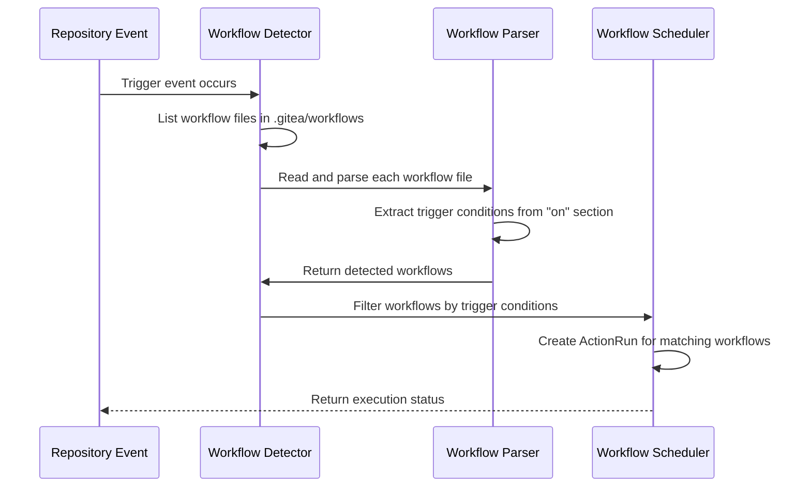
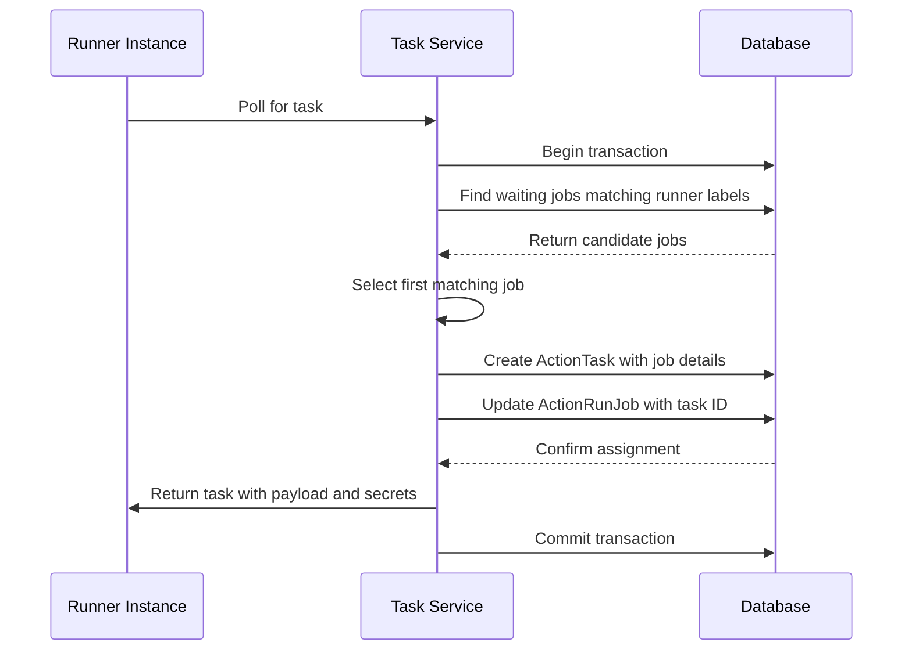
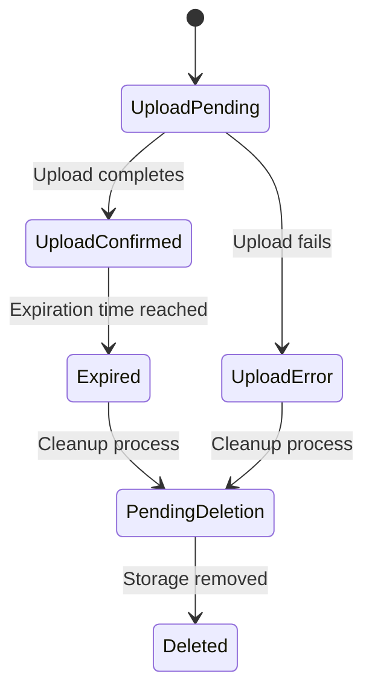

# Actions (CI/CD)

<cite>
**Referenced Files in This Document**   
- [artifact.go](file://models/actions/artifact.go)
- [run.go](file://models/actions/run.go)
- [run_job.go](file://models/actions/run_job.go)
- [runner.go](file://models/actions/runner.go)
- [task.go](file://models/actions/task.go)
- [workflow.go](file://services/actions/workflow.go)
- [task.go](file://services/actions/task.go)
- [workflows.go](file://modules/actions/workflows.go)
- [artifacts.go](file://modules/actions/artifacts.go)
</cite>

## Table of Contents
1. [Introduction](#introduction)
2. [Core Components](#core-components)
3. [Workflow Configuration and Detection](#workflow-configuration-and-detection)
4. [Runners and Job Execution](#runners-and-job-execution)
5. [Artifacts Management](#artifacts-management)
6. [Secrets and Variables](#secrets-and-variables)
7. [Relationship with Repositories and Pull Requests](#relationship-with-repositories-and-pull-requests)
8. [Common Issues and Troubleshooting](#common-issues-and-troubleshooting)
9. [Performance Considerations](#performance-considerations)

## Introduction

Gitea's Actions CI/CD system provides a powerful automation platform for continuous integration and deployment workflows. It enables developers to define, execute, and manage automated pipelines directly within the Gitea ecosystem. The system supports workflow configuration through YAML files in `.gitea/workflows` or `.github/workflows` directories, allowing users to automate testing, building, and deployment processes triggered by various repository events such as pushes, pull requests, and scheduled events.

The CI/CD pipeline architecture is built around several core components: workflow definitions, runners, jobs, tasks, and artifacts. When a triggering event occurs, Gitea detects relevant workflows, creates action runs, and schedules jobs to be executed by available runners. The system handles complex scenarios including forked pull requests, concurrency control, and artifact persistence, providing a comprehensive automation solution that integrates seamlessly with Gitea's repository management features.

**Section sources**
- [workflows.go](file://modules/actions/workflows.go)
- [workflow.go](file://services/actions/workflow.go)

## Core Components

The Gitea Actions system is composed of several interconnected models that represent different aspects of the CI/CD pipeline. The `ActionRun` model represents a complete workflow execution, containing metadata about the triggering event, repository, and overall status. Each run consists of one or more `ActionRunJob` instances, which correspond to individual jobs defined in the workflow YAML file. These jobs are distributed to runners as `ActionTask` objects, which contain the actual execution payload and runtime information.

The system maintains a clear hierarchy: runs contain jobs, and jobs are executed as tasks on runners. Each component has its own lifecycle and status tracking, with the run status being aggregated from its constituent jobs. The models include comprehensive timestamp tracking for monitoring pipeline duration and performance. The system also implements optimistic locking through version fields to prevent race conditions when multiple processes update the same run concurrently.

**Diagram sources**
- [run.go](file://models/actions/run.go)
- [run_job.go](file://models/actions/run_job.go)
- [task.go](file://models/actions/task.go)
- [runner.go](file://models/actions/runner.go)

**Section sources**
- [run.go](file://models/actions/run.go)
- [run_job.go](file://models/actions/run_job.go)
- [task.go](file://models/actions/task.go)
- [runner.go](file://models/actions/runner.go)

## Workflow Configuration and Detection

Gitea Actions supports workflow configuration through YAML files stored in the `.gitea/workflows` or `.github/workflows` directories of a repository. The system automatically detects these workflow files during various repository events and parses their trigger conditions to determine if execution should proceed. Workflow detection is performed by the `DetectWorkflows` function, which examines the repository tree at a specific commit and identifies all valid workflow files based on their extension (`.yml` or `.yaml`) and location.

The workflow engine supports a wide range of trigger events including push, pull_request, issues, release, and schedule. For each detected workflow, the system parses the `on` configuration to determine the specific conditions under which the workflow should run. This includes support for branch and tag filters, path filters, and activity type filtering (such as `opened`, `closed`, or `synchronized` for pull requests). Scheduled workflows are detected separately and can be triggered by cron-like specifications defined in the workflow file.

**Diagram sources**
- [workflows.go](file://modules/actions/workflows.go)
- [workflow.go](file://services/actions/workflow.go)

**Section sources**
- [workflows.go](file://modules/actions/workflows.go)
- [workflow.go](file://services/actions/workflow.go)

## Runners and Job Execution

The Gitea Actions runner system manages the execution of CI/CD jobs through a distributed architecture where runners poll for available tasks. Runners can be registered at different levels: global (system-wide), organization/user-level, or repository-specific. Each runner is identified by a unique UUID and maintains its status through periodic heartbeat updates. The runner status is determined by the time since its last activity, with runners considered offline if they haven't communicated within a configured timeout period.

When a runner requests a task, the system finds available jobs that match the runner's labels (specified in the runner's configuration) and assigns them based on a first-come, first-served basis. The assignment process occurs within a database transaction to ensure consistency. Each task contains the complete workflow payload for the specific job, along with secrets, variables, and context information. The system supports ephemeral runners that are automatically removed after completing a single task, making them ideal for secure, disposable execution environments.

**Diagram sources**
- [task.go](file://services/actions/task.go)
- [task.go](file://models/actions/task.go)
- [runner.go](file://models/actions/runner.go)

**Section sources**
- [task.go](file://services/actions/task.go)
- [task.go](file://models/actions/task.go)
- [runner.go](file://models/actions/runner.go)

## Artifacts Management

Gitea Actions provides comprehensive artifact management capabilities that allow workflows to store and retrieve files generated during execution. Artifacts are stored in a configurable storage backend and can be accessed through the web interface or API. The system supports both the legacy artifact storage format and a newer v4 format that stores artifacts as compressed zip files, improving storage efficiency and download performance.

The artifact lifecycle is managed through several status states: upload pending, upload confirmed, expired, and pending deletion. When a workflow uploads an artifact, it first creates a record in the database with a pending status. As files are uploaded, they are stored in the configured storage backend with a generated path. Artifacts have configurable expiration periods after which they are marked as expired and eventually deleted by a background cleanup process. The system provides APIs for downloading artifacts, with support for direct serving from storage backends when possible to reduce server load.

**Diagram sources**
- [artifact.go](file://models/actions/artifact.go)
- [artifacts.go](file://modules/actions/artifacts.go)

**Section sources**
- [artifact.go](file://models/actions/artifact.go)
- [artifacts.go](file://modules/actions/artifacts.go)

## Secrets and Variables

The Gitea Actions system provides secure management of sensitive information through its secrets and variables functionality. Secrets are encrypted values that can be injected into workflow runs, while variables provide non-sensitive configuration values. Both secrets and variables can be defined at different levels: repository, organization, or system-wide, with more specific levels taking precedence over broader ones.

When a task is assigned to a runner, the system retrieves all applicable secrets and variables for that context and includes them in the task payload. Secrets are transmitted securely and are only accessible to the runner executing the task. The system prevents secrets from being logged or exposed in the user interface, providing a secure environment for handling credentials, API keys, and other sensitive data. Variables can be used to configure workflow behavior based on environment or repository settings without exposing sensitive information.

**Section sources**
- [task.go](file://services/actions/task.go)
- [task.go](file://models/actions/task.go)

## Relationship with Repositories and Pull Requests

Gitea Actions is tightly integrated with repositories and pull requests, providing context-aware execution and status reporting. Each action run is associated with a specific repository and can be triggered by various repository events. For pull requests, the system distinguishes between direct branch pushes and forked repository contributions, applying different security policies accordingly. When a workflow is triggered by a pull request from a forked repository, the system may require approval before executing potentially dangerous operations.

The system creates appropriate commit statuses for each job, which are displayed in the pull request interface to provide visual feedback on the CI/CD pipeline status. These statuses include links to the detailed run information and logs. The integration also respects repository permissions, ensuring that only users with appropriate access levels can view workflow details, modify workflow configurations, or register runners for a repository. This tight integration allows teams to maintain comprehensive quality control processes within the familiar Gitea interface.

**Section sources**
- [run.go](file://models/actions/run.go)
- [run_job.go](file://models/actions/run_job.go)

## Common Issues and Troubleshooting

Common issues in the Gitea Actions system typically fall into several categories: runner connectivity problems, job failures, and configuration errors. Runner connectivity issues often stem from network configuration, authentication problems, or outdated runner software. When runners fail to connect, administrators should verify the runner token, check network connectivity to the Gitea instance, and ensure the runner software version is compatible with the server.

Job failures can occur due to various reasons including missing dependencies, insufficient permissions, or errors in the workflow definition. The system provides detailed logs for each job step, which should be the first place to investigate failures. For forked pull requests, jobs may be blocked awaiting approval, which appears as a "waiting" status in the interface. Configuration errors such as invalid YAML syntax or unsupported workflow features are typically detected during workflow parsing and reported in the repository's action logs.

**Section sources**
- [task.go](file://models/actions/task.go)
- [run_job.go](file://models/actions/run_job.go)
- [run.go](file://models/actions/run.go)

## Performance Considerations

The Gitea Actions system includes several performance optimizations to handle high-volume CI/CD workloads efficiently. The database schema is indexed strategically to optimize common queries, such as finding runs by repository or locating waiting jobs for runners. The system implements caching for frequently accessed data, such as successful task tokens, to reduce database load and improve response times.

Resource management is handled through concurrency controls that prevent excessive parallel execution of workflows. The system supports workflow-level and job-level concurrency specifications, allowing administrators to limit the number of simultaneous runs or jobs. For large repositories with many workflows, the system can be configured to prioritize certain workflows or limit the total number of concurrent tasks. Storage performance is optimized through the use of efficient artifact compression and direct serving from storage backends when supported, reducing the load on the main application server.

**Section sources**
- [run.go](file://models/actions/run.go)
- [task.go](file://models/actions/task.go)
- [artifact.go](file://models/actions/artifact.go)