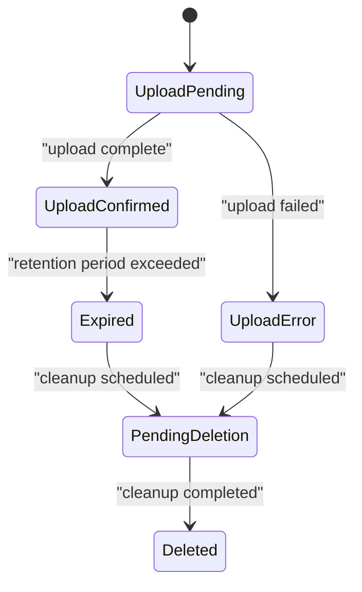
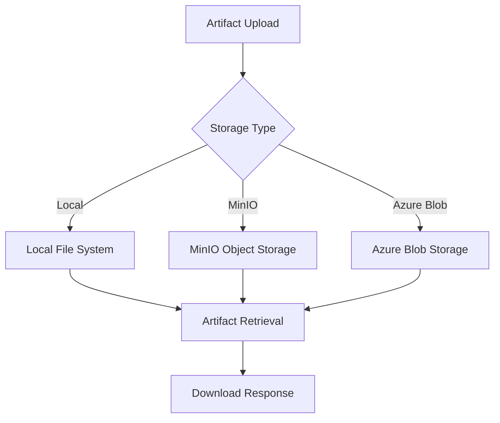
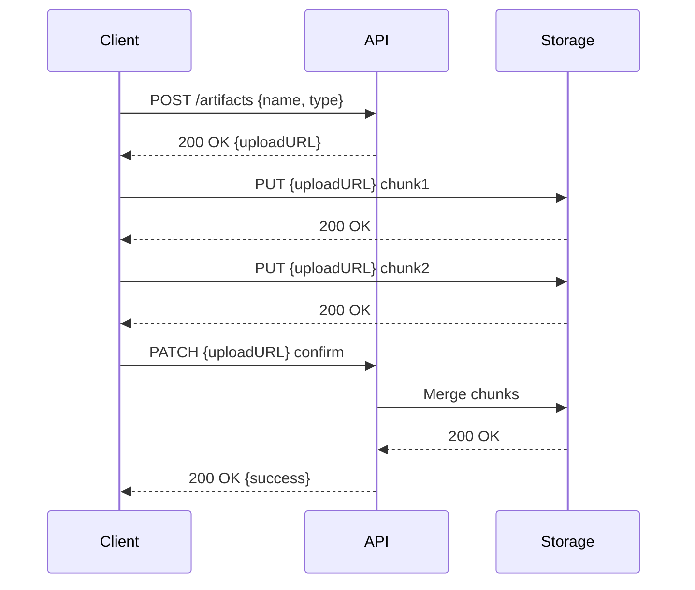
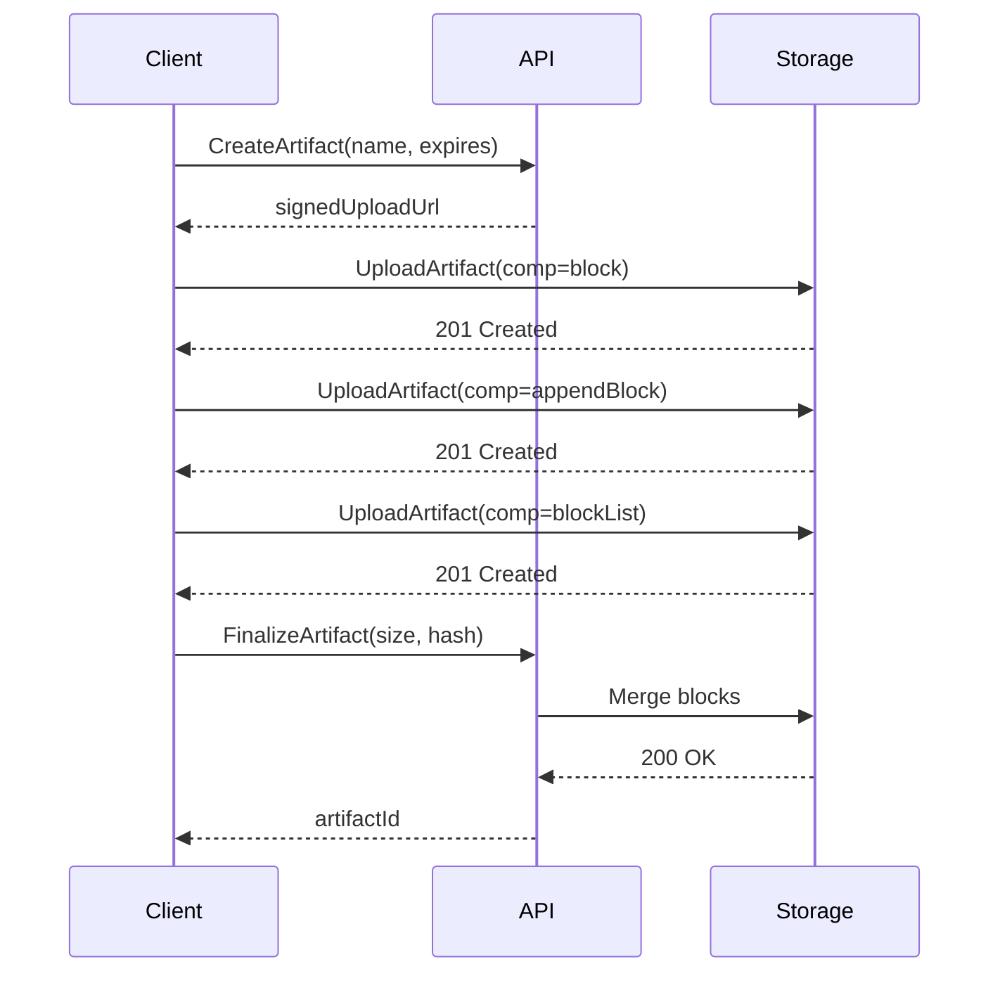
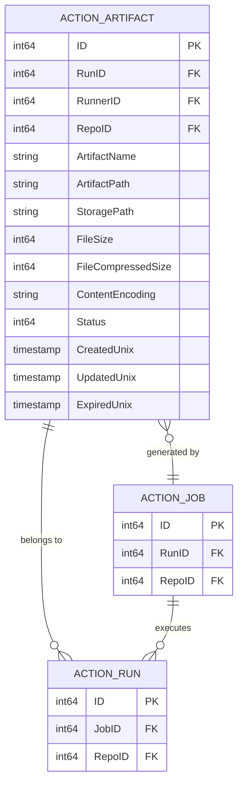

# Artifacts

<cite>
**Referenced Files in This Document**   
- [models/actions/artifact.go](file://models/actions/artifact.go)
- [routers/api/actions/artifacts.go](file://routers/api/actions/artifacts.go)
- [routers/api/actions/artifactsv4.go](file://routers/api/actions/artifactsv4.go)
- [modules/actions/artifacts.go](file://modules/actions/artifacts.go)
- [modules/setting/storage.go](file://modules/setting/storage.go)
</cite>

## Table of Contents
1. [Introduction](#introduction)
2. [Artifact Lifecycle Management](#artifact-lifecycle-management)
3. [Storage Architecture](#storage-architecture)
4. [API Endpoints and Protocols](#api-endpoints-and-protocols)
5. [Artifact Upload Process](#artifact-upload-process)
6. [Artifact Download Process](#artifact-download-process)
7. [V4 API Specification](#v4-api-specification)
8. [Relationship Between Artifacts, Jobs, and Storage](#relationship-between-artifacts-jobs-and-storage)
9. [Common Issues and Solutions](#common-issues-and-solutions)
10. [Performance Considerations](#performance-considerations)

## Introduction
Gitea's artifact management system provides a comprehensive solution for storing, retrieving, and managing files generated during CI/CD pipeline execution. The system supports both traditional and V4 API specifications, enabling efficient handling of artifacts across different workflow scenarios. This documentation details the implementation of artifact storage, retrieval, and lifecycle management, focusing on the core components in `models/actions/artifact.go` and `routers/api/actions/artifacts.go`.

**Section sources**
- [models/actions/artifact.go](file://models/actions/artifact.go#L1-L214)
- [routers/api/actions/artifacts.go](file://routers/api/actions/artifacts.go#L1-L504)

## Artifact Lifecycle Management
The artifact lifecycle in Gitea is managed through a state machine implemented in the `ArtifactStatus` enumeration. Each artifact transitions through several states from creation to deletion:

- **Upload Pending**: Initial state when artifact upload begins
- **Upload Confirmed**: Upload completed successfully
- **Upload Error**: Upload failed
- **Expired**: Artifact has exceeded its retention period
- **Pending Deletion**: Marked for removal by cleanup process
- **Deleted**: Permanently removed

The system automatically manages state transitions based on upload completion, expiration policies, and deletion requests. The `ActionArtifact` struct in `models/actions/artifact.go` contains fields for tracking creation time, update time, and expiration time, enabling precise lifecycle management.

**Diagram sources**
- [models/actions/artifact.go](file://models/actions/artifact.go#L32-L53)

**Section sources**
- [models/actions/artifact.go](file://models/actions/artifact.go#L32-L53)
- [models/actions/artifact.go](file://models/actions/artifact.go#L120-L169)

## Storage Architecture
Gitea's artifact storage architecture is designed for flexibility and scalability, supporting multiple storage backends through the `ObjectStorage` interface. The system can utilize local file storage or cloud-based solutions like MinIO and Azure Blob Storage.

The storage configuration is managed through the `Storage` struct in `modules/setting/storage.go`, which defines the storage type, path, and backend-specific configuration. The `ServeDirect` property enables direct serving of artifacts from external storage systems, reducing server load and improving download performance.

**Diagram sources**
- [modules/setting/storage.go](file://modules/setting/storage.go#L1-L343)

**Section sources**
- [modules/setting/storage.go](file://modules/setting/storage.go#L1-L343)
- [models/actions/artifact.go](file://models/actions/artifact.go#L1-L214)

## API Endpoints and Protocols
Gitea provides a comprehensive API for artifact management, supporting both traditional and V4 specifications. The API endpoints are organized under the `/api/actions_pipeline/_apis/pipelines/workflows/{run_id}/artifacts` route.

Key endpoints include:
- **POST /artifacts**: Acquire upload URL
- **PUT /{artifact_id}/upload**: Upload artifact chunks
- **PATCH /{artifact_id}/upload**: Confirm upload completion
- **GET /artifacts**: List available artifacts
- **GET /{artifact_id}/download**: Download artifact content

The API uses standard HTTP methods and status codes, with JSON responses for metadata operations and binary content for file downloads. Authentication is performed using Bearer tokens, with support for both JWT-based and legacy token formats.

**Section sources**
- [routers/api/actions/artifacts.go](file://routers/api/actions/artifacts.go#L1-L504)

## Artifact Upload Process
The artifact upload process in Gitea follows a three-step protocol designed for reliability and efficiency:

1. **Upload URL Acquisition**: The client sends a POST request with artifact metadata to obtain a signed upload URL
2. **Chunked Upload**: The client uploads file data in chunks using PUT requests with range headers
3. **Upload Confirmation**: The client sends a PATCH request to confirm upload completion and trigger chunk merging

The system validates each chunk using MD5 checksums and tracks upload progress through the `ActionArtifact` record. Large files are handled efficiently through streaming, with chunks stored temporarily before being merged into the final artifact file.

**Diagram sources**
- [routers/api/actions/artifacts.go](file://routers/api/actions/artifacts.go#L1-L504)

**Section sources**
- [routers/api/actions/artifacts.go](file://routers/api/actions/artifacts.go#L1-L504)
- [models/actions/artifact.go](file://models/actions/artifact.go#L1-L214)

## Artifact Download Process
The artifact download process supports both direct serving from external storage and proxy serving through the Gitea server. When `ServeDirect` is enabled, the system generates pre-signed URLs for direct access to storage backends, reducing server load and improving download speeds.

The download flow involves:
1. **Artifact Listing**: Client requests list of available artifacts
2. **Download URL Acquisition**: Client obtains download URL for specific artifact
3. **Content Retrieval**: Client downloads artifact content from the provided URL

The system handles content encoding transparently, setting appropriate headers for compressed artifacts. Access permissions are verified through token authentication and artifact status checks.

**Section sources**
- [routers/api/actions/artifacts.go](file://routers/api/actions/artifacts.go#L1-L504)
- [modules/actions/artifacts.go](file://modules/actions/artifacts.go#L1-L49)

## V4 API Specification
The V4 API specification introduces a more efficient artifact management protocol based on the Twirp RPC framework and protobuf messages. This API is designed for high-performance scenarios and large file transfers.

Key features of the V4 API:
- **CreateArtifact**: Initiates artifact creation with retention policy
- **UploadArtifact**: Handles chunked uploads with block identifiers
- **FinalizeArtifact**: Completes upload and validates checksum
- **ListArtifacts**: Retrieves artifact metadata with filtering
- **GetSignedArtifactURL**: Generates download URLs with expiration
- **DeleteArtifact**: Marks artifacts for deletion

The V4 API uses HMAC signatures for request authentication and supports parallel chunk uploads with explicit ordering through block lists. Artifacts are stored as single ZIP files, simplifying the storage model and improving compatibility.

**Diagram sources**
- [routers/api/actions/artifactsv4.go](file://routers/api/actions/artifactsv4.go#L1-L587)

**Section sources**
- [routers/api/actions/artifactsv4.go](file://routers/api/actions/artifactsv4.go#L1-L587)
- [models/actions/artifact.go](file://models/actions/artifact.go#L1-L214)

## Relationship Between Artifacts, Jobs, and Storage
Artifacts are intrinsically linked to workflow execution through their association with jobs and runs. Each artifact is tied to a specific `runID` and `jobID`, ensuring proper isolation and access control. The `ActionArtifact` struct contains foreign keys to these entities, enabling efficient querying and cleanup operations.

The storage backend is configured globally for the actions system, with artifacts organized by run ID in the storage hierarchy. This structure allows for efficient cleanup of all artifacts associated with a completed workflow run.

**Diagram sources**
- [models/actions/artifact.go](file://models/actions/artifact.go#L1-L214)

**Section sources**
- [models/actions/artifact.go](file://models/actions/artifact.go#L1-L214)
- [routers/api/actions/artifacts.go](file://routers/api/actions/artifacts.go#L1-L504)

## Common Issues and Solutions
### Large File Uploads
Large file uploads are handled through chunked transfer encoding, with each chunk validated using MD5 checksums. The system supports resumable uploads, allowing clients to retry failed chunks without restarting the entire upload.

### Storage Limits
Storage limits are managed through configurable retention policies. The `ArtifactRetentionDays` setting controls how long artifacts are preserved before automatic expiration. Administrators can configure storage quotas at the repository or instance level.

### Access Permissions
Access to artifacts is controlled through token-based authentication. The system verifies that the requesting runner is associated with the target workflow run, preventing unauthorized access. The `ArtifactContexter` middleware validates authentication tokens and loads the associated task context.

**Section sources**
- [routers/api/actions/artifacts.go](file://routers/api/actions/artifacts.go#L1-L504)
- [models/actions/artifact.go](file://models/actions/artifact.go#L1-L214)
- [modules/setting/storage.go](file://modules/setting/storage.go#L1-L343)

## Performance Considerations
### Artifact Transfer Optimization
The system optimizes artifact transfer through several mechanisms:
- **Direct Serving**: When enabled, artifacts are served directly from storage backends
- **Chunked Uploads**: Large files are transferred in parallel chunks
- **Streaming Processing**: Files are processed as streams, minimizing memory usage
- **Efficient Merging**: Chunks are merged directly to storage without intermediate buffering

### Storage Optimization
Storage performance is enhanced through:
- **Hierarchical Organization**: Artifacts are organized by run ID for efficient cleanup
- **Compression Support**: Gzip compression reduces storage requirements
- **Background Cleanup**: Expired artifacts are removed by scheduled jobs
- **Caching**: Frequently accessed artifacts can be cached at the storage layer

These optimizations ensure efficient handling of artifacts even in high-volume CI/CD environments.

**Section sources**
- [routers/api/actions/artifacts.go](file://routers/api/actions/artifacts.go#L1-L504)
- [modules/actions/artifacts.go](file://modules/actions/artifacts.go#L1-L49)
- [modules/setting/storage.go](file://modules/setting/storage.go#L1-L343)