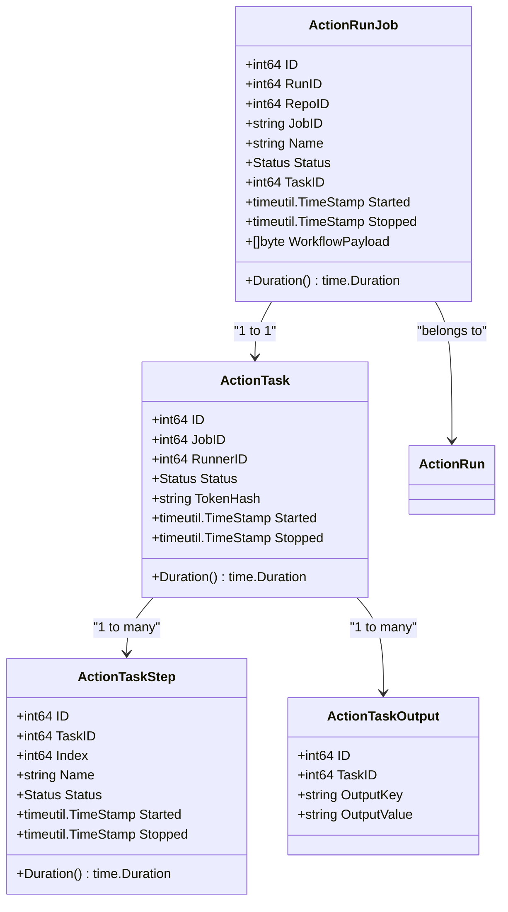
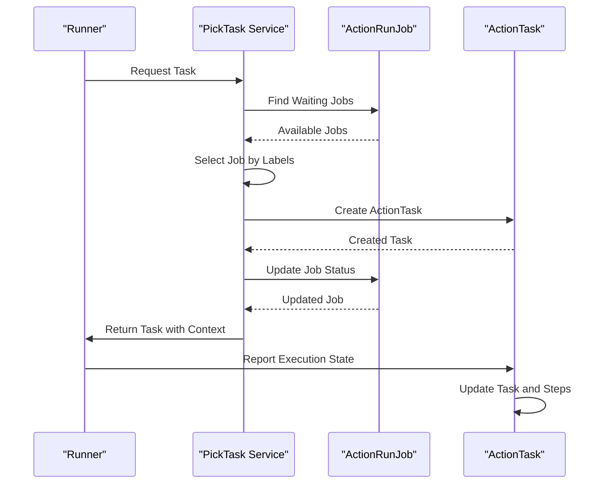
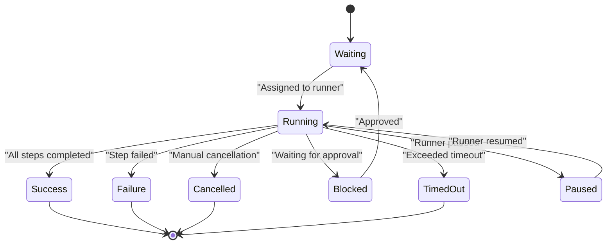
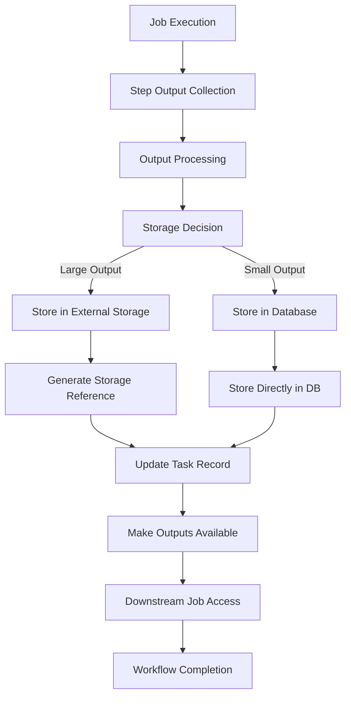
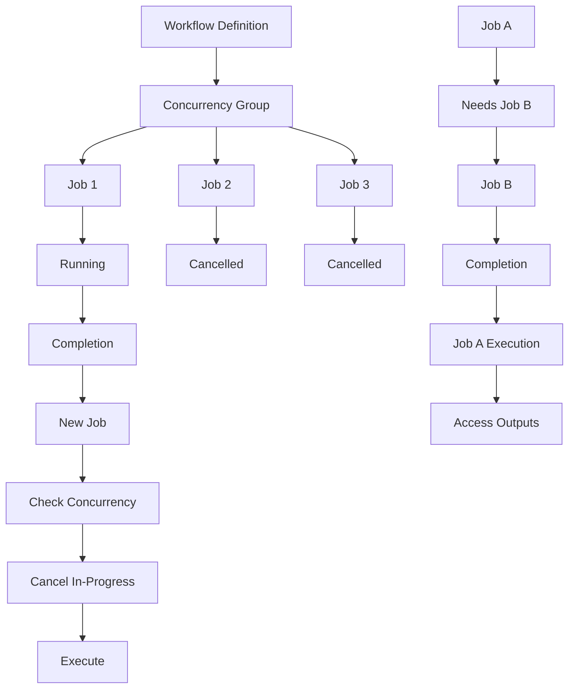
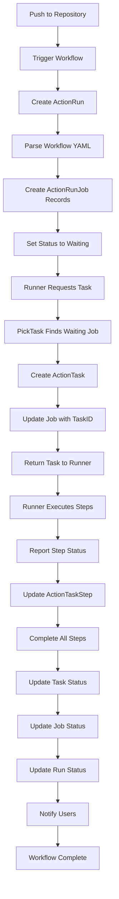

# Jobs and Steps

<cite>
**Referenced Files in This Document**   
- [run_job.go](file://models/actions/run_job.go)
- [task.go](file://services/actions/task.go)
- [task.go](file://models/actions/task.go)
- [task_step.go](file://models/actions/task_step.go)
- [task_output.go](file://models/actions/task_output.go)
- [run.go](file://models/actions/run.go)
</cite>

## Table of Contents
1. [Introduction](#introduction)
2. [Job and Step Architecture](#job-and-step-architecture)
3. [Job Creation and Workflow Integration](#job-creation-and-workflow-integration)
4. [Job Scheduling and Execution](#job-scheduling-and-execution)
5. [Status Management System](#status-management-system)
6. [Job Output Capture and Storage](#job-output-capture-and-storage)
7. [Concurrency and Dependency Management](#concurrency-and-dependency-management)
8. [Error Handling and Common Issues](#error-handling-and-common-issues)
9. [Performance Considerations](#performance-considerations)
10. [Execution Flow Example](#execution-flow-example)

## Introduction
Gitea's job and step execution system provides a comprehensive workflow automation framework that enables continuous integration and deployment capabilities. The system is designed to handle complex workflow definitions, manage job execution across distributed runners, and provide detailed tracking of execution status and outputs. This document details the implementation of job creation, scheduling, execution tracking, and relationship management between jobs, steps, and workflows in Gitea's actions system.

## Job and Step Architecture

**Diagram sources**
- [run_job.go](file://models/actions/run_job.go#L12-L87)
- [task.go](file://models/actions/task.go#L12-L50)
- [task_step.go](file://models/actions/task_step.go#L14-L40)
- [task_output.go](file://models/actions/task_output.go#L15-L25)

**Section sources**
- [run_job.go](file://models/actions/run_job.go#L12-L87)
- [task.go](file://models/actions/task.go#L12-L50)

## Job Creation and Workflow Integration

The job creation process in Gitea begins with the parsing of workflow definitions and the instantiation of job records in the database. When a workflow is triggered by a repository event, the system creates `ActionRun` records that represent the overall workflow execution, which in turn contain multiple `ActionRunJob` instances representing individual jobs within the workflow.

The `ActionRunJob` struct contains essential information about each job, including its name, status, and the raw workflow payload that defines its behavior. The `WorkflowPayload` field stores the serialized job definition from the workflow YAML file, which is later parsed to extract the actual job configuration. This design allows Gitea to maintain a complete record of the job definition at the time of execution, ensuring reproducibility and auditability.

When jobs are created from workflow definitions, the system parses the workflow file and extracts individual job configurations, creating corresponding `ActionRunJob` records in the database. The job creation process also handles the evaluation of conditional expressions and matrix configurations that may result in multiple job instances being created from a single job definition in the workflow file.

**Section sources**
- [run_job.go](file://models/actions/run_job.go#L12-L87)
- [run.go](file://models/actions/run.go#L21-L457)

## Job Scheduling and Execution

**Diagram sources**
- [task.go](file://services/actions/task.go#L19-L132)
- [task.go](file://models/actions/task.go#L12-L507)
- [run_job.go](file://models/actions/run_job.go#L120-L173)

**Section sources**
- [task.go](file://services/actions/task.go#L19-L132)
- [task.go](file://models/actions/task.go#L12-L507)

The job scheduling and execution process in Gitea is managed through a pull-based model where runners request tasks from the server. The `PickTask` function in the services layer is responsible for assigning jobs to available runners. When a runner requests a task, the system searches for waiting jobs that match the runner's labels and creates an `ActionTask` record to represent the assignment.

The scheduling process considers several factors when assigning jobs to runners, including repository scope, owner scope, and label matching. Runners can be configured to handle jobs from specific repositories or all repositories owned by a particular user or organization. The label matching system allows for flexible routing of jobs to runners with specific capabilities or environments.

Once a job is assigned to a runner, an `ActionTask` record is created with a unique token for authentication and authorization. The task includes the complete workflow payload, secrets, variables, and context information needed by the runner to execute the job. This design ensures that runners have all necessary information to execute jobs without requiring additional API calls during execution.

## Status Management System

**Diagram sources**
- [run_job.go](file://models/actions/run_job.go#L12-L87)
- [task.go](file://models/actions/task.go#L12-L50)

**Section sources**
- [run_job.go](file://models/actions/run_job.go#L12-L87)
- [task.go](file://models/actions/task.go#L12-L50)

The status management system in Gitea provides comprehensive tracking of job execution states throughout their lifecycle. Each job can exist in multiple states, including waiting, running, success, failure, cancelled, blocked, and timed out. The system maintains both the current status and timestamps for when the job started and stopped, enabling accurate duration calculations and execution history analysis.

The status of a job is updated through various mechanisms, including explicit updates from the runner, automatic updates based on timeouts, and manual updates from users. When a runner reports its state, the `UpdateTaskByState` function processes the state update and propagates changes to the associated job and steps. This function also handles the special case of non-final states by updating the task's updated timestamp to prevent the task from being considered a "zombie" task.

The system also provides aggregate status calculation for workflow runs, where the overall status of a workflow is determined by the statuses of its constituent jobs. This aggregation follows specific rules: if all jobs are successful or skipped, the workflow is successful; if any job fails, the workflow fails; if any job is cancelled, the workflow is cancelled; otherwise, the workflow status reflects the most advanced state among its jobs.

## Job Output Capture and Storage

**Diagram sources**
- [task_output.go](file://models/actions/task_output.go#L15-L55)
- [task.go](file://models/actions/task.go#L12-L507)

**Section sources**
- [task_output.go](file://models/actions/task_output.go#L15-L55)
- [task.go](file://models/actions/task.go#L12-L507)

Gitea's job output capture and storage system is designed to handle both step-level outputs and job-level artifacts. The system captures outputs through the `ActionTaskOutput` model, which stores key-value pairs of output data associated with a specific task. This design ensures that outputs are bound to the task rather than the job, preventing confusion when jobs are re-run and ensuring that each execution has its own isolated output space.

The output capture process begins when a runner reports step completion with output data. The `UpdateTaskByState` function processes these reports and stores the outputs in the database. For larger outputs or artifacts, the system may use external storage mechanisms, with references stored in the database. This hybrid approach balances performance and storage efficiency while maintaining data integrity.

Outputs are made available to downstream jobs through the workflow's dependency system. When a job specifies dependencies on other jobs, the system automatically makes the outputs of the dependent jobs available as environment variables or through the workflow context. This enables complex workflows where the output of one job determines the behavior of subsequent jobs, such as deployment strategies based on test results or artifact promotion through environments.

## Concurrency and Dependency Management

**Diagram sources**
- [run_job.go](file://models/actions/run_job.go#L43-L87)
- [run.go](file://models/actions/run.go#L21-L457)

**Section sources**
- [run_job.go](file://models/actions/run_job.go#L43-L87)
- [run.go](file://models/actions/run.go#L21-L457)

Gitea's concurrency and dependency management system provides sophisticated control over job execution patterns. The concurrency system allows workflow authors to limit the number of simultaneously running jobs across different dimensions, such as repository-wide or workflow-specific concurrency. This is implemented through the `RawConcurrency` field in the `ActionRunJob` model, which stores the raw concurrency specification from the workflow YAML, and the evaluated `ConcurrencyGroup` and `ConcurrencyCancel` fields that determine the actual concurrency behavior.

When a job with a concurrency specification is scheduled, the system checks for other jobs in the same concurrency group that are currently running or waiting. If the `ConcurrencyCancel` flag is set, the system automatically cancels any in-progress jobs in the same group, ensuring that only the most recent job executes. This is particularly useful for pull request workflows where new commits should cancel previous builds.

The dependency management system is implemented through the `Needs` field in the `ActionRunJob` model, which stores a list of job IDs that the current job depends on. Before a job can start execution, all jobs in its `Needs` list must complete successfully. The system automatically resolves these dependencies and makes the outputs of dependent jobs available to the dependent job through the workflow context. This creates a directed acyclic graph of job execution that ensures proper sequencing and data flow through the workflow.

## Error Handling and Common Issues

The job execution system in Gitea includes comprehensive error handling mechanisms to address common issues that may occur during workflow execution. For job timeouts, the system monitors the execution duration of tasks and can automatically cancel jobs that exceed their configured timeout limits. This prevents runaway processes from consuming resources indefinitely and ensures that workflows complete in a timely manner.

Step failures are handled at both the step and job levels. When a step fails, the system updates the step's status to failure and may terminate the entire job depending on the step's configuration. The system preserves the output from failed steps to aid in debugging, and provides detailed error messages and stack traces when available. For jobs that fail due to infrastructure issues rather than code problems, the system supports automatic retry mechanisms that can re-execute the job with the same inputs.

Resource constraints are managed through the runner selection and job scheduling system. When runners are unavailable or lack the necessary resources, jobs remain in the waiting state until suitable runners become available. The system provides visibility into queue times and runner availability, allowing administrators to scale their runner infrastructure based on demand. For jobs that require specific resources, the label-based routing system ensures that jobs are only assigned to runners that can satisfy their requirements.

**Section sources**
- [task.go](file://services/actions/task.go#L19-L132)
- [task.go](file://models/actions/task.go#L12-L507)
- [run_job.go](file://models/actions/run_job.go#L12-L87)

## Performance Considerations

The job queuing and parallel execution system in Gitea is designed for high performance and scalability. The database schema is optimized for the most common queries, with indexes on key fields such as `RunID`, `RepoID`, `Status`, and `RunnerID`. This enables efficient job discovery and assignment, even in repositories with thousands of workflow runs.

The system supports parallel execution of multiple jobs within a workflow, limited only by available runners and concurrency constraints. This allows for significant time savings in workflows with independent jobs, such as testing across multiple platforms or environments. The job scheduling algorithm is designed to maximize runner utilization by quickly matching available runners with waiting jobs that match their capabilities.

For large-scale deployments, the system can be optimized by distributing runners across multiple machines or using containerized runners that can be dynamically scaled. The token-based authentication system minimizes the overhead of job assignment, as runners can authenticate and receive their task details in a single request. The use of LRU caching for successful task tokens further reduces database load and improves response times for active runners.

**Section sources**
- [task.go](file://models/actions/task.go#L12-L507)
- [run_job.go](file://models/actions/run_job.go#L12-L87)

## Execution Flow Example

**Diagram sources**
- [run_job.go](file://models/actions/run_job.go#L12-L87)
- [task.go](file://services/actions/task.go#L19-L132)
- [task.go](file://models/actions/task.go#L12-L507)

**Section sources**
- [run_job.go](file://models/actions/run_job.go#L12-L87)
- [task.go](file://services/actions/task.go#L19-L132)
- [task.go](file://models/actions/task.go#L12-L507)

The complete execution flow of a job in Gitea begins with a repository event that triggers a workflow. The system creates an `ActionRun` record to represent the workflow execution, then parses the workflow definition to create one or more `ActionRunJob` records. Each job starts with a status of "waiting" and remains in this state until a suitable runner is available.

When a runner polls for work, the `PickTask` service finds a waiting job that matches the runner's labels and creates an `ActionTask` record to represent the assignment. The job's status is updated to "running" and the task details, including the workflow payload, secrets, and context, are returned to the runner. The runner then executes each step of the job, reporting progress and output back to the server.

As the runner executes steps, the system updates the corresponding `ActionTaskStep` records with their status, start and stop times, and output data. When all steps are complete, the task status is updated to reflect the final outcome, and this status is propagated back to the associated job and workflow run. The system then handles any post-execution actions, such as sending notifications, updating commit statuses, or triggering downstream workflows.