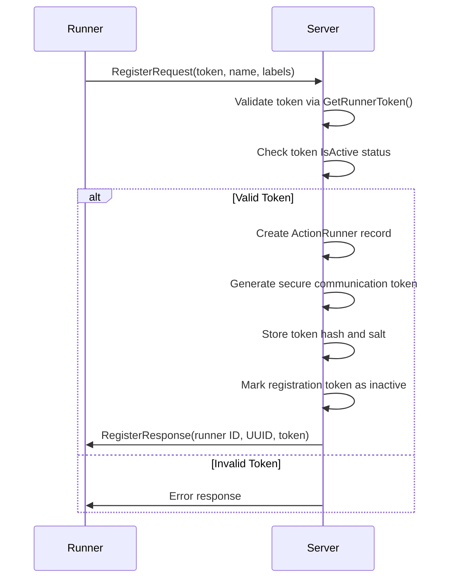
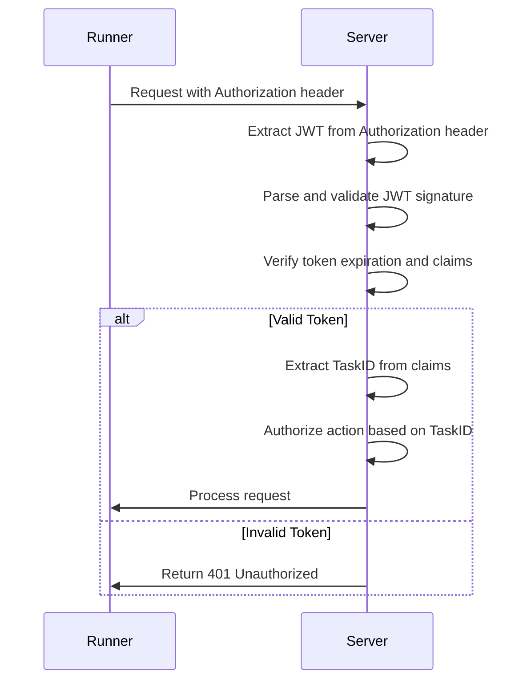
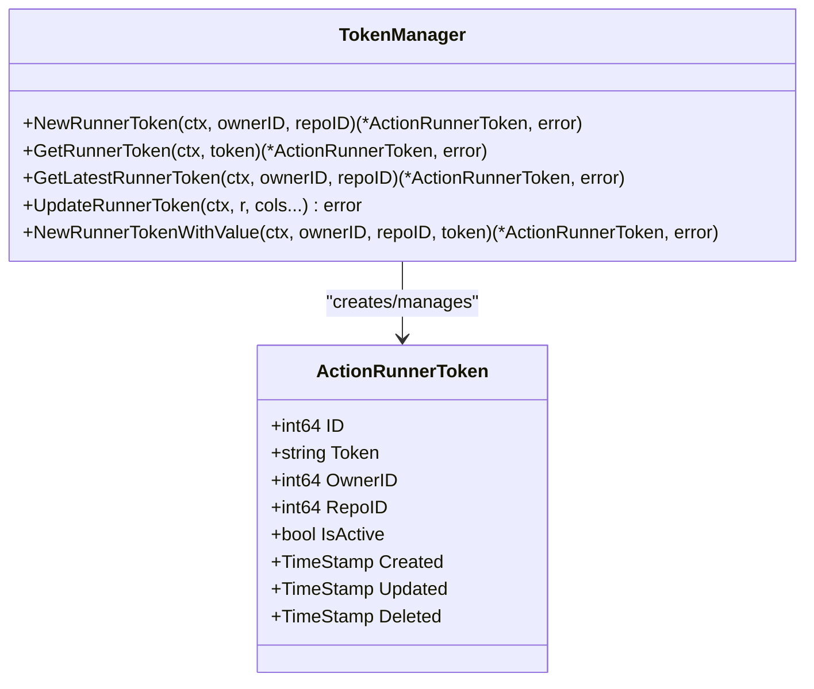
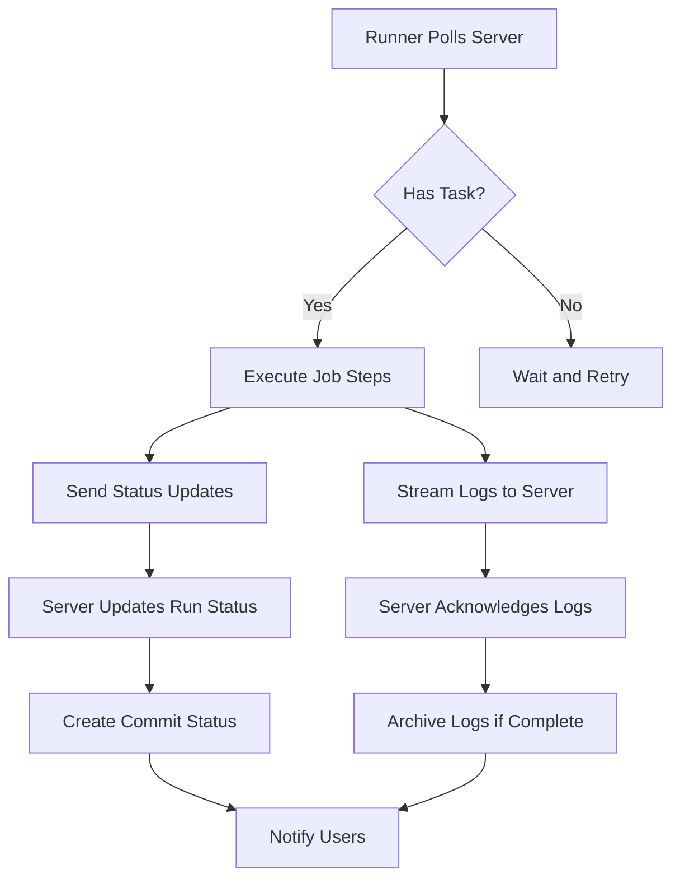
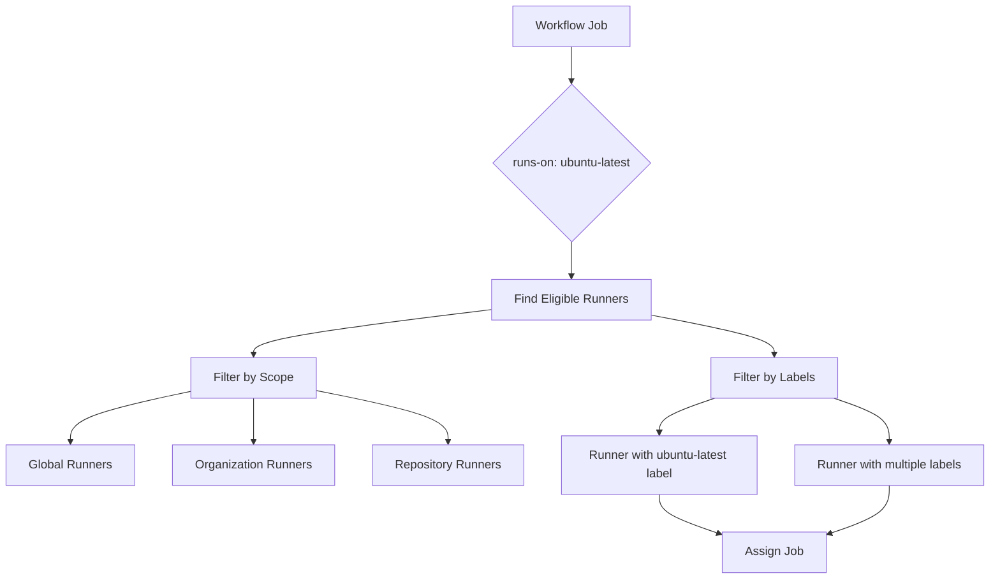

# Runners

<cite>
**Referenced Files in This Document**   
- [runner_token.go](file://models/actions/runner_token.go)
- [auth.go](file://services/actions/auth.go)
- [runner.go](file://models/actions/runner.go)
- [runner.go](file://routers/api/actions/runner/runner.go)
- [run_job.go](file://models/actions/run_job.go)
- [run.go](file://models/actions/run.go)
</cite>

## Table of Contents
1. [Introduction](#introduction)
2. [Runner Registration and Authentication](#runner-registration-and-authentication)
3. [Runner Token System](#runner-token-system)
4. [Communication Between Runners and Server](#communication-between-runners-and-server)
5. [Relationship Between Runners, Repositories, and Organizations](#relationship-between-runners-repositories-and-organizations)
6. [Common Issues and Troubleshooting](#common-issues-and-troubleshooting)
7. [Performance Considerations and Scaling](#performance-considerations-and-scaling)
8. [Conclusion](#conclusion)

## Introduction
Gitea's CI/CD runners provide a flexible and scalable infrastructure for executing continuous integration and deployment workflows. Runners act as agents that poll the Gitea server for jobs, execute them in isolated environments, and report back results and logs. This document details the implementation of runner registration, authentication mechanisms, token management, communication protocols, and their integration within Gitea's organizational structure. It also addresses common operational issues and performance optimization strategies for managing multiple runners.

## Runner Registration and Authentication

### Registration Process
The runner registration process begins when a new runner instance sends a registration request to the Gitea server using a valid runner token. The registration endpoint is implemented as a Connect RPC service in `routers/api/actions/runner/runner.go`. When a runner sends a `RegisterRequest` containing its token, name, version, and labels, the server validates the token through the `GetRunnerToken` function in `models/actions/runner_token.go`.

Upon successful validation, the server creates a new `ActionRunner` record in the database with a unique UUID, stores a salted hash of the communication token, and associates the runner with either a specific repository, organization/user, or globally (system-wide). The runner's metadata, including its labels and ephemeral status, is persisted. After creation, the registration token is marked as used by setting `IsActive` to false, ensuring one-time use for security.

**Diagram sources**
- [runner.go](file://routers/api/actions/runner/runner.go#L30-L85)
- [runner_token.go](file://models/actions/runner_token.go#L50-L75)

**Section sources**
- [runner.go](file://routers/api/actions/runner/runner.go#L30-L85)
- [runner_token.go](file://models/actions/runner_token.go#L50-L75)

### Authentication Flow
After registration, runners authenticate subsequent requests using the generated communication token. The authentication mechanism is implemented in `services/actions/auth.go` using JWT (JSON Web Tokens). When a runner needs to perform an action that requires authorization, such as reporting job results, the server generates a time-limited JWT token via the `CreateAuthorizationToken` function.

This JWT contains claims including the task ID, run ID, job ID, and permissions scope. The token is signed using Gitea's general token signing secret, ensuring its integrity. Runners include this JWT in the `Authorization` header of their HTTP requests. The server parses and validates the token using `ParseAuthorizationToken` and `TokenToTaskID`, verifying the signature and extracting the associated task ID for authorization checks.

**Diagram sources**
- [auth.go](file://services/actions/auth.go#L30-L108)
- [runner.go](file://routers/api/actions/runner/runner.go#L150-L200)

**Section sources**
- [auth.go](file://services/actions/auth.go#L30-L108)

## Runner Token System

### Token Structure and Scopes
The runner token system in Gitea is designed to support multiple scopes: global, organization/user-level, and repository-level. The `ActionRunnerToken` struct in `models/actions/runner_token.go` defines the token model with fields for `OwnerID`, `RepoID`, and `IsActive`. The design principle ensures that only one of `OwnerID` or `RepoID` can be non-zero to prevent ambiguity in token ownership and simplify queries.

Global tokens have both `OwnerID` and `RepoID` set to zero. Organization or user-level tokens have `OwnerID` set to the user/organization ID and `RepoID` set to zero. Repository-level tokens have `RepoID` set to the repository ID and `OwnerID` set to zero. This clear separation allows for precise control over which runners can register within different scopes of the system.

### Token Management and Lifecycle
Token management is handled through several key functions in the `runner_token.go` file. The `NewRunnerToken` function generates a cryptographically secure random string of 40 characters and creates a new active token, automatically invalidating any previous tokens for the same scope (owner or repository). This ensures that only the most recently generated token is valid, enhancing security by preventing the use of old or compromised tokens.

The `GetLatestRunnerToken` function retrieves the most recent active token for a given scope, ordered by ID in descending order. The `UpdateRunnerToken` function allows modification of token properties, such as deactivating a token. The token lifecycle is strictly controlled: tokens are created as active, used exactly once for runner registration, and then automatically deactivated to prevent reuse.

**Diagram sources**
- [runner_token.go](file://models/actions/runner_token.go#L15-L124)

**Section sources**
- [runner_token.go](file://models/actions/runner_token.go#L15-L124)

## Communication Between Runners and Server

### Job Polling Mechanism
Runners communicate with the Gitea server through a polling mechanism implemented using the Connect RPC framework. The primary interaction point is the `FetchTask` method in the `RunnerService` defined in `routers/api/actions/runner/runner.go`. Runners periodically call this endpoint to check for available jobs.

The polling process includes a version-based optimization to reduce unnecessary database queries. Each runner maintains a `tasksVersion` counter. When a runner calls `FetchTask`, it includes its current `tasksVersion`. The server compares this with the latest version in the database for the runner's scope (global, organization, or repository). If the versions match, the server returns immediately with no task, indicating that no new jobs are available. If the versions differ, the server attempts to assign a task to the runner through the `PickTask` function in `services/actions`.

### Status Reporting and Log Upload
Once a runner receives a task, it executes the workflow steps and reports status updates through the `UpdateTask` endpoint. This endpoint allows runners to update the task's state (e.g., running, success, failure) and send output variables. The server processes these updates, creates commit statuses via `CreateCommitStatusForRunJobs`, and notifies relevant parties through the notification system.

Log reporting is handled by the `UpdateLog` endpoint, which implements an efficient streaming protocol. Runners send log chunks with an index indicating the position in the overall log stream. The server acknowledges received logs and only accepts new entries, preventing duplication. When a task completes, the runner signals the end of logs with the `NoMore` flag, triggering log archiving to external storage if configured.

**Diagram sources**
- [runner.go](file://routers/api/actions/runner/runner.go#L100-L250)
- [run_job.go](file://models/actions/run_job.go#L200-L250)
- [run.go](file://models/actions/run.go#L400-L450)

**Section sources**
- [runner.go](file://routers/api/actions/runner/runner.go#L100-L250)

## Relationship Between Runners, Repositories, and Organizations

### Ownership and Scope Hierarchy
Gitea's runner system implements a clear hierarchy of ownership and scope that determines which workflows a runner can execute. The `ActionRunner` model in `models/actions/runner.go` defines three distinct scopes through the `OwnerID` and `RepoID` fields, following the same pattern as runner tokens.

A runner's scope determines its visibility and eligibility for jobs. Global runners (both IDs zero) can execute jobs from any repository in the system. Organization or user-level runners (non-zero `OwnerID`, zero `RepoID`) can execute jobs from any repository owned by that organization or user. Repository-level runners (zero `OwnerID`, non-zero `RepoID`) are restricted to jobs from that specific repository only.

### Runner Selection and Job Assignment
The job assignment process considers both the runner's scope and its labels. When a workflow job specifies `runs-on` labels, the `PickTask` function identifies eligible runners whose `AgentLabels` contain all the required labels. The `CanMatchLabels` method in the `ActionRunner` struct performs this matching by treating the runner's labels as a set and checking if it contains all labels specified in the job.

The `FindRunnerOptions` struct provides filtering capabilities for querying runners based on various criteria, including online status, name, and availability. The `WithAvailable` flag allows queries to include not only runners directly belonging to a scope but also those that can be used by it (e.g., organization runners can use global runners).

**Diagram sources**
- [runner.go](file://models/actions/runner.go#L150-L200)
- [runner.go](file://routers/api/actions/runner/runner.go#L100-L150)

**Section sources**
- [runner.go](file://models/actions/runner.go#L150-L200)

## Common Issues and Troubleshooting

### Connectivity Problems
Runner connectivity issues typically manifest as runners showing as offline in the Gitea interface. This occurs when the runner fails to send periodic heartbeat signals to update its `LastOnline` timestamp. The server considers a runner offline if the time since its last online signal exceeds `RunnerOfflineTime` (1 minute). Common causes include network interruptions, firewall restrictions on the RPC endpoint, or the runner process crashing.

To troubleshoot connectivity issues, administrators should verify that the runner can reach the Gitea server's RPC endpoint (typically on port 3000), check firewall rules, and examine runner logs for connection errors. The `Declare` endpoint allows runners to update their metadata and re-establish connection, which can resolve temporary connectivity problems.

### Token Expiration and Management
Runner registration tokens are designed for one-time use and are automatically invalidated after a successful registration. The most common token-related issue is attempting to reuse an expired token, which results in a clear error message. Administrators should generate new tokens when registering additional runners.

For communication tokens, the primary concern is their JWT-based authorization tokens expiring. These tokens have a lifespan of 1 hour plus the `EndlessTaskTimeout` setting. If a job runs longer than this duration, it may encounter authentication failures when reporting results. This can be mitigated by adjusting the timeout settings or ensuring jobs complete within the token validity period.

### Resource Allocation Challenges
Resource allocation issues arise when runners are overwhelmed with jobs or when job concurrency settings create bottlenecks. The `RawConcurrency` field in `ActionRunJob` and `ActionRun` allows workflows to specify concurrency limits, but misconfiguration can lead to jobs being perpetually in "waiting" or "blocked" states.

The system automatically cancels previous jobs when new ones are triggered for the same workflow, reference, and event through the `CancelPreviousJobs` function. However, if concurrency groups are misconfigured, multiple jobs may compete for the same resources. Monitoring job queues and adjusting concurrency settings based on infrastructure capacity can prevent resource starvation.

**Section sources**
- [runner.go](file://models/actions/runner.go#L20-L40)
- [runner.go](file://routers/api/actions/runner/runner.go#L30-L85)
- [auth.go](file://services/actions/auth.go#L30-L50)
- [run_job.go](file://models/actions/run_job.go#L250-L270)
- [run.go](file://models/actions/run.go#L350-L400)

## Performance Considerations and Scaling

### Managing Multiple Runners
Efficient management of multiple runners requires careful consideration of labeling strategies, scope assignment, and load distribution. Using descriptive labels allows for fine-grained control over job routing, enabling specialized runners (e.g., with specific hardware or software) to handle appropriate workloads.

The database indexing strategy on `ActionRunner` fields (`last_online`, `owner_id`, `repo_id`) supports efficient querying of online runners within specific scopes. Regular maintenance tasks, such as removing runners without valid owners or repositories through `FixRunnersWithoutBelongingOwner` and `FixRunnersWithoutBelongingRepo`, help maintain database integrity and query performance.

### Scaling CI/CD Capacity
Scaling Gitea's CI/CD capacity involves both horizontal and vertical scaling strategies. Horizontal scaling is achieved by adding more runner instances, which can be automated using infrastructure-as-code tools. Ephemeral runners, indicated by the `Ephemeral` flag, can be provisioned on-demand and automatically destroyed after completing their job, providing elastic scaling capabilities.

Vertical scaling involves optimizing individual runner performance through resource allocation (CPU, memory), network bandwidth, and storage I/O. The task versioning system minimizes unnecessary polling by allowing runners to quickly determine if new jobs are available without querying the database for job details.

Caching strategies, particularly for workflow parsing and repository metadata, can significantly reduce the load on the Gitea server. The separation of log storage from the main database, controlled by the `LogInStorage` flag, allows logs to be archived to external systems, preventing database bloat and maintaining performance as the volume of CI/CD activity grows.

**Section sources**
- [runner.go](file://models/actions/runner.go#L200-L300)
- [runner.go](file://routers/api/actions/runner/runner.go#L100-L150)
- [run_job.go](file://models/actions/run_job.go#L200-L250)

## Conclusion
Gitea's CI/CD runner system provides a robust and secure infrastructure for executing continuous integration and deployment workflows. The implementation features a well-designed token system for secure registration, JWT-based authentication for ongoing communication, and an efficient polling mechanism for job assignment. The clear hierarchy of runner scopes enables flexible deployment models from global shared runners to repository-specific agents. By understanding the relationships between runners, repositories, and organizations, and addressing common issues like connectivity problems and token management, administrators can effectively operate and scale their CI/CD infrastructure. Performance optimization through proper labeling, resource allocation, and scaling strategies ensures that Gitea can handle growing development workloads efficiently.