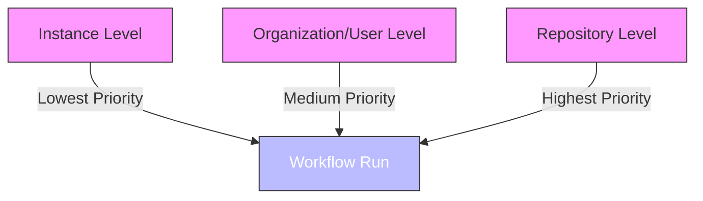
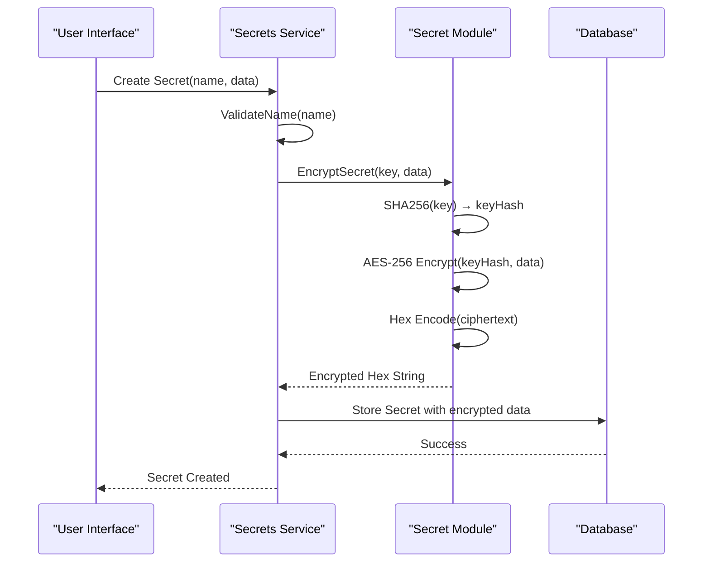
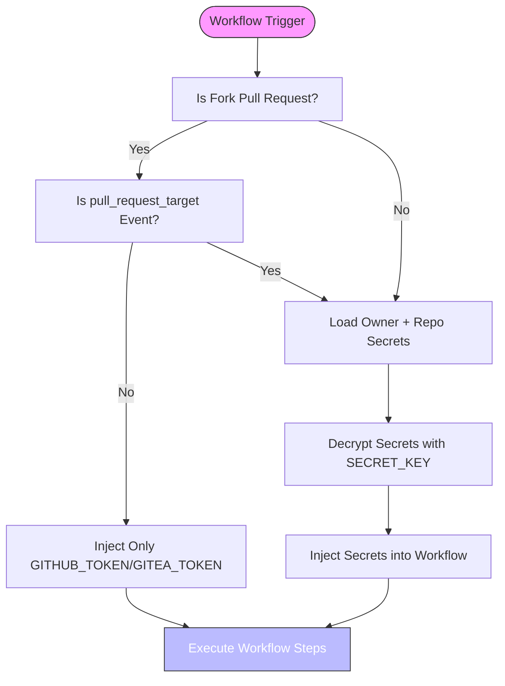
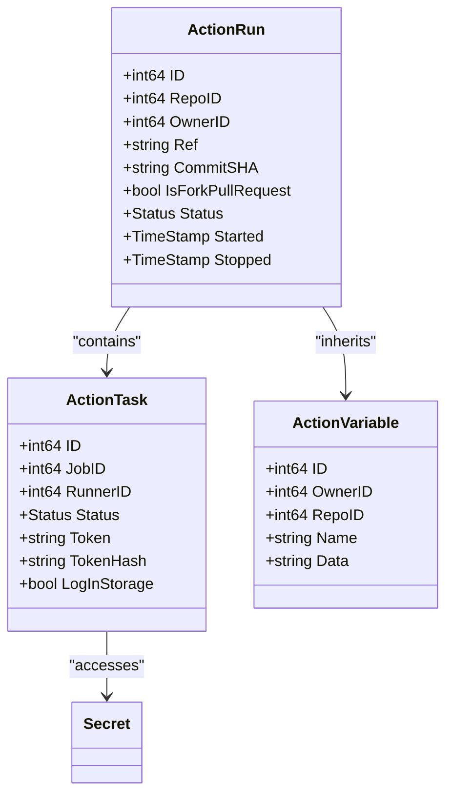

# Secrets Management

<cite>
**Referenced Files in This Document**   
- [models/actions/variable.go](file://models/actions/variable.go)
- [services/actions/variables.go](file://services/actions/variables.go)
- [models/secret/secret.go](file://models/secret/secret.go)
- [services/secrets/secrets.go](file://services/secrets/secrets.go)
- [modules/secret/secret.go](file://modules/secret/secret.go)
- [models/actions/run.go](file://models/actions/run.go)
- [models/actions/task.go](file://models/actions/task.go)
</cite>

## Table of Contents
1. [Introduction](#introduction)
2. [Secrets vs Variables](#secrets-vs-variables)
3. [Hierarchical Scope Levels](#hierarchical-scope-levels)
4. [Encryption and Storage](#encryption-and-storage)
5. [Access Control and Injection](#access-control-and-injection)
6. [Workflow Execution Context](#workflow-execution-context)
7. [Security Considerations](#security-considerations)
8. [Best Practices](#best-practices)
9. [Troubleshooting](#troubleshooting)
10. [Conclusion](#conclusion)

## Introduction
Gitea's secrets management system provides a secure framework for handling sensitive data in CI/CD pipelines. The system differentiates between variables (non-sensitive configuration) and secrets (sensitive data), implementing strict access controls and encryption mechanisms. Secrets can be defined at repository, organization, and instance levels, with inheritance and precedence rules governing their availability in workflow runs. This document details the implementation of secret storage, encryption, access control, and injection mechanisms across the Gitea codebase.

## Secrets vs Variables

Gitea distinguishes between two types of runtime configuration: variables and secrets. Variables are non-sensitive values used for configuration, while secrets are sensitive data requiring encryption and restricted access.

```mermaid
classDiagram
class ActionVariable {
+int64 ID
+int64 OwnerID
+int64 RepoID
+string Name
+string Data
+string Description
+TimeStamp CreatedUnix
+TimeStamp UpdatedUnix
}
class Secret {
+int64 ID
+int64 OwnerID
+int64 RepoID
+string Name
+string Data (encrypted)
+string Description
+TimeStamp CreatedUnix
}
note right of ActionVariable
Plain text storage
No encryption
Used for non-sensitive configuration
end note
note left of Secret
Encrypted storage
AES-256 encryption
Used for sensitive data
end note
```

**Diagram sources**
- [models/actions/variable.go](file://models/actions/variable.go#L15-L45)
- [models/secret/secret.go](file://models/secret/secret.go#L30-L50)

The `ActionVariable` struct stores non-sensitive data in plain text, while the `Secret` struct stores sensitive data in encrypted form. Variables are managed through the `actions` package, while secrets are handled by the dedicated `secrets` service with additional validation and encryption layers.

**Section sources**
- [models/actions/variable.go](file://models/actions/variable.go#L15-L185)
- [models/secret/secret.go](file://models/secret/secret.go#L30-L203)

## Hierarchical Scope Levels

Secrets and variables in Gitea follow a hierarchical scope model with three distinct levels: repository, organization/user, and instance. Each level has specific ownership rules and precedence in the inheritance chain.



**Diagram sources**
- [models/actions/variable.go](file://models/actions/variable.go#L20-L35)
- [models/secret/secret.go](file://models/secret/secret.go#L35-L50)

The scope hierarchy follows strict rules to prevent ambiguity:
- Repository-level secrets have `OwnerID = 0` and `RepoID = repo_id`
- Organization/user-level secrets have `OwnerID = owner_id` and `RepoID = 0`
- Instance-level variables have both `OwnerID = 0` and `RepoID = 0`
- It is invalid to have both `OwnerID` and `RepoID` non-zero

This design prevents confusion when querying secrets by owner, ensuring that repository-level secrets are not accidentally included in organization-level queries.

**Section sources**
- [models/actions/variable.go](file://models/actions/variable.go#L20-L35)
- [models/secret/secret.go](file://models/secret/secret.go#L35-L50)

## Encryption and Storage

Gitea implements AES-256 encryption for secret storage using a system-wide secret key. The encryption process converts plaintext secrets into encrypted hex strings stored in the database.



**Diagram sources**
- [services/secrets/secrets.go](file://services/secrets/secrets.go#L10-L35)
- [modules/secret/secret.go](file://modules/secret/secret.go#L40-L80)

The encryption process uses the following steps:
1. The system's `SECRET_KEY` is hashed using SHA-256 to create a 256-bit key
2. AES-256 in CFB mode encrypts the plaintext secret data
3. The ciphertext is base64-encoded and then hex-encoded for storage
4. The resulting hex string is stored in the `data` field of the `secret` table

Decryption reverses this process, with additional error handling to detect incorrect keys or corrupted data. The system validates that neither `OwnerID` nor `RepoID` can be zero simultaneously, preventing the creation of global secrets for security reasons.

**Section sources**
- [modules/secret/secret.go](file://modules/secret/secret.go#L40-L80)
- [models/secret/secret.go](file://models/secret/secret.go#L80-L120)

## Access Control and Injection

Secret access is tightly controlled based on the workflow execution context, with special handling for pull requests from forked repositories to prevent secret leakage.



**Diagram sources**
- [models/secret/secret.go](file://models/secret/secret.go#L150-L180)
- [models/actions/task.go](file://models/actions/task.go#L250-L300)

Secret injection follows these security principles:
- Secrets are only injected into workflows triggered by trusted sources
- Forked repository pull requests cannot access secrets unless using `pull_request_target` event
- The `GITHUB_TOKEN` and `GITEA_TOKEN` are automatically generated for all workflows
- Organization and repository secrets are merged with repository secrets taking precedence
- Secrets are decrypted at runtime using the system's `SECRET_KEY`

The `GetSecretsOfTask` function orchestrates this process, first checking the workflow context and then retrieving and decrypting the appropriate secrets. For security reasons, the system logs errors if decryption fails, which may indicate an incorrect `SECRET_KEY`.

**Section sources**
- [models/secret/secret.go](file://models/secret/secret.go#L150-L200)
- [models/actions/task.go](file://models/actions/task.go#L250-L300)

## Workflow Execution Context

The workflow execution context determines which secrets are available and how variables are resolved during pipeline execution. The context includes information about the triggering event, repository, and user permissions.



**Diagram sources**
- [models/actions/run.go](file://models/actions/run.go#L15-L50)
- [models/actions/task.go](file://models/actions/task.go#L15-L40)
- [models/actions/variable.go](file://models/actions/variable.go#L15-L45)

The execution context is established when a workflow is triggered by a webhook event. The `ActionRun` object captures the initial context, including the repository, reference, and triggering user. When a job is scheduled, an `ActionTask` is created with a unique token for runner authentication. Variables are resolved through the `GetVariablesOfRun` function, which merges variables from all applicable levels with repository-level variables taking precedence.

**Section sources**
- [models/actions/run.go](file://models/actions/run.go#L15-L458)
- [models/actions/task.go](file://models/actions/task.go#L15-L508)
- [models/actions/variable.go](file://models/actions/variable.go#L150-L185)

## Security Considerations

Gitea's secrets management system addresses several critical security concerns, including secret leakage, permission errors, and cryptographic vulnerabilities.

### Secret Leakage Prevention
The system implements multiple safeguards against secret leakage:
- Forked repository pull requests cannot access secrets by default
- Only `pull_request_target` events can access secrets in forked repository contexts
- Secrets are encrypted at rest using AES-256
- The `SECRET_KEY` must be kept confidential to prevent decryption of stored secrets

### Permission Management
Access to secrets is controlled through the following mechanisms:
- Repository owners can manage repository-level secrets
- Organization owners can manage organization-level secrets
- Instance administrators can manage instance-level variables
- Users must have appropriate permissions to create, update, or delete secrets

### Rotation Policies
While the current implementation does not include automated secret rotation, best practices recommend:
- Regularly rotating high-value secrets
- Using short-lived tokens when possible
- Monitoring secret usage and access patterns
- Implementing audit logging for secret operations

The system provides functions to update existing secrets, allowing for manual rotation processes. The `UpdateSecret` function handles re-encryption with the current `SECRET_KEY`, ensuring that rotated secrets maintain the same security properties.

**Section sources**
- [models/secret/secret.go](file://models/secret/secret.go#L150-L200)
- [services/secrets/secrets.go](file://services/secrets/secrets.go#L10-L80)
- [models/actions/variable.go](file://models/actions/variable.go#L150-L185)

## Best Practices

To ensure secure management of secrets in Gitea's CI/CD pipelines, follow these best practices:

### Secret Naming and Organization
- Use descriptive names that indicate the secret's purpose
- Follow consistent naming conventions across your organization
- Avoid including sensitive information in secret names
- Use prefixes to group related secrets (e.g., `AWS_`, `DATABASE_`)

### Access Control
- Grant secret management permissions only to trusted users
- Use organization-level secrets for shared credentials
- Use repository-level secrets for repository-specific credentials
- Regularly review and audit secret access permissions

### Security Hygiene
- Rotate secrets regularly, especially after personnel changes
- Use the principle of least privilege when defining secrets
- Never commit secrets to version control
- Use environment-specific secrets for development, staging, and production

### Monitoring and Auditing
- Monitor logs for secret decryption errors, which may indicate `SECRET_KEY` issues
- Track secret creation, modification, and deletion events
- Set up alerts for suspicious secret access patterns
- Regularly review which workflows have access to which secrets

These practices help maintain the security and integrity of your CI/CD pipelines while ensuring that sensitive data remains protected.

**Section sources**
- [services/secrets/secrets.go](file://services/secrets/secrets.go#L10-L80)
- [models/secret/secret.go](file://models/secret/secret.go#L80-L120)
- [modules/secret/secret.go](file://modules/secret/secret.go#L40-L80)

## Troubleshooting

Common issues with Gitea's secrets management system and their solutions:

### Secret Decryption Errors
**Symptom**: "Unable to decrypt Actions secret" errors in logs
**Cause**: The `SECRET_KEY` in app.ini does not match the key used to encrypt the secrets
**Solution**: 
1. Verify the `SECRET_KEY` in your configuration
2. If the key has changed, secrets encrypted with the previous key cannot be recovered
3. You must recreate all secrets with the new key

### Permission Errors
**Symptom**: "Permission denied" when creating or updating secrets
**Cause**: Insufficient permissions for the current user
**Solution**:
1. Verify the user has owner or admin privileges for the repository/organization
2. Check that the user has the appropriate unit permissions enabled
3. Ensure the user is not restricted by organization policies

### Missing Secrets in Workflows
**Symptom**: Expected secrets are not available in workflow runs
**Cause**: 
- Forked repository pull request context
- Incorrect secret scope (organization vs repository)
- Typographical errors in secret names
**Solution**:
1. Verify the workflow is not running in a forked repository context
2. Check that secrets are defined at the appropriate level
3. Validate secret names match exactly (case-sensitive)

### Database Consistency Issues
**Symptom**: Inconsistent secret behavior or missing secrets
**Cause**: Database records with invalid `OwnerID`/`RepoID` combinations
**Solution**:
1. Run database consistency checks
2. Use the `UpdateWrongRepoLevelSecrets` function to correct invalid records
3. Verify database integrity after migrations

**Section sources**
- [models/secret/secret.go](file://models/secret/secret.go#L150-L200)
- [services/secrets/secrets.go](file://services/secrets/secrets.go#L10-L80)
- [modules/secret/secret.go](file://modules/secret/secret.go#L40-L80)

## Conclusion
Gitea's secrets management system provides a robust framework for securely handling sensitive data in CI/CD pipelines. By differentiating between variables and secrets, implementing strong encryption, and enforcing strict access controls, the system protects sensitive information while providing flexibility for various deployment scenarios. The hierarchical scope model allows for appropriate secret sharing across repositories, organizations, and instances, while the context-aware injection mechanism prevents secret leakage in untrusted environments. Administrators should follow security best practices, including regular secret rotation and access control reviews, to maintain the integrity of their CI/CD pipelines. The system's comprehensive error handling and logging capabilities facilitate troubleshooting when issues arise, ensuring that security incidents can be quickly identified and addressed.