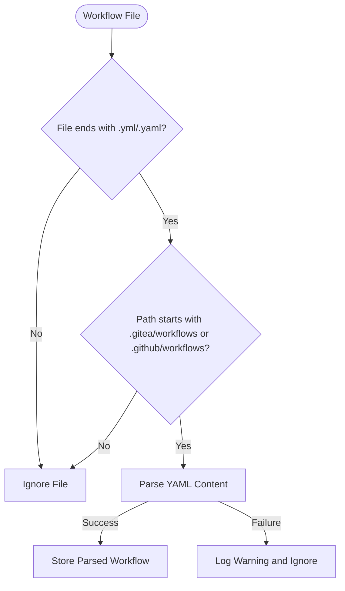
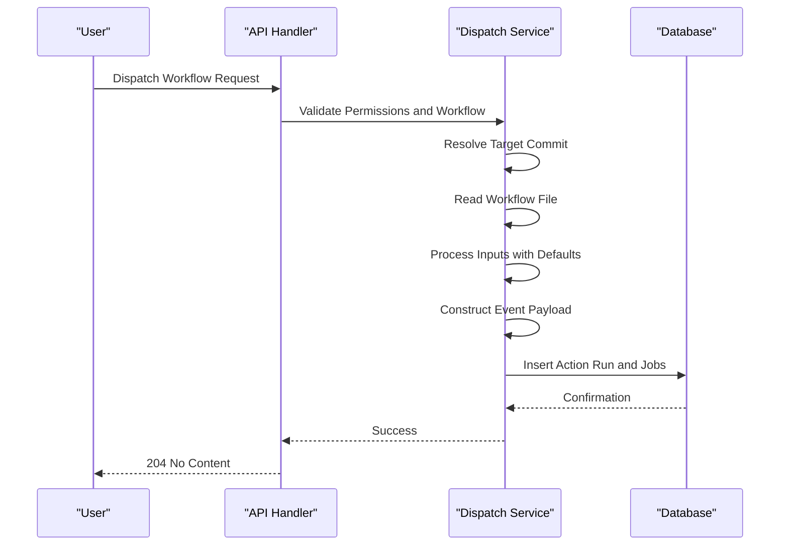
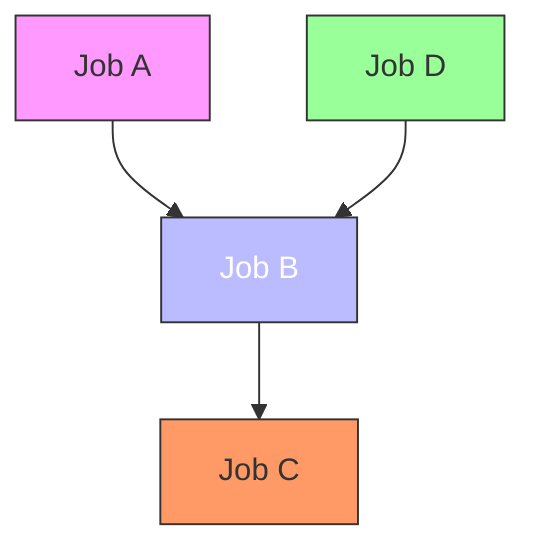
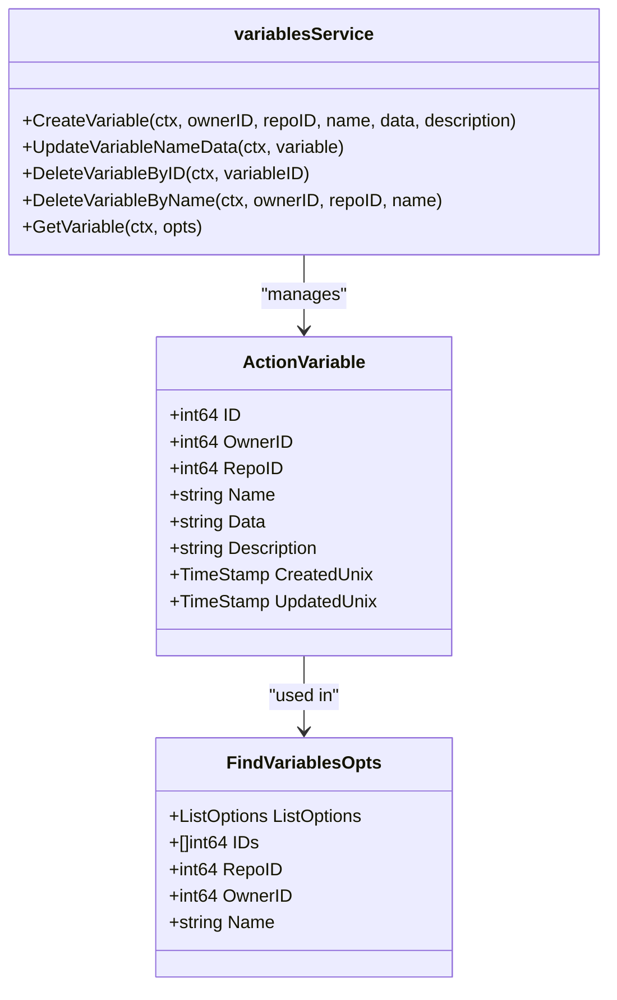

# Workflows

<cite>
**Referenced Files in This Document**   
- [workflow.go](file://services/actions/workflow.go)
- [workflows.go](file://modules/actions/workflows.go)
- [run.go](file://services/actions/run.go)
- [variable.go](file://models/actions/variable.go)
- [variables.go](file://services/actions/variables.go)
</cite>

## Table of Contents
1. [Introduction](#introduction)
2. [Workflow Configuration and Syntax](#workflow-configuration-and-syntax)
3. [Workflow Triggers and Event Detection](#workflow-triggers-and-event-detection)
4. [Job Dependencies and Execution Planning](#job-dependencies-and-execution-planning)
5. [Variables and Secrets Injection](#variables-and-secrets-injection)
6. [Common Issues and Troubleshooting](#common-issues-and-troubleshooting)
7. [Performance Considerations and Caching](#performance-considerations-and-caching)

## Introduction
Gitea's workflow configuration system enables automated CI/CD pipelines through YAML-based definitions stored in repositories. Workflows are defined in `.gitea/workflows` or `.github/workflows` directories and are triggered by repository events such as pushes, pull requests, or manual dispatch. The system parses workflow files, validates their structure, and plans execution based on triggers, dependencies, and concurrency settings. This document details the implementation of workflow definitions, execution context, variable injection, and common operational considerations.

## Workflow Configuration and Syntax
Workflow definitions in Gitea follow YAML syntax and are stored in repository directories `.gitea/workflows` or `.github/workflows`. The system identifies workflow files by their `.yml` or `.yaml` extensions within these directories. Each workflow file contains a configuration that specifies triggers (`on`), jobs, steps, and other execution parameters. The parsing process uses the `jobparser` package to unmarshal YAML content into structured data, validating syntax during unmarshaling. Invalid workflow files are logged and ignored during detection.

**Diagram sources**
- [workflows.go](file://modules/actions/workflows.go#L20-L30)

**Section sources**
- [workflows.go](file://modules/actions/workflows.go#L20-L85)

## Workflow Triggers and Event Detection
Workflows are triggered by repository events such as push, pull request, or manual dispatch. The `DetectWorkflows` function in `modules/actions/workflows.go` scans the repository at a specific commit to identify applicable workflows. It reads all workflow files, extracts trigger events from the `on` field, and matches them against the triggering event type and payload. For `workflow_dispatch` events, the system validates inputs against defined parameters and constructs an event payload containing workflow metadata, inputs, and sender information.

The dispatch process begins with permission and existence checks, ensuring the workflow exists and is not disabled. The target commit is resolved from the provided reference (branch or tag), and the workflow file is retrieved from the commit tree. Inputs are processed either from form data or JSON payload, with default values applied for missing inputs. The constructed event payload is serialized to JSON and stored in the action run record.

**Diagram sources**
- [workflow.go](file://services/actions/workflow.go#L50-L172)

**Section sources**
- [workflow.go](file://services/actions/workflow.go#L50-L172)
- [actions.go](file://routers/api/v1/repo/action.go#L1018-L1050)

## Job Dependencies and Execution Planning
Job dependencies in Gitea workflows are defined using the `needs` keyword, establishing execution order between jobs. The system evaluates dependencies during job emission, determining whether a job can proceed based on the status of its dependent jobs. A job with dependencies remains in `Blocked` status until all dependencies are completed. If all dependent jobs succeed, the dependent job transitions to `Waiting` status; otherwise, it may be skipped based on its `if` condition.

The `jobStatusResolver` analyzes job dependencies and updates job statuses accordingly. It maintains a mapping of job IDs to their dependencies and current statuses, resolving status changes in iterations until no further updates occur. Concurrency settings are also evaluated during job planning, allowing workflows to limit concurrent runs by group name. The concurrency configuration is parsed and stored in the action run record, enabling runners to enforce concurrency policies.

**Diagram sources**
- [job_emitter.go](file://services/actions/job_emitter.go#L243-L323)
- [concurrency.go](file://services/actions/concurrency.go#L34-L63)

**Section sources**
- [job_emitter.go](file://services/actions/job_emitter.go#L243-L323)
- [concurrency.go](file://services/actions/concurrency.go#L34-L63)

## Variables and Secrets Injection
Gitea supports variables at multiple levels: global, organization/user, and repository. Variables are stored in the database with precedence order: repository > organization/user > global. When a workflow run is prepared, variables from all applicable levels are collected and merged into a single map, with higher-level variables overriding lower-level ones. Variable names are case-insensitive and stored in uppercase format.

The `GetVariablesOfRun` function retrieves variables from the database based on the run's repository and owner, combining them into a single map. Variables are injected into the workflow execution context, making them available to jobs and steps. The system enforces length limits on variable data (65,536 characters) and descriptions (4,096 characters), truncating values as necessary. Variable operations such as create, update, and delete are handled through service functions that validate input and interact with the database.

**Diagram sources**
- [variable.go](file://models/actions/variable.go#L41-L90)
- [variables.go](file://services/actions/variables.go#L50-L62)

**Section sources**
- [variable.go](file://models/actions/variable.go#L41-L184)
- [variables.go](file://services/actions/variables.go#L50-L62)

## Common Issues and Troubleshooting
Common issues in Gitea workflows include syntax errors, permission failures, and environment setup problems. Syntax errors in workflow YAML files prevent parsing and cause the workflow to be ignored, with warnings logged in the server logs. Permission failures occur when users lack write access to the repository or when workflows are disabled in repository settings. Environment setup problems may arise from missing runners, incorrect runner labels, or network connectivity issues.

To troubleshoot workflow issues, administrators should check server logs for parsing errors, verify repository permissions, and ensure runners are registered and online. For `workflow_dispatch` events, validate that inputs match the defined schema and that default values are correctly specified. When jobs fail due to dependencies, verify that all required jobs are defined and that their names match exactly in the `needs` field.

## Performance Considerations and Caching
Workflow execution performance can be optimized through efficient parsing, database indexing, and caching strategies. The system minimizes parsing overhead by reading workflow files only when necessary, such as during event detection or manual dispatch. Database queries for variables and workflow configurations are optimized with appropriate indexing on owner, repository, and name fields.

Caching strategies include storing parsed workflow structures in memory during request processing and leveraging database connection pooling for efficient data access. For repositories with numerous workflows, the system uses recursive directory traversal to efficiently enumerate workflow files. Concurrency evaluation is performed during job planning to minimize runtime overhead, with results stored in the action run record for reference by runners.