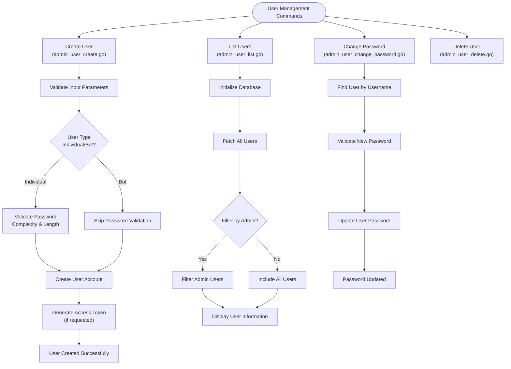
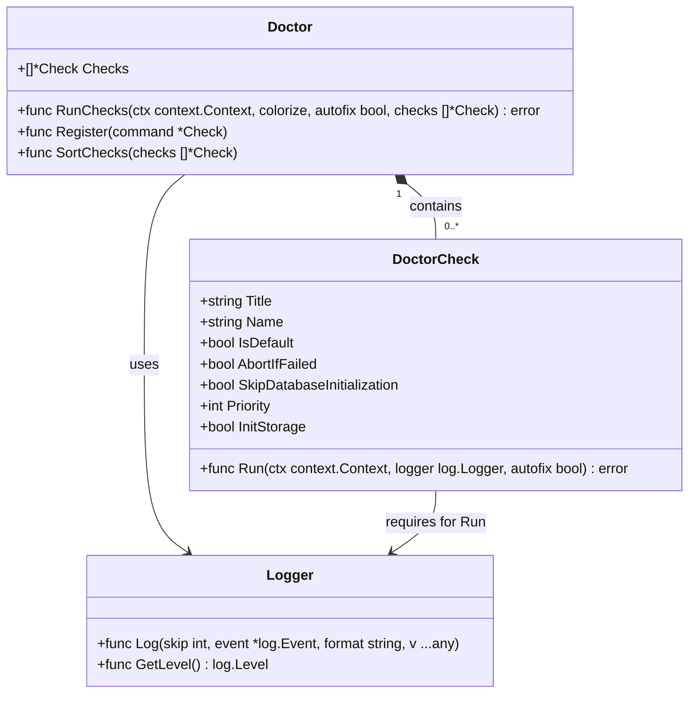

# Administration

<cite>
**Referenced Files in This Document**   
- [cmd/admin.go](file://cmd/admin.go)
- [cmd/admin_user.go](file://cmd/admin_user.go)
- [cmd/admin_user_create.go](file://cmd/admin_user_create.go)
- [cmd/admin_user_list.go](file://cmd/admin_user_list.go)
- [cmd/admin_user_change_password.go](file://cmd/admin_user_change_password.go)
- [cmd/admin_regenerate.go](file://cmd/admin_regenerate.go)
- [services/doctor/doctor.go](file://services/doctor/doctor.go)
- [services/doctor/dbconsistency.go](file://services/doctor/dbconsistency.go)
- [services/doctor/paths.go](file://services/doctor/paths.go)
- [services/doctor/storage.go](file://services/doctor/storage.go)
- [services/doctor/repository.go](file://services/doctor/repository.go)
</cite>

## Table of Contents
1. [Introduction](#introduction)
2. [Core Administrative Commands](#core-administrative-commands)
3. [User Management](#user-management)
4. [System Diagnostics and Repair](#system-diagnostics-and-repair)
5. [Database and Storage Maintenance](#database-and-storage-maintenance)
6. [Practical Administration Examples](#practical-administration-examples)
7. [Performance Considerations](#performance-considerations)
8. [Troubleshooting Common Issues](#troubleshooting-common-issues)
9. [Best Practices for Proactive Maintenance](#best-practices-for-proactive-maintenance)

## Introduction
Gitea provides a comprehensive suite of administrative tools designed to monitor, maintain, and optimize the system's health and performance. These tools enable administrators to perform critical operations ranging from user and repository management to system diagnostics and database maintenance. The administrative capabilities are primarily accessed through command-line interfaces defined in `cmd/admin.go` and diagnostic utilities in the `services/doctor` package. This documentation covers the implementation details, relationships between components, and practical usage of these administrative features, providing guidance for effective system management.

## Core Administrative Commands
The administrative command structure in Gitea is organized around the `CmdAdmin` command in `cmd/admin.go`, which serves as the entry point for various administrative operations. This command provides subcommands for user management, repository synchronization, configuration regeneration, external authentication management, and mass email distribution. The command hierarchy follows a modular design, with specialized subcommands handling specific administrative domains. The implementation leverages the urfave/cli framework to provide a consistent command-line interface with proper flag handling and argument validation. Each administrative command initializes the database connection and logging system before executing its specific functionality, ensuring that operations have access to the necessary system resources and can properly report their status.

**Section sources**
- [cmd/admin.go](file://cmd/admin.go#L1-L167)

## User Management
User management in Gitea is implemented through a series of commands under the `subcmdUser` command group. These commands provide comprehensive functionality for creating, listing, modifying, and deleting user accounts. The user creation command (`admin_user_create.go`) supports various options including username, email, password (either specified or randomly generated), administrative privileges, and access token generation. The implementation includes validation for user types (individual or bot) and enforces password complexity requirements. User listing functionality provides detailed information about all users or filtered subsets (such as administrators only), including two-factor authentication status. Password changes are handled through a dedicated command that validates new passwords against configured complexity rules and can enforce password change requirements on next login.

**Diagram sources**
- [cmd/admin_user_create.go](file://cmd/admin_user_create.go#L1-L241)
- [cmd/admin_user_list.go](file://cmd/admin_user_list.go#L1-L58)
- [cmd/admin_user_change_password.go](file://cmd/admin_user_change_password.go#L1-L78)

**Section sources**
- [cmd/admin_user.go](file://cmd/admin_user.go#L1-L21)
- [cmd/admin_user_create.go](file://cmd/admin_user_create.go#L1-L241)
- [cmd/admin_user_list.go](file://cmd/admin_user_list.go#L1-L58)
- [cmd/admin_user_change_password.go](file://cmd/admin_user_change_password.go#L1-L78)

## System Diagnostics and Repair
The diagnostic capabilities in Gitea are centered around the `services/doctor` package, which provides a framework for system health checks and automated repairs. The doctor system is designed as a collection of independent checks that can be executed individually or as a comprehensive suite. Each check is registered with the system and can be configured with properties such as priority, whether it should abort execution if failed, and whether it requires database initialization. The diagnostic framework supports both detection and automatic repair (when the autofix option is enabled), making it a powerful tool for maintaining system integrity. The checks are executed in priority order, with critical infrastructure checks running first to ensure the system is in a stable state before more complex validations are performed.

**Diagram sources**
- [services/doctor/doctor.go](file://services/doctor/doctor.go#L1-L138)

**Section sources**
- [services/doctor/doctor.go](file://services/doctor/doctor.go#L1-L138)

## Database and Storage Maintenance
Gitea provides specialized tools for maintaining database consistency and storage integrity. The database consistency check (`dbconsistency.go`) identifies and repairs various types of data inconsistencies, including orphaned records, missing references, and invalid data states. This check examines relationships between entities across multiple models, ensuring referential integrity is maintained throughout the system. For storage maintenance, the system provides checks for various storage types including attachments, LFS files, avatars, repository archives, and package blobs. These checks identify "orphaned" files that exist in storage but have no corresponding database records, which can occur due to incomplete operations or system errors. The maintenance tools can operate in detection mode (reporting issues) or repair mode (automatically removing orphaned files when autofix is enabled).

```mermaid
flowchart TD
DBMaintenance["Database Maintenance\n(dbconsistency.go)"] --> IdentifyOrphans["Identify Orphaned Records"]
IdentifyOrphans --> CheckLabels["Orphaned Labels"]
IdentifyOrphans --> CheckIssues["Orphaned Issues"]
IdentifyOrphans --> CheckReleases["Orphaned Releases"]
IdentifyOrphans --> CheckPulls["Orphaned Pull Requests"]
IdentifyOrphans --> CheckAttachments["Orphaned Attachments"]
IdentifyOrphans --> CheckCollaborations["Orphaned Collaborations"]
IdentifyOrphans --> CheckAccess["Orphaned Access Entries"]
StorageMaintenance["Storage Maintenance\n(storage.go)"] --> CheckStorageTypes["Check All Storage Types"]
CheckStorageTypes --> CheckAttachments["Attachments Storage"]
CheckStorageTypes --> CheckLFS["LFS Files Storage"]
CheckStorageTypes --> CheckAvatars["User Avatars Storage"]
CheckStorageTypes --> CheckRepoAvatars["Repository Avatars Storage"]
CheckStorageTypes --> CheckArchives["Repository Archives Storage"]
CheckStorageTypes --> CheckPackages["Package Blobs Storage"]
IdentifyOrphans --> |autofix enabled| RepairDB["Repair Database\nDelete Orphaned Records"]
CheckStorageTypes --> |autofix enabled| RepairStorage["Repair Storage\nDelete Orphaned Files"]
RepairDB --> ReportResults["Report Results"]
RepairStorage --> ReportResults
IdentifyOrphans --> |autofix disabled| ReportIssues["Report Issues Only"]
CheckStorageTypes --> |autofix disabled| ReportIssues
```

**Diagram sources**
- [services/doctor/dbconsistency.go](file://services/doctor/dbconsistency.go#L1-L274)
- [services/doctor/storage.go](file://services/doctor/storage.go#L1-L270)

**Section sources**
- [services/doctor/dbconsistency.go](file://services/doctor/dbconsistency.go#L1-L274)
- [services/doctor/storage.go](file://services/doctor/storage.go#L1-L270)
- [services/doctor/repository.go](file://services/doctor/repository.go#L1-L78)

## Practical Administration Examples
Administrative operations in Gitea follow a consistent pattern of command execution with appropriate flags and parameters. For user management, administrators can create new users with specific attributes, list existing users with filtering options, or modify user properties such as passwords. System diagnostics can be run selectively or as a comprehensive suite, with the option to automatically repair identified issues. Repository maintenance operations, such as synchronizing releases with tags, ensure that the system's metadata remains consistent with the underlying Git repositories. Configuration regeneration commands update critical system files like git hooks and authorized_keys, which may become outdated or corrupted over time. These operations are designed to be idempotent and safe to run repeatedly, making them suitable for inclusion in automated maintenance scripts.

**Section sources**
- [cmd/admin.go](file://cmd/admin.go#L1-L167)
- [cmd/admin_regenerate.go](file://cmd/admin_regenerate.go#L1-L42)

## Performance Considerations
Administrative operations in Gitea can have significant performance implications, particularly when operating on large datasets. Database consistency checks and storage maintenance operations may need to scan large portions of the database or storage system, which can impact system performance during execution. To mitigate this, these operations are designed to be run during maintenance windows or periods of low activity. The system employs batching mechanisms for operations that process large numbers of records, preventing memory exhaustion and reducing lock contention. For storage operations, the system uses streaming interfaces to process files without loading them entirely into memory. Administrators should monitor system resources during maintenance operations and consider running checks incrementally rather than as comprehensive sweeps when dealing with very large installations.

## Troubleshooting Common Issues
Common administrative issues in Gitea typically fall into several categories: database inconsistencies, storage orphaning, configuration problems, and performance bottlenecks. Database inconsistencies may manifest as missing records, broken references, or invalid data states, and can be addressed using the doctor's consistency checks. Storage orphaning occurs when files exist in storage without corresponding database records, often due to interrupted operations, and can be resolved using the storage maintenance tools. Configuration problems may prevent the system from starting or cause unexpected behavior, and can be diagnosed using the path validation check. Performance bottlenecks may arise from inefficient queries, inadequate indexing, or resource constraints, and require monitoring and optimization of both database and application performance.

**Section sources**
- [services/doctor/paths.go](file://services/doctor/paths.go#L1-L123)

## Best Practices for Proactive Maintenance
Effective administration of Gitea involves implementing a proactive maintenance strategy that prevents issues before they impact users. Regular execution of diagnostic checks, particularly the database consistency and storage integrity checks, can identify and resolve problems early. Automated backup procedures should be established and tested regularly to ensure data protection. Configuration changes should be made incrementally and validated before deployment to production. Monitoring system logs and performance metrics can provide early warning signs of potential issues. Administrators should also stay informed about updates and security patches, planning upgrades during scheduled maintenance windows to minimize disruption. By following these best practices, administrators can ensure the reliability, security, and performance of their Gitea installation.