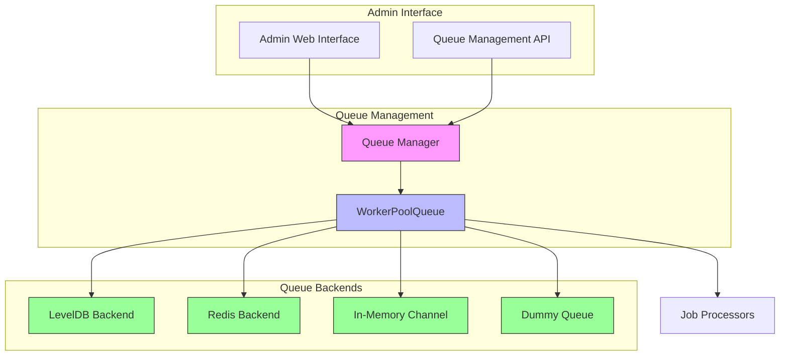
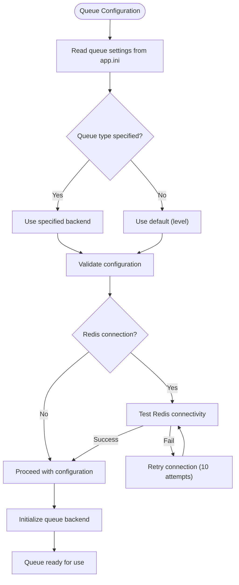
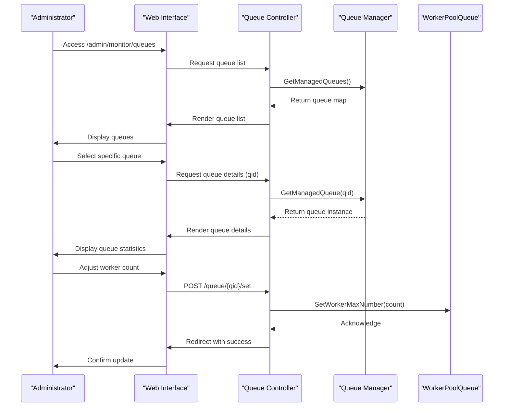
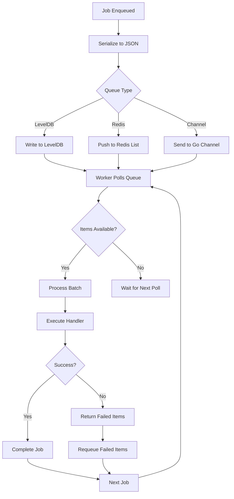

# Background Jobs and Queues

<cite>
**Referenced Files in This Document**   
- [manager.go](file://modules/queue/manager.go)
- [workerqueue.go](file://modules/queue/workerqueue.go)
- [base.go](file://modules/queue/base.go)
- [base_levelqueue.go](file://modules/queue/base_levelqueue.go)
- [base_redis.go](file://modules/queue/base_redis.go)
- [base_channel.go](file://modules/queue/base_channel.go)
- [queue.go](file://modules/setting/queue.go)
- [queue.go](file://routers/web/admin/queue.go)
- [queue_tester.go](file://routers/web/admin/queue_tester.go)
</cite>

## Table of Contents
1. [Introduction](#introduction)
2. [Architecture Overview](#architecture-overview)
3. [Queue Management Components](#queue-management-components)
4. [Queue Configuration and Backends](#queue-configuration-and-backends)
5. [Admin Interface for Queue Monitoring](#admin-interface-for-queue-monitoring)
6. [Job Processing and Worker Management](#job-processing-and-worker-management)
7. [Common Issues and Troubleshooting](#common-issues-and-troubleshooting)
8. [Performance Considerations and Scaling](#performance-considerations-and-scaling)

## Introduction
Gitea implements a robust background job processing system through its queue management framework, enabling asynchronous execution of resource-intensive tasks while maintaining system responsiveness. The architecture is designed to handle various background operations including repository mirroring, issue indexing, email delivery, and webhook processing. This document details the implementation of Gitea's queue system, focusing on the relationship between queue controllers, managers, and job processors, along with administrative capabilities for monitoring and managing background jobs.

**Section sources**
- [manager.go](file://modules/queue/manager.go#L1-L115)
- [workerqueue.go](file://modules/queue/workerqueue.go#L1-L260)

## Architecture Overview



**Diagram sources**
- [manager.go](file://modules/queue/manager.go#L1-L115)
- [workerqueue.go](file://modules/queue/workerqueue.go#L1-L260)
- [base.go](file://modules/queue/base.go#L1-L42)

## Queue Management Components

The queue management system in Gitea consists of several key components that work together to process background jobs efficiently. The `Manager` serves as the central registry for all managed queues, providing administrative access to queue statistics and control functions. Each queue is implemented as a `WorkerPoolQueue` that manages a pool of workers to process items from the underlying storage backend.

The `WorkerPoolQueue` struct maintains important metrics including worker counts, batch processing configuration, and queue state. It provides methods for pushing items to the queue, retrieving queue statistics, and managing worker lifecycle. The queue system supports both regular and unique queues, with the latter preventing duplicate items through additional tracking mechanisms.

```mermaid
classDiagram
class Manager {
+qidCounter int64
+Queues map[int64]ManagedWorkerPoolQueue
+AddManagedQueue(queue ManagedWorkerPoolQueue)
+GetManagedQueue(qid int64) ManagedWorkerPoolQueue
+ManagedQueues() map[int64]ManagedWorkerPoolQueue
+FlushAll(ctx context.Context, timeout time.Duration) error
}
class WorkerPoolQueue[T] {
+ctxRun context.Context
+baseQueueType string
+baseConfig *BaseConfig
+baseQueue baseQueue
+batchChan chan []T
+flushChan chan flushType
+batchLength int
+workerMaxNum int
+GetName() string
+GetType() string
+GetWorkerMaxNumber() int
+SetWorkerMaxNumber(num int)
+GetQueueItemNumber() int
+Push(data T) error
+FlushWithContext(ctx context.Context, timeout time.Duration) error
+RemoveAllItems(ctx context.Context) error
}
class baseQueue {
<<interface>>
+PushItem(ctx context.Context, data []byte) error
+PopItem(ctx context.Context) ([]byte, error)
+HasItem(ctx context.Context, data []byte) (bool, error)
+Len(ctx context.Context) (int, error)
+Close() error
+RemoveAll(ctx context.Context) error
}
Manager "1" --> "*" WorkerPoolQueue : manages
WorkerPoolQueue "1" --> "1" baseQueue : implements
```

**Diagram sources**
- [manager.go](file://modules/queue/manager.go#L1-L115)
- [workerqueue.go](file://modules/queue/workerqueue.go#L1-L260)
- [base.go](file://modules/queue/base.go#L1-L42)

**Section sources**
- [manager.go](file://modules/queue/manager.go#L1-L115)
- [workerqueue.go](file://modules/queue/workerqueue.go#L1-L260)

## Queue Configuration and Backends

Gitea supports multiple queue backends, each with different characteristics and use cases. The backend type is configured through the `QueueSettings` structure, which can be customized in the application configuration. The available backends include:

- **LevelDB**: Persistent storage using LevelDB, suitable for production environments where job persistence is critical
- **Redis**: Distributed queue using Redis, enabling clustering and high availability
- **Channel**: In-memory channel-based queue, appropriate for development and testing
- **Dummy**: Null implementation that discards all jobs, used when no processing is desired

The `QueueSettings` structure defines key parameters such as queue type, data directory, connection string (for Redis), maximum queue length, batch processing size, and maximum worker count. Default values are provided for all settings, with worker count typically set to half the number of CPU cores (capped at 10).



**Diagram sources**
- [queue.go](file://modules/setting/queue.go#L1-L120)
- [base_levelqueue.go](file://modules/queue/base_levelqueue.go#L1-L83)
- [base_redis.go](file://modules/queue/base_redis.go#L1-L138)
- [base_channel.go](file://modules/queue/base_channel.go#L1-L131)

**Section sources**
- [queue.go](file://modules/setting/queue.go#L1-L120)
- [base_levelqueue.go](file://modules/queue/base_levelqueue.go#L1-L83)
- [base_redis.go](file://modules/queue/base_redis.go#L1-L138)
- [base_channel.go](file://modules/queue/base_channel.go#L1-L131)

## Admin Interface for Queue Monitoring

Administrators can monitor and manage background job queues through the web interface, which provides comprehensive visibility into queue operations. The admin interface exposes endpoints for viewing all queues, inspecting individual queue details, adjusting worker counts, and performing maintenance operations.

The `Queues` handler displays a list of all managed queues with their current statistics, including worker counts, queue length, and item type. The `QueueManage` handler provides detailed information about a specific queue, allowing administrators to view its configuration and runtime metrics. Administrators can adjust the maximum number of workers for any queue through the `QueueSet` handler, enabling dynamic scaling based on current load.

For maintenance purposes, the `QueueRemoveAllItems` handler allows administrators to clear all items from a queue, which can be useful when dealing with corrupted or stuck queues. This operation removes all items from the underlying storage backend, effectively resetting the queue state.



**Diagram sources**
- [queue.go](file://routers/web/admin/queue.go#L1-L88)
- [manager.go](file://modules/queue/manager.go#L1-L115)
- [workerqueue.go](file://modules/queue/workerqueue.go#L1-L260)

**Section sources**
- [queue.go](file://routers/web/admin/queue.go#L1-L88)

## Job Processing and Worker Management

The job processing workflow in Gitea follows a consistent pattern across all queue types. When a job is enqueued, the `Push` method serializes the data to JSON and delegates to the underlying backend's `PushItem` method. Workers continuously poll the queue for new items, processing them in batches according to the configured `BatchLength`.

Each worker operates within a context that supports graceful shutdown and error recovery. The `safeHandler` wrapper provides panic recovery and logging, ensuring that individual job failures do not terminate the entire worker process. Failed jobs can be returned by the handler, causing them to be requeued for subsequent processing attempts.

The system implements retry logic through the handler's return value - any items returned by the handler are automatically requeued. This allows for custom retry policies based on job type and failure conditions. The `ShutdownWait` method ensures graceful shutdown by waiting for active workers to complete their current tasks before terminating.



**Diagram sources**
- [workerqueue.go](file://modules/queue/workerqueue.go#L1-L260)
- [base_levelqueue.go](file://modules/queue/base_levelqueue.go#L1-L83)
- [base_redis.go](file://modules/queue/base_redis.go#L1-L138)
- [base_channel.go](file://modules/queue/base_channel.go#L1-L131)

**Section sources**
- [workerqueue.go](file://modules/queue/workerqueue.go#L1-L260)

## Common Issues and Troubleshooting

Several common issues can arise in queue processing that administrators should be aware of. Stuck jobs occur when workers fail to process items due to application errors or system resource constraints. Queue backlogs develop when the rate of job creation exceeds the processing capacity, leading to growing queue lengths.

To address stuck jobs, administrators can use the admin interface to inspect queue statistics and worker activity. If workers are not active despite pending jobs, restarting the Gitea service typically resolves the issue. For persistent problems, checking system logs for error messages related to specific job types can identify underlying causes.

Queue backlogs can be mitigated by increasing the maximum worker count through the admin interface. However, this should be done cautiously, considering system resource constraints. For Redis-backed queues, ensuring adequate Redis server performance and connectivity is crucial.

Failed job processing often stems from configuration issues or external service failures. The system's retry mechanism helps recover from transient failures, but persistent failures require investigation of the specific job type and its dependencies. The `RemoveAllItems` function can be used as a last resort to clear problematic queues, though this results in loss of pending jobs.

**Section sources**
- [workerqueue.go](file://modules/queue/workerqueue.go#L1-L260)
- [manager.go](file://modules/queue/manager.go#L1-L115)
- [queue.go](file://routers/web/admin/queue.go#L1-L88)

## Performance Considerations and Scaling

Optimizing queue throughput requires careful consideration of several factors. The choice of queue backend significantly impacts performance characteristics. LevelDB provides persistent storage with good performance for single-server deployments, while Redis enables distributed processing and higher throughput at the cost of additional infrastructure.

Worker count should be tuned based on available CPU resources and the nature of the jobs being processed. CPU-intensive jobs benefit from worker counts close to the number of CPU cores, while I/O-bound jobs can utilize higher worker counts to maintain throughput during wait periods. The batch processing configuration should be optimized based on job size and processing patterns.

For high-load environments, scaling strategies include:
- Increasing worker counts to utilize available CPU resources
- Using Redis backend for distributed processing across multiple servers
- Optimizing job batching to reduce processing overhead
- Monitoring queue lengths to identify bottlenecks
- Separating different job types into dedicated queues with appropriate configurations

The system's design supports horizontal scaling through Redis clustering, allowing multiple Gitea instances to share the same job queue. This enables load distribution across multiple servers while maintaining job processing consistency.

**Section sources**
- [workerqueue.go](file://modules/queue/workerqueue.go#L1-L260)
- [base_redis.go](file://modules/queue/base_redis.go#L1-L138)
- [queue.go](file://modules/setting/queue.go#L1-L120)