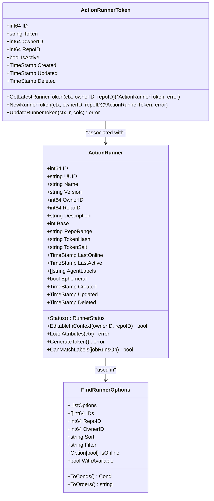
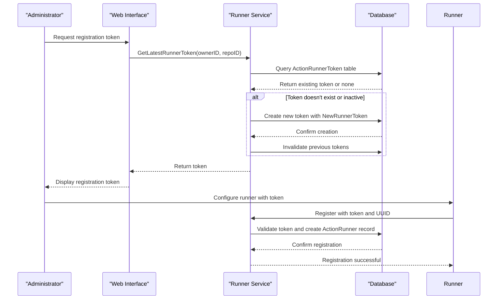
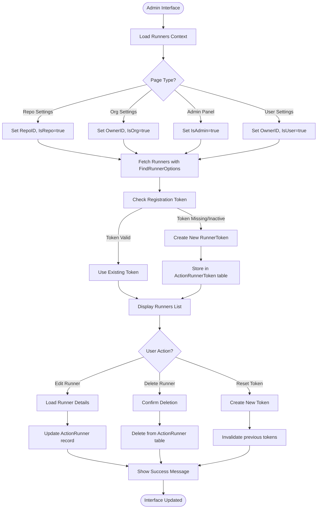
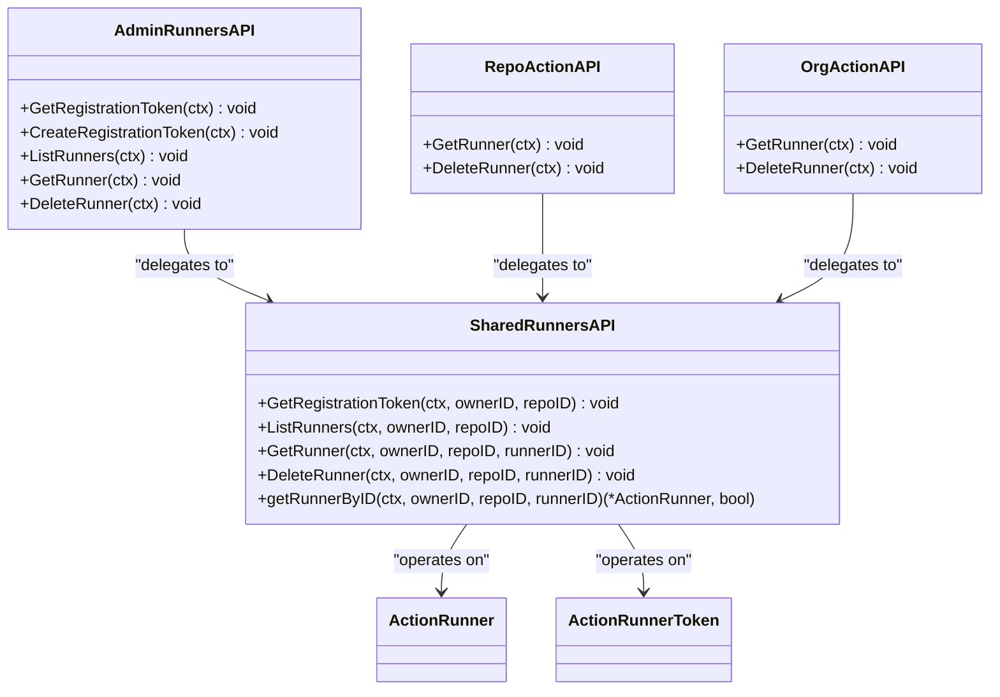
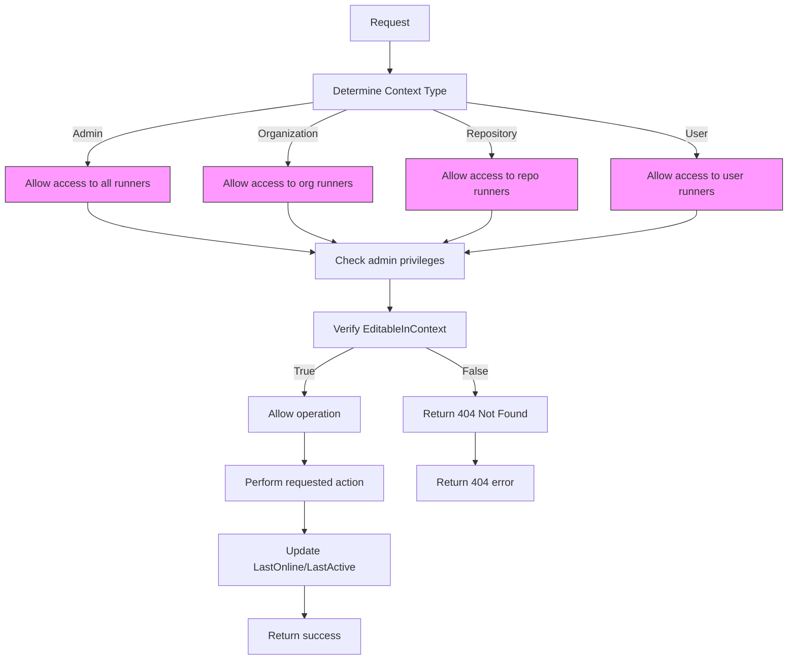
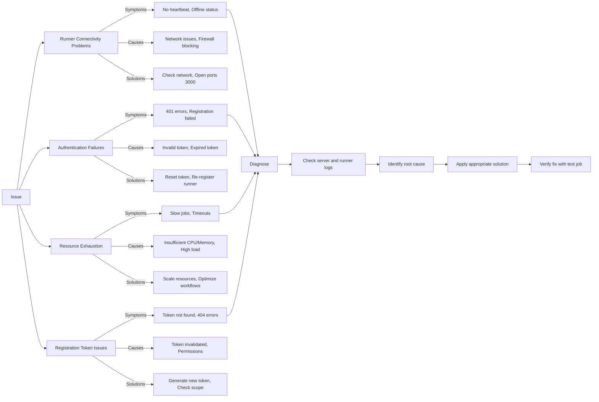
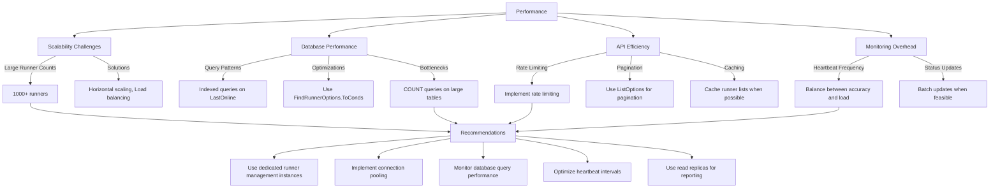
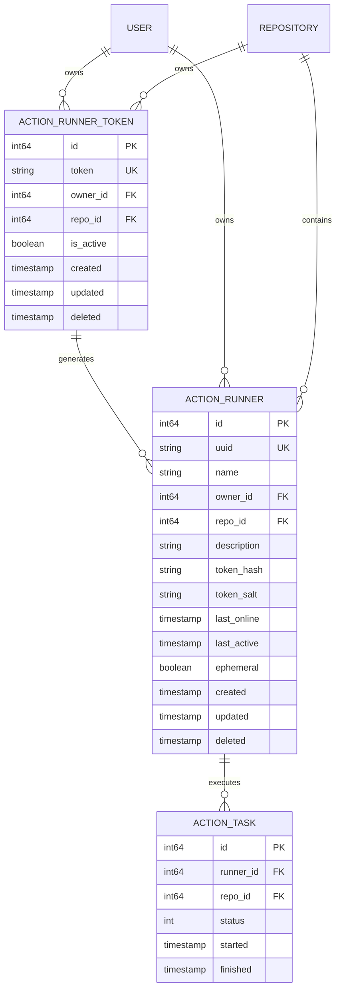

# CI/CD Runners

<cite>
**Referenced Files in This Document**   
- [runner.go](file://models/actions/runner.go)
- [runner_token.go](file://models/actions/runner_token.go)
- [runners.go](file://routers/web/shared/actions/runners.go)
- [admin/runners.go](file://routers/api/v1/admin/runners.go)
- [shared/runners.go](file://routers/api/v1/shared/runners.go)
</cite>

## Table of Contents
1. [Introduction](#introduction)
2. [Runner Architecture and Data Model](#runner-architecture-and-data-model)
3. [Runner Registration and Token Management](#runner-registration-and-token-management)
4. [Admin Interface for Runner Management](#admin-interface-for-runner-management)
5. [API Endpoints for Runner Operations](#api-endpoints-for-runner-operations)
6. [Runner Status and Monitoring](#runner-status-and-monitoring)
7. [Security and Access Control](#security-and-access-control)
8. [Common Issues and Troubleshooting](#common-issues-and-troubleshooting)
9. [Performance Considerations](#performance-considerations)
10. [Best Practices for CI/CD Infrastructure](#best-practices-for-ci/cd-infrastructure)

## Introduction
Gitea provides comprehensive CI/CD runner management capabilities through its admin interface, enabling administrators to register, monitor, and manage self-hosted runners at various levels of the system hierarchy. This documentation details the implementation of runner management features, focusing on the relationship between controllers, models, and services that handle runner operations. The system supports global, organization/user-level, and repository-level runners, with robust token-based authentication and comprehensive monitoring capabilities.

**Section sources**
- [runner.go](file://models/actions/runner.go#L1-L50)
- [runner_token.go](file://models/actions/runner_token.go#L1-L30)

## Runner Architecture and Data Model



**Diagram sources**
- [runner.go](file://models/actions/runner.go#L40-L397)
- [runner_token.go](file://models/actions/runner_token.go#L1-L125)

**Section sources**
- [runner.go](file://models/actions/runner.go#L40-L397)
- [runner_token.go](file://models/actions/runner_token.go#L1-L125)

## Runner Registration and Token Management



**Diagram sources**
- [runner_token.go](file://models/actions/runner_token.go#L70-L120)
- [runners.go](file://routers/web/shared/actions/runners.go#L100-L150)

**Section sources**
- [runner_token.go](file://models/actions/runner_token.go#L70-L120)
- [runners.go](file://routers/web/shared/actions/runners.go#L100-L150)

## Admin Interface for Runner Management



**Diagram sources**
- [runners.go](file://routers/web/shared/actions/runners.go#L50-L360)

**Section sources**
- [runners.go](file://routers/web/shared/actions/runners.go#L50-L360)

## API Endpoints for Runner Operations



**Diagram sources**
- [admin/runners.go](file://routers/api/v1/admin/runners.go#L1-L105)
- [shared/runners.go](file://routers/api/v1/shared/runners.go#L1-L107)
- [runner.go](file://models/actions/runner.go#L1-L397)

**Section sources**
- [admin/runners.go](file://routers/api/v1/admin/runners.go#L1-L105)
- [shared/runners.go](file://routers/api/v1/shared/runners.go#L1-L107)

## Runner Status and Monitoring

```mermaid
stateDiagram-v2
[*] --> DetermineStatus
DetermineStatus --> Offline : "LastOnline > 1 minute ago"
DetermineStatus --> Idle : "LastActive > 10 seconds ago"
DetermineStatus --> Active : "Recently active"
state "Runner Status" as RunnerStatus {
[*] --> Offline
Offline --> Idle : "Heartbeat received"
Idle --> Active : "Job started"
Active --> Idle : "Job completed"
Idle --> Offline : "No heartbeat for 1 minute"
Active --> Offline : "No heartbeat for 1 minute"
}
Click "DetermineStatus" as DetermineStatusAction
Click "RunnerStatus" as MonitoringProcess
note right of DetermineStatusAction
Checks LastOnline and LastActive
timestamps against current time
end note
note left of MonitoringProcess
Runners update their status
through periodic heartbeats
end note
```

**Diagram sources**
- [runner.go](file://models/actions/runner.go#L100-L130)

**Section sources**
- [runner.go](file://models/actions/runner.go#L100-L130)

## Security and Access Control



**Diagram sources**
- [runner.go](file://models/actions/runner.go#L140-L170)
- [shared/runners.go](file://routers/api/v1/shared/runners.go#L74-L106)

**Section sources**
- [runner.go](file://models/actions/runner.go#L140-L170)
- [shared/runners.go](file://routers/api/v1/shared/runners.go#L74-L106)

## Common Issues and Troubleshooting



**Diagram sources**
- [runner.go](file://models/actions/runner.go#L1-L397)
- [runner_token.go](file://models/actions/runner_token.go#L1-L125)
- [runners.go](file://routers/web/shared/actions/runners.go#L50-L360)

**Section sources**
- [runner.go](file://models/actions/runner.go#L1-L397)
- [runner_token.go](file://models/actions/runner_token.go#L1-L125)

## Performance Considerations



**Diagram sources**
- [runner.go](file://models/actions/runner.go#L300-L397)
- [runner_token.go](file://models/actions/runner_token.go#L1-L125)

**Section sources**
- [runner.go](file://models/actions/runner.go#L300-L397)
- [runner_token.go](file://models/actions/runner_token.go#L1-L125)

## Best Practices for CI/CD Infrastructure



**Diagram sources**
- [runner.go](file://models/actions/runner.go#L1-L397)
- [runner_token.go](file://models/actions/runner_token.go#L1-L125)

**Section sources**
- [runner.go](file://models/actions/runner.go#L1-L397)
- [runner_token.go](file://models/actions/runner_token.go#L1-L125)