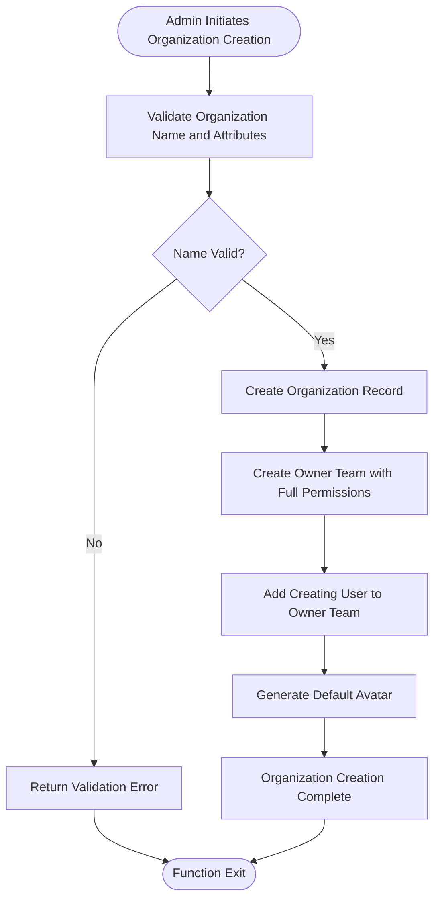
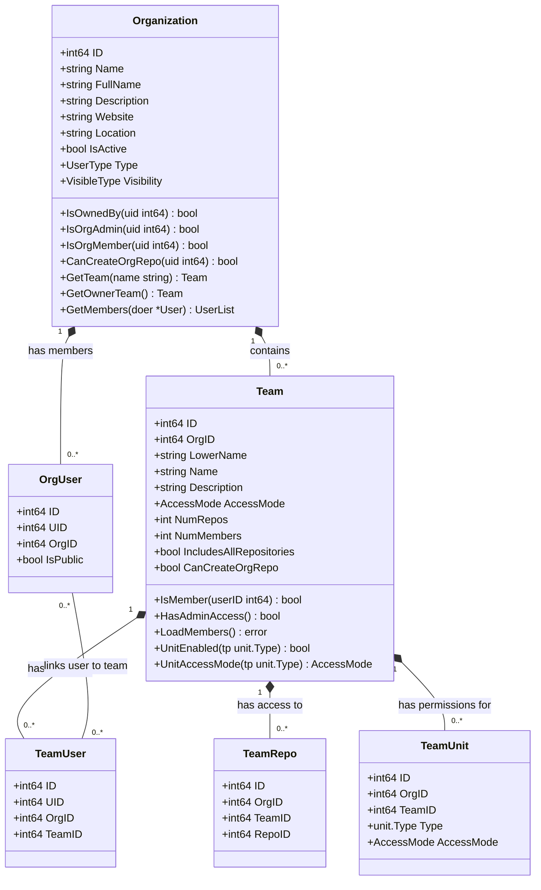
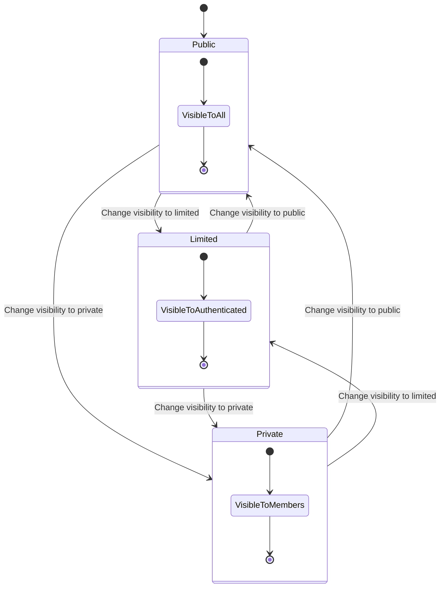
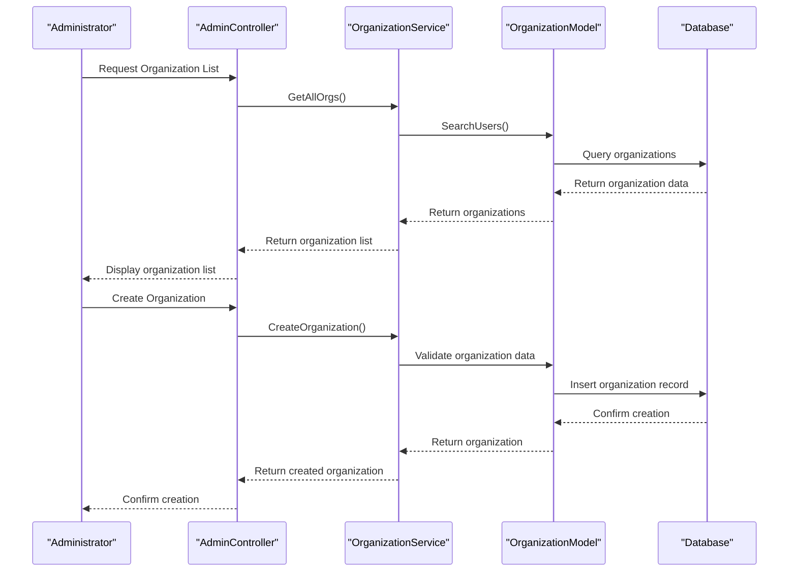

# Organization Management

<cite>
**Referenced Files in This Document**   
- [org.go](file://models/organization/org.go)
- [team.go](file://models/organization/team.go)
- [org_user.go](file://models/organization/org_user.go)
- [org.go](file://services/org/org.go)
- [org.go](file://models/organization/org.go)
- [orgs.go](file://routers/web/admin/orgs.go)
- [org.go](file://routers/api/v1/admin/org.go)
</cite>

## Table of Contents
1. [Introduction](#introduction)
2. [Core Components](#core-components)
3. [Organization Creation and Configuration](#organization-creation-and-configuration)
4. [Team Structure and Permission Management](#team-structure-and-permission-management)
5. [Organization Visibility and Access Control](#organization-visibility-and-access-control)
6. [Administrative Operations and Auditing](#administrative-operations-and-auditing)
7. [Performance Considerations](#performance-considerations)
8. [Troubleshooting Common Issues](#troubleshooting-common-issues)
9. [Best Practices for Organizational Governance](#best-practices-for-organizational-governance)

## Introduction
Gitea provides comprehensive administrative capabilities for managing organizations within the platform. This document details the implementation of organization management features, focusing on the administrative interface for creating, modifying, and auditing organizations. The system enables administrators to control organizational hierarchies, manage team structures, enforce policies, and configure visibility settings. The architecture follows a layered approach with clear separation between the admin interface, service layer, and data models, ensuring robust management of organizational resources and permissions.

## Core Components
The organization management system in Gitea consists of several interconnected components that work together to provide administrative functionality. The core components include the organization model, team management system, permission service, and administrative controllers. These components are organized in a layered architecture where the admin interface interacts with service layers that in turn manage the underlying data models. The system supports comprehensive organization lifecycle management, from creation and configuration to deletion and auditing.

**Section sources**
- [org.go](file://models/organization/org.go#L1-L599)
- [team.go](file://models/organization/team.go#L1-L250)
- [org_user.go](file://models/organization/org_user.go#L1-L199)

## Organization Creation and Configuration
The organization creation process in Gitea is initiated through the administrative interface and follows a structured workflow. Administrators can create organizations by specifying essential attributes such as name, full name, description, website, location, and visibility settings. The system validates the organization name against reserved patterns and character restrictions before creation. Each organization is automatically provisioned with an owner team that has full administrative privileges, and the creating user is added as the initial member of this team.

Organization configuration includes settings for resource limits, repository creation permissions, and default visibility. Administrators can modify these settings post-creation to align with organizational policies. The system supports configuration of organization-wide settings such as avatar, custom fields, and integration preferences. Resource limits can be applied to control the number of repositories, packages, and other resources an organization can create.

**Diagram sources**
- [org.go](file://models/organization/org.go#L400-L500)
- [org.go](file://services/org/org.go#L1-L170)

**Section sources**
- [org.go](file://models/organization/org.go#L400-L500)
- [org.go](file://routers/api/v1/admin/org.go#L48-L101)

## Team Structure and Permission Management
Gitea's team management system provides a flexible framework for organizing users within organizations and controlling their access to resources. Each organization contains one or more teams, with the owner team having complete administrative control. Teams can be configured with different permission levels, including read, write, admin, and owner access. The system supports both repository-level and organization-level permissions, allowing for granular control over resource access.

Team permissions are managed through a unit-based system where each team can have different access levels to various repository units such as code, issues, pull requests, releases, and wikis. Administrators can configure whether team members can create repositories within the organization and whether they can manage team membership. The system also supports public and private membership visibility, allowing organizations to control how team membership is displayed to external users.

**Diagram sources**
- [team.go](file://models/organization/team.go#L1-L250)
- [org_user.go](file://models/organization/org_user.go#L1-L199)

**Section sources**
- [team.go](file://models/organization/team.go#L1-L250)
- [org_user.go](file://models/organization/org_user.go#L1-L199)

## Organization Visibility and Access Control
Gitea implements a comprehensive visibility and access control system for organizations with three distinct visibility levels: public, limited, and private. Public organizations are visible to all users, including anonymous visitors, while limited organizations are visible only to authenticated users. Private organizations are visible exclusively to their members, providing the highest level of privacy and access control.

The visibility system is integrated with the permission framework to ensure consistent access control across all organizational resources. When an organization's visibility is changed, the system automatically updates the visibility of all repositories within the organization and recalculates access permissions. This ensures that access controls remain consistent with the organization's overall visibility settings. The system also handles special cases such as repository stars, which are cleared when a repository becomes private.

**Diagram sources**
- [org.go](file://models/organization/org.go#L500-L550)
- [org.go](file://services/org/org.go#L100-L170)

**Section sources**
- [org.go](file://models/organization/org.go#L500-L550)
- [org.go](file://services/org/org.go#L100-L170)

## Administrative Operations and Auditing
Administrative operations for organization management include creating, modifying, and deleting organizations, as well as auditing organizational activities. The administrative interface provides comprehensive tools for inspecting organization hierarchies, modifying team memberships, and enforcing organization-wide policies. Administrators can view detailed information about all organizations in the system, including membership, repository counts, and configuration settings.

The auditing system tracks all administrative operations related to organizations, providing a complete history of changes for compliance and troubleshooting purposes. This includes tracking organization creation, configuration changes, team membership modifications, and deletion operations. The system also provides tools for bulk operations, allowing administrators to apply changes across multiple organizations simultaneously.

**Diagram sources**
- [orgs.go](file://routers/web/admin/orgs.go#L1-L39)
- [org.go](file://routers/api/v1/admin/org.go#L1-L123)

**Section sources**
- [orgs.go](file://routers/web/admin/orgs.go#L1-L39)
- [org.go](file://routers/api/v1/admin/org.go#L1-L123)

## Performance Considerations
Managing large organization structures in Gitea requires careful consideration of performance implications. The system is optimized to handle organizations with thousands of members and repositories through efficient database queries and caching mechanisms. However, certain operations such as changing organization visibility or updating team permissions can be resource-intensive, especially for organizations with extensive repository networks.

To optimize performance, the system implements pagination for organization and team member lists, reducing the memory footprint and response time for large datasets. The permission calculation system is optimized to minimize database queries by caching team membership and access rights. For organizations with complex team structures, administrators should consider the performance impact of frequent permission changes and large membership updates.

Best practices for maintaining optimal performance include regularly reviewing and consolidating team structures, avoiding excessive nesting of teams, and using organization-wide policies rather than individual repository configurations when possible. The system also provides monitoring tools to track the performance of organization-related operations and identify potential bottlenecks.

**Section sources**
- [org.go](file://models/organization/org.go#L1-L599)
- [org.go](file://services/org/org.go#L1-L170)

## Troubleshooting Common Issues
Common issues in organization management typically relate to permission inheritance, team membership synchronization, and visibility configuration. Permission inheritance problems can occur when team permissions are not properly propagated to repositories, resulting in access denied errors for team members. This can be resolved by recalculating team accesses through the administrative interface or by using the system's repair tools.

Team membership synchronization errors may occur when users are added to or removed from teams, particularly in large organizations with complex team structures. These issues can be addressed by verifying team membership through the administrative interface and ensuring that all team-related database records are consistent. Visibility configuration issues, such as users being unable to access organizations they should have access to, can typically be resolved by verifying the organization's visibility settings and the user's membership status.

Other common issues include problems with organization creation due to name conflicts or reserved names, repository creation permissions not being properly inherited from teams, and avatar or other custom settings not being applied correctly. These issues can usually be resolved by verifying the organization's configuration and ensuring that all required fields are properly set.

**Section sources**
- [org.go](file://models/organization/org.go#L1-L599)
- [team.go](file://models/organization/team.go#L1-L250)

## Best Practices for Organizational Governance
Effective organizational governance in Gitea requires adherence to several best practices. Administrators should establish clear policies for organization creation, team structure, and permission management. This includes defining naming conventions for organizations and teams, establishing guidelines for repository creation, and implementing consistent visibility settings across similar organizations.

Regular audits of organization structures and permissions are recommended to ensure compliance with organizational policies and security requirements. Administrators should periodically review team memberships, repository access controls, and organization configurations to identify and address any inconsistencies or security risks. Implementing a least-privilege access model, where users are granted only the permissions necessary for their roles, helps minimize security risks.

Documentation of organizational structures and governance policies is essential for maintaining consistency and facilitating onboarding of new administrators. Administrators should also establish procedures for handling organization lifecycle events such as mergers, acquisitions, and decommissioning of organizations. Regular training and communication with organization owners and team leads help ensure that governance policies are understood and followed throughout the organization.

**Section sources**
- [org.go](file://models/organization/org.go#L1-L599)
- [team.go](file://models/organization/team.go#L1-L250)
- [org_user.go](file://models/organization/org_user.go#L1-L199)