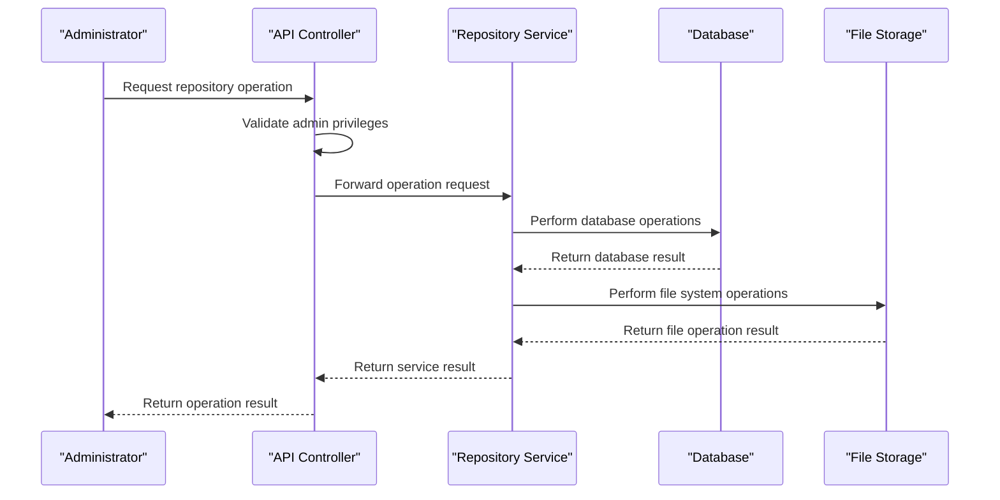
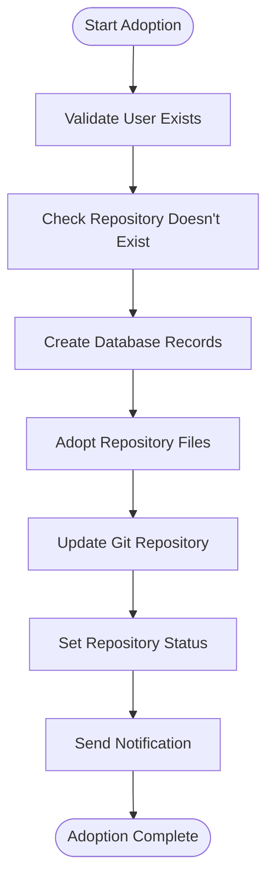
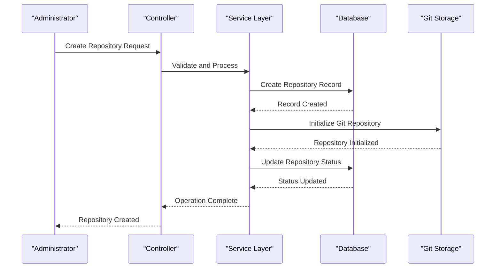
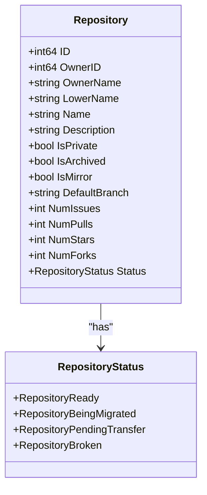
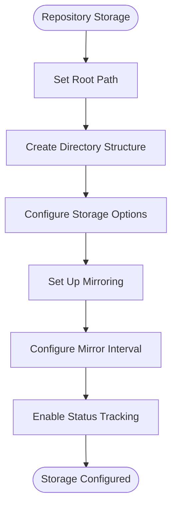

# Repository Management

<cite>
**Referenced Files in This Document**   
- [adopt.go](file://routers/api/v1/admin/adopt.go)
- [repos.go](file://routers/web/admin/repos.go)
- [adopt.go](file://services/repository/adopt.go)
- [repo.go](file://models/repo/repo.go)
- [repo_list.go](file://models/repo/repo_list.go)
- [repository.go](file://services/repository/repository.go)
- [create.go](file://services/repository/create.go)
- [delete.go](file://services/repository/delete.go)
</cite>

## Table of Contents
1. [Introduction](#introduction)
2. [Administrative Repository Operations](#administrative-repository-operations)
3. [Repository Adoption and Cleanup](#repository-adoption-and-cleanup)
4. [Repository Creation and Deletion](#repository-creation-and-deletion)
5. [Repository Configuration and Metadata](#repository-configuration-and-metadata)
6. [Storage and Mirroring Configuration](#storage-and-mirroring-configuration)
7. [Common Repository Issues](#common-repository-issues)
8. [Performance Considerations](#performance-considerations)
9. [Best Practices for Repository Lifecycle Management](#best-practices-for-repository-lifecycle-management)

## Introduction
This document provides a comprehensive overview of Gitea's administrative repository management capabilities. It details the implementation of repository inspection, configuration, and maintenance operations available to system administrators. The document explains the relationship between the admin repository controller and the repository service layer, including how repository metadata and settings are accessed and modified. Concrete examples from the codebase illustrate how administrators can audit repository configurations, enforce policies, and perform bulk operations. The document also covers configuration options for repository storage, access controls, and mirroring settings, addressing common issues such as repository corruption, storage quota violations, and failed migration operations.

## Administrative Repository Operations
System administrators in Gitea have extensive capabilities to manage repositories across the entire instance. The administrative interface provides both API endpoints and web-based controls for repository management. The core administrative operations are implemented in the `admin` package within the API controllers, which serve as the entry point for repository management requests.

The administrative repository controller exposes endpoints for listing, creating, and deleting repositories. These operations are designed to be performed on behalf of users or organizations, allowing administrators to manage repositories without requiring direct access to user accounts. The controller layer validates administrative privileges before forwarding requests to the repository service layer for processing.

**Diagram sources**
- [adopt.go](file://routers/api/v1/admin/adopt.go#L52-L145)
- [repository.go](file://services/repository/repository.go#L20-L40)

**Section sources**
- [adopt.go](file://routers/api/v1/admin/adopt.go#L52-L145)
- [repository.go](file://services/repository/repository.go#L20-L40)

## Repository Adoption and Cleanup
Gitea provides specialized functionality for adopting pre-existing repository files and cleaning up unadopted repositories. This capability is particularly useful when migrating repositories from other systems or when recovering from incomplete repository creation operations.

The repository adoption process follows a structured workflow that ensures data integrity and proper configuration. When an administrator initiates the adoption of a repository, the system first verifies that the target user exists and that the repository does not already exist in the database. The adoption service then creates the necessary database records and configures the repository with appropriate settings before finalizing the operation.

The cleanup functionality allows administrators to remove unadopted repository files from the file system. This operation is critical for maintaining storage efficiency and preventing orphaned files from consuming disk space. The cleanup process includes validation to ensure that only truly unadopted repositories are deleted, preventing accidental data loss.

**Diagram sources**
- [adopt.go](file://services/repository/adopt.go#L100-L150)
- [repos.go](file://routers/web/admin/repos.go#L120-L160)

**Section sources**
- [adopt.go](file://services/repository/adopt.go#L100-L150)
- [repos.go](file://routers/web/admin/repos.go#L120-L160)

## Repository Creation and Deletion
The repository creation and deletion processes in Gitea are implemented as multi-step operations that ensure data consistency across the database and file system. The creation process begins with validation of repository name and user permissions, followed by database record creation and file system initialization.

When creating a repository, the system first checks if the user has reached their repository creation limit. If the limit is not exceeded, the system creates a database record for the repository with a "being migrated" status. This temporary status prevents the repository from being accessed until the creation process is complete. The system then initializes the Git repository on the file system, creates necessary hooks, and synchronizes branch information.

Repository deletion is a comprehensive process that removes all associated data from both the database and file system. The deletion service first closes any open pull requests, then removes the repository from the database, and finally deletes the repository files from the file system. The process also cleans up related data such as attachments, releases, and webhook configurations.

**Diagram sources**
- [create.go](file://services/repository/create.go#L200-L300)
- [delete.go](file://services/repository/delete.go#L50-L150)

**Section sources**
- [create.go](file://services/repository/create.go#L200-L300)
- [delete.go](file://services/repository/delete.go#L50-L150)

## Repository Configuration and Metadata
Gitea's repository management system provides extensive configuration options for administrators to control repository behavior and metadata. The repository model includes fields for storing essential information such as name, description, visibility, and various status indicators.

Administrators can modify repository settings through both the web interface and API endpoints. The configuration system supports various repository attributes including privacy settings, template status, and trust models. When a repository's visibility is changed, the system automatically updates related configurations such as access controls and indexing settings.

The metadata system includes comprehensive tracking of repository statistics such as the number of issues, pull requests, stars, and forks. These metrics are updated automatically as repository activity occurs, providing administrators with real-time insights into repository usage and engagement.

**Diagram sources**
- [repo.go](file://models/repo/repo.go#L150-L250)
- [repo_list.go](file://models/repo/repo_list.go#L200-L300)

**Section sources**
- [repo.go](file://models/repo/repo.go#L150-L250)
- [repo_list.go](file://models/repo/repo_list.go#L200-L300)

## Storage and Mirroring Configuration
Gitea provides flexible storage and mirroring configuration options for administrators to manage repository data efficiently. The system supports various storage backends and mirroring intervals to accommodate different deployment requirements.

Repository storage is configured through the system settings, allowing administrators to specify the root path for repository storage and various storage-related options. The system automatically creates the necessary directory structure when repositories are created, ensuring consistent organization of repository files.

Mirroring configuration allows administrators to set up automatic synchronization between repositories and external sources. The mirroring system supports various interval configurations and provides status tracking for mirror operations. Administrators can monitor mirror status and troubleshoot issues through the administrative interface.

**Diagram sources**
- [create.go](file://services/repository/create.go#L300-L400)
- [repository.go](file://services/repository/repository.go#L200-L300)

**Section sources**
- [create.go](file://services/repository/create.go#L300-L400)
- [repository.go](file://services/repository/repository.go#L200-L300)

## Common Repository Issues
Administrators may encounter various issues when managing repositories in Gitea. Common problems include repository corruption, storage quota violations, and failed migration operations. The system provides diagnostic tools and recovery procedures to address these issues.

Repository corruption can occur due to incomplete operations or file system errors. The system includes integrity checking mechanisms that can detect and report corruption issues. Administrators can use the repository adoption functionality to recover from certain types of corruption by re-adopting repository files.

Storage quota violations occur when repositories exceed configured size limits. The system tracks repository size and provides warnings when limits are approached. Administrators can configure automatic cleanup procedures or manually intervene to reduce repository size.

Failed migration operations can leave repositories in an inconsistent state. The system uses transactional operations to minimize the risk of incomplete migrations, but administrators should monitor migration status and be prepared to clean up failed operations.

**Section sources**
- [adopt.go](file://services/repository/adopt.go#L300-L350)
- [delete.go](file://services/repository/delete.go#L300-L350)

## Performance Considerations
Managing large numbers of repositories requires careful consideration of performance implications. The repository management system is designed to handle bulk operations efficiently through batch processing and optimized database queries.

When performing operations on multiple repositories, administrators should consider the impact on system resources such as CPU, memory, and disk I/O. The system includes pagination and batch processing mechanisms to prevent resource exhaustion during bulk operations.

Database performance is optimized through appropriate indexing and query optimization. The system uses efficient data structures and algorithms to minimize the overhead of repository operations. Administrators should monitor system performance and adjust configuration settings as needed to maintain optimal operation.

**Section sources**
- [repo_list.go](file://models/repo/repo_list.go#L500-L600)
- [repository.go](file://services/repository/repository.go#L300-L400)

## Best Practices for Repository Lifecycle Management
Effective repository lifecycle management requires adherence to best practices that ensure data integrity, security, and operational efficiency. Administrators should establish clear policies for repository creation, maintenance, and deletion.

Regular audits of repository configurations help ensure compliance with organizational policies. Administrators should implement automated monitoring and alerting for critical repository metrics and status changes.

Backup procedures should be established to protect against data loss. The system provides export functionality that can be used as part of a comprehensive backup strategy. Administrators should test recovery procedures regularly to ensure they can restore repositories when needed.

Documentation of repository management procedures helps ensure consistency and facilitates knowledge transfer. Administrators should maintain up-to-date documentation of policies, procedures, and configuration settings.

**Section sources**
- [create.go](file://services/repository/create.go#L400-L450)
- [delete.go](file://services/repository/delete.go#L350-L400)