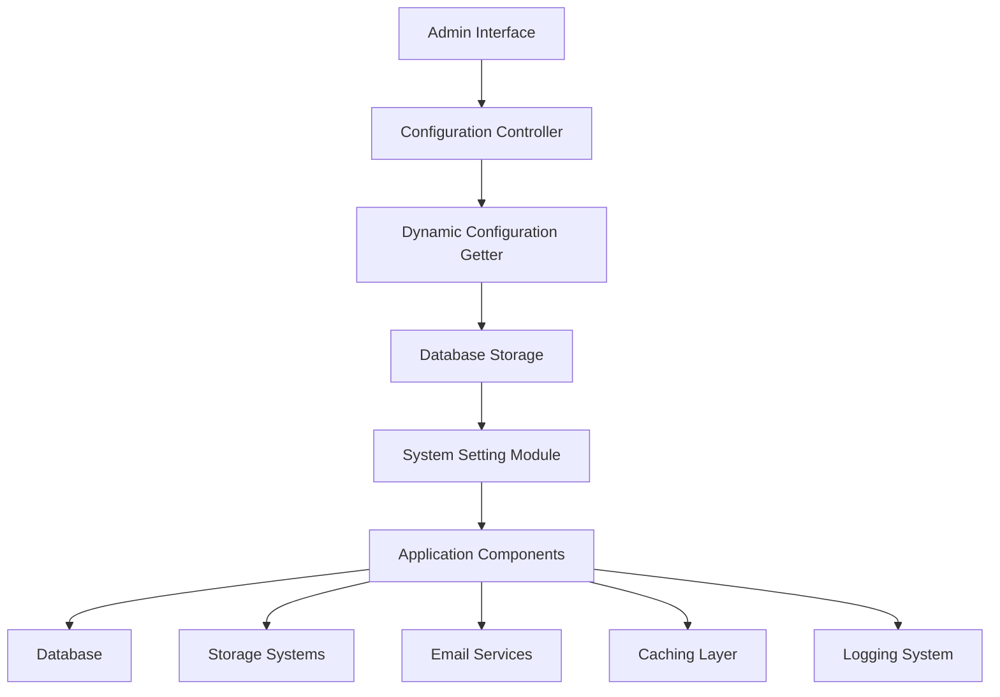
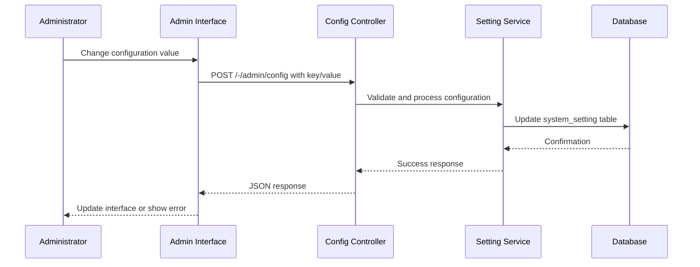
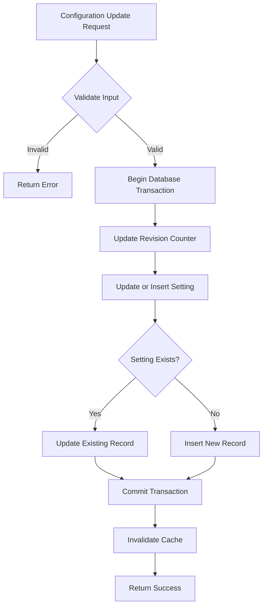
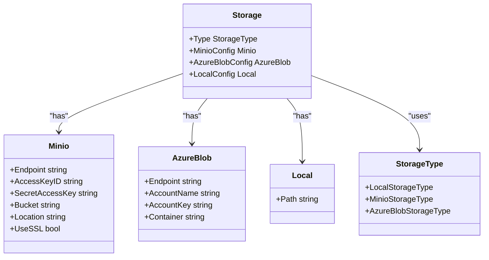

# System Configuration

<cite>
**Referenced Files in This Document**   
- [config.go](file://cmd/config.go)
- [setting.go](file://models/system/setting.go)
- [config.go](file://routers/web/admin/config.go)
- [storage.go](file://modules/setting/storage.go)
- [mailer.go](file://modules/setting/mailer.go)
- [admin.go](file://modules/setting/admin.go)
- [log.go](file://modules/setting/log.go)
- [config.ts](file://web_src/js/features/admin/config.ts)
</cite>

## Table of Contents
1. [Introduction](#introduction)
2. [Configuration Architecture](#configuration-architecture)
3. [Admin Configuration Interface](#admin-configuration-interface)
4. [Configuration Persistence and Validation](#configuration-persistence-and-validation)
5. [Component Configuration Options](#component-configuration-options)
6. [Storage Configuration](#storage-configuration)
7. [Common Configuration Issues](#common-configuration-issues)
8. [Performance Considerations](#performance-considerations)
9. [Best Practices](#best-practices)

## Introduction
Gitea provides a comprehensive administrative system for managing system-wide settings through its web interface. This documentation details the implementation of viewing and modifying system configurations, focusing on the relationship between the admin configuration controller and the global setting module. The system allows administrators to modify critical components including database settings, storage configurations, authentication, email, caching, and logging. Configuration values are persisted in the database and validated through a robust system that ensures data integrity and security.

## Configuration Architecture

**Diagram sources**
- [setting.go](file://models/system/setting.go#L60-L109)
- [config.go](file://routers/web/admin/config.go#L157-L187)

**Section sources**
- [setting.go](file://models/system/setting.go#L60-L109)
- [config.go](file://routers/web/admin/config.go#L157-L187)

## Admin Configuration Interface

The admin configuration interface provides a centralized location for system administrators to view and modify system-wide settings. The interface is accessible through the admin panel and exposes configuration options for various system components. The frontend implementation uses JavaScript to handle dynamic configuration updates, sending requests to the server when configuration values change.

**Diagram sources**
- [config.ts](file://web_src/js/features/admin/config.ts#L5-L23)
- [config.go](file://routers/web/admin/config.go#L42-L88)

**Section sources**
- [config.ts](file://web_src/js/features/admin/config.ts#L5-L23)
- [config.go](file://routers/web/admin/config.go#L42-L88)

## Configuration Persistence and Validation

System configuration values are persisted in the database through the `system_setting` table, which stores key-value pairs for all configurable options. The persistence mechanism ensures atomic updates and maintains a revision counter to track configuration changes. When configuration values are modified through the admin interface, they are validated before being stored to prevent invalid configurations.

**Diagram sources**
- [setting.go](file://models/system/setting.go#L60-L109)
- [config.go](file://routers/web/admin/config.go#L157-L187)

**Section sources**
- [setting.go](file://models/system/setting.go#L60-L109)

## Component Configuration Options

Gitea exposes configuration options for various system components through the admin interface. Each component has specific configuration parameters that control its behavior and integration with external services.

### Authentication Configuration
Administrators can configure authentication sources including LDAP, OAuth2, SMTP, and PAM. Each authentication source type has specific configuration requirements and validation rules to ensure proper setup.

### Email Configuration
The email system can be configured with SMTP settings or sendmail configuration. The system validates email settings and provides a test function to verify the configuration.

### Caching Configuration
Caching options include Redis, Memcached, and in-memory storage. The admin interface provides a cache test function that measures response time and reports performance issues.

### Logging Configuration
Logging settings allow administrators to configure multiple log writers with different levels, formats, and destinations. Each logger can have console, file, or network output.

**Section sources**
- [admin.go](file://modules/setting/admin.go#L0-L33)
- [mailer.go](file://modules/setting/mailer.go#L31-L73)
- [log.go](file://modules/setting/log.go#L113-L168)

## Storage Configuration

Gitea supports multiple storage backends for various system components including repository archives, packages, and actions. The storage configuration system allows administrators to define storage types and connection parameters for each component.

**Diagram sources**
- [storage.go](file://modules/setting/storage.go#L101-L135)
- [storage.go](file://modules/setting/storage.go#L135-L158)

**Section sources**
- [storage.go](file://modules/setting/storage.go#L101-L158)

## Common Configuration Issues

Administrators may encounter several common issues when modifying system configurations. These include validation errors, incorrect value formats, and failed configuration reloads. The system provides error messages and validation feedback to help resolve these issues.

### Configuration Validation Errors
The system validates configuration values using predefined rules and constraints. Validation errors occur when values do not meet requirements such as minimum/maximum sizes, required formats, or valid options.

### Incorrect Value Formats
Configuration values must adhere to specific formats. For example, email addresses must be valid, URLs must be properly formatted, and numeric values must be within acceptable ranges.

### Failed Configuration Reloads
After configuration changes, the system may fail to reload settings properly. This can occur due to syntax errors in configuration files or invalid database connections.

**Section sources**
- [binding.go](file://modules/web/middleware/binding.go#L111-L144)
- [config.go](file://routers/web/admin/config.go#L42-L88)

## Performance Considerations

Configuration changes can have significant performance implications on system behavior. Administrators should consider the following performance aspects when modifying settings:

- **Cache Configuration**: Cache settings directly impact system responsiveness. Slow cache responses can degrade overall performance.
- **Database Settings**: Connection pool size and query logging affect database performance and resource utilization.
- **Storage Configuration**: Storage backend selection and network configuration impact file operations and repository performance.
- **Logging Level**: Excessive logging can create I/O bottlenecks and consume storage space rapidly.

**Section sources**
- [config.go](file://routers/web/admin/config.go#L42-L88)
- [log.go](file://modules/setting/log.go#L136-L160)

## Best Practices

To maintain configuration consistency across environments, administrators should follow these best practices:

1. **Test Changes in Staging**: Always test configuration changes in a staging environment before applying to production.
2. **Document Configuration Changes**: Maintain documentation of configuration changes and their rationale.
3. **Use Configuration Management**: Implement configuration management tools to ensure consistency across instances.
4. **Monitor Configuration Impact**: Monitor system performance after configuration changes to identify issues.
5. **Backup Configuration**: Regularly backup configuration settings to enable quick recovery.
6. **Limit Administrative Access**: Restrict configuration access to authorized personnel only.

**Section sources**
- [config.go](file://routers/web/admin/config.go#L157-L187)
- [setting.go](file://models/system/setting.go#L60-L109)