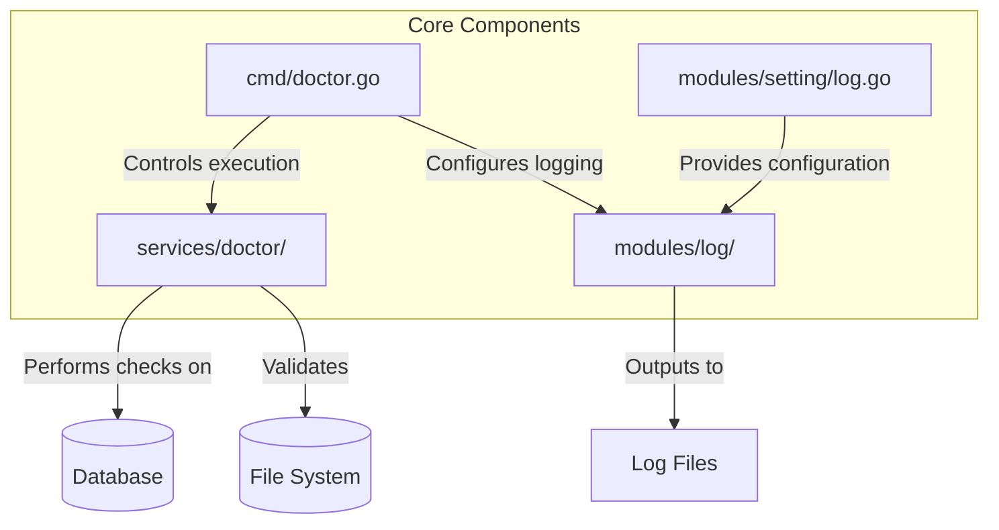
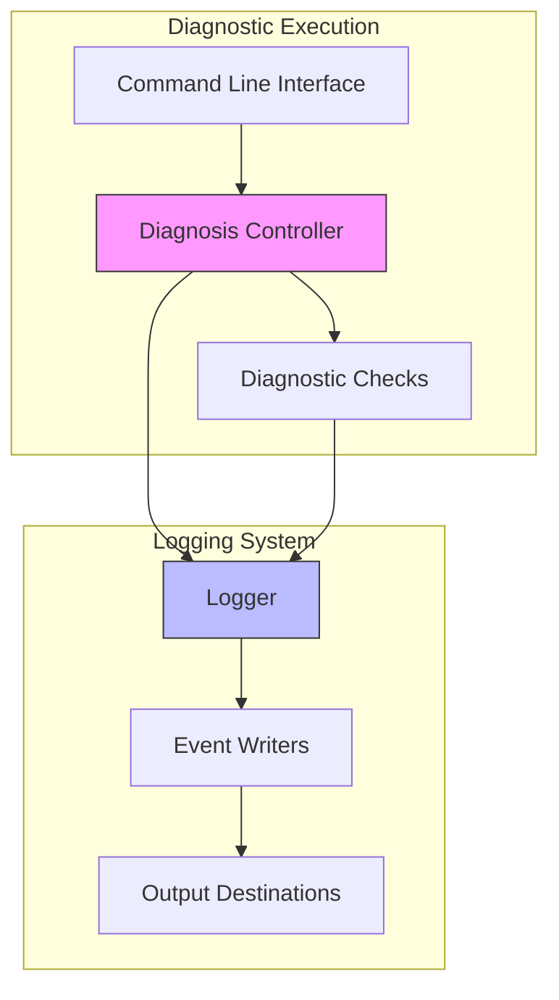
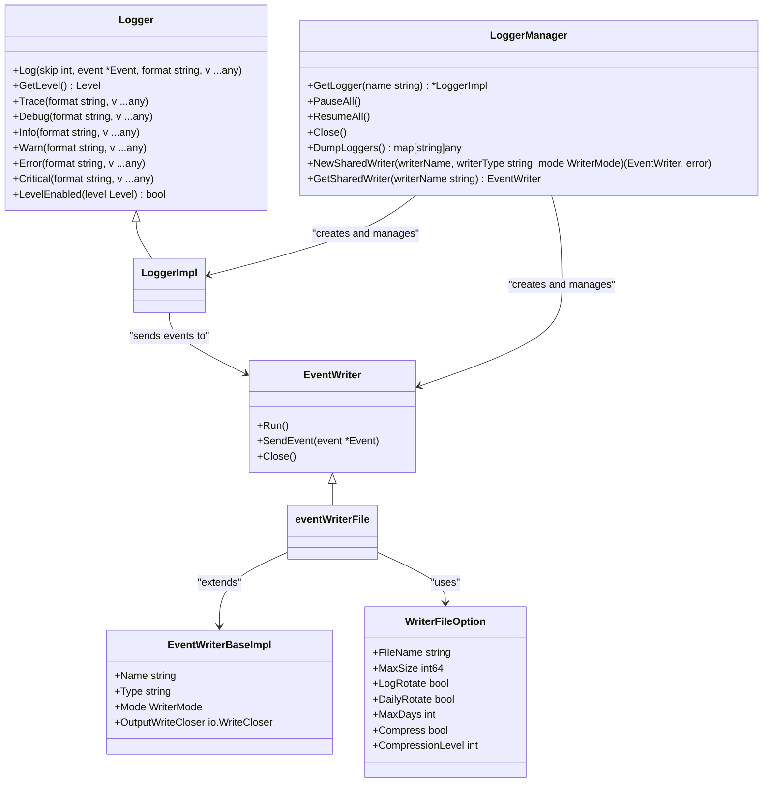
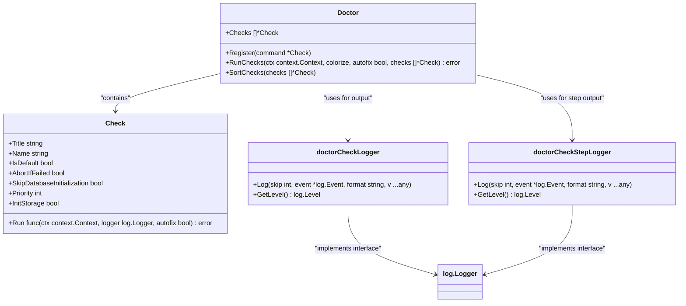
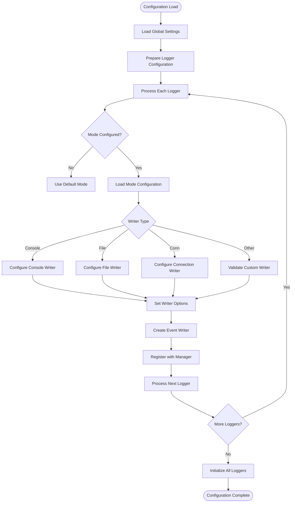
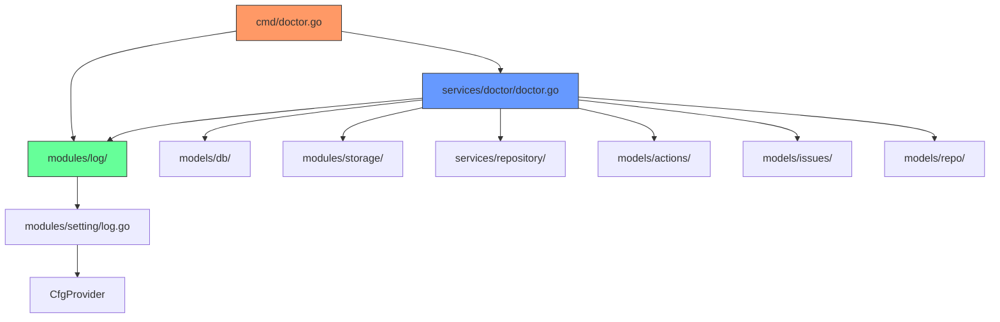

# System Monitoring and Logs

<cite>
**Referenced Files in This Document**   
- [cmd/doctor.go](file://cmd/doctor.go)
- [modules/log/logger.go](file://modules/log/logger.go)
- [modules/log/manager.go](file://modules/log/manager.go)
- [modules/log/event_writer_file.go](file://modules/log/event_writer_file.go)
- [modules/setting/log.go](file://modules/setting/log.go)
- [services/doctor/doctor.go](file://services/doctor/doctor.go)
- [services/doctor/dbconsistency.go](file://services/doctor/dbconsistency.go)
- [services/doctor/paths.go](file://services/doctor/paths.go)
- [services/doctor/repository.go](file://services/doctor/repository.go)
</cite>

## Table of Contents
1. [Introduction](#introduction)
2. [Project Structure](#project-structure)
3. [Core Components](#core-components)
4. [Architecture Overview](#architecture-overview)
5. [Detailed Component Analysis](#detailed-component-analysis)
6. [Dependency Analysis](#dependency-analysis)
7. [Performance Considerations](#performance-considerations)
8. [Troubleshooting Guide](#troubleshooting-guide)
9. [Conclusion](#conclusion)

## Introduction
Gitea provides comprehensive system monitoring and diagnostic capabilities for administrators to ensure system health, identify issues, and maintain optimal performance. This document details the implementation of log viewing, system diagnostics, and health checks within Gitea, focusing on the relationship between the diagnosis controller, logging system, and doctor service. The system enables administrators to analyze log output, run diagnostic checks, and troubleshoot system issues through both command-line tools and configuration options. Key components include a flexible logging framework, a diagnostic check system for database and file system consistency, and configurable health monitoring capabilities.

## Project Structure
The system monitoring and diagnostic functionality in Gitea is organized across several key directories and files. The core diagnostic capabilities are primarily located in the `cmd/doctor.go` file, which serves as the entry point for the doctor command-line tool. The logging system is implemented in the `modules/log/` directory, containing the core logging components and writers. Diagnostic checks are implemented in the `services/doctor/` package, with individual check files for specific diagnostic areas. Configuration for logging is handled in `modules/setting/log.go`, which processes the configuration file settings for log output and behavior.

**Diagram sources**
- [cmd/doctor.go](file://cmd/doctor.go)
- [modules/log/logger.go](file://modules/log/logger.go)
- [services/doctor/doctor.go](file://services/doctor/doctor.go)
- [modules/setting/log.go](file://modules/setting/log.go)

**Section sources**
- [cmd/doctor.go](file://cmd/doctor.go)
- [modules/log/](file://modules/log/)
- [services/doctor/](file://services/doctor/)
- [modules/setting/log.go](file://modules/setting/log.go)

## Core Components
The system monitoring and diagnostic capabilities in Gitea consist of three primary components: the logging system, the doctor service for diagnostics, and the configuration system that controls their behavior. The logging system provides flexible output options to various destinations with configurable levels and formatting. The doctor service implements a series of diagnostic checks that can identify and optionally fix inconsistencies in the database and file system. These components work together to provide administrators with comprehensive tools for monitoring system health and troubleshooting issues. The relationship between these components is orchestrated through the command-line interface and configuration files, allowing administrators to customize the monitoring behavior according to their specific needs and environment requirements.

**Section sources**
- [cmd/doctor.go](file://cmd/doctor.go#L1-L215)
- [modules/log/logger.go](file://modules/log/logger.go#L1-L51)
- [services/doctor/doctor.go](file://services/doctor/doctor.go#L1-L138)

## Architecture Overview
The system monitoring architecture in Gitea follows a modular design where the diagnosis controller coordinates between the logging system and diagnostic services. When an administrator runs a diagnostic command, the diagnosis controller initializes the appropriate logging configuration and executes registered diagnostic checks. Each diagnostic check operates independently but shares the same logging infrastructure, allowing for consistent output formatting and destination handling. The logging system acts as a central hub that receives log events from various components and dispatches them to configured writers, which can output to console, files, or network destinations. This architecture enables separation of concerns between diagnostic logic and output presentation, making it easier to extend both the types of checks and the ways their results are reported.

**Diagram sources**
- [cmd/doctor.go](file://cmd/doctor.go#L1-L215)
- [services/doctor/doctor.go](file://services/doctor/doctor.go#L1-L138)
- [modules/log/logger.go](file://modules/log/logger.go#L1-L51)

## Detailed Component Analysis

### Logging System Analysis
The logging system in Gitea is implemented as a flexible framework that supports multiple output destinations and configurable behavior. At its core is the Logger interface that provides standard logging methods (Trace, Debug, Info, Warn, Error, Critical) with different severity levels. The system uses a manager pattern to coordinate multiple loggers and shared writers, allowing different components to use the same output destinations while maintaining independent configuration. Log events are dispatched asynchronously to writers through goroutines, ensuring that logging does not block the main application flow. The system supports various writer types including console, file, and network connections, with the file writer implementing log rotation based on size and time.

#### For Object-Oriented Components:

**Diagram sources**
- [modules/log/logger.go](file://modules/log/logger.go#L1-L51)
- [modules/log/manager.go](file://modules/log/manager.go#L1-L142)
- [modules/log/event_writer_file.go](file://modules/log/event_writer_file.go#L1-L54)

**Section sources**
- [modules/log/logger.go](file://modules/log/logger.go#L1-L51)
- [modules/log/manager.go](file://modules/log/manager.go#L1-L142)
- [modules/log/event_writer_file.go](file://modules/log/event_writer_file.go#L1-L54)

### Diagnostic Service Analysis
The diagnostic service in Gitea is designed as a modular system where individual checks can be registered and executed independently. Each diagnostic check is represented by a Check struct that contains metadata about the check and a function to execute it. The system supports both default checks that run automatically and optional checks that can be invoked explicitly. Checks can be configured to abort further execution if they fail, allowing critical issues to stop the diagnostic process. The diagnostic framework handles database initialization and storage setup as needed for different checks, optimizing performance by avoiding unnecessary initialization when not required. This modular design allows new diagnostic checks to be added without modifying the core execution logic.

#### For Object-Oriented Components:

**Diagram sources**
- [services/doctor/doctor.go](file://services/doctor/doctor.go#L1-L138)
- [cmd/doctor.go](file://cmd/doctor.go#L1-L215)

**Section sources**
- [services/doctor/doctor.go](file://services/doctor/doctor.go#L1-L138)
- [cmd/doctor.go](file://cmd/doctor.go#L1-L215)

### Configuration System Analysis
The logging configuration system in Gitea processes settings from the configuration file to initialize the logging framework with appropriate writers and behavior. The system supports global logging settings as well as per-logger configurations, allowing different components to have different logging behavior. Configuration options include log level, output destination, file rotation settings, and formatting options. The system handles deprecated settings by automatically migrating them to the current configuration format, ensuring backward compatibility. For diagnostic operations, the configuration also controls whether automatic fixes are applied when issues are detected, providing a safety mechanism for production environments.

#### For Complex Logic Components:

**Diagram sources**
- [modules/setting/log.go](file://modules/setting/log.go#L1-L268)

**Section sources**
- [modules/setting/log.go](file://modules/setting/log.go#L1-L268)

## Dependency Analysis
The system monitoring components in Gitea have well-defined dependencies that enable their functionality while maintaining separation of concerns. The doctor command depends on the diagnostic service to execute checks and the logging system to report results. The diagnostic service depends on the database and storage systems to perform its consistency checks but is designed to initialize these components only when needed. The logging system has minimal dependencies, primarily on the configuration system for initialization parameters and on the operating system for file and network operations. This dependency structure allows the diagnostic tools to function even when parts of the main application are not fully initialized, making them valuable for troubleshooting installation and configuration issues.

**Diagram sources**
- [cmd/doctor.go](file://cmd/doctor.go#L1-L215)
- [services/doctor/doctor.go](file://services/doctor/doctor.go#L1-L138)
- [modules/log/logger.go](file://modules/log/logger.go#L1-L51)
- [modules/setting/log.go](file://modules/setting/log.go#L1-L268)

**Section sources**
- [cmd/doctor.go](file://cmd/doctor.go#L1-L215)
- [services/doctor/doctor.go](file://services/doctor/doctor.go#L1-L138)
- [modules/log/logger.go](file://modules/log/logger.go#L1-L51)
- [modules/setting/log.go](file://modules/setting/log.go#L1-L268)

## Performance Considerations
The logging and diagnostic systems in Gitea are designed with performance in mind, particularly for production environments where excessive logging can impact system performance. The logging framework uses asynchronous event dispatching to prevent blocking application execution, with configurable buffer sizes to balance memory usage and data loss risk. For diagnostic operations, the system minimizes database initialization overhead by only initializing components when required by specific checks. Large-scale operations, such as checking database consistency, are implemented with batch processing to avoid memory exhaustion. Administrators should be aware that verbose logging levels and comprehensive diagnostic checks can significantly increase I/O operations and should be used judiciously in production environments. The system provides configuration options to control log file size and retention, helping to manage disk space usage over time.

## Troubleshooting Guide
When encountering issues with Gitea's monitoring and diagnostic capabilities, administrators should first verify the configuration settings in the app.ini file, particularly the log section and any logger-specific configurations. Common issues include log files not being created due to permission problems or incorrect paths, which can be diagnosed using the paths check in the doctor command. If diagnostic checks fail to execute, verify that the database is accessible and that the Gitea instance is properly installed. For issues with log rotation, check that the file system has sufficient space and that the process has write permissions to the log directory. When diagnostic checks report false positives, ensure that the database schema is up to date by running the migration check. For performance issues related to logging, consider adjusting the log level or disabling less critical loggers in production environments.

**Section sources**
- [services/doctor/paths.go](file://services/doctor/paths.go#L1-L123)
- [services/doctor/dbconsistency.go](file://services/doctor/dbconsistency.go#L1-L274)
- [services/doctor/repository.go](file://services/doctor/repository.go#L1-L78)

## Conclusion
Gitea's system monitoring and diagnostic capabilities provide administrators with comprehensive tools for maintaining system health and troubleshooting issues. The modular architecture separates concerns between logging, diagnostics, and configuration, enabling flexible and extensible monitoring capabilities. The logging system offers configurable output destinations and levels, while the diagnostic service provides a framework for identifying and optionally fixing system inconsistencies. By understanding the relationship between these components and their configuration options, administrators can effectively monitor their Gitea instances, proactively identify potential issues, and maintain optimal system performance. The combination of command-line diagnostic tools and configuration-driven logging behavior makes Gitea's monitoring system both powerful and adaptable to different operational requirements.