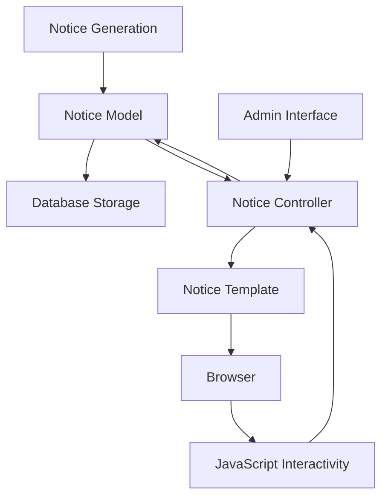
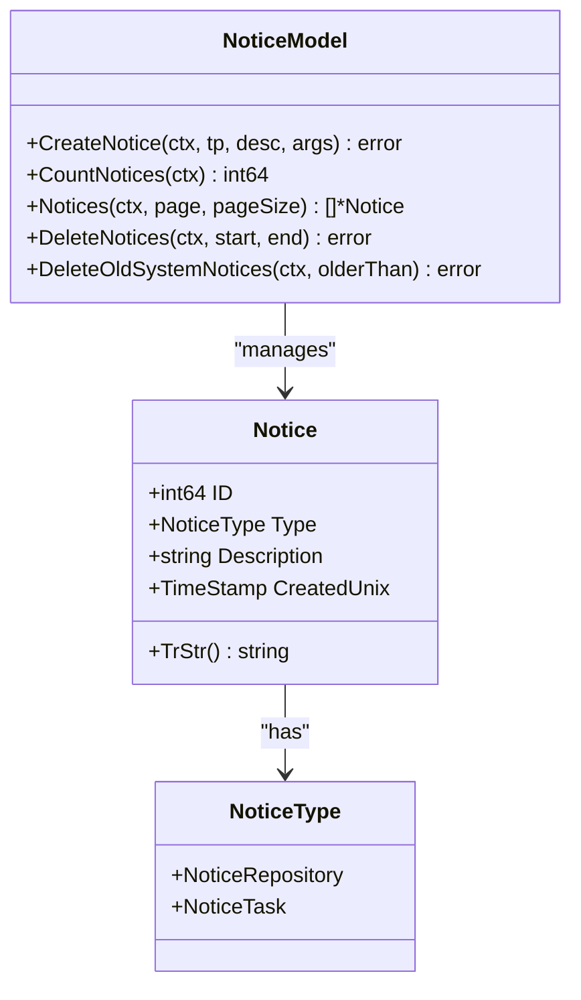
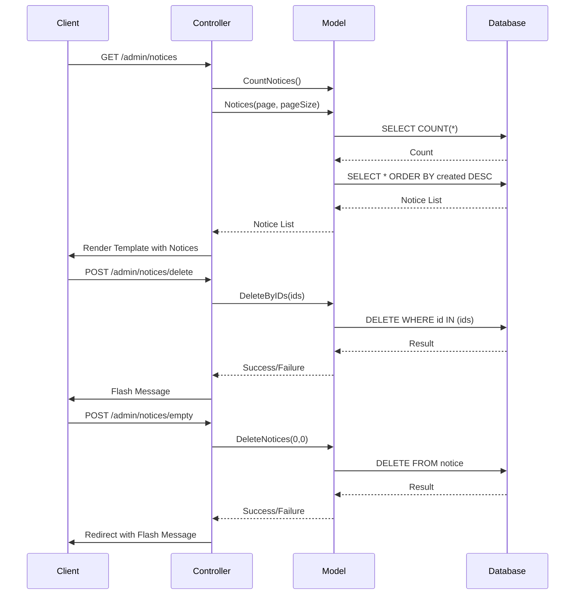
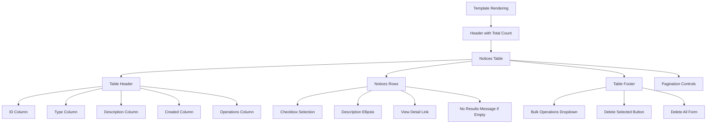
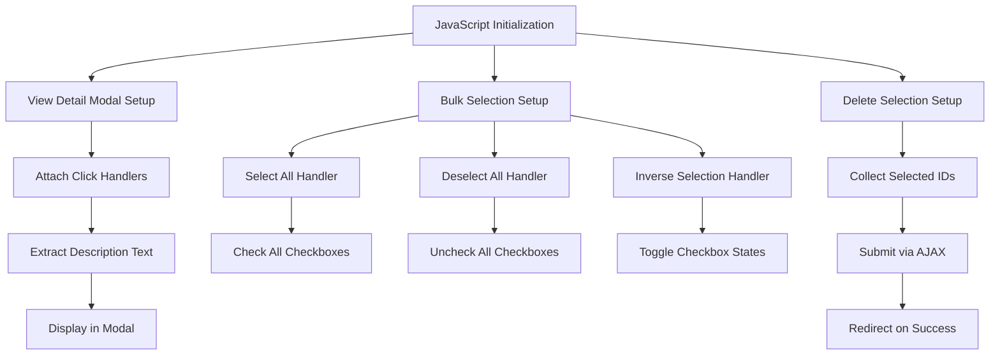

# System Notices

<cite>
**Referenced Files in This Document**   
- [notice.go](file://models/system/notice.go)
- [notice.go](file://routers/web/admin/notice.go)
- [notice.tmpl](file://templates/admin/notice.tmpl)
- [common.ts](file://web_src/js/features/admin/common.ts)
- [ui.go](file://modules/setting/ui.go)
</cite>

## Table of Contents
1. [Introduction](#introduction)
2. [Core Components](#core-components)
3. [Architecture Overview](#architecture-overview)
4. [Detailed Component Analysis](#detailed-component-analysis)
5. [Performance Considerations](#performance-considerations)
6. [Troubleshooting Guide](#troubleshooting-guide)
7. [Conclusion](#conclusion)

## Introduction
Gitea's system notice management provides administrators with a centralized interface for monitoring system events, diagnosing issues, and maintaining platform health. The system notices feature enables tracking of repository operations, task executions, and critical system events through a comprehensive admin interface. This documentation details the implementation of viewing, filtering, and clearing system notices, explaining the relationship between the notice controller, notice model, and notification services. The system supports audit capabilities for system events, identification of recurring issues, and management of accumulated notices through configurable retention policies and filtering criteria.

## Core Components
The system notice functionality in Gitea consists of several interconnected components that handle the generation, storage, display, and management of system notices. The core components include the Notice model for data representation, the admin notice controller for handling HTTP requests, the admin notice template for UI rendering, and the frontend JavaScript for interactive functionality. These components work together to provide administrators with a comprehensive view of system events and the ability to take action on accumulated notices.

**Section sources**
- [notice.go](file://models/system/notice.go)
- [notice.go](file://routers/web/admin/notice.go)
- [notice.tmpl](file://templates/admin/notice.tmpl)
- [common.ts](file://web_src/js/features/admin/common.ts)

## Architecture Overview
The system notice architecture follows a clean separation of concerns between data storage, business logic, and presentation layers. Notices are generated by various system components and stored in the database through the Notice model. The admin controller retrieves and manages notices based on user requests, while the template renders the UI for viewing and interacting with notices. Frontend JavaScript enhances the user experience with interactive features like bulk selection and modal dialogs for viewing detailed notice information.

**Diagram sources**
- [notice.go](file://models/system/notice.go)
- [notice.go](file://routers/web/admin/notice.go)
- [notice.tmpl](file://templates/admin/notice.tmpl)
- [common.ts](file://web_src/js/features/admin/common.ts)

## Detailed Component Analysis

### Notice Model Analysis
The Notice model serves as the foundation for system notice management, defining the structure and behavior of stored notices. It includes fields for unique identification, notice type classification, descriptive content, and creation timestamp. The model provides methods for creating, counting, retrieving, and deleting notices, with support for pagination and range-based deletion operations.

**Diagram sources**
- [notice.go](file://models/system/notice.go)

**Section sources**
- [notice.go](file://models/system/notice.go)

### Notice Controller Analysis
The admin notice controller handles HTTP requests related to system notices, providing endpoints for viewing, deleting, and emptying notices. It integrates with the notice model to retrieve paginated notice lists, process deletion requests for specific notice IDs, and clear all notices from the system. The controller also manages user feedback through flash messages and handles pagination based on configurable settings.

**Diagram sources**
- [notice.go](file://routers/web/admin/notice.go)

**Section sources**
- [notice.go](file://routers/web/admin/notice.go)

### Notice Template Analysis
The admin notice template defines the user interface for viewing and managing system notices. It displays notices in a paginated table format with columns for ID, type, description, creation time, and operations. The template includes controls for bulk operations like selecting all, deselecting all, and inverting selection, as well as buttons for deleting selected notices or clearing all notices. A modal dialog allows viewing detailed notice descriptions.

**Diagram sources**
- [notice.tmpl](file://templates/admin/notice.tmpl)

**Section sources**
- [notice.tmpl](file://templates/admin/notice.tmpl)

### Frontend JavaScript Analysis
The frontend JavaScript enhances the admin notice interface with interactive functionality. It handles modal dialogs for viewing detailed notice descriptions, implements bulk selection operations (select all, deselect all, inverse selection), and manages the deletion of selected notices through AJAX requests. The JavaScript also initializes event listeners for various UI elements and coordinates with the backend through form submissions and API calls.

**Diagram sources**
- [common.ts](file://web_src/js/features/admin/common.ts)

**Section sources**
- [common.ts](file://web_src/js/features/admin/common.ts)

## Performance Considerations
The system notice functionality includes several performance considerations for storage and retrieval operations. Notice retrieval is optimized with database indexing on the creation timestamp and pagination to limit result set sizes. The default configuration limits notice display to 25 items per page, reducing memory usage and improving response times. For large notice volumes, administrators can use bulk deletion operations to manage storage requirements. The system also provides a configuration option for automatic deletion of old notices based on a configurable age threshold, helping to prevent unbounded growth of the notice table.

**Section sources**
- [ui.go](file://modules/setting/ui.go)
- [notice.go](file://models/system/notice.go)

## Troubleshooting Guide
Common issues with system notices include notice flooding, missing critical notices, and incorrect notice categorization. Notice flooding can occur when system operations generate excessive notices; this can be mitigated by reviewing the source of notices and adjusting system configurations. Missing critical notices may indicate filtering issues or problems with notice generation; administrators should verify that notice creation functions are being called correctly. Incorrect notice categorization typically results from using the wrong notice type constant when creating notices; developers should ensure proper type assignment based on the notice context. Performance issues with notice retrieval can be addressed by optimizing database indexes and adjusting pagination settings.

**Section sources**
- [notice.go](file://models/system/notice.go)
- [ui.go](file://modules/setting/ui.go)

## Conclusion
Gitea's system notice management provides administrators with essential tools for monitoring platform health and diagnosing issues. The architecture effectively separates concerns between data storage, business logic, and presentation layers, enabling efficient notice management through a user-friendly interface. The system supports comprehensive audit capabilities, flexible filtering, and bulk operations for maintaining a clean notice history. By understanding the relationships between the notice model, controller, template, and frontend components, administrators can effectively use notices as a diagnostic tool for system health monitoring and proactive issue resolution.