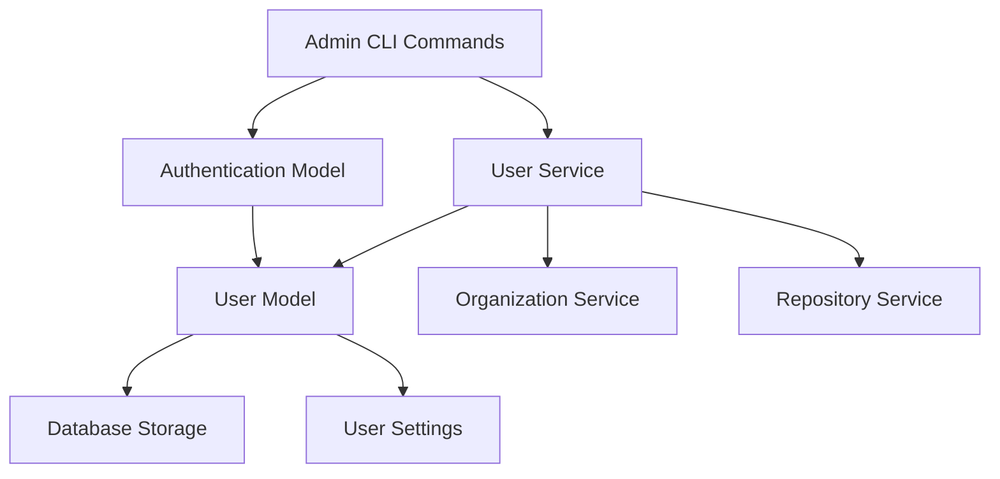
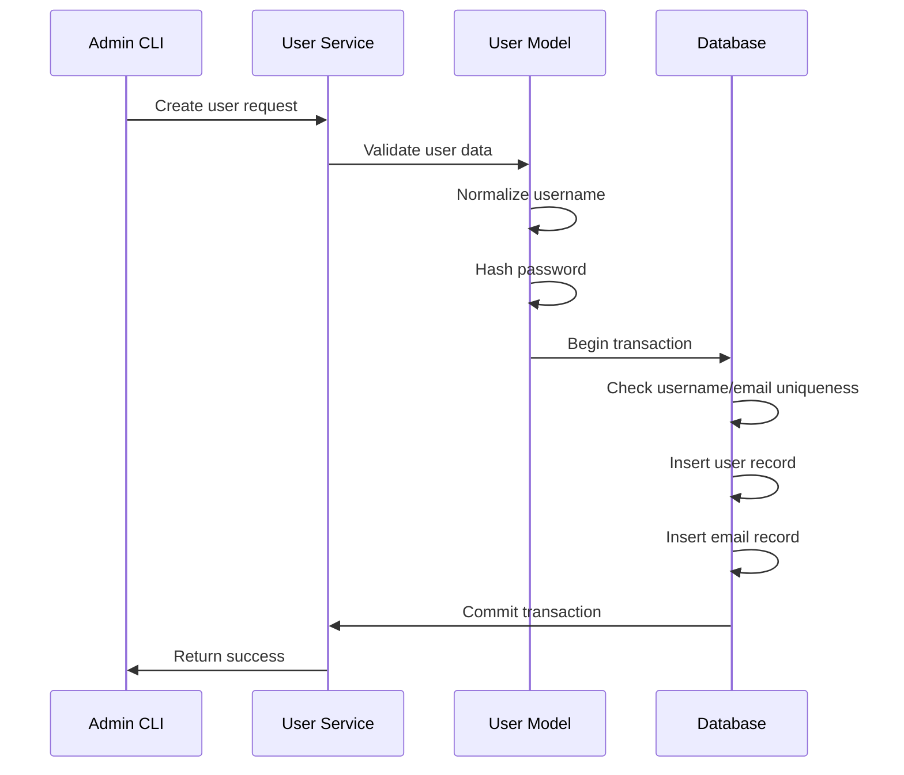
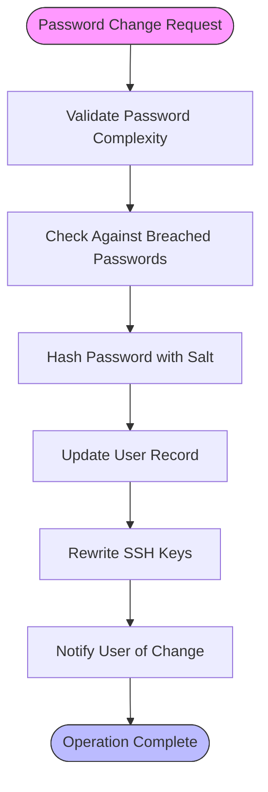
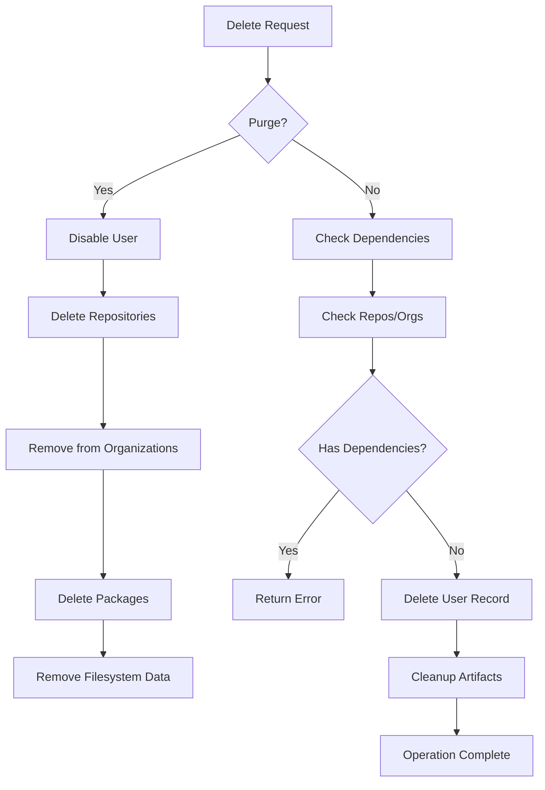
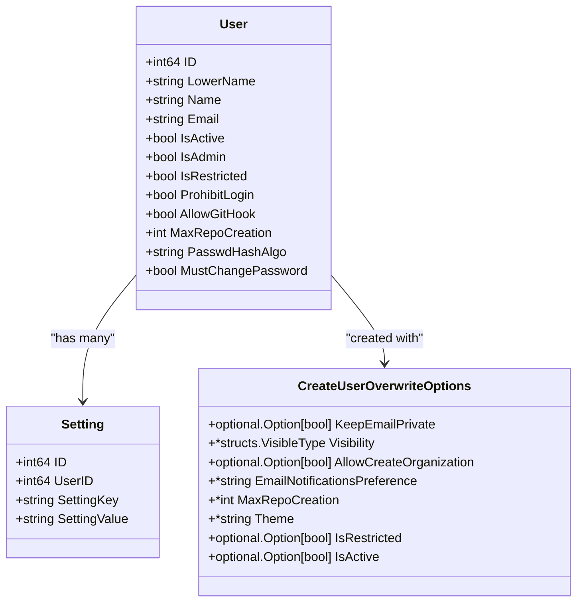

# User Management

<cite>
**Referenced Files in This Document**   
- [user.go](file://models/user/user.go)
- [setting.go](file://models/user/setting.go)
- [admin_user_create.go](file://cmd/admin_user_create.go)
- [admin_user_delete.go](file://cmd/admin_user_delete.go)
- [admin_user_change_password.go](file://cmd/admin_user_change_password.go)
- [user.go](file://services/user/user.go)
</cite>

## Table of Contents
1. [Introduction](#introduction)
2. [Core Components](#core-components)
3. [User Creation Process](#user-creation-process)
4. [User Modification and Password Management](#user-modification-and-password-management)
5. [User Deletion and Purge Operations](#user-deletion-and-purge-operations)
6. [Configuration Options and Access Controls](#configuration-options-and-access-controls)
7. [Common Issues and Troubleshooting](#common-issues-and-troubleshooting)
8. [Performance Considerations and Best Practices](#performance-considerations-and-best-practices)

## Introduction
This document provides a comprehensive analysis of Gitea's administrative user management capabilities, focusing on the implementation details of user lifecycle operations including creation, modification, suspension, and deletion. The documentation covers the relationship between the admin user controller and underlying user services and models, explains configuration options for provisioning and access controls, addresses common operational issues, and provides performance guidance for enterprise environments.

## Core Components

The user management system in Gitea is built around several key components that work together to provide administrative capabilities. The core functionality is distributed across models, services, and command-line interfaces that handle different aspects of user administration.

**Diagram sources**
- [user.go](file://models/user/user.go)
- [user.go](file://services/user/user.go)
- [admin_user_create.go](file://cmd/admin_user_create.go)

**Section sources**
- [user.go](file://models/user/user.go)
- [user.go](file://services/user/user.go)

## User Creation Process

The user creation process in Gitea is implemented through a structured workflow that ensures data integrity and proper initialization of user accounts. The process begins with the admin CLI command `admin_user_create.go` which validates input parameters and prepares the user data for insertion into the system.

When creating a new user, the system performs several critical operations:
- Validates username against reserved patterns and character requirements
- Ensures email uniqueness and proper formatting
- Hashes passwords using the configured algorithm (default: argon2)
- Sets default permissions and visibility based on system configuration
- Creates necessary database records and filesystem directories

The `CreateUser` function in the user model handles the transactional creation of user records, ensuring that both the user record and associated email address are created atomically. The process also supports optional features such as generating random passwords, creating access tokens with specific scopes, and setting user restrictions.

**Diagram sources**
- [admin_user_create.go](file://cmd/admin_user_create.go)
- [user.go](file://models/user/user.go)

**Section sources**
- [admin_user_create.go](file://cmd/admin_user_create.go#L1-L242)
- [user.go](file://models/user/user.go#L300-L600)

## User Modification and Password Management

User modification operations in Gitea are handled through dedicated service functions that provide controlled updates to user attributes while maintaining system security and data consistency. The password management system implements several security features including password complexity validation, breach detection, and mandatory password change policies.

The `UpdateAuth` function in the user service handles password changes and related authentication updates. When an administrator changes a user's password, the system:
- Validates the new password against configured complexity requirements
- Checks the password against known breached password databases
- Updates the password hash using the current hashing algorithm
- Respects the "must change password" flag for first-time login scenarios

The system also supports renaming users through the `RenameUser` function, which carefully coordinates updates across multiple systems:
- Updates the username in the database
- Renames the user's filesystem directory
- Creates redirect records for backward compatibility
- Updates repository ownership references
- Notifies integrated services like container registries

**Diagram sources**
- [admin_user_change_password.go](file://cmd/admin_user_change_password.go)
- [user.go](file://services/user/user.go#L1-L100)

**Section sources**
- [admin_user_change_password.go](file://cmd/admin_user_change_password.go#L1-L79)
- [user.go](file://services/user/user.go#L1-L50)

## User Deletion and Purge Operations

User deletion in Gitea is implemented as a two-phase process that distinguishes between regular deletion and complete purging. The `DeleteUser` function in the user service handles both scenarios with appropriate safeguards to prevent accidental data loss.

For regular deletion, the system:
- Verifies the user is not the last admin account
- Ensures the user doesn't own repositories or organizations
- Removes the user record while preserving their contributions in issues and comments

For purge operations (when the `--purge` flag is used), the system performs additional cleanup:
- Disables the user immediately to prevent further access
- Deletes all repositories owned by the user
- Removes the user from all organizations
- Deletes all associated packages
- Removes filesystem artifacts including repositories and avatars

The deletion process is designed to be as atomic as possible while handling the distributed nature of user data across multiple systems. The service coordinates with repository, organization, and package services to ensure consistent cleanup across all components.

**Diagram sources**
- [admin_user_delete.go](file://cmd/admin_user_delete.go)
- [user.go](file://services/user/user.go#L100-L250)

**Section sources**
- [admin_user_delete.go](file://cmd/admin_user_delete.go#L1-L85)
- [user.go](file://services/user/user.go#L100-L300)

## Configuration Options and Access Controls

Gitea provides extensive configuration options for user provisioning and access controls through both system settings and per-user configurations. The system supports various user types including individual users, bots, and reserved accounts, each with different capabilities and restrictions.

Key configuration options include:
- **Password policies**: Minimum length, complexity requirements, and breach detection
- **User visibility**: Default visibility settings for new users
- **Repository limits**: Maximum repositories a user can create
- **Access restrictions**: Restricted users have limited visibility to organizations and repositories
- **Authentication methods**: Support for local, LDAP, OAuth2, and SMTP authentication

The user model stores configuration through a flexible key-value store implemented in `setting.go`, which allows for extensible user preferences and settings. This system supports caching for improved performance and provides transactional updates to ensure data consistency.

Administrative controls are implemented through boolean flags on the user model:
- `IsAdmin`: Grants full system access including admin panel access
- `IsRestricted`: Limits visibility to explicitly granted resources
- `ProhibitLogin`: Prevents web interface login while potentially allowing API/Git access
- `AllowGitHook`: Permits creation of Git hooks in repositories

**Diagram sources**
- [user.go](file://models/user/user.go)
- [setting.go](file://models/user/setting.go)

**Section sources**
- [user.go](file://models/user/user.go#L100-L200)
- [setting.go](file://models/user/setting.go#L1-L100)

## Common Issues and Troubleshooting

Several common issues can arise during user management operations in Gitea, primarily related to data consistency and authentication problems. Understanding these issues and their solutions is critical for maintaining a stable system.

**User Data Inconsistency**: This typically occurs when manual database modifications bypass the application logic. The most common symptoms include:
- Username case sensitivity issues
- Missing filesystem directories
- Orphaned SSH keys
- Incorrect repository ownership references

Resolution involves using the proper API endpoints or CLI commands rather than direct database manipulation, and running consistency checks when issues are detected.

**Failed Authentication After Modification**: This issue commonly occurs after password changes or user restrictions are applied. Causes include:
- Caching of authentication tokens
- Session persistence after password changes
- Incorrect password hashing algorithm application
- Synchronization delays in distributed environments

The recommended solution is to use the provided service functions for user modifications and to implement proper session invalidation when security-critical attributes are changed.

**Bulk Operation Failures**: When performing operations on multiple users, issues can arise from:
- Database transaction timeouts
- Memory exhaustion during large operations
- Lock contention in high-concurrency environments

These are mitigated by processing users in smaller batches and using appropriate transaction isolation levels.

## Performance Considerations and Best Practices

For enterprise environments with large numbers of users, several performance considerations and best practices should be followed:

**Bulk Operations**: When creating or modifying multiple users, batch the operations to minimize database transactions and reduce overhead. The system performs better with fewer, larger transactions than many small ones.

**Indexing Strategy**: Ensure proper database indexes exist on frequently queried fields such as `LowerName`, `Email`, and `IsActive` to maintain query performance as user counts grow.

**Caching Configuration**: Configure appropriate cache TTLs for user settings and authentication data to balance consistency with performance, especially in distributed deployments.

**Resource Limits**: Set reasonable limits on repository creation and file storage per user to prevent resource exhaustion from individual accounts.

**Regular Maintenance**: Implement regular cleanup of inactive users and orphaned data to maintain system performance and security.

**Monitoring**: Monitor key metrics such as user creation/deletion rates, authentication failure rates, and database query performance to detect issues early.

The recommended approach for enterprise user management is to use automated provisioning through the CLI interface or API, implement proper auditing of administrative actions, and establish clear policies for user lifecycle management.