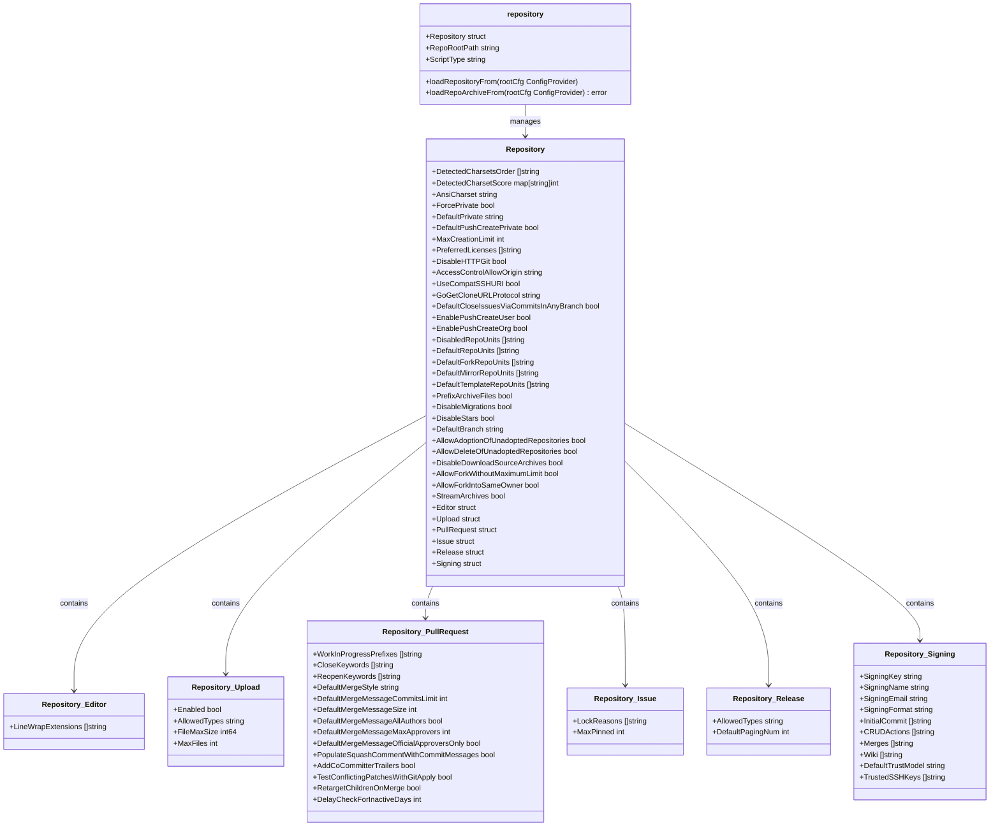

# Configuration

<cite>
**Referenced Files in This Document**   
- [setting.go](file://modules/setting/setting.go)
- [config_provider.go](file://modules/setting/config_provider.go)
- [database.go](file://modules/setting/database.go)
- [server.go](file://modules/setting/server.go)
- [mailer.go](file://modules/setting/mailer.go)
- [storage.go](file://modules/setting/storage.go)
- [repository.go](file://modules/setting/repository.go)
- [security.go](file://modules/setting/security.go)
- [service.go](file://modules/setting/service.go)
- [attachment.go](file://modules/setting/attachment.go)
- [lfs.go](file://modules/setting/lfs.go)
- [cors.go](file://modules/setting/cors.go)
- [session.go](file://modules/setting/session.go)
- [cache.go](file://modules/setting/cache.go)
</cite>

## Table of Contents
1. [Introduction](#introduction)
2. [Configuration Architecture](#configuration-architecture)
3. [Configuration Loading Process](#configuration-loading-process)
4. [Hierarchical Configuration Structure](#hierarchical-configuration-structure)
5. [Database Configuration](#database-configuration)
6. [Server Configuration](#server-configuration)
7. [Email Configuration](#email-configuration)
8. [Storage Configuration](#storage-configuration)
9. [Repository Configuration](#repository-configuration)
10. [Security Configuration](#security-configuration)
11. [Service Configuration](#service-configuration)
12. [Common Configuration Scenarios](#common-configuration-scenarios)
13. [Configuration Precedence and Troubleshooting](#configuration-precedence-and-troubleshooting)
14. [Performance and Security Considerations](#performance-and-security-considerations)

## Introduction

Gitea's configuration system provides a flexible and modular approach to managing application settings through multiple sources including configuration files, environment variables, and command-line flags. This comprehensive system allows administrators to customize Gitea's behavior across various deployment scenarios while maintaining consistency and security. The configuration management is centralized in the `modules/setting` package, which handles the loading, parsing, and distribution of configuration values to all components of the application.

The system is designed to support both simple standalone deployments and complex clustered environments, with features that include hierarchical configuration sections, secure credential management, and runtime configuration validation. This document explores the architecture, implementation, and practical usage of Gitea's configuration system, providing administrators with the knowledge needed to effectively manage their Gitea instances.

**Section sources**
- [setting.go](file://modules/setting/setting.go#L1-L244)

## Configuration Architecture

Gitea's configuration architecture is built around a modular design that separates configuration concerns into distinct components while maintaining a unified interface for accessing settings. The core of this architecture is the `ConfigProvider` interface defined in `config_provider.go`, which abstracts the underlying configuration source and provides a consistent API for reading and manipulating configuration values.

The architecture follows a layered approach where configuration values are loaded from the primary source (typically `app.ini`) and then enhanced with environment variables and command-line flags. This modular design allows for easy extension and testing of the configuration system. Each configuration section is managed by dedicated Go files (e.g., `database.go`, `server.go`, `mailer.go`) that define the specific settings for that domain and provide loading functions that extract values from the configuration provider.

The system uses a combination of global variables and structured configuration types to expose settings to the rest of the application. For example, database settings are stored in the `Database` struct, server settings in various global variables, and mailer settings in the `MailService` variable. This approach provides type safety while allowing for efficient access to configuration values throughout the codebase.


**Diagram sources **
- [config_provider.go](file://modules/setting/config_provider.go#L1-L371)
- [setting.go](file://modules/setting/setting.go#L1-L244)

**Section sources**
- [config_provider.go](file://modules/setting/config_provider.go#L1-L371)
- [setting.go](file://modules/setting/setting.go#L1-L244)

## Configuration Loading Process

The configuration loading process in Gitea follows a well-defined sequence that ensures all settings are properly initialized before the application starts serving requests. The process begins with the initialization of the configuration provider through `InitCfgProvider`, which reads the configuration file (typically `app.ini`) and creates an in-memory representation of the configuration. This provider implements the `ConfigProvider` interface and serves as the central source for all configuration values.

Once the provider is initialized, the loading process proceeds through several stages. First, `loadCommonSettingsFrom` is called to load settings that are required for basic application functionality, including run mode, logging, server, SSH, OAuth2, security, and repository settings. This function calls individual loading functions for each configuration domain in a specific order to ensure dependencies are resolved correctly.

After common settings are loaded, `LoadSettings` is called to load the remaining configuration sections including database, service, OAuth2 client, cache, session, CORS, mail, proxy, webhook, migrations, indexer, task, project, MIME type map, and federation settings. Each loading function extracts values from the configuration provider and stores them in appropriate global variables or structs.

The loading process includes several validation and security checks. For example, `mustCurrentRunUserMatch` verifies that the configured run user matches the actual user running the application (except on Windows). The system also checks for installation lock status and validates critical settings like database connection parameters and security tokens. If any validation fails, the application logs a fatal error and terminates.


**Diagram sources **
- [setting.go](file://modules/setting/setting.go#L1-L244)
- [config_provider.go](file://modules/setting/config_provider.go#L1-L371)

**Section sources**
- [setting.go](file://modules/setting/setting.go#L1-L244)

## Hierarchical Configuration Structure

Gitea's configuration system organizes settings into a hierarchical structure that mirrors the application's functional domains. This structure is implemented through INI file sections, with each major component having its own section and subsections as needed. The hierarchical organization improves readability and maintainability by grouping related settings together and providing a logical framework for configuration management.

The root configuration contains global settings in the default section (unnamed), including `APP_NAME` and `RUN_USER`. Major functional areas are organized into top-level sections such as `[database]`, `[server]`, `[mailer]`, `[security]`, and `[service]`. Some sections have subsections to further organize related settings, such as `[repository.editor]`, `[repository.upload]`, and `[repository.pull-request]`.

This hierarchical approach allows for both broad configuration of system-wide behavior and granular control over specific features. For example, repository settings include general repository behavior in the `[repository]` section, while specific aspects like editor behavior, upload limits, and pull request workflows are configured in their respective subsections. Similarly, service settings include general user and organization policies in the main `[service]` section, with specialized configurations for explore page behavior in the `[service.explore]` subsection.

The system also supports storage-specific configurations through a flexible storage system that allows different storage backends (local, MinIO, Azure Blob) to be configured with their own settings while maintaining a consistent interface. This is achieved through section naming patterns like `[storage]`, `[storage.lfs]`, and `[storage.attachments]`, which enable both shared and specialized configuration for different storage use cases.


**Diagram sources **
- [setting.go](file://modules/setting/setting.go#L1-L244)
- [database.go](file://modules/setting/database.go#L1-L226)
- [server.go](file://modules/setting/server.go#L1-L398)
- [mailer.go](file://modules/setting/mailer.go#L1-L301)
- [security.go](file://modules/setting/security.go#L1-L186)
- [service.go](file://modules/setting/service.go#L1-L295)
- [repository.go](file://modules/setting/repository.go#L1-L367)

**Section sources**
- [setting.go](file://modules/setting/setting.go#L1-L244)

## Database Configuration

The database configuration in Gitea is managed through the `[database]` section of the configuration file and controlled by the functions in `database.go`. This configuration determines how Gitea connects to and interacts with the underlying database system, supporting multiple database types including MySQL, PostgreSQL, MSSQL, and SQLite3.

The `Database` struct defines all configurable database parameters, including connection details (`Type`, `Host`, `Name`, `User`, `Passwd`), connection pooling settings (`MaxIdleConns`, `MaxOpenConns`, `ConnMaxLifetime`), and database-specific options like `SSLMode`, `CharsetCollation`, and `SQLiteJournalMode`. The configuration also includes performance-related settings such as `LogSQL` for enabling SQL query logging and `SlowQueryThreshold` for identifying slow queries.

Database connection parameters are loaded through the `loadDBSetting` function, which extracts values from the configuration provider and applies default values where appropriate. For example, SQLite databases default to a path within the application data directory, and connection timeouts default to 500 milliseconds. The system also handles database-specific connection string formatting through the `DBConnStr` function, which generates the appropriate connection string based on the database type.

Security considerations are integrated into the database configuration, with password values protected from being overwritten if already set. The system also validates database type compatibility and provides clear error messages for unsupported configurations. Connection retries and backoff settings help ensure reliability in environments with intermittent database connectivity issues.


**Diagram sources **
- [database.go](file://modules/setting/database.go#L1-L226)

**Section sources**
- [database.go](file://modules/setting/database.go#L1-L226)

## Server Configuration

The server configuration in Gitea, managed by `server.go`, controls the fundamental behavior of the application server including network settings, protocol configuration, and URL handling. This configuration is critical for determining how Gitea accepts connections, serves content, and presents itself to users and other services.

The `Server` settings include network parameters such as `Domain`, `HTTPAddr`, and `HTTPPort`, which define where the server listens for connections. Protocol configuration is handled through the `Protocol` setting, which supports HTTP, HTTPS, FastCGI, and Unix socket variants. For HTTPS, the configuration includes SSL/TLS settings like `CertFile`, `KeyFile`, `SSLMinimumVersion`, and `SSLCipherSuites` to control encryption strength and compatibility.

URL configuration is a key aspect of server settings, with `AppURL` defining the public root URL of the application and `AppSubURL` handling sub-path deployments. The system automatically validates the `AppURL` format and adjusts it as needed to ensure proper functionality. Additional URL-related settings include `StaticURLPrefix` for static asset serving and `LocalURL` for internal service-to-service communication.

The server configuration also includes operational settings like `EnableGzip` for response compression, `EnablePprof` for performance profiling, and `LandingPageURL` for determining the default page users see when visiting the root URL. Security-related settings include `OfflineMode` to disable external network access and `UnixSocketPermission` to control Unix socket file permissions.


**Diagram sources **
- [server.go](file://modules/setting/server.go#L1-L398)

**Section sources**
- [server.go](file://modules/setting/server.go#L1-L398)

## Email Configuration

The email configuration in Gitea, implemented in `mailer.go`, enables the application to send notifications, registration confirmations, and other email communications through SMTP or sendmail. This configuration is essential for user engagement and system notifications, with settings that control both the technical delivery mechanism and the presentation of emails.

The `Mailer` struct defines all email-related settings, including sender information (`From`, `FromName`, `FromEmail`), SMTP connection parameters (`SMTPAddr`, `SMTPPort`, `User`, `Passwd`), and security settings for TLS/SSL connections. The configuration also includes customization options like `SubjectPrefix` for email subject lines and `FromDisplayNameFormat` for customizing the sender display name using Go templates.

Email delivery methods are configured through the `Protocol` setting, which supports various SMTP variants (plain SMTP, SMTPS, STARTTLS) as well as sendmail and Unix socket connections. For SMTP, the system automatically infers the appropriate port and protocol based on configuration values, with warnings issued for potentially insecure configurations like non-encrypted SMTP to non-local addresses.

The configuration loading process in `loadMailsFrom` includes backward compatibility handling for deprecated settings, automatically mapping old configuration keys to their modern equivalents with appropriate warnings. This ensures smooth upgrades from older Gitea versions while encouraging administrators to update their configuration files.

Security considerations are integrated throughout the email configuration, with validation of email addresses, secure handling of credentials, and warnings about potentially insecure connection methods. The system also supports email header overrides through the `[mailer.override_header]` section, allowing for custom headers to be added to outgoing emails.


**Diagram sources **
- [mailer.go](file://modules/setting/mailer.go#L1-L301)

**Section sources**
- [mailer.go](file://modules/setting/mailer.go#L1-L301)

## Storage Configuration

Gitea's storage configuration system, implemented in `storage.go`, provides a flexible framework for managing file storage across different backends including local filesystem, MinIO/S3-compatible object storage, and Azure Blob Storage. This modular design allows administrators to choose the most appropriate storage solution for their deployment needs while maintaining a consistent interface for the application.

The `Storage` struct defines the common storage interface with fields for storage type, path, and backend-specific configuration. For local storage, the `Path` field specifies the filesystem location, while object storage backends use specialized configuration structs like `MinioStorageConfig` and `AzureBlobStorageConfig` that contain connection details, bucket/container names, and access credentials.

The configuration system supports multiple storage instances through a naming convention that allows different parts of the application to use different storage backends. For example, LFS objects might use S3 storage while attachments use local storage. This is achieved through section patterns like `[storage]`, `[storage.lfs]`, and `[storage.attachments]`, with fallback to default values when specific configurations are not provided.

Storage configuration loading is handled by the `getStorage` function, which resolves the appropriate configuration section based on the requested storage name and type. The system applies default values from the `[storage]` section when specific settings are not provided, and supports path resolution relative to the application data directory. Security considerations include credential masking in logs and configuration outputs through the `ToShadow` methods that replace sensitive values with asterisks.

The configuration also includes performance-related settings like `ServeDirect` for object storage backends, which allows direct URL serving of files without proxying through the Gitea application, improving performance for large file downloads.


**Diagram sources **
- [storage.go](file://modules/setting/storage.go#L1-L343)

**Section sources**
- [storage.go](file://modules/setting/storage.go#L1-L343)

## Repository Configuration

The repository configuration in Gitea, managed by `repository.go`, controls the behavior and settings for Git repositories hosted by the application. This comprehensive configuration system covers repository creation policies, access controls, feature availability, and various operational parameters that affect how repositories function.

The `Repository` struct defines a wide range of settings organized into logical groups. Repository creation policies are controlled by settings like `ForcePrivate`, `DefaultPrivate`, and `MaxCreationLimit`, which determine the default visibility and creation limits for new repositories. Feature availability is managed through boolean flags like `DisableHTTPGit`, `DisableMigrations`, and `DisableStars`, allowing administrators to enable or disable specific repository features.

Repository operational settings include `DefaultBranch` for specifying the default branch name, `PrefixArchiveFiles` for archive file naming, and `StreamArchives` for controlling archive delivery method. The configuration also includes editor settings like `LineWrapExtensions` that determine which file types should have line wrapping enabled in the web editor.

The system supports granular control over repository units (features) through arrays like `DisabledRepoUnits`, `DefaultRepoUnits`, and `DefaultForkRepoUnits`, which allow administrators to specify which features are available by default or disabled entirely. This includes units for packages, actions, and other repository functionality.

Security-related settings include `AllowAdoptionOfUnadoptedRepositories` and `AllowDeleteOfUnadoptedRepositories`, which control whether users can claim or delete repositories that were created by deleted users. The configuration also includes signing settings that determine how commits are signed and verified.



**Diagram sources **
- [repository.go](file://modules/setting/repository.go#L1-L367)

**Section sources**
- [repository.go](file://modules/setting/repository.go#L1-L367)

## Security Configuration

The security configuration in Gitea, implemented in `security.go`, encompasses critical settings that protect the application and its users from various threats. This configuration system manages authentication, authorization, session security, and other security-related parameters that are essential for maintaining a secure deployment.

Key security settings include `InstallLock` which indicates whether the application has been installed and configured, `SecretKey` used for data encryption and CSRF protection, and `InternalToken` for internal service-to-service authentication. The system automatically generates and saves the internal token during installation if it doesn't exist, ensuring that clustered deployments can authenticate internal requests.

Authentication and session security are controlled by settings like `LogInRememberDays` for session duration, `CookieRememberName` for authentication cookie naming, and `CSRFCookieHTTPOnly` for CSRF protection. Password security is managed through `MinPasswordLength`, `PasswordComplexity`, and `PasswordHashAlgo`, which determine minimum password requirements and hashing algorithms.

The configuration also includes reverse proxy authentication settings that allow Gitea to integrate with external authentication systems. These include `ReverseProxyAuthUser`, `ReverseProxyAuthEmail`, and `ReverseProxyAuthFullName` which specify the HTTP headers containing user identity information, and `ReverseProxyTrustedProxies` which defines the trusted proxy networks.

Additional security features include `DisableGitHooks` to prevent execution of potentially malicious Git hooks, `DisableWebhooks` to disable webhook functionality, and `OnlyAllowPushIfGiteaEnvironmentSet` to prevent unauthorized push operations. The system also supports two-factor authentication enforcement through the `TwoFactorAuthEnforced` setting.


**Diagram sources **
- [security.go](file://modules/setting/security.go#L1-L186)

**Section sources**
- [security.go](file://modules/setting/security.go#L1-L186)

## Service Configuration

The service configuration in Gitea, managed by `service.go`, controls user-facing features, registration policies, and various application-wide behaviors that affect the user experience. This comprehensive configuration system allows administrators to tailor Gitea's functionality to their organization's needs and security requirements.

User and organization visibility settings are controlled by `DefaultUserVisibility`, `AllowedUserVisibilityModes`, and `DefaultOrgVisibility`, which determine the default privacy levels for new users and organizations. Registration policies are managed through settings like `DisableRegistration`, `AllowOnlyInternalRegistration`, and `AllowOnlyExternalRegistration`, which control who can create accounts.

Authentication and security features are configured through settings like `EnableCaptcha`, `RequireCaptchaForLogin`, and `EnableReverseProxyAuth`, which determine whether CAPTCHA challenges are used and how reverse proxy authentication is handled. The system supports multiple CAPTCHA providers including reCAPTCHA, hCaptcha, and Cloudflare Turnstile.

Time tracking and dependency management features are controlled by `EnableTimetracking`, `DefaultEnableTimetracking`, and `DefaultEnableDependencies`, which determine whether these features are available and their default state. User interface settings include `AutoWatchNewRepos` for automatically watching newly created repositories and `EnableUserHeatmap` for displaying user activity heatmaps.

The configuration also includes explore page settings that control visibility of various content types through `Explore.RequireSigninView`, `Explore.DisableUsersPage`, and similar settings. Quality of service settings in the `QoS` struct allow administrators to control request handling behavior with parameters like `MaxInFlightRequests` and `MaxWaitingRequests`.


**Diagram sources **
- [service.go](file://modules/setting/service.go#L1-L295)

**Section sources**
- [service.go](file://modules/setting/service.go#L1-L295)

## Common Configuration Scenarios

### SMTP Setup

Configuring SMTP for email delivery involves setting up the `[mailer]` section with appropriate connection details and authentication parameters. For a typical SMTP configuration with TLS encryption, the configuration would include:

```ini
[mailer]
ENABLED = true
FROM = noreply@gitea.example.com
PROTOCOL = smtp+starttls
SMTP_ADDR = smtp.example.com
SMTP_PORT = 587
USER = gitea-user
PASSWD = your-password
```

For environments requiring client certificates, additional settings can be specified:

```ini
[mailer]
USE_CLIENT_CERT = true
CLIENT_CERT_FILE = /path/to/client-cert.pem
CLIENT_KEY_FILE = /path/to/client-key.pem
```

When using sendmail instead of SMTP, the configuration would specify:

```ini
[mailer]
ENABLED = true
FROM = noreply@gitea.example.com
PROTOCOL = sendmail
SENDMAIL_PATH = /usr/sbin/sendmail
```

### Reverse Proxy Configuration

Configuring Gitea behind a reverse proxy requires careful coordination between the proxy server and Gitea's configuration. The `[server]` section must be configured with the correct `DOMAIN` and `ROOT_URL` to match the proxy's external address:

```ini
[server]
DOMAIN = git.example.com
ROOT_URL = https://git.example.com/
```

If the reverse proxy terminates SSL/TLS, Gitea should be configured to trust the proxy's headers:

```ini
[server]
REDIRECT_OTHER_PORT = true
PORT_TO_REDIRECT = 80
```

For reverse proxy authentication, where the proxy handles user authentication and passes identity information to Gitea:

```ini
[security]
ENABLE_REVERSE_PROXY_AUTHENTICATION = true
REVERSE_PROXY_AUTHENTICATION_USER = X-Forwarded-User
REVERSE_PROXY_AUTHENTICATION_EMAIL = X-Forwarded-Email
REVERSE_PROXY_TRUSTED_PROXIES = 192.168.1.0/24, 10.0.0.1
```

### Storage Backend Configuration

Configuring alternative storage backends allows Gitea to scale beyond local filesystem limitations. For MinIO/S3-compatible storage:

```ini
[storage]
STORAGE_TYPE = minio
MINIO_ENDPOINT = minio.example.com:9000
MINIO_ACCESS_KEY_ID = your-access-key
MINIO_SECRET_ACCESS_KEY = your-secret-key
MINIO_BUCKET = gitea
MINIO_USE_SSL = true

[storage.lfs]
STORAGE_TYPE = minio
MINIO_ENDPOINT = minio.example.com:9000
MINIO_ACCESS_KEY_ID = your-access-key
MINIO_SECRET_ACCESS_KEY = your-secret-key
MINIO_BUCKET = gitea-lfs
MINIO_USE_SSL = true
SERVE_DIRECT = true
```

For Azure Blob Storage:

```ini
[storage]
STORAGE_TYPE = azureblob
AZURE_BLOB_ENDPOINT = https://youraccount.blob.core.windows.net
AZURE_BLOB_ACCOUNT_NAME = youraccount
AZURE_BLOB_ACCOUNT_KEY = your-key
AZURE_BLOB_CONTAINER = gitea
```

Local storage with custom paths:

```ini
[storage]
STORAGE_TYPE = local
PATH = /mnt/storage/gitea/

[storage.attachments]
PATH = /mnt/storage/gitea/attachments/
```

**Section sources**
- [mailer.go](file://modules/setting/mailer.go#L1-L301)
- [server.go](file://modules/setting/server.go#L1-L398)
- [storage.go](file://modules/setting/storage.go#L1-L343)

## Configuration Precedence and Troubleshooting

Gitea's configuration system follows a specific precedence order when resolving settings: command-line flags take precedence over environment variables, which in turn take precedence over configuration file values. This hierarchy allows administrators to override settings at different levels depending on their deployment needs.

When troubleshooting configuration issues, common problems include syntax errors in the `app.ini` file, incorrect file permissions, and conflicting settings. The system provides startup validation that logs fatal errors for critical configuration problems, such as invalid database connection parameters or missing required settings.

Environment variable precedence can lead to unexpected behavior if not properly understood. For example, setting `GITEA__DATABASE__HOST` as an environment variable will override the `HOST` value in the `[database]` section of `app.ini`, even if the environment variable is set unintentionally.

Configuration file syntax errors are a common source of problems. The INI format requires proper section headers in square brackets, key-value pairs separated by equals signs, and proper escaping of special characters. Comments must use semicolons or hash symbols at the beginning of lines.

The system includes several mechanisms to help identify configuration issues. Deprecated settings generate warning messages in the logs, helping administrators identify outdated configuration options. The `LogStartupProblem` function records various configuration issues that can be reviewed during startup.

For complex configuration problems, administrators can enable debug logging to see detailed information about configuration loading and validation. The system also provides command-line tools like `gitea doctor` that can diagnose common configuration issues and suggest fixes.

**Section sources**
- [setting.go](file://modules/setting/setting.go#L1-L244)
- [config_provider.go](file://modules/setting/config_provider.go#L1-L371)

## Performance and Security Considerations

Optimizing Gitea's configuration for performance involves tuning various parameters that affect resource utilization and response times. Database connection pooling settings like `MaxIdleConns` and `MaxOpenConns` should be adjusted based on the expected load and database server capacity. For high-traffic instances, increasing these values can improve performance by reducing connection overhead.

Caching configuration in the `[cache]` section significantly impacts performance. The `Adapter` setting can be configured to use Redis or memcache for distributed caching in clustered deployments, while the `TTL` settings control how long cached data is retained. The `LastCommit` cache settings are particularly important for repository performance, as they reduce the need to query Git for recent commit information.

Security implications of configuration settings are critical for maintaining a secure deployment. The `SecretKey` should be a strong, randomly generated value and kept confidential, as it protects against CSRF attacks and encrypts sensitive data. Password security settings like `MinPasswordLength` and `PasswordComplexity` should be configured to meet organizational security requirements.

The `DisableGitHooks` setting has important security implications, as enabling Git hooks allows repository owners to execute arbitrary code on the server. This should only be enabled in trusted environments with appropriate isolation measures. Similarly, `ImportLocalPaths` should be disabled in multi-tenant environments to prevent unauthorized access to the server's filesystem.

Network security settings like `SSLMinimumVersion` and `SSLCipherSuites` should be configured to disable weak cryptographic protocols and ciphers. For HTTPS deployments, using modern TLS versions (1.2 or higher) and strong cipher suites helps protect against various network-based attacks.

Regular security reviews of configuration settings are recommended, particularly for settings that control feature availability and access controls. The configuration system itself should be protected with appropriate file permissions (typically 600) to prevent unauthorized modifications.

**Section sources**
- [setting.go](file://modules/setting/setting.go#L1-L244)
- [database.go](file://modules/setting/database.go#L1-L226)
- [cache.go](file://modules/setting/cache.go#L1-L86)
- [security.go](file://modules/setting/security.go#L1-L186)