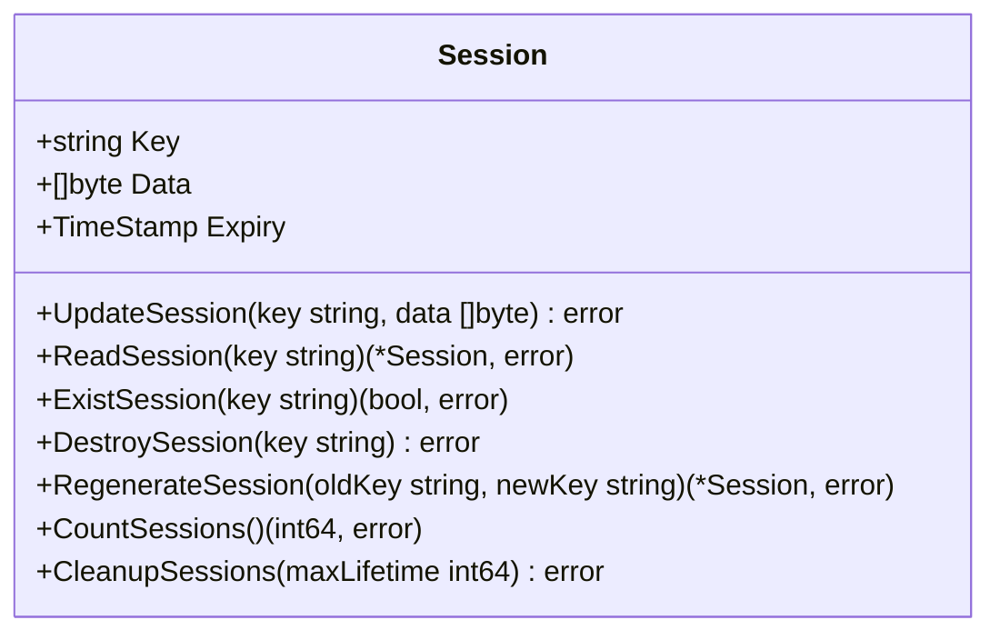
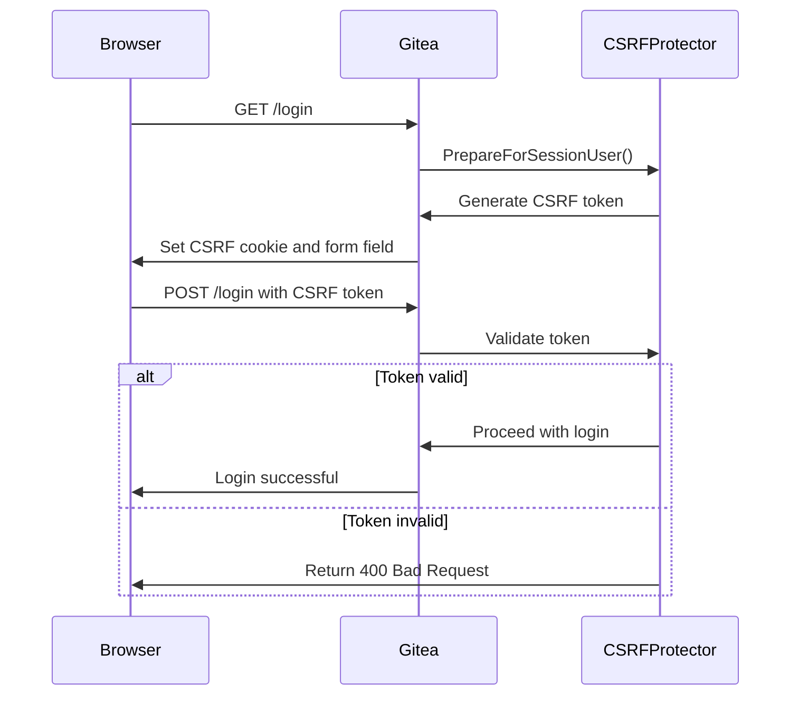
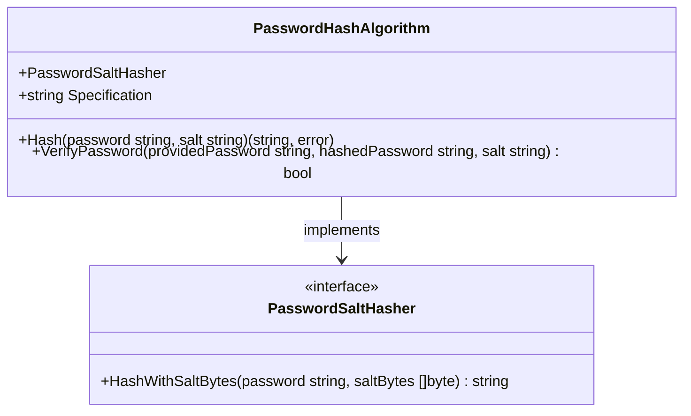
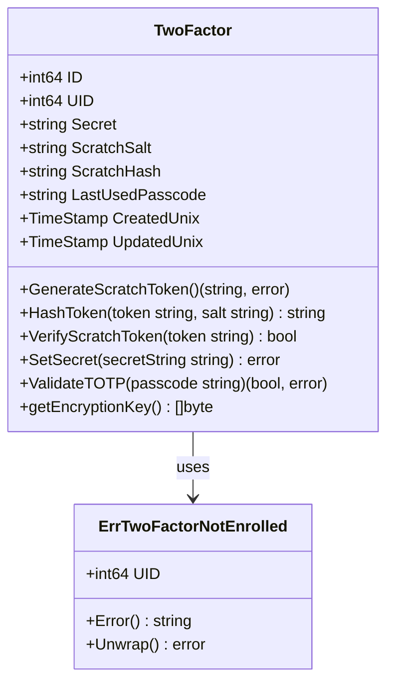

# Security Settings

<cite>
**Referenced Files in This Document**   
- [security.go](file://modules/setting/security.go)
- [twofactor.go](file://models/auth/twofactor.go)
- [hash.go](file://modules/auth/password/hash/hash.go)
- [csrf.go](file://services/context/csrf.go)
- [session.go](file://models/auth/session.go)
</cite>

## Table of Contents
1. [Introduction](#introduction)
2. [Authentication Methods](#authentication-methods)
3. [Session Management](#session-management)
4. [CSRF Protection](#csrf-protection)
5. [Password Policies](#password-policies)
6. [Two-Factor Authentication](#two-factor-authentication)
7. [Account Locking and Brute Force Protection](#account-locking-and-brute-force-protection)
8. [Secure Cookies and HTTPS Enforcement](#secure-cookies-and-https-enforcement)
9. [Security Headers](#security-headers)
10. [Common Security Issues](#common-security-issues)

## Introduction
Gitea provides comprehensive security configuration options to protect user accounts, prevent unauthorized access, and ensure data integrity. This document details the security settings implementation in Gitea, focusing on authentication methods, session management, CSRF protection, password policies, and two-factor authentication. The configuration is primarily managed through the `modules/setting/security.go` file, which defines various security-related parameters and their default values. These settings can be customized in the `app.ini` configuration file to meet specific security requirements.

## Authentication Methods
Gitea supports multiple authentication methods, including local account authentication, LDAP, SMTP, PAM, OAuth2, and SSPI. The authentication process is handled by the `auth` package, which provides a flexible framework for integrating different authentication sources. Local account authentication verifies user credentials against stored password hashes, while external authentication methods delegate the authentication process to external services. The `ReverseProxyAuthUser`, `ReverseProxyAuthEmail`, and `ReverseProxyAuthFullName` settings in `security.go` configure the HTTP headers used for reverse proxy authentication, allowing Gitea to integrate with external authentication systems.

**Section sources**
- [security.go](file://modules/setting/security.go#L1-L185)

## Session Management
Gitea implements session management to maintain user authentication state across requests. Sessions are stored in a database table named `session` with fields for the session key, data, and expiry timestamp. The session system uses the `go-chi/session` compatible structure, allowing for seamless integration with the web framework. Session data is encrypted using the application's secret key, and sessions are automatically cleaned up when they expire. The `LogInRememberDays` setting determines how long login sessions are remembered, while the `CookieRememberName` setting specifies the name of the cookie used to store the remember-me token.

**Diagram sources**
- [session.go](file://models/auth/session.go#L0-L112)

**Section sources**
- [session.go](file://models/auth/session.go#L0-L112)

## CSRF Protection
Gitea implements CSRF (Cross-Site Request Forgery) protection to prevent unauthorized commands from being transmitted from a user that the web application trusts. The CSRF protection system generates unique tokens for each user session and validates these tokens on form submissions and API requests. The `CSRFCookieName` setting specifies the name of the cookie used to store the CSRF token, while the `CSRFCookieHTTPOnly` setting determines whether the cookie should be accessible only through HTTP(S) and not through JavaScript. The CSRF protection system is implemented in the `services/context/csrf.go` file, which provides middleware for generating and validating CSRF tokens.

**Diagram sources**
- [csrf.go](file://services/context/csrf.go#L0-L167)

**Section sources**
- [csrf.go](file://services/context/csrf.go#L0-L167)

## Password Policies
Gitea enforces password policies to ensure that user passwords meet minimum security requirements. The `MinPasswordLength` setting specifies the minimum length for passwords, while the `PasswordComplexity` setting defines complexity requirements such as requiring uppercase, lowercase, numbers, and special characters. Passwords are hashed using configurable algorithms, with the default being PBKDF2. The `PasswordHashAlgo` setting allows administrators to specify the password hashing algorithm, supporting various configurations for different security requirements. Passwords are verified using constant-time comparison to prevent timing attacks.

**Diagram sources**
- [hash.go](file://modules/auth/password/hash/hash.go#L0-L189)

**Section sources**
- [hash.go](file://modules/auth/password/hash/hash.go#L0-L189)

## Two-Factor Authentication
Gitea supports two-factor authentication (2FA) to provide an additional layer of security for user accounts. The 2FA system is implemented using TOTP (Time-Based One-Time Password) and backup scratch tokens. When a user enables 2FA, a secret key is generated and stored encrypted in the database. The user can then use an authenticator app to generate time-based codes for login. Additionally, backup scratch tokens are provided to allow account recovery if the user loses access to their authenticator app. The `TwoFactorAuthEnforced` setting can be used to require all users to enable 2FA.

**Diagram sources**
- [twofactor.go](file://models/auth/twofactor.go#L0-L176)

**Section sources**
- [twofactor.go](file://models/auth/twofactor.go#L0-L176)

## Account Locking and Brute Force Protection
Gitea includes mechanisms to protect against brute force attacks and unauthorized access attempts. While the provided code does not explicitly show account locking functionality, the framework supports implementing such features through custom authentication methods or middleware. The `SuccessfulTokensCacheSize` setting helps prevent token replay attacks by caching recently used successful authentication tokens. Additionally, the reverse proxy authentication settings include rate limiting through the `ReverseProxyLimit` parameter, which can help mitigate brute force attacks when using external authentication systems.

## Secure Cookies and HTTPS Enforcement
Gitea provides configuration options to ensure secure cookie handling and enforce HTTPS connections. The `CSRFCookieHTTPOnly` setting ensures that CSRF cookies are not accessible via JavaScript, reducing the risk of cross-site scripting attacks. While the provided code does not show explicit HTTPS enforcement settings, Gitea's server configuration includes options for SSL/TLS setup, certificate management, and HTTP to HTTPS redirection. The application URL configuration in `server.go` allows administrators to specify the root URL with HTTPS protocol, ensuring that all generated links use secure connections.

## Security Headers
Gitea implements various security headers to enhance protection against common web vulnerabilities. While the specific header implementation is not shown in the provided code, the framework supports setting headers such as Content Security Policy (CSP), X-Content-Type-Options, X-Frame-Options, and X-XSS-Protection. These headers help prevent cross-site scripting, clickjacking, and MIME type sniffing attacks. The CSRF protection system also contributes to security by setting appropriate cookie attributes and validating request authenticity.

## Common Security Issues
Gitea addresses several common security issues through its configuration and implementation:

**Session Fixation**: Gitea prevents session fixation attacks by regenerating session IDs after successful authentication. The session management system ensures that session keys are cryptographically secure and unpredictable.

**Token Leakage**: The application minimizes token leakage risks by using secure cookie attributes (HttpOnly, Secure) and avoiding token transmission through URLs when possible. The `DisableQueryAuthToken` setting can be used to disable authentication via query parameters, reducing the risk of tokens being logged in server logs or referer headers.

**Insecure Direct Object References**: Gitea implements proper authorization checks throughout the application to prevent unauthorized access to resources. The authentication and authorization systems ensure that users can only access objects they have permission to view or modify.

**Section sources**
- [security.go](file://modules/setting/security.go#L1-L185)
- [twofactor.go](file://models/auth/twofactor.go#L0-L176)
- [hash.go](file://modules/auth/password/hash/hash.go#L0-L189)
- [csrf.go](file://services/context/csrf.go#L0-L167)
- [session.go](file://models/auth/session.go#L0-L112)