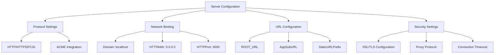
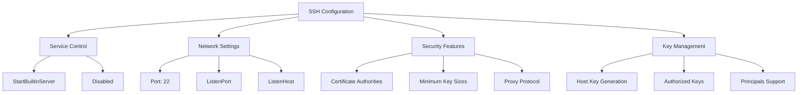
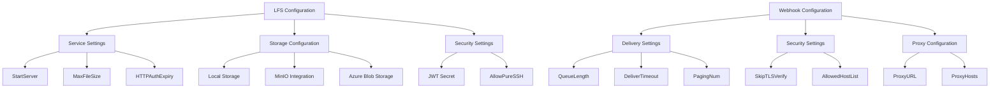
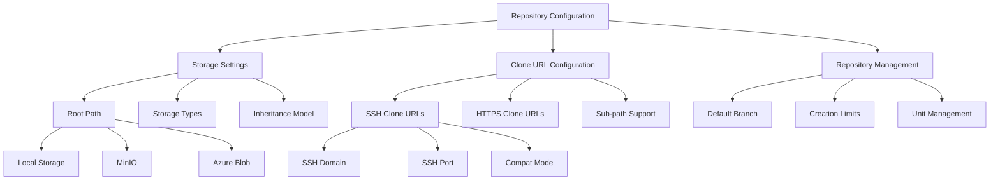
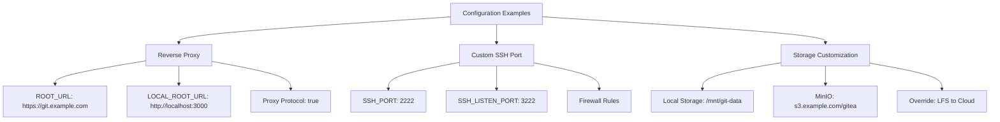
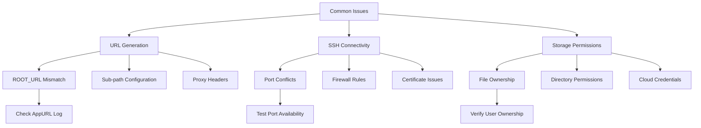

# Server Configuration

<cite>
**Referenced Files in This Document**   
- [server.go](file://modules/setting/server.go)
- [repository.go](file://modules/setting/repository.go)
- [ssh.go](file://modules/setting/ssh.go)
- [lfs.go](file://modules/setting/lfs.go)
- [webhook.go](file://modules/setting/webhook.go)
- [storage.go](file://modules/setting/storage.go)
</cite>

## Table of Contents
1. [Introduction](#introduction)
2. [HTTP/HTTPS Binding and Application URL](#httphttps-binding-and-application-url)
3. [SSH Service Configuration](#ssh-service-configuration)
4. [LFS and Webhook Delivery Settings](#lfs-and-webhook-delivery-settings)
5. [Repository Storage and Clone URL Configuration](#repository-storage-and-clone-url-configuration)
6. [Practical Configuration Examples](#practical-configuration-examples)
7. [Common Issues and Troubleshooting](#common-issues-and-troubleshooting)
8. [Performance and Security Considerations](#performance-and-security-considerations)

## Introduction
This document provides comprehensive guidance on Gitea's server and repository configuration, focusing on critical settings that control system accessibility, repository management, and service integration. The configuration system is primarily managed through the `modules/setting` package, which handles various aspects of server operation including HTTP/HTTPS binding, SSH services, LFS (Large File Storage), webhook delivery, and repository storage paths. Understanding these configurations is essential for properly deploying and maintaining a Gitea instance, ensuring optimal performance, security, and user accessibility.

## HTTP/HTTPS Binding and Application URL

The server configuration in Gitea controls fundamental aspects of how the application is accessed and presented to users. The primary settings for HTTP/HTTPS binding are defined in the `[server]` section of the configuration file and include critical parameters such as domain, port, and protocol. The `PROTOCOL` setting determines whether the server operates over HTTP, HTTPS, or other supported protocols like FCGI, with HTTPS requiring appropriate certificate files when ACME (Automated Certificate Management Environment) is not enabled.

The application URL, represented by the `ROOT_URL` configuration, is crucial for generating correct links throughout the system. This URL must accurately reflect the public address where Gitea is accessible, as it's used to construct clone URLs, webhook callbacks, and various internal links. The system automatically validates the `ROOT_URL` and adjusts it by removing default port specifications (80 for HTTP, 443 for HTTPS) to ensure clean URL formatting. When the `ROOT_URL` differs from the configured domain, the system automatically updates the domain setting to match the URL's hostname, ensuring consistency.

Additional settings enhance server functionality and security. The `LOCAL_ROOT_URL` specifies the address for internal services and background jobs to contact Gitea, which can differ from the public URL in complex deployment scenarios. Security-related configurations include SSL/TLS version constraints (`SSL_MIN_VERSION`, `SSL_MAX_VERSION`), cipher suite preferences, and curve preferences, allowing administrators to enforce modern cryptographic standards. The system also supports proxy protocol handling for deployments behind load balancers, with options to accept unknown addresses and configure header timeouts.

**Diagram sources**
- [server.go](file://modules/setting/server.go#L81-L122)
- [server.go](file://modules/setting/server.go#L171-L212)

**Section sources**
- [server.go](file://modules/setting/server.go#L0-L397)

## SSH Service Configuration

Gitea's SSH service configuration provides secure access to repositories through the SSH protocol, with flexible options for deployment and integration. The SSH settings are managed through the `SSH` struct in the server configuration, allowing administrators to control whether the built-in SSH server is enabled, the port it listens on, and various security parameters. By default, the SSH service runs on port 22, but this can be customized to avoid conflicts with existing SSH servers or to implement non-standard configurations.

The built-in SSH server can be configured to listen on a specific host interface through the `SSH_LISTEN_HOST` setting, while `SSH_PORT` defines the public SSH port that appears in clone URLs. This separation allows the server to bind to a different internal port while presenting a standard external port to users. The configuration also includes support for SSH certificates through trusted certificate authorities, enabling certificate-based authentication for enhanced security in enterprise environments.

Key management is an important aspect of SSH configuration, with Gitea automatically generating host keys if they don't exist. The server host keys are stored in the data directory and can be specified explicitly in the configuration. Additional security features include minimum key size enforcement for different key types (RSA, ECDSA, Ed25519), with configurable size requirements to balance security and compatibility. The system also supports proxy protocol integration for SSH connections, which is essential when running behind certain types of load balancers or reverse proxies.

**Diagram sources**
- [ssh.go](file://modules/setting/ssh.go#L0-L186)
- [ssh.go](file://modules/ssh/ssh.go#L0-L440)

**Section sources**
- [ssh.go](file://modules/setting/ssh.go#L0-L186)

## LFS and Webhook Delivery Settings

Gitea's configuration system provides comprehensive support for Git Large File Storage (LFS) and webhook delivery, enabling advanced repository functionality and integration capabilities. The LFS configuration, defined in the `[server]` section, allows administrators to enable the LFS server, set maximum file sizes, and configure authentication parameters. When enabled, the LFS server handles large file storage separately from the Git repository, improving performance and reducing repository bloat.

The LFS implementation includes several important security and performance settings. The `LFS_JWT_SECRET` is automatically generated if not provided, ensuring secure authentication for LFS operations. The `LFS_HTTP_AUTH_EXPIRY` setting controls how long authentication tokens remain valid, balancing security with usability. Administrators can also configure storage backends for LFS content, with support for local storage, MinIO, and Azure Blob Storage, allowing integration with existing storage infrastructure.

Webhook delivery settings control how Gitea notifies external services about repository events. The configuration includes a queue system with configurable length (`QUEUE_LENGTH`) to handle bursts of events, and a delivery timeout (`DELIVER_TIMEOUT`) that prevents hanging requests. Security features include the ability to skip TLS verification for internal services and a proxy configuration for webhook requests that must traverse corporate firewalls. The system supports multiple webhook types including Gitea, Gogs, Slack, Discord, and various other collaboration tools, making it highly versatile for different integration scenarios.

**Diagram sources**
- [lfs.go](file://modules/setting/lfs.go#L0-L102)
- [webhook.go](file://modules/setting/webhook.go#L0-L50)

**Section sources**
- [lfs.go](file://modules/setting/lfs.go#L0-L102)
- [webhook.go](file://modules/setting/webhook.go#L0-L50)

## Repository Storage and Clone URL Configuration

The repository configuration in Gitea controls how repositories are stored on disk and how they are accessed by users through clone URLs. The primary storage location is defined by the `ROOT` setting in the `[repository]` section, which specifies the base directory where all repositories are stored. By default, this is set to a subdirectory within the application data path, but it can be customized to use external storage systems or network-mounted drives for scalability and backup purposes.

Storage configuration extends beyond simple path settings through Gitea's flexible storage system. The `storage` package provides a unified interface for different storage backends, including local filesystem, MinIO, and Azure Blob Storage. Each storage type can be configured with specific parameters such as bucket names, endpoints, and access credentials. The system supports inheritance and overriding of storage configurations, allowing administrators to define global defaults while specifying exceptions for particular services like attachments, LFS, or package storage.

Clone URL templates are automatically generated based on the server configuration, but can be customized through settings like `USE_COMPAT_SSH_URI` and `GO_GET_CLONE_URL_PROTOCOL`. The system generates both SSH and HTTPS clone URLs for each repository, with the protocol and host information derived from the server settings. For SSH access, the clone URL uses the configured SSH domain and port, while HTTPS URLs are based on the application's root URL. The configuration also supports sub-path deployments, where Gitea is served from a subdirectory of a domain, with appropriate adjustments to the clone URLs.

**Diagram sources**
- [repository.go](file://modules/setting/repository.go#L23-L54)
- [storage.go](file://modules/setting/storage.go#L0-L342)

**Section sources**
- [repository.go](file://modules/setting/repository.go#L0-L366)
- [storage.go](file://modules/setting/storage.go#L0-L342)

## Practical Configuration Examples

Implementing Gitea in various deployment scenarios requires specific configuration approaches to address different requirements. For reverse proxy setups, where Gitea runs behind nginx, Apache, or similar web servers, the configuration must account for the proxy's handling of requests. The `ROOT_URL` should reflect the public URL through which users access Gitea, while `LOCAL_ROOT_URL` can point to the internal address. Proxy protocol settings may be necessary if the reverse proxy forwards connection information, and appropriate headers should be trusted for public URL detection.

Custom SSH port configurations are common when running Gitea alongside an existing SSH server. By setting `SSH_PORT` to a non-standard value (e.g., 2222) and configuring the built-in server to listen on a different internal port, administrators can avoid conflicts while maintaining standard SSH access patterns. The SSH configuration should also include proper firewall rules and potentially certificate-based authentication for enhanced security in production environments.

Storage path customization allows Gitea to integrate with existing storage infrastructure. For local storage, the repository root can be set to a dedicated drive or network share with appropriate permissions. For cloud storage, configurations for MinIO or Azure Blob Storage can be specified with access credentials and bucket information. The storage system's inheritance model allows global settings to be overridden for specific services, enabling scenarios like storing LFS content in cloud storage while keeping repositories on local disk.

**Diagram sources**
- [server.go](file://modules/setting/server.go#L171-L212)
- [ssh.go](file://modules/setting/ssh.go#L0-L186)
- [storage.go](file://modules/setting/storage.go#L0-L342)

**Section sources**
- [server.go](file://modules/setting/server.go#L0-L397)
- [ssh.go](file://modules/setting/ssh.go#L0-L186)
- [storage.go](file://modules/setting/storage.go#L0-L342)

## Common Issues and Troubleshooting

Several common issues can arise when configuring Gitea's server and repository settings, often related to URL generation, SSH connectivity, and storage path permissions. Incorrect URL generation is typically caused by misconfigured `ROOT_URL` settings that don't match the actual public address of the server. This manifests as broken links, incorrect clone URLs, or webhook delivery failures. The issue can be resolved by ensuring the `ROOT_URL` exactly matches the address users type in their browsers, including the correct protocol, domain, and port if non-standard.

SSH connectivity problems frequently occur due to port conflicts, firewall restrictions, or incorrect SSH configuration. When the built-in SSH server conflicts with an existing SSH daemon, changing the `SSH_PORT` and `SSH_LISTEN_PORT` settings can resolve the issue. Firewall rules must allow traffic on the configured SSH port, and security groups in cloud environments should be appropriately configured. Certificate-based authentication issues often stem from improperly formatted CA keys or incorrect principal configuration, which can be diagnosed by checking server logs for authentication failure messages.

Storage path permission issues are common, especially when running Gitea under different user accounts or in containerized environments. The application requires read and write access to the repository root and data directories, with proper ownership and permissions. On Unix-like systems, the Gitea process user must have execute permission on all parent directories and read/write permission on the storage locations. For cloud storage backends, authentication credentials must be correctly configured with appropriate permissions on the target buckets or containers.

**Diagram sources**
- [server.go](file://modules/setting/server.go#L327-L366)
- [ssh.go](file://modules/setting/ssh.go#L0-L186)
- [storage.go](file://modules/setting/storage.go#L0-L342)

**Section sources**
- [server.go](file://modules/setting/server.go#L0-L397)
- [ssh.go](file://modules/setting/ssh.go#L0-L186)
- [storage.go](file://modules/setting/storage.go#L0-L342)

## Performance and Security Considerations

Optimizing Gitea's performance and security requires careful consideration of server settings and their implications. Connection handling settings such as `PER_WRITE_TIMEOUT` and `PER_WRITE_PER_KB_TIMEOUT` control how long the server waits for write operations, preventing hung connections while accommodating slower network conditions. The static file cache time can be adjusted to balance freshness with performance, with longer cache durations reducing server load at the expense of delayed content updates.

Security implications vary significantly across different server settings. HTTPS configuration with proper certificates and modern cipher suites protects data in transit, while disabling older SSL/TLS versions prevents known vulnerabilities. The SSH server's minimum key size requirements ensure cryptographic strength, though overly restrictive settings may break compatibility with older clients. Disabling HTTP Git access can enhance security by forcing all repository operations through authenticated channels, though this may impact certain workflows.

For high-traffic instances, several performance optimizations are available. Enabling Gzip compression reduces bandwidth usage, while configuring appropriate cache headers improves client-side performance. The built-in SSH server can handle connection multiplexing efficiently, reducing the overhead of establishing new SSH sessions. For webhook delivery, adjusting the queue length and delivery timeout can prevent message loss during peak loads while ensuring timely delivery to integrated services.

```mermaid
graph TD
A[Performance Considerations] --> B[Connection Handling]
A --> C[Caching Strategies]
A --> D[Resource Limits]
B --> B1[Write Timeouts]
B --> B2[Graceful Restart]
B --> B3[Hammer Time]
C --> C1[Static Cache Time]
C --> C2[Gzip Compression]
C --> C3[Memory Caching]
D --> D1[File Size Limits]
D --> D2[Concurrent Operations]
D --> D3[Queue Lengths]
E[Security Considerations] --> F[Encryption]
E --> G[Authentication]
E --> H[Access Control]
F --> F1[SSL/TLS Configuration]
F --> F2[SSH Key Strength]
F --> F3[Certificate Validation]
G --> G1[ACME Integration]
G --> G2[Proxy Authentication]
G --> G3[Two-factor Support]
H --> H1[Host Restrictions]
H --> H2[Webhook Security]
H --> H3[Private Mode]
```

**Diagram sources**
- [server.go](file://modules/setting/server.go#L81-L122)
- [webhook.go](file://modules/setting/webhook.go#L0-L50)
- [lfs.go](file://modules/setting/lfs.go#L0-L102)

**Section sources**
- [server.go](file://modules/setting/server.go#L0-L397)
- [webhook.go](file://modules/setting/webhook.go#L0-L50)
- [lfs.go](file://modules/setting/lfs.go#L0-L102)