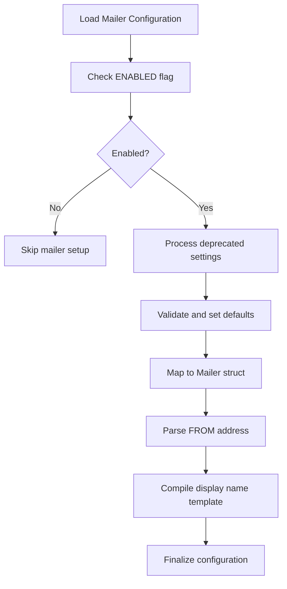
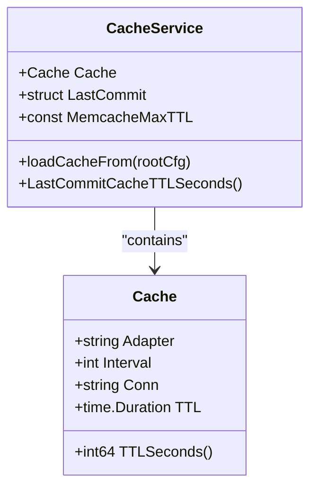
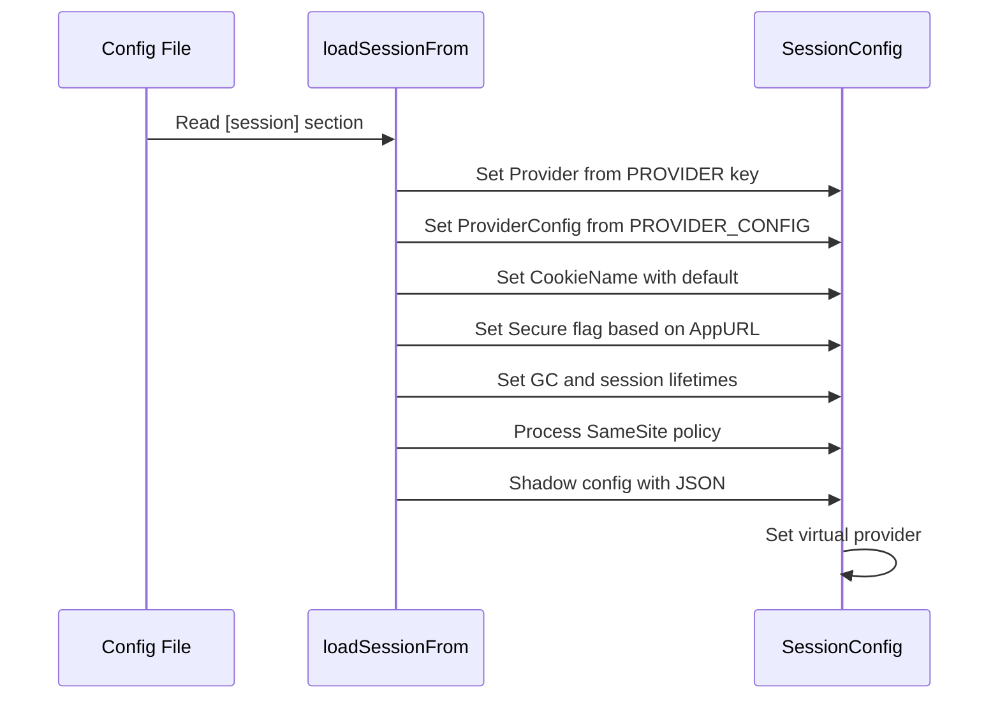

# Service Configuration

<cite>
**Referenced Files in This Document**   
- [cache.go](file://modules/setting/cache.go)
- [mailer.go](file://modules/setting/mailer.go)
- [session.go](file://modules/setting/session.go)
- [database.go](file://modules/setting/database.go)
- [app.ini](file://docker/root/etc/templates/app.ini)
</cite>

## Table of Contents
1. [Introduction](#introduction)
2. [Mailer Configuration](#mailer-configuration)
3. [Cache Configuration](#cache-configuration)
4. [Session Configuration](#session-configuration)
5. [Common Configuration Issues](#common-configuration-issues)
6. [Conclusion](#conclusion)

## Introduction
Gitea provides robust service configuration options for critical components including mailer, cache, and session services. These services are essential for email notifications, performance optimization, and user session management. The configuration is primarily handled through the `app.ini` file and corresponding Go configuration modules in the `modules/setting/` directory. This document provides comprehensive guidance on configuring these services with practical examples and best practices.

## Mailer Configuration

Gitea's mailer service enables email notifications for user registration, password resets, issue updates, and other system events. The configuration is defined in the `[mailer]` section of the configuration file and implemented in the `modules/setting/mailer.go` module.

### SMTP Email Delivery Configuration
The mailer service supports multiple protocols including SMTP, SMTPS, STARTTLS, and Unix socket connections. Key configuration options include:

- **PROTOCOL**: Specifies the mail protocol (`smtp`, `smtps`, `smtp+starttls`, `smtp+unix`, `sendmail`, or `dummy`)
- **SMTP_ADDR**: SMTP server address
- **SMTP_PORT**: SMTP server port (defaults to 25, 465, or 587 based on protocol)
- **USER**: SMTP authentication username
- **PASSWD**: SMTP authentication password
- **FROM**: Sender email address
- **SUBJECT_PREFIX**: Prefix for all email subjects

### TLS/SSL Settings and Authentication
Gitea provides comprehensive security options for email transmission:

- **FORCE_TRUST_SERVER_CERT**: Bypasses certificate validation (not recommended for production)
- **USE_CLIENT_CERT**: Enables client certificate authentication
- **CLIENT_CERT_FILE** and **CLIENT_KEY_FILE**: Paths to client certificate and key files
- Automatic protocol inference based on port number (25=smtp, 465=smtps, 587=smtp+starttls)

The system includes deprecation handling for older configuration options, automatically mapping legacy settings like `IS_TLS_ENABLED` to current equivalents.

### Sender Address Configuration
The `FROM` field specifies the sender address, which can be a simple email or a formatted address like `"Gitea Server" <noreply@gitea.example.com>`. The system parses this into separate name and email components. The `ENVELOPE_FROM` option allows specification of the SMTP envelope sender address, with special handling for empty envelopes (`<>`).

**Diagram sources**
- [mailer.go](file://modules/setting/mailer.go#L20-L300)

**Section sources**
- [mailer.go](file://modules/setting/mailer.go#L20-L300)
- [app.ini](file://docker/root/etc/templates/app.ini#L1-L62)

## Cache Configuration

Gitea's caching system improves performance by storing frequently accessed data in memory or external stores. The configuration is managed through the `[cache]` section and implemented in `modules/setting/cache.go`.

### Redis and In-Memory Caching
Gitea supports multiple cache adapters:

- **memory**: In-process memory cache (default)
- **redis**: Redis server cache
- **memcache**: Memcached server
- **twoqueue**: TwoQ cache with specified capacity

For Redis configuration, the `HOST` parameter specifies the connection string in the format `host:port[,password][,db_index]`. The memory adapter requires no additional configuration.

### Expiration Policies and Connection Settings
Key cache configuration options include:

- **ADAPTER**: Cache backend type
- **ITEM_TTL**: Time-to-live for cached items
- **HOST**: Connection string for external caches
- **INTERVAL**: Cache cleanup interval in seconds

The system implements special handling for memcache's 30-day TTL limit, converting long TTLs to Unix timestamps when necessary. The `LastCommit` cache section configures a separate TTL for repository commit data.

**Diagram sources**
- [cache.go](file://modules/setting/cache.go#L15-L85)

**Section sources**
- [cache.go](file://modules/setting/cache.go#L15-L85)
- [app.ini](file://docker/root/etc/templates/app.ini#L1-L62)

## Session Configuration

Gitea's session management system handles user authentication state across requests. The configuration is defined in the `[session]` section and implemented in `modules/setting/session.go`.

### Session Store Configuration
Gitea supports multiple session storage backends:

- **memory**: In-process memory storage
- **file**: File system storage
- **redis**: Redis server storage
- **mysql/postgres**: Database storage
- **couchbase/memcache**: External cache storage
- **db**: Database storage (alternative to mysql/postgres)

The `PROVIDER_CONFIG` parameter specifies the connection details for external stores. For file storage, it defines the directory path for session files.

### Security and Expiration Settings
Critical session configuration options include:

- **COOKIE_NAME**: Session cookie name (default: i_like_gitea)
- **SESSION_LIFE_TIME**: Session expiration time in seconds
- **GC_INTERVAL_TIME**: Garbage collection interval
- **COOKIE_SECURE**: Requires HTTPS for cookie transmission
- **DOMAIN**: Cookie domain restriction
- **SAME_SITE**: SameSite policy (none, lax, strict)

The system implements a virtual session provider pattern, shadowing the original configuration to prevent sensitive data exposure while maintaining functionality.

**Diagram sources**
- [session.go](file://modules/setting/session.go#L15-L75)

**Section sources**
- [session.go](file://modules/setting/session.go#L15-L75)
- [app.ini](file://docker/root/etc/templates/app.ini#L1-L62)

## Common Configuration Issues

### Email Delivery Failures
Common causes and solutions:

- **Authentication failures**: Verify username/password and ensure proper encoding of special characters
- **TLS/SSL errors**: Check certificate validity and consider using `FORCE_TRUST_SERVER_CERT` temporarily for testing
- **Connection timeouts**: Verify network connectivity and firewall rules for SMTP ports
- **Sender address rejection**: Ensure the `FROM` address is authorized by the SMTP server

Best practice: Start with a simple SMTP configuration and gradually add security features after verifying basic connectivity.

### Cache Invalidation Problems
Typical issues and resolutions:

- **Stale data**: Ensure proper TTL settings and verify cache cleanup intervals
- **Redis connection failures**: Check connection string format and network accessibility
- **Memory exhaustion**: Monitor memory usage and consider switching to external cache for large installations
- **TwoQ cache misconfiguration**: Verify the capacity parameter in the HOST field

### Session Hijacking Prevention
Security best practices:

- Always set `COOKIE_SECURE = true` in production environments
- Use strong `SAME_SITE` policies (prefer `lax` or `strict`)
- Regularly rotate the `SECRET_KEY` in the `[security]` section
- Limit session lifetime based on security requirements
- Use external session stores (Redis, database) for clustered deployments

**Section sources**
- [mailer.go](file://modules/setting/mailer.go#L20-L300)
- [cache.go](file://modules/setting/cache.go#L15-L85)
- [session.go](file://modules/setting/session.go#L15-L75)

## Conclusion
Gitea's service configuration system provides flexible and secure options for mailer, cache, and session services. By understanding the configuration structure and implementation details, administrators can optimize their Gitea instances for performance, reliability, and security. The modular design allows for easy adaptation to different deployment scenarios, from single-server installations to clustered environments with external dependencies. Always refer to the latest documentation and test configurations thoroughly before deploying to production.