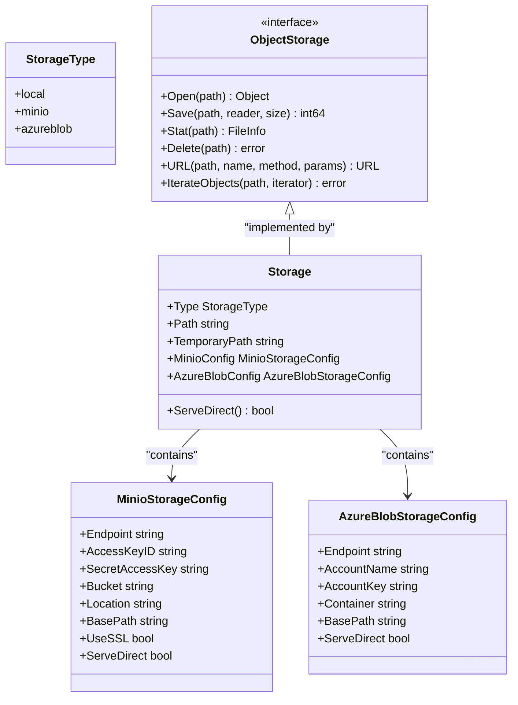
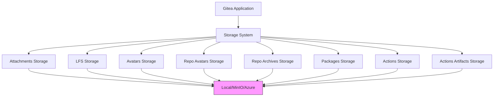

# Storage Configuration

<cite>
**Referenced Files in This Document**   
- [storage.go](file://modules/storage/storage.go)
- [storage.go](file://modules/setting/storage.go)
- [storage_test.go](file://modules/setting/storage_test.go)
- [app.ini](file://docker/root/etc/templates/app.ini)
</cite>

## Table of Contents
1. [Introduction](#introduction)
2. [Pluggable Storage Architecture](#pluggable-storage-architecture)
3. [Storage Configuration Implementation](#storage-configuration-implementation)
4. [Configuration Options](#configuration-options)
5. [Practical Configuration Examples](#practical-configuration-examples)
6. [Storage Services and Dependencies](#storage-services-and-dependencies)
7. [System Reliability and Disaster Recovery](#system-reliability-and-disaster-recovery)
8. [Common Issues and Troubleshooting](#common-issues-and-troubleshooting)
9. [Performance Considerations](#performance-considerations)
10. [Security Implications](#security-implications)

## Introduction
Gitea's storage configuration system provides a flexible and pluggable architecture that supports multiple storage backends including local filesystem, Amazon S3 (via MinIO), and Azure Blob Storage. This system allows administrators to configure different storage solutions for various types of data within the Gitea application, such as user avatars, repository attachments, LFS objects, packages, and repository archives. The configuration system is designed to be both flexible and robust, supporting inheritance patterns and override mechanisms to simplify management of complex storage requirements.

**Section sources**
- [storage.go](file://modules/setting/storage.go#L1-L343)

## Pluggable Storage Architecture
Gitea implements a pluggable storage architecture that enables the use of different storage backends through a unified interface. The system supports three primary storage types: local filesystem storage, MinIO/S3-compatible storage, and Azure Blob Storage. This architecture is built around the `StorageType` enum which defines the available storage options: `local`, `minio`, and `azureblob`. The pluggable design allows Gitea to abstract the underlying storage implementation, enabling seamless switching between different storage solutions without requiring changes to the core application logic.

The architecture follows a factory pattern where storage instances are created based on configuration parameters. Each storage type implements the `ObjectStorage` interface, which defines standard operations such as Open, Save, Stat, Delete, and URL generation. This interface abstraction allows services throughout Gitea to interact with storage in a consistent manner regardless of the underlying implementation.



**Diagram sources**
- [storage.go](file://modules/setting/storage.go#L13-L98)
- [storage.go](file://modules/storage/storage.go#L45-L72)

## Storage Configuration Implementation
The storage configuration system is implemented in the `modules/setting/storage.go` file and follows a hierarchical configuration pattern. The system uses INI-style configuration sections to define storage settings, with support for inheritance and overrides. The core `Storage` struct contains fields for all supported storage types, but only the configuration relevant to the selected storage type is used at runtime.

Configuration resolution follows a specific order: first checking for a storage type specified in the service section (e.g., `[attachment]`), then falling back to type-specific sections (e.g., `[storage.minio]`), and finally using the default storage section `[storage]`. This allows for both global defaults and service-specific overrides. The system also supports path resolution with intelligent fallbacks, automatically converting relative paths to absolute paths based on the application's data directory.

The configuration system includes validation mechanisms to ensure that only supported storage types are used and that required parameters are present. When loading configuration, the system performs type checking and provides meaningful error messages for invalid configurations. The `ToShadowCopy` method provides a way to create sanitized copies of storage configurations for logging purposes, replacing sensitive values like access keys with asterisks.

**Section sources**
- [storage.go](file://modules/setting/storage.go#L1-L343)
- [storage_test.go](file://modules/setting/storage_test.go#L0-L593)

## Configuration Options
Gitea's storage system provides comprehensive configuration options for each supported storage backend. For local storage, the primary configuration option is the `PATH` parameter, which specifies the filesystem path where data should be stored. For MinIO/S3-compatible storage, configuration includes endpoint URL, access credentials, bucket name, region/location, base path within the bucket, SSL settings, and checksum algorithms. Azure Blob Storage configuration includes endpoint URL, account credentials, container name, and base path.

All storage configurations support the `SERVE_DIRECT` option, which determines whether files should be served directly from the storage backend (bypassing the Gitea application server) when possible. This can significantly improve performance for large file downloads. The system also supports temporary storage paths for operations that require intermediate file storage.

Configuration can be specified at multiple levels: globally in the `[storage]` section, for specific storage types in sections like `[storage.minio]`, or for individual services in sections like `[attachment]` or `[lfs]`. When configurations are inherited, specific settings can be overridden in the service section, allowing for fine-grained control over storage behavior.

**Section sources**
- [storage.go](file://modules/setting/storage.go#L45-L98)
- [app.ini](file://docker/root/etc/templates/app.ini#L38-L41)

## Practical Configuration Examples

### Local Storage Configuration
For local storage, configuration is straightforward, requiring only a path specification:

```ini
[attachment]
STORAGE_TYPE = local
PATH = /var/lib/gitea/data/attachments

[lfs]
STORAGE_TYPE = local
PATH = /var/lib/gitea/data/lfs
```

### AWS S3 Configuration
To configure AWS S3 storage (using MinIO-compatible API), specify the endpoint, credentials, bucket, and region:

```ini
[storage]
STORAGE_TYPE = minio
MINIO_ENDPOINT = s3.amazonaws.com
MINIO_ACCESS_KEY_ID = YOUR_ACCESS_KEY
MINIO_SECRET_ACCESS_KEY = YOUR_SECRET_KEY
MINIO_BUCKET = gitea-production
MINIO_LOCATION = us-west-2
MINIO_USE_SSL = true
SERVE_DIRECT = true
```

### Azure Blob Storage Configuration
For Azure Blob Storage, provide the endpoint, account credentials, and container name:

```ini
[storage]
STORAGE_TYPE = azureblob
AZURE_BLOB_ENDPOINT = https://youraccount.blob.core.windows.net
AZURE_BLOB_ACCOUNT_NAME = youraccount
AZURE_BLOB_ACCOUNT_KEY = youraccesskey
AZURE_BLOB_CONTAINER = gitea-container
SERVE_DIRECT = true
```

These examples demonstrate the flexibility of Gitea's storage configuration system, allowing administrators to choose the most appropriate storage solution for their environment and requirements.

**Section sources**
- [storage.go](file://modules/setting/storage.go#L101-L135)
- [app.ini](file://docker/root/etc/templates/app.ini#L38-L41)

## Storage Services and Dependencies
Gitea utilizes the storage system across multiple services, each with its own storage requirements and configurations. The primary services that depend on storage include attachments, LFS (Large File Storage), avatars (both user and repository), repository archives, packages, and CI/CD actions (both logs and artifacts).

Each service has its own storage configuration that can inherit from global settings but also be customized independently. For example, attachments and LFS objects might use different storage backends optimized for their specific access patterns. The system initializes all storage services during application startup, creating the appropriate `ObjectStorage` instances based on configuration.

The storage system is integrated with Gitea's dependency injection and initialization framework, ensuring that storage is available when needed by other services. The `Init` function in the storage package initializes all configured storage services, and individual initialization functions (like `initAttachments`, `initLFS`, etc.) handle service-specific setup, including logging and error handling.



**Diagram sources**
- [storage.go](file://modules/storage/storage.go#L120-L180)

## System Reliability and Disaster Recovery
The choice of storage backend has significant implications for system reliability and disaster recovery. Local storage provides simplicity but requires careful backup strategies to prevent data loss. Network-attached storage solutions like S3 and Azure Blob Storage offer built-in redundancy and durability, typically guaranteeing 99.999999999% (11 nines) durability for stored objects.

For disaster recovery, administrators should implement regular backups of both the database and storage data. When using cloud storage, data is inherently replicated across multiple availability zones, but it's still important to have a recovery plan that includes database restoration and potential data migration between storage backends. Gitea provides a `migrate-storage` command that facilitates moving data between different storage configurations, which is invaluable for disaster recovery scenarios and storage upgrades.

The system's support for multiple storage backends also enables hybrid approaches where critical data is stored in highly available cloud storage while less critical data uses local storage, balancing cost and reliability requirements. Regular monitoring of storage usage and health is essential to prevent outages due to storage exhaustion.

**Section sources**
- [storage.go](file://modules/storage/storage.go#L80-L110)
- [migrate_storage.go](file://cmd/migrate_storage.go#L27-L200)

## Common Issues and Troubleshooting
Several common issues can arise with Gitea's storage configuration. Storage quota exceeded errors occur when the underlying storage medium runs out of space, requiring either cleanup of old data or expansion of storage capacity. Permission denied errors typically result from incorrect filesystem permissions or invalid cloud storage credentials, and can be resolved by verifying access rights and credential validity.

Network connectivity problems to remote storage can manifest as timeouts or connection failures, often requiring investigation of network configuration, firewall rules, or cloud provider connectivity. Configuration errors, such as specifying an unsupported storage type or missing required parameters, will prevent Gitea from starting and should be addressed by validating the configuration against the documentation.

When troubleshooting storage issues, administrators should first check the Gitea logs for error messages, verify that storage endpoints are reachable, and confirm that credentials have the necessary permissions. For cloud storage, it's also important to verify that the specified buckets or containers exist and that the storage service is operational.

**Section sources**
- [storage.go](file://modules/storage/storage.go#L10-L35)
- [storage.go](file://modules/setting/storage.go#L31-L40)

## Performance Considerations
Storage I/O performance significantly impacts Gitea's overall responsiveness, particularly for operations involving large files. The `SERVE_DIRECT` configuration option can dramatically improve download performance by allowing the storage backend to serve files directly, bypassing the Gitea application server. This is particularly beneficial for LFS objects and CI/CD artifacts.

For local storage, performance depends on the underlying filesystem and storage hardware. Using SSDs rather than HDDs, ensuring adequate RAM for filesystem caching, and configuring appropriate filesystem mount options can all improve performance. For cloud storage, network bandwidth and latency become critical factors, and using storage in the same region as the Gitea server can reduce latency.

Caching strategies can also improve performance, with frequently accessed files potentially cached locally to reduce round trips to remote storage. The system's ability to use different storage backends for different services allows administrators to optimize each service's storage for its specific access patterns—for example, using high-performance storage for CI/CD artifacts while using more cost-effective storage for archival data.

**Section sources**
- [storage.go](file://modules/setting/storage.go#L96-L98)
- [actions.go](file://modules/actions/artifacts.go#L20-L21)

## Security Implications
Storage configuration has important security implications that administrators must consider. When using cloud storage, access credentials must be protected and should have the minimum necessary permissions. The use of IAM roles and temporary credentials is preferred over long-lived access keys when possible.

For local storage, proper filesystem permissions are essential to prevent unauthorized access to stored data. All storage paths should be restricted to the Gitea application user and not accessible by other system users. When serving files directly from storage (`SERVE_DIRECT`), administrators should ensure that the storage backend's access controls are properly configured to prevent unauthorized access.

Encryption is another critical consideration. Cloud storage providers typically offer server-side encryption, but administrators may also want to implement client-side encryption for sensitive data. For local storage, full disk encryption or filesystem-level encryption should be considered to protect data at rest.

Network security is also important, particularly for cloud storage. Using SSL/TLS for all storage communications is essential, and administrators should consider using private network connections (like AWS Direct Connect or Azure ExpressRoute) for production deployments to avoid exposing storage traffic to the public internet.

**Section sources**
- [storage.go](file://modules/setting/storage.go#L45-L70)
- [storage.go](file://modules/setting/storage.go#L65-L68)