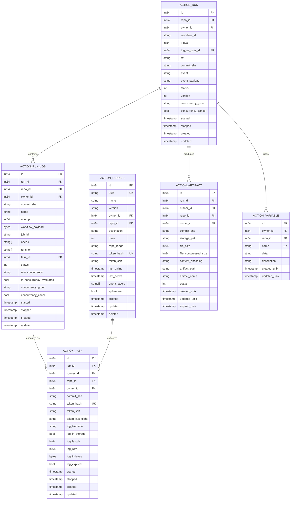
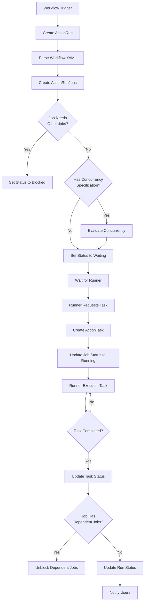
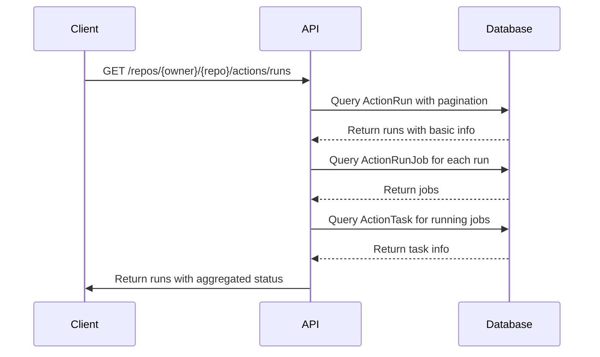
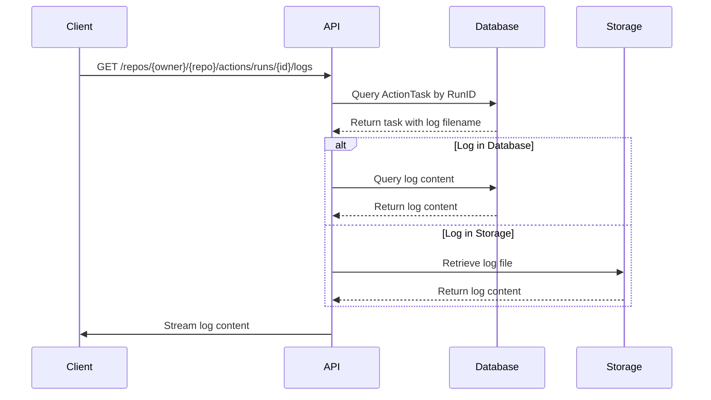
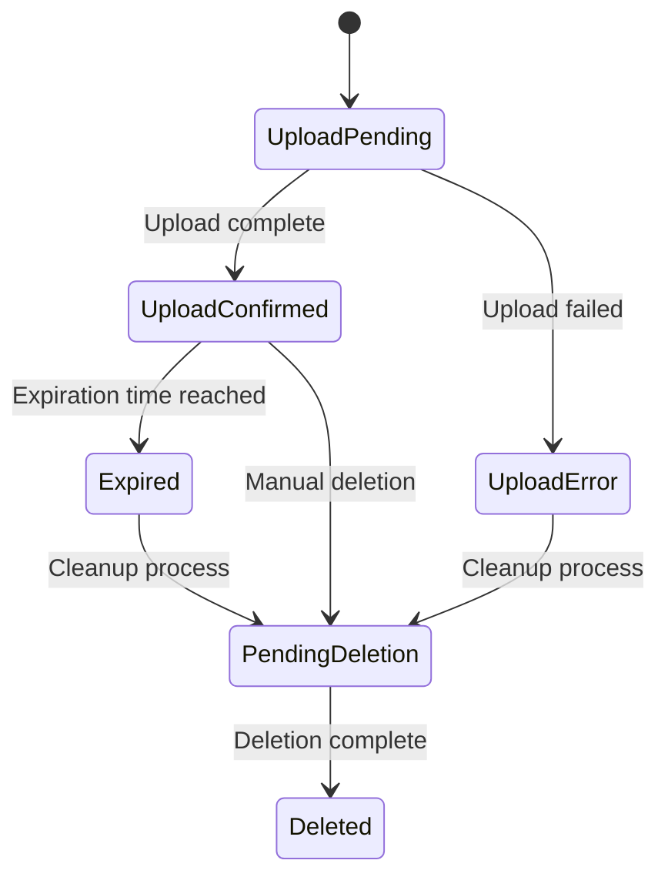

# Actions (CI/CD) Data Model

<cite>
**Referenced Files in This Document**   
- [run.go](file://models/actions/run.go)
- [run_job.go](file://models/actions/run_job.go)
- [runner.go](file://models/actions/runner.go)
- [task.go](file://models/actions/task.go)
- [artifact.go](file://models/actions/artifact.go)
- [variable.go](file://models/actions/variable.go)
- [status.go](file://models/actions/status.go)
- [utils.go](file://models/actions/utils.go)
- [workflows.go](file://modules/actions/workflows.go)
</cite>

## Table of Contents
1. [Introduction](#introduction)
2. [Core Entities and Relationships](#core-entities-and-relationships)
3. [Entity Field Definitions](#entity-field-definitions)
4. [Workflow Execution Hierarchy](#workflow-execution-hierarchy)
5. [Data Access Patterns](#data-access-patterns)
6. [Data Lifecycle Management](#data-lifecycle-management)
7. [Performance Considerations](#performance-considerations)
8. [Conclusion](#conclusion)

## Introduction

Gitea's Actions system provides a CI/CD platform for automating software workflows. This document details the data model that underpins the workflow execution system, focusing on the entities that track workflow runs, jobs, runners, tasks, artifacts, and variables. The model is designed to support complex workflow orchestration with proper concurrency control, status tracking, and data persistence.

The data model follows a hierarchical structure where a single workflow run contains multiple jobs, each of which may be executed as tasks on runners. Artifacts are produced during task execution and stored for later retrieval, while variables provide configuration data for workflow execution. The system supports various levels of scoping for runners and variables, allowing for organization-wide, repository-specific, or instance-level configurations.

**Section sources**
- [run.go](file://models/actions/run.go#L1-L458)
- [run_job.go](file://models/actions/run_job.go#L1-L270)

## Core Entities and Relationships

The Actions system consists of several core entities that work together to manage workflow execution:

- **ActionRun**: Represents a single execution of a workflow file
- **ActionRunJob**: Represents an individual job within a workflow run
- **ActionRunner**: Represents a machine or container that can execute jobs
- **ActionTask**: Represents a distribution of a job to a specific runner
- **ActionArtifact**: Represents files produced during workflow execution
- **ActionVariable**: Represents variables that can be used in workflows

These entities are interconnected through a well-defined relationship hierarchy that enables efficient workflow orchestration and status tracking.



**Diagram sources**
- [run.go](file://models/actions/run.go#L15-L100)
- [run_job.go](file://models/actions/run_job.go#L15-L50)
- [runner.go](file://models/actions/runner.go#L15-L50)
- [task.go](file://models/actions/task.go#L15-L50)
- [artifact.go](file://models/actions/artifact.go#L15-L50)
- [variable.go](file://models/actions/variable.go#L15-L50)

**Section sources**
- [run.go](file://models/actions/run.go#L15-L100)
- [run_job.go](file://models/actions/run_job.go#L15-L50)
- [runner.go](file://models/actions/runner.go#L15-L50)
- [task.go](file://models/actions/task.go#L15-L50)
- [artifact.go](file://models/actions/artifact.go#L15-L50)
- [variable.go](file://models/actions/variable.go#L15-L50)

## Entity Field Definitions

### ActionRun Fields

The ActionRun entity represents a complete workflow execution and contains the following key fields:

- **ID**: Primary key, unique identifier for the run
- **RepoID**: Foreign key to the repository where the workflow is defined
- **OwnerID**: Foreign key to the user or organization that owns the repository
- **WorkflowID**: Name of the workflow file that was executed
- **Index**: Unique number for each run within a repository (used in URLs)
- **TriggerUserID**: User who triggered the workflow execution
- **Ref**: Git reference (branch, tag, or pull request) that caused the run
- **CommitSHA**: Commit hash associated with the run
- **Event**: Webhook event type that triggered the workflow
- **EventPayload**: JSON payload containing event details
- **Status**: Current status of the run (waiting, running, success, etc.)
- **ConcurrencyGroup**: Group identifier for concurrency control
- **ConcurrencyCancel**: Whether to cancel concurrent runs in the same group
- **Started/Stopped**: Timestamps for run execution
- **Created/Updated**: Timestamps for record management

**Section sources**
- [run.go](file://models/actions/run.go#L15-L100)

### ActionRunJob Fields

The ActionRunJob entity represents an individual job within a workflow and contains:

- **ID**: Primary key, unique identifier for the job
- **RunID**: Foreign key to the parent ActionRun
- **RepoID/OwnerID**: Repository and owner identifiers (duplicated for query efficiency)
- **Name**: Display name of the job
- **Attempt**: Execution attempt number (for retries)
- **WorkflowPayload**: Serialized job definition from the workflow file
- **JobID**: Identifier of the job within the workflow YAML
- **Needs**: Array of job IDs that this job depends on
- **RunsOn**: Array of labels that specify compatible runners
- **TaskID**: Foreign key to the ActionTask that executes this job
- **Status**: Current status of the job
- **RawConcurrency**: Raw concurrency specification from the job YAML
- **IsConcurrencyEvaluated**: Whether concurrency has been evaluated
- **ConcurrencyGroup/ConcurrencyCancel**: Evaluated concurrency settings
- **Started/Stopped/Created/Updated**: Timestamps for job lifecycle

**Section sources**
- [run_job.go](file://models/actions/run_job.go#L15-L50)

### ActionRunner Fields

The ActionRunner entity represents a machine or container that can execute jobs:

- **ID**: Primary key, unique identifier for the runner
- **UUID**: Unique identifier for the runner (used for authentication)
- **Name**: Display name of the runner
- **Version**: Version of the runner software
- **OwnerID**: Owner of the runner (0 for global runners)
- **RepoID**: Repository that owns the runner (0 for organization/user runners)
- **Description**: Description of the runner
- **Base**: Type of runner (0=native, 1=docker, 2=virtual machine)
- **RepoRange**: Glob pattern specifying which repositories can use this runner
- **TokenHash**: Hash of the authentication token
- **TokenSalt**: Salt used for token hashing
- **LastOnline/LastActive**: Timestamps for runner availability
- **AgentLabels**: Labels defined in the runner configuration
- **Ephemeral**: Whether the runner should be removed after use
- **Created/Updated/Deleted**: Timestamps for runner lifecycle

**Section sources**
- [runner.go](file://models/actions/runner.go#L15-L50)

### ActionTask Fields

The ActionTask entity represents a job execution on a specific runner:

- **ID**: Primary key, unique identifier for the task
- **JobID**: Foreign key to the ActionRunJob being executed
- **RunnerID**: Foreign key to the ActionRunner executing the task
- **RepoID/OwnerID**: Repository and owner identifiers
- **CommitSHA**: Commit hash for the task execution
- **TokenHash/TokenSalt/TokenLastEight**: Authentication token information
- **LogFilename**: Name of the log file
- **LogInStorage**: Whether logs are stored in object storage
- **LogLength/LogSize**: Size metrics for the log
- **LogIndexes**: Index mapping log lines to byte offsets
- **LogExpired**: Whether the log has expired
- **Started/Stopped/Created/Updated**: Timestamps for task lifecycle

**Section sources**
- [task.go](file://models/actions/task.go#L15-L50)

### ActionArtifact Fields

The ActionArtifact entity represents files produced during workflow execution:

- **ID**: Primary key, unique identifier for the artifact
- **RunID**: Foreign key to the ActionRun that produced the artifact
- **RunnerID**: Foreign key to the ActionRunner that uploaded the artifact
- **RepoID/OwnerID**: Repository and owner identifiers
- **CommitSHA**: Commit hash associated with the artifact
- **StoragePath**: Path to the artifact in storage
- **FileSize/FileCompressedSize**: Size metrics for the artifact
- **ContentEncoding**: Encoding of the artifact content
- **ArtifactPath/ArtifactName**: Path and name of the artifact as specified in the workflow
- **Status**: Current status of the artifact (uploading, confirmed, expired, etc.)
- **CreatedUnix/UpdatedUnix/ExpiredUnix**: Timestamps for artifact lifecycle

**Section sources**
- [artifact.go](file://models/actions/artifact.go#L15-L50)

### ActionVariable Fields

The ActionVariable entity represents variables that can be used in workflows:

- **ID**: Primary key, unique identifier for the variable
- **OwnerID**: Owner of the variable (0 for global variables)
- **RepoID**: Repository that owns the variable (0 for organization/user variables)
- **Name**: Name of the variable (case-insensitive)
- **Data**: Value of the variable
- **Description**: Description of the variable
- **CreatedUnix/UpdatedUnix**: Timestamps for variable lifecycle

**Section sources**
- [variable.go](file://models/actions/variable.go#L15-L50)

## Workflow Execution Hierarchy

The workflow execution process follows a hierarchical structure that enables efficient orchestration and status tracking:



The execution hierarchy begins when a workflow is triggered by a repository event. An ActionRun is created to represent the workflow execution, and the workflow YAML is parsed to create ActionRunJob records for each job in the workflow. Jobs are initially set to "waiting" status unless they have dependencies (specified in "needs") or concurrency restrictions, in which case they are set to "blocked" status.

When a runner becomes available and requests work, the system creates an ActionTask record that links the job to the specific runner. The job status is updated to "running," and the runner executes the task according to the workflow definition. As tasks complete, the system updates their status and checks for any dependent jobs that can now proceed. The overall run status is aggregated from the status of all jobs in the run.

**Diagram sources**
- [run.go](file://models/actions/run.go#L1-L458)
- [run_job.go](file://models/actions/run_job.go#L1-L270)
- [task.go](file://models/actions/task.go#L1-L133)
- [workflows.go](file://modules/actions/workflows.go#L1-L756)

**Section sources**
- [run.go](file://models/actions/run.go#L1-L458)
- [run_job.go](file://models/actions/run_job.go#L1-L270)
- [task.go](file://models/actions/task.go#L1-L133)
- [workflows.go](file://modules/actions/workflows.go#L1-L756)

## Data Access Patterns

### Retrieving Workflow Status

To retrieve the status of workflow executions, the system provides several query patterns:



The primary access pattern for retrieving workflow status involves querying the ActionRun table with appropriate filters (repository, status, date range) and pagination. For each run, the system aggregates job status by querying the ActionRunJob table and, if necessary, the ActionTask table for additional details about running tasks.

**Diagram sources**
- [run.go](file://models/actions/run.go#L1-L458)
- [run_job.go](file://models/actions/run_job.go#L1-L270)

### Retrieving Workflow Logs

Workflow logs are stored in a specialized format that enables efficient retrieval:



Logs are stored either in the database (for smaller logs) or in object storage (for larger logs), with the storage location determined by configuration. The log indexing system uses variable-length encoding to map line numbers to byte offsets, enabling efficient random access to specific log lines.

**Diagram sources**
- [task.go](file://models/actions/task.go#L1-L133)
- [utils.go](file://models/actions/utils.go#L1-L104)

## Data Lifecycle Management

### Artifact Retention Policies

Artifacts are managed according to configurable retention policies:



Artifacts go through several states during their lifecycle. When a workflow uploads an artifact, it is initially in the "upload pending" state. Once the upload is complete, it transitions to "upload confirmed." Artifacts remain in this state until their expiration time is reached, at which point they are marked as "expired." A background cleanup process periodically identifies expired artifacts and marks them for deletion. Finally, the artifacts are physically deleted from storage and marked as "deleted" in the database.

**Diagram sources**
- [artifact.go](file://models/actions/artifact.go#L1-L214)

### Automatic Cleanup of Completed Runs

Completed workflow runs and associated data are automatically cleaned up based on retention policies:

- **Logs**: Task logs are expired based on a configurable time-to-live setting
- **Tasks**: Completed tasks are retained for a period to allow for debugging
- **Runs**: Completed runs are retained indefinitely by default, but can be configured for automatic cleanup
- **Artifacts**: Artifacts are cleaned up based on their individual expiration settings

The cleanup process is handled by background cron jobs that periodically scan for expired data and remove it from the system. This ensures that disk space is efficiently managed while preserving important historical data.

**Section sources**
- [artifact.go](file://models/actions/artifact.go#L1-L214)
- [task.go](file://models/actions/task.go#L1-L133)

## Performance Considerations

### Query Optimization for Large Numbers of Executions

For repositories with high workflow execution volume, the following indexing strategies are employed:

- **ActionRun**: Indexes on RepoID, Status, and Created for efficient filtering
- **ActionRunJob**: Indexes on RunID, Status, and RepoID for job status queries
- **ActionTask**: Indexes on RunnerID, Status, and Stopped for task assignment
- **ActionArtifact**: Indexes on RunID, Status, and ExpiredUnix for artifact cleanup

These indexes enable efficient querying of workflow data, particularly for filtering by repository, status, or date range. The system also employs pagination to limit the amount of data returned in a single request.

### Filtering by Repository or Status

When filtering workflow executions by repository or status, the following query patterns are optimized:

```sql
-- Find recent runs for a repository
SELECT * FROM action_run 
WHERE repo_id = ? 
  AND status IN (?, ?, ?)
ORDER BY id DESC 
LIMIT 30;

-- Find running jobs for a repository
SELECT j.*, r.status as run_status 
FROM action_run_job j
JOIN action_run r ON j.run_id = r.id
WHERE j.repo_id = ?
  AND j.status IN (?, ?)
ORDER BY j.updated DESC;
```

The query patterns leverage composite indexes and efficient filtering to minimize database load. For high-volume repositories, the system may employ additional caching strategies to further improve performance.

**Section sources**
- [run.go](file://models/actions/run.go#L1-L458)
- [run_job.go](file://models/actions/run_job.go#L1-L270)
- [task.go](file://models/actions/task.go#L1-L133)

## Conclusion

The Gitea Actions data model provides a robust foundation for CI/CD workflow execution, with well-defined entities for runs, jobs, runners, tasks, artifacts, and variables. The hierarchical structure enables efficient orchestration of complex workflows, while the comprehensive status tracking system provides detailed visibility into execution progress.

Key strengths of the model include its support for concurrency control, flexible runner scoping, and efficient data access patterns. The artifact retention system ensures that storage is managed effectively, while the indexing strategy supports high-performance queries even with large numbers of workflow executions.

The model is designed to be extensible, allowing for future enhancements such as improved dependency management, enhanced artifact handling, and more sophisticated concurrency controls. By following established database design principles and leveraging efficient data structures, the Actions system provides a reliable platform for automated software workflows.