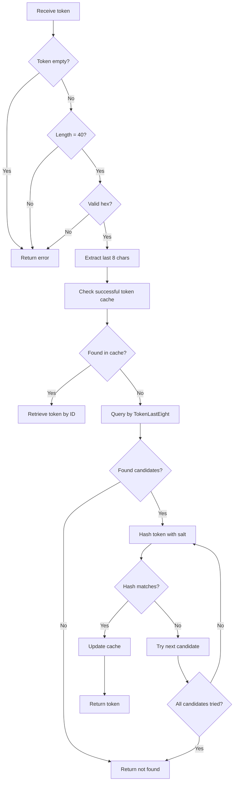

# Authentication Data Model

<cite>
**Referenced Files in This Document**   
- [access_token.go](file://models/auth/access_token.go)
- [oauth2.go](file://models/auth/oauth2.go)
- [source.go](file://models/auth/source.go)
- [ssh_key.go](file://models/asymkey/ssh_key.go)
- [gpg_key.go](file://models/asymkey/gpg_key.go)
- [access_token.yml](file://models/fixtures/access_token.yml)
- [oauth2_application.yml](file://models/fixtures/oauth2_application.yml)
- [login_source.yml](file://models/fixtures/login_source.yml)
- [public_key.yml](file://models/fixtures/public_key.yml)
- [gpg_key.yml](file://models/fixtures/gpg_key.yml)
</cite>

## Table of Contents
1. [Introduction](#introduction)
2. [Entity Relationships](#entity-relationships)
3. [Field Definitions and Data Types](#field-definitions-and-data-types)
4. [Security Considerations](#security-considerations)
5. [Data Access Patterns](#data-access-patterns)
6. [Data Lifecycle Management](#data-lifecycle-management)
7. [Performance Considerations](#performance-considerations)
8. [Database Schema Diagram](#database-schema-diagram)

## Introduction
This document provides comprehensive documentation of Gitea's authentication system data model. It details the entity relationships between AccessTokens, OAuth2 applications, AuthenticationSources, SSHKeys, and GPGKeys, including primary/foreign keys and constraints. The documentation covers field definitions, data types, security considerations for token hashing and key storage, data access patterns for authentication validation, data lifecycle management for token expiration and revocation, and performance considerations for authentication queries.

## Entity Relationships

The authentication system in Gitea consists of several interconnected entities that work together to provide secure authentication mechanisms. The core entities include AccessTokens, OAuth2 applications, AuthenticationSources, SSHKeys, and GPGKeys, all of which are associated with users through foreign key relationships.

```mermaid
erDiagram
USER {
int64 id PK
string name
string email
timestamp created_at
timestamp updated_at
}
ACCESS_TOKEN {
int64 id PK
int64 uid FK
string name
string token_hash UK
string token_salt
string token_last_eight IDX
string scope
timestamp created_unix IDX
timestamp updated_unix IDX
}
OAUTH2_APPLICATION {
int64 id PK
int64 uid FK
string name
string client_id UK
string client_secret
bool confidential_client
string redirect_uris
timestamp created_unix IDX
timestamp updated_unix IDX
}
OAUTH2_GRANT {
int64 id PK
int64 user_id FK
int64 application_id FK
int64 counter
string scope
string nonce
timestamp created_unix
timestamp updated_unix
}
OAUTH2_AUTHORIZATION_CODE {
int64 id PK
int64 grant_id FK
string code UK
string code_challenge
string code_challenge_method
string redirect_uri
timestamp valid_until IDX
}
AUTHENTICATION_SOURCE {
int64 id PK
int type
string name UK
bool is_active IDX
bool is_sync_enabled IDX
string two_factor_policy
text cfg
timestamp created_unix IDX
timestamp updated_unix IDX
}
SSH_KEY {
int64 id PK
int64 owner_id FK
string name
string fingerprint IDX
string content
int mode
int type
int64 login_source_id FK
timestamp created_unix
timestamp updated_unix
bool verified
}
GPG_KEY {
int64 id PK
int64 owner_id FK
string key_id IDX
string primary_key_id
string content
timestamp created_unix
timestamp expired_unix
timestamp added_unix
bool verified
bool can_sign
bool can_encrypt_comms
bool can_encrypt_storage
bool can_certify
}
USER ||--o{ ACCESS_TOKEN : "has"
USER ||--o{ OAUTH2_APPLICATION : "owns"
USER ||--o{ OAUTH2_GRANT : "has"
USER ||--o{ SSH_KEY : "has"
USER ||--o{ GPG_KEY : "has"
AUTHENTICATION_SOURCE ||--o{ SSH_KEY : "provides"
OAUTH2_APPLICATION ||--o{ OAUTH2_GRANT : "has"
OAUTH2_GRANT ||--o{ OAUTH2_AUTHORIZATION_CODE : "generates"
```

**Diagram sources**
- [access_token.go](file://models/auth/access_token.go#L20-L60)
- [oauth2.go](file://models/auth/oauth2.go#L30-L150)
- [source.go](file://models/auth/source.go#L70-L100)
- [ssh_key.go](file://models/asymkey/ssh_key.go#L25-L65)
- [gpg_key.go](file://models/asymkey/gpg_key.go#L15-L55)

**Section sources**
- [access_token.go](file://models/auth/access_token.go#L20-L236)
- [oauth2.go](file://models/auth/oauth2.go#L30-L636)
- [source.go](file://models/auth/source.go#L70-L398)
- [ssh_key.go](file://models/asymkey/ssh_key.go#L25-L407)
- [gpg_key.go](file://models/asymkey/gpg_key.go#L15-L242)

## Field Definitions and Data Types

### Access Token Fields
The AccessToken entity contains the following fields:

- **ID**: int64, primary key, auto-incrementing identifier
- **UID**: int64, foreign key to user table, indexed for fast lookup
- **Name**: string, user-defined name for the token
- **TokenHash**: string, SHA256 hash of the token, unique constraint to prevent duplicates
- **TokenSalt**: string, cryptographic salt used in token hashing
- **TokenLastEight**: string, last eight characters of the token, indexed for partial matching
- **Scope**: string, permissions scope for the token
- **CreatedUnix**: timestamp, creation time, indexed for sorting
- **UpdatedUnix**: timestamp, last update time, indexed for activity tracking

### OAuth2 Application Fields
The OAuth2Application entity contains the following fields:

- **ID**: int64, primary key, auto-incrementing identifier
- **UID**: int64, foreign key to user table, identifies the application owner
- **Name**: string, user-defined name for the application
- **ClientID**: string, unique identifier for the OAuth2 client
- **ClientSecret**: string, bcrypt-hashed client secret
- **ConfidentialClient**: bool, indicates if the client is confidential (requires secret)
- **SkipSecondaryAuthorization**: bool, whether to skip secondary authorization
- **RedirectURIs**: string (JSON), array of allowed redirect URIs
- **CreatedUnix**: timestamp, creation time, indexed
- **UpdatedUnix**: timestamp, last update time, indexed

### Authentication Source Fields
The AuthenticationSource entity contains the following fields:

- **ID**: int64, primary key, auto-incrementing identifier
- **Type**: int, authentication type (LDAP, SMTP, OAuth2, etc.)
- **Name**: string, unique name for the source
- **IsActive**: bool, whether the source is active, indexed
- **IsSyncEnabled**: bool, whether synchronization is enabled, indexed
- **TwoFactorPolicy**: string, two-factor authentication policy
- **Cfg**: text, JSON-encoded configuration specific to the authentication type
- **CreatedUnix**: timestamp, creation time, indexed
- **UpdatedUnix**: timestamp, last update time, indexed

### SSH Key Fields
The SSHKey entity contains the following fields:

- **ID**: int64, primary key, auto-incrementing identifier
- **OwnerID**: int64, foreign key to user table, indexed
- **Name**: string, user-defined name for the key
- **Fingerprint**: string, SHA256 fingerprint of the public key, indexed
- **Content**: string, the actual public key content
- **Mode**: int, access mode (read, write, admin)
- **Type**: int, key type (user, deploy, principal)
- **LoginSourceID**: int64, foreign key to authentication source, 0 for local
- **CreatedUnix**: timestamp, creation time
- **UpdatedUnix**: timestamp, last update time
- **Verified**: bool, whether the key has been verified

### GPG Key Fields
The GPGKey entity contains the following fields:

- **ID**: int64, primary key, auto-incrementing identifier
- **OwnerID**: int64, foreign key to user table, indexed
- **KeyID**: string, hexadecimal key identifier, 16 characters, indexed
- **PrimaryKeyID**: string, for subkeys, references the primary key ID
- **Content**: string, Base64-encoded public key content
- **CreatedUnix**: timestamp, key creation time
- **ExpiredUnix**: timestamp, key expiration time
- **AddedUnix**: timestamp, when the key was added to the system
- **Verified**: bool, whether the key has been verified against user emails
- **CanSign**: bool, whether the key can be used for signing
- **CanEncryptComms**: bool, whether the key can encrypt communications
- **CanEncryptStorage**: bool, whether the key can encrypt storage
- **CanCertify**: bool, whether the key can certify other keys

**Section sources**
- [access_token.go](file://models/auth/access_token.go#L20-L60)
- [oauth2.go](file://models/auth/oauth2.go#L30-L150)
- [source.go](file://models/auth/source.go#L70-L100)
- [ssh_key.go](file://models/asymkey/ssh_key.go#L25-L65)
- [gpg_key.go](file://models/asymkey/gpg_key.go#L15-L55)

## Security Considerations

### Token Hashing and Storage
Gitea implements robust security measures for token storage and validation. Access tokens are never stored in plaintext. Instead, they are hashed using SHA256 with a unique salt for each token:

- **TokenHash**: The token value is hashed using SHA256 combined with a random salt (TokenSalt)
- **TokenSalt**: A 10-character random string generated for each token to prevent rainbow table attacks
- **TokenLastEight**: The last eight characters of the token are stored separately and indexed to enable efficient partial matching during authentication

The token validation process follows a two-step approach:
1. First, tokens are filtered by the last eight characters (TokenLastEight) to reduce the search space
2. Then, each candidate token's hash is compared using constant-time comparison to prevent timing attacks

A successful token cache (LRU cache) is implemented to improve performance for frequently used tokens, with the cache size configurable via settings.

### OAuth2 Client Secret Security
OAuth2 client secrets are protected using bcrypt hashing:
- Client secrets are generated with cryptographically secure random bytes
- The secrets are hashed using bcrypt with the default cost factor
- The plaintext secret is only returned once during creation and never stored
- The hashed secret is stored in the database and used for validation

### Key Storage and Verification
SSH and GPG keys are stored with appropriate security measures:
- **SSH Keys**: Public keys are stored in their entirety with their fingerprints calculated and indexed
- **GPG Keys**: Public keys are stored in Base64-encoded format with their KeyIDs extracted and indexed
- **Verification**: Both SSH and GPG keys can be marked as verified, indicating they have been validated through the authentication process

Authentication sources that provide external key management (like LDAP) are tracked through the LoginSourceID field, allowing the system to determine whether keys should be managed locally or externally.

**Section sources**
- [access_token.go](file://models/auth/access_token.go#L100-L200)
- [oauth2.go](file://models/auth/oauth2.go#L200-L300)
- [ssh_key.go](file://models/asymkey/ssh_key.go#L100-L200)
- [gpg_key.go](file://models/asymkey/gpg_key.go#L100-L150)

## Data Access Patterns

### Authentication Validation
The primary data access pattern for authentication involves validating credentials against stored tokens and keys:

#### Access Token Validation


**Diagram sources**
- [access_token.go](file://models/auth/access_token.go#L150-L200)

#### SSH Key Authentication
SSH key authentication follows a similar pattern:
1. Extract the key content from the SSH authentication request
2. Calculate the fingerprint of the provided key
3. Query the database for a matching fingerprint
4. Verify the key belongs to an active user
5. Update the key's last used timestamp

### Token Lookup and Management
Token lookup operations are optimized for both user-facing operations and API access:

- **By User**: Tokens are retrieved by UID for user management interfaces
- **By Name**: Token existence is checked by name and UID to prevent duplicates
- **By Hash**: Authentication uses the token hash for secure validation
- **By Last Eight**: Partial matching uses the last eight characters for efficient filtering

OAuth2 token flows follow the standard OAuth2 specification:
1. Client authentication with ClientID and ClientSecret
2. Authorization code generation with PKCE support
3. Token exchange using the authorization code
4. Grant management for refresh tokens

**Section sources**
- [access_token.go](file://models/auth/access_token.go#L150-L200)
- [oauth2.go](file://models/auth/oauth2.go#L300-L500)
- [ssh_key.go](file://models/asymkey/ssh_key.go#L200-L300)

## Data Lifecycle Management

### Token Expiration and Revocation
Gitea's authentication system implements comprehensive lifecycle management for authentication tokens:

#### Access Tokens
- **Creation**: Tokens are created with a unique salt and hash, and the plaintext token is only available immediately after creation
- **Usage Tracking**: The UpdatedUnix field is updated on each use, allowing detection of recently active tokens
- **Revocation**: Tokens can be deleted by ID with UID verification to prevent unauthorized deletion
- **Expiration**: While not explicitly implemented in the model, the system supports token revocation through deletion

#### OAuth2 Tokens
OAuth2 tokens follow the OAuth2 specification lifecycle:
- **Authorization Codes**: Have a limited validity period and are invalidated after use
- **Grants**: Represent user consent for applications and can be revoked by the user
- **Refresh Tokens**: Managed through grants and can be rotated or revoked

### Key Management Lifecycle
SSH and GPG keys follow a structured lifecycle:

#### SSH Keys
- **Creation**: Keys are added with fingerprint calculation and storage in authorized_keys file
- **Synchronization**: For external authentication sources, keys can be synchronized from the external system
- **Revocation**: Keys can be deleted and removed from the authorized_keys file
- **Activity Tracking**: The UpdatedUnix field tracks last use for identifying inactive keys

#### GPG Keys
- **Import**: Keys are parsed and validated against user email addresses
- **Subkey Management**: Primary keys and subkeys are stored in a parent-child relationship
- **Expiration**: Keys have explicit expiration times (ExpiredUnix)
- **Revocation**: Keys can be deleted along with their subkeys

The system also provides bulk operations for user account cleanup:
- When a user is deleted, all associated tokens, keys, and grants are removed
- When an authentication source is removed, associated external keys are cleaned up
- Periodic cleanup tasks can remove expired or unused authentication artifacts

**Section sources**
- [access_token.go](file://models/auth/access_token.go#L200-L236)
- [oauth2.go](file://models/auth/oauth2.go#L500-L636)
- [ssh_key.go](file://models/asymkey/ssh_key.go#L300-L407)
- [gpg_key.go](file://models/asymkey/gpg_key.go#L200-L242)

## Performance Considerations

### Indexing Strategies
Gitea employs targeted indexing to optimize authentication queries:

#### Access Token Indexes
- **UID Index**: Enables fast retrieval of all tokens for a specific user
- **TokenLastEight Index**: Allows efficient filtering of tokens by their last eight characters
- **CreatedUnix Index**: Supports chronological sorting of tokens
- **UpdatedUnix Index**: Facilitates identification of recently used tokens

#### OAuth2 Application Indexes
- **ClientID Unique Index**: Ensures client ID uniqueness and enables fast lookup
- **UID Index**: Allows retrieval of all applications owned by a user
- **CreatedUnix Index**: Supports chronological operations
- **UpdatedUnix Index**: Tracks application modifications

#### SSH Key Indexes
- **OwnerID Index**: Enables fast retrieval of all keys for a user
- **Fingerprint Index**: Allows quick lookup by key fingerprint
- **LoginSourceID**: Supports queries for externally managed keys

#### GPG Key Indexes
- **OwnerID Index**: Facilitates retrieval of all GPG keys for a user
- **KeyID Index**: Enables fast lookup by key identifier
- **PrimaryKeyID**: Supports queries for subkeys of a primary key

### Query Optimization
The authentication system implements several performance optimizations:

#### Caching
- **Successful Token Cache**: An LRU cache stores recently validated token IDs to reduce database queries
- **Configurable Cache Size**: The cache size is configurable via settings to balance memory usage and performance
- **Cache Invalidation**: The cache is invalidated when tokens are deleted or updated

#### Query Patterns
- **Batch Operations**: Related entities are often retrieved in batches to minimize round trips
- **Conditional Loading**: Some fields are calculated on-demand rather than stored (e.g., HasUsed, HasRecentActivity)
- **Efficient Filtering**: Queries use indexed fields for filtering before applying more expensive operations

#### Connection Management
- **Database Session Reuse**: Database sessions are reused within transactions
- **Connection Pooling**: The underlying database driver manages connection pooling
- **Transaction Management**: Related operations are grouped in transactions to ensure consistency

These performance considerations ensure that authentication operations remain efficient even with large numbers of users and tokens.

**Section sources**
- [access_token.go](file://models/auth/access_token.go#L100-L150)
- [oauth2.go](file://models/auth/oauth2.go#L150-L200)
- [ssh_key.go](file://models/asymkey/ssh_key.go#L100-L150)
- [gpg_key.go](file://models/asymkey/gpg_key.go#L100-L150)

## Database Schema Diagram

The following diagram illustrates the complete database schema for Gitea's authentication system, showing all entities, their attributes, and the relationships between them:

```mermaid
erDiagram
USER {
int64 id PK
string name
string email
timestamp created_at
timestamp updated_at
}
ACCESS_TOKEN {
int64 id PK
int64 uid FK
string name
string token_hash UK
string token_salt
string token_last_eight IDX
string scope
timestamp created_unix IDX
timestamp updated_unix IDX
}
OAUTH2_APPLICATION {
int64 id PK
int64 uid FK
string name
string client_id UK
string client_secret
bool confidential_client
string redirect_uris
timestamp created_unix IDX
timestamp updated_unix IDX
}
OAUTH2_GRANT {
int64 id PK
int64 user_id FK
int64 application_id FK
int64 counter
string scope
string nonce
timestamp created_unix
timestamp updated_unix
}
OAUTH2_AUTHORIZATION_CODE {
int64 id PK
int64 grant_id FK
string code UK
string code_challenge
string code_challenge_method
string redirect_uri
timestamp valid_until IDX
}
AUTHENTICATION_SOURCE {
int64 id PK
int type
string name UK
bool is_active IDX
bool is_sync_enabled IDX
string two_factor_policy
text cfg
timestamp created_unix IDX
timestamp updated_unix IDX
}
SSH_KEY {
int64 id PK
int64 owner_id FK
string name
string fingerprint IDX
string content
int mode
int type
int64 login_source_id FK
timestamp created_unix
timestamp updated_unix
bool verified
}
GPG_KEY {
int64 id PK
int64 owner_id FK
string key_id IDX
string primary_key_id
string content
timestamp created_unix
timestamp expired_unix
timestamp added_unix
bool verified
bool can_sign
bool can_encrypt_comms
bool can_encrypt_storage
bool can_certify
}
USER ||--o{ ACCESS_TOKEN : "has"
USER ||--o{ OAUTH2_APPLICATION : "owns"
USER ||--o{ OAUTH2_GRANT : "has"
USER ||--o{ SSH_KEY : "has"
USER ||--o{ GPG_KEY : "has"
AUTHENTICATION_SOURCE ||--o{ SSH_KEY : "provides"
OAUTH2_APPLICATION ||--o{ OAUTH2_GRANT : "has"
OAUTH2_GRANT ||--o{ OAUTH2_AUTHORIZATION_CODE : "generates"
note right of USER
Core user entity that serves as
the foundation for all authentication
methods. All authentication entities
are linked to a user.
end note
note right of ACCESS_TOKEN
Personal access tokens for API
authentication. Stored with
SHA256 hash and salt for security.
Indexed by last 8 characters for
efficient lookup.
end note
note right of OAUTH2_APPLICATION
OAuth2 client applications that
can request access to user data.
Client secrets are bcrypt-hashed.
Supports both confidential and
public clients.
end note
note right of OAUTH2_GRANT
Represents user consent for an
OAuth2 application to access
their data. Contains the scope
of permissions granted.
end note
note right of OAUTH2_AUTHORIZATION_CODE
Temporary codes used in the OAuth2
authorization flow. Valid for a
limited time and invalidated after
use (one-time use).
end note
note right of AUTHENTICATION_SOURCE
External authentication sources
like LDAP, SMTP, or OAuth2 providers.
Can provide external management
of SSH keys.
end note
note right of SSH_KEY
SSH public keys for Git operations
and shell access. Can be locally
managed or provided by external
authentication sources.
end note
note right of GPG_KEY
GPG public keys for commit
verification and encryption.
Supports primary keys and subkeys
with different capabilities.
end note
```

**Diagram sources**
- [access_token.go](file://models/auth/access_token.go)
- [oauth2.go](file://models/auth/oauth2.go)
- [source.go](file://models/auth/source.go)
- [ssh_key.go](file://models/asymkey/ssh_key.go)
- [gpg_key.go](file://models/asymkey/gpg_key.go)

**Section sources**
- [access_token.go](file://models/auth/access_token.go)
- [oauth2.go](file://models/auth/oauth2.go)
- [source.go](file://models/auth/source.go)
- [ssh_key.go](file://models/asymkey/ssh_key.go)
- [gpg_key.go](file://models/asymkey/gpg_key.go)