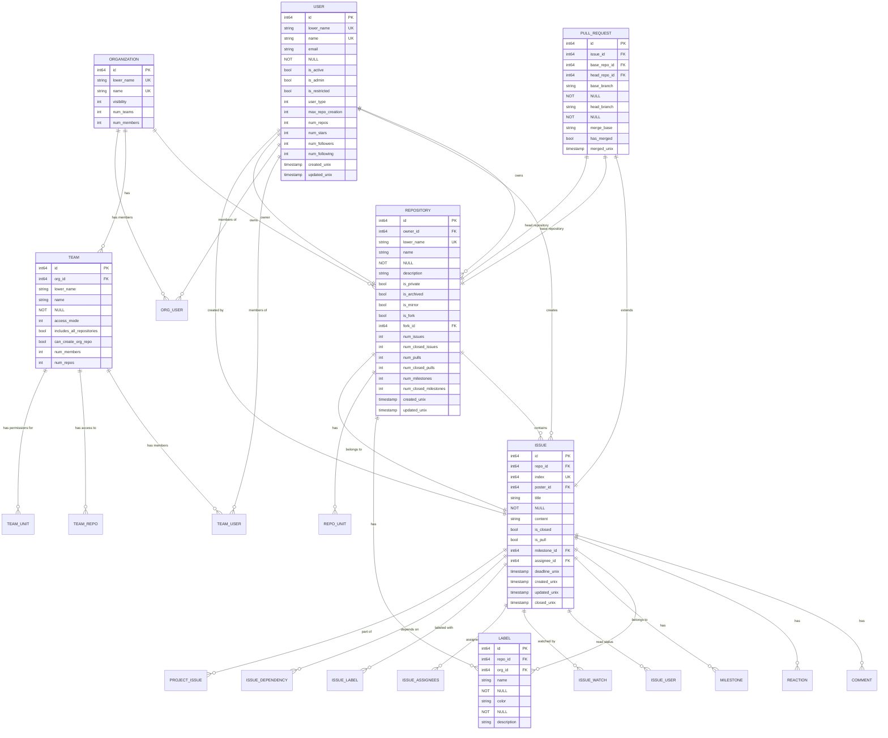

# Core Data Models

<cite>
**Referenced Files in This Document**   
- [user.go](file://models/user/user.go)
- [repo.go](file://models/repo/repo.go)
- [issue.go](file://models/issues/issue.go)
- [pull.go](file://models/issues/pull.go)
- [org.go](file://models/organization/org.go)
- [org_user.go](file://models/organization/org_user.go)
- [team.go](file://models/organization/team.go)
- [team_user.go](file://models/organization/team_user.go)
- [issue_label.go](file://models/issues/issue_label.go)
- [label.go](file://models/issues/label.go)
</cite>

## Table of Contents
1. [Introduction](#introduction)
2. [Entity Relationship Overview](#entity-relationship-overview)
3. [User Model](#user-model)
4. [Repository Model](#repository-model)
5. [Issue Model](#issue-model)
6. [PullRequest Model](#pullrequest-model)
7. [Organization Model](#organization-model)
8. [Data Access Patterns](#data-access-patterns)
9. [Data Lifecycle Management](#data-lifecycle-management)
10. [Performance Considerations](#performance-considerations)

## Introduction
This document provides comprehensive documentation of Gitea's core data models, focusing on the primary entities that form the foundation of the platform: User, Repository, Issue, PullRequest, and Organization. These models represent the essential building blocks of Gitea's functionality, enabling version control, collaboration, issue tracking, and organizational management. The documentation details the database schema, field definitions, relationships, and business rules that govern these entities, providing a complete understanding of how data is structured and managed within the system.

## Entity Relationship Overview

**Diagram sources**
- [user.go](file://models/user/user.go#L100-L200)
- [repo.go](file://models/repo/repo.go#L50-L150)
- [issue.go](file://models/issues/issue.go#L50-L100)
- [pull.go](file://models/issues/pull.go#L50-L100)
- [org.go](file://models/organization/org.go#L50-L100)
- [team.go](file://models/organization/team.go#L50-L100)

## User Model

The User model represents both individual users and service accounts within the Gitea system. It serves as the foundation for authentication, authorization, and personalization. The model includes essential fields for user identification, authentication, and preferences, while also supporting organizational membership through relationships with teams and organizations.

### Field Definitions
- **ID**: Primary key, auto-incrementing integer identifier
- **LowerName**: Lowercase version of the username, used for case-insensitive lookups and unique constraint
- **Name**: Display name of the user, must be unique across the system
- **Email**: Primary email address used for communication and authentication
- **KeepEmailPrivate**: Boolean flag indicating whether the user's email should be hidden from public view
- **Passwd**: Hashed password for authentication
- **Type**: Enumeration indicating the user type (Individual, Organization, Bot, etc.)
- **IsActive**: Boolean flag indicating whether the user account is active and can log in
- **IsAdmin**: Boolean flag indicating whether the user has administrative privileges
- **IsRestricted**: Boolean flag indicating whether the user has limited access to repositories
- **MaxRepoCreation**: Maximum number of repositories the user can create (-1 for unlimited)
- **NumRepos**: Counter for the number of repositories owned by the user
- **NumStars**: Counter for the number of repositories starred by the user
- **NumFollowers**: Counter for the number of users following this user
- **NumFollowing**: Counter for the number of users this user is following
- **CreatedUnix**: Timestamp of when the user account was created
- **UpdatedUnix**: Timestamp of when the user account was last updated

### Business Rules
- Username uniqueness is enforced through a unique constraint on the LowerName field
- Email addresses are normalized to lowercase before storage
- Users can be restricted from creating repositories based on their MaxRepoCreation setting
- The model supports soft deletion through the IsActive flag rather than physical deletion
- User types include Individual, Organization, Bot, and reserved types for system accounts

**Section sources**
- [user.go](file://models/user/user.go#L50-L300)

## Repository Model

The Repository model represents a Git repository within the Gitea system, serving as the central entity for code storage, version control, and collaboration. It contains metadata about the repository, access controls, and counters for various repository activities. The model supports both standalone repositories and those that are part of organizational structures.

### Field Definitions
- **ID**: Primary key, auto-incrementing integer identifier
- **OwnerID**: Foreign key referencing the User who owns the repository
- **OwnerName**: Denormalized field storing the owner's username for performance
- **LowerName**: Lowercase version of the repository name, used for case-insensitive lookups
- **Name**: Display name of the repository, must be unique within the owner's namespace
- **Description**: Text description of the repository's purpose and contents
- **IsPrivate**: Boolean flag indicating whether the repository is private (requires authentication to access)
- **IsArchived**: Boolean flag indicating whether the repository is archived and read-only
- **IsMirror**: Boolean flag indicating whether the repository is a mirror of an external repository
- **IsFork**: Boolean flag indicating whether the repository is a fork of another repository
- **ForkID**: Foreign key referencing the original repository if this is a fork
- **DefaultBranch**: Name of the default branch (typically "main" or "master")
- **NumIssues**: Counter for the total number of issues in the repository
- **NumClosedIssues**: Counter for the number of closed issues
- **NumPulls**: Counter for the total number of pull requests
- **NumClosedPulls**: Counter for the number of closed pull requests
- **NumMilestones**: Counter for the total number of milestones
- **NumClosedMilestones**: Counter for the number of closed milestones
- **CreatedUnix**: Timestamp of when the repository was created
- **UpdatedUnix**: Timestamp of when the repository was last updated

### Business Rules
- Repository names must be unique within an owner's namespace, enforced by a unique constraint on OwnerID and LowerName
- The model supports soft deletion through the IsArchived flag, which makes the repository read-only
- Forked repositories maintain a reference to their original repository through the ForkID field
- Counters for issues, pull requests, and milestones are maintained for performance optimization
- Repository visibility is controlled by the IsPrivate flag, with public repositories accessible to all users
- The model includes support for mirroring external repositories, with metadata about the original source

**Section sources**
- [repo.go](file://models/repo/repo.go#L50-L200)

## Issue Model

The Issue model represents both issues and pull requests within a repository, serving as the primary mechanism for tracking work, bugs, and feature requests. Despite its name, this model is used for both regular issues and pull requests, with the IsPull field distinguishing between the two types. This unified approach simplifies the data model while providing flexibility for different use cases.

### Field Definitions
- **ID**: Primary key, auto-incrementing integer identifier
- **RepoID**: Foreign key referencing the Repository to which the issue belongs
- **Index**: Sequential number within the repository, used for human-readable issue references
- **PosterID**: Foreign key referencing the User who created the issue
- **Title**: Title or subject of the issue
- **Content**: Markdown-formatted content describing the issue in detail
- **IsClosed**: Boolean flag indicating whether the issue is closed
- **IsPull**: Boolean flag indicating whether this issue is actually a pull request
- **MilestoneID**: Foreign key referencing the Milestone to which the issue is assigned
- **AssigneeID**: Foreign key referencing the User to whom the issue is assigned
- **DeadlineUnix**: Timestamp deadline for the issue
- **CreatedUnix**: Timestamp of when the issue was created
- **UpdatedUnix**: Timestamp of when the issue was last updated
- **ClosedUnix**: Timestamp of when the issue was closed (if applicable)

### Business Rules
- Issues are uniquely identified within a repository by their Index field
- The model uses a single table for both issues and pull requests, with the IsPull field indicating the type
- Pull requests are implemented as a special type of issue, allowing them to inherit issue functionality like comments and labels
- The model supports assignment to multiple users through a separate IssueAssignees table
- Issues can be labeled with multiple labels through a many-to-many relationship
- The model includes support for time tracking with fields for time estimation and actual time spent
- Issues can be linked to projects through a separate ProjectIssue table
- The model supports dependency tracking between issues through a separate IssueDependency table

**Section sources**
- [issue.go](file://models/issues/issue.go#L50-L200)

## PullRequest Model

The PullRequest model extends the Issue model to provide specialized functionality for code review and merge requests. It contains information about the source and target branches, merge status, and other pull request-specific metadata. This model is tightly coupled with the Issue model, as each pull request is associated with a corresponding issue record.

### Field Definitions
- **ID**: Primary key, auto-incrementing integer identifier
- **IssueID**: Foreign key referencing the Issue that represents this pull request
- **BaseRepoID**: Foreign key referencing the Repository that contains the target branch
- **HeadRepoID**: Foreign key referencing the Repository that contains the source branch
- **BaseBranch**: Name of the target branch in the base repository
- **HeadBranch**: Name of the source branch in the head repository
- **MergeBase**: Common ancestor commit between the base and head branches
- **HasMerged**: Boolean flag indicating whether the pull request has been merged
- **MergedUnix**: Timestamp of when the pull request was merged
- **MergeCommitID**: SHA-1 hash of the merge commit (if applicable)

### Business Rules
- Each pull request must have a corresponding issue record, enforced by the IssueID foreign key
- The model supports cross-repository pull requests by allowing different BaseRepoID and HeadRepoID values
- Pull requests can only be created against repositories where the user has appropriate permissions
- The merge process is tracked through the HasMerged flag and MergedUnix timestamp
- The model includes support for merge strategies and conflict detection
- Pull requests can be automatically closed when the source branch is deleted
- The model supports draft pull requests, which are not ready for review
- Pull request reviews are tracked separately from general comments

**Section sources**
- [pull.go](file://models/issues/pull.go#L50-L150)

## Organization Model

The Organization model represents a group of users who collaborate on repositories, providing a structure for team-based development. Organizations inherit from the User model, allowing them to own repositories and participate in the system as first-class entities. The model includes features for team management, access control, and organizational settings.

### Field Definitions
- **ID**: Primary key, auto-incrementing integer identifier (inherited from User)
- **LowerName**: Lowercase version of the organization name (inherited from User)
- **Name**: Display name of the organization (inherited from User)
- **Visibility**: Enumeration indicating the organization's visibility (public, limited, private)
- **NumTeams**: Counter for the number of teams within the organization
- **NumMembers**: Counter for the number of members in the organization
- **RepoAdminChangeTeamAccess**: Boolean flag indicating whether repository administrators can change team access

### Business Rules
- Organizations are implemented as a special type of User, allowing them to own repositories and have avatars
- Membership is managed through the OrgUser table, which links users to organizations
- Access control is implemented through teams, which can be assigned to repositories
- The model supports public and private organizations, with different visibility rules
- Organizations can have multiple teams with different permission levels
- Team membership can be public or private, controlling whether it appears in the user's profile
- The model includes support for organization-wide settings and preferences
- Organizations can have default repository permissions for new repositories
- The model supports organization webhooks for external integration

**Section sources**
- [org.go](file://models/organization/org.go#L50-L150)

## Data Access Patterns

Gitea's data access patterns are built around the XORM ORM framework, which provides a structured approach to database interactions. The models use XORM tags to define database schema elements, relationships, and constraints. This section documents the key data access patterns and XORM usage across the core models.

### XORM Tags and Annotations
- **xorm:"pk autoincr"**: Defines a field as the primary key with auto-incrementing values
- **xorm:"UNIQUE"**: Creates a unique constraint on the field
- **xorm:"INDEX"**: Creates a database index on the field for improved query performance
- **xorm:"NOT NULL"**: Enforces that the field cannot contain null values
- **xorm:"-"**: Excludes the field from database mapping (used for computed or transient fields)
- **xorm:"extends"**: Indicates that fields from another struct should be embedded

### Custom Queries and Indexing
The models implement custom queries for common operations, often optimized for performance. These include:
- Paginated queries for listing repositories, issues, and users
- Batch operations for updating multiple records efficiently
- Complex joins for retrieving related data in a single query
- Aggregation queries for calculating statistics and counts

The system uses composite indexes on frequently queried field combinations, such as (RepoID, Index) for issues and (OrgID, UID) for organization membership. These indexes are critical for maintaining performance as the dataset grows.

**Section sources**
- [user.go](file://models/user/user.go#L50-L300)
- [repo.go](file://models/repo/repo.go#L50-L200)
- [issue.go](file://models/issues/issue.go#L50-L200)

## Data Lifecycle Management

Gitea implements sophisticated data lifecycle management strategies to balance data integrity, performance, and user experience. This includes soft deletes, cascading operations, and background cleanup processes.

### Soft Deletes
Repositories are not physically deleted but are instead marked as archived using the IsArchived flag. This preserves the repository's history and metadata while making it read-only. The archived state is indicated by the IsArchived field and the ArchivedUnix timestamp.

### Cascading Deletes
When an issue is deleted, related records are automatically cleaned up through cascading operations:
- Comments associated with the issue are deleted
- Labels assigned to the issue are disassociated
- Watch and read status records are removed
- Time tracking records are deleted
- Pull request records (if applicable) are removed

These cascading operations ensure data consistency while preventing orphaned records.

### Background Cleanup
The system includes background processes for cleaning up temporary data and maintaining database integrity:
- Orphaned records are periodically identified and removed
- Unused attachments and artifacts are cleaned up
- Database indexes are optimized
- Statistics are recalculated

These processes run on a schedule to maintain system performance without impacting user operations.

**Section sources**
- [repo.go](file://models/repo/repo.go#L50-L200)
- [issue.go](file://models/issues/issue.go#L50-L200)
- [dbconsistency.go](file://services/doctor/dbconsistency.go#L78-L107)

## Performance Considerations

Gitea's data models are designed with performance as a primary consideration, incorporating various optimization strategies to handle large datasets and high concurrency.

### Indexing Strategies
The system employs a comprehensive indexing strategy to optimize common query patterns:
- Primary keys are indexed by default
- Foreign keys are indexed to optimize join operations
- Frequently filtered fields have individual indexes
- Composite indexes are used for multi-field queries
- Text search fields use full-text indexes where supported

Key indexes include:
- (OwnerID, LowerName) on Repository for owner-based lookups
- (RepoID, Index) on Issue for repository-specific issue retrieval
- (OrgID, UID) on OrgUser for membership checks
- (IssueID, Type) on Comment for issue comment retrieval

### Query Optimization
The models implement several query optimization techniques:
- Counter fields are maintained to avoid expensive COUNT queries
- Denormalized fields reduce the need for joins
- Pagination is supported for large result sets
- Batch operations minimize database round trips
- Caching is used for frequently accessed data

### Scalability Considerations
The data models are designed to scale to large numbers of users and repositories:
- Sharding is supported through database configuration
- Read replicas can be used for query load balancing
- Connection pooling optimizes database resource usage
- Asynchronous operations handle long-running tasks

These performance considerations ensure that Gitea remains responsive and reliable even under heavy load.

**Section sources**
- [repo.go](file://models/repo/repo.go#L50-L200)
- [issue.go](file://models/issues/issue.go#L50-L200)
- [db/index.go](file://models/db/index.go#L50-L150)