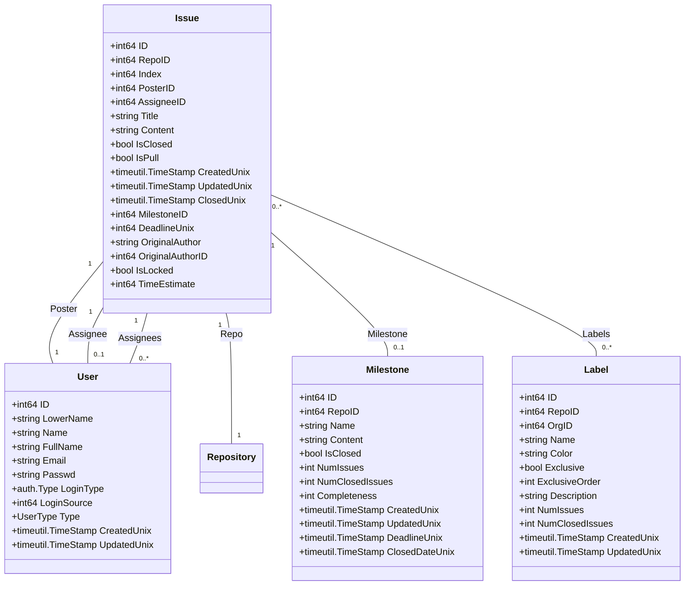
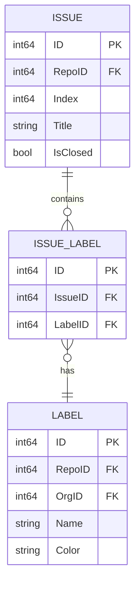
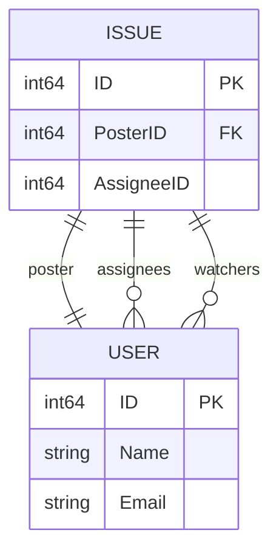
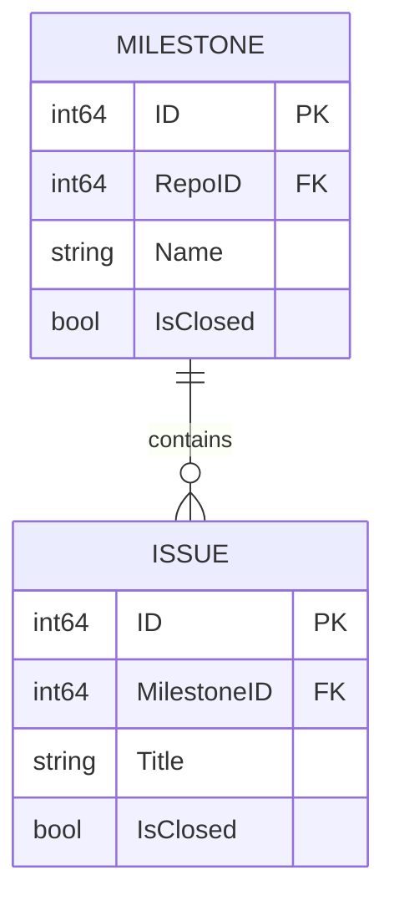
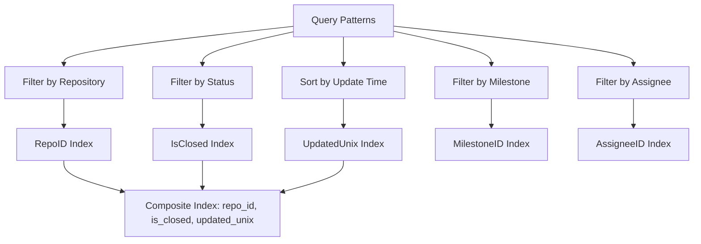
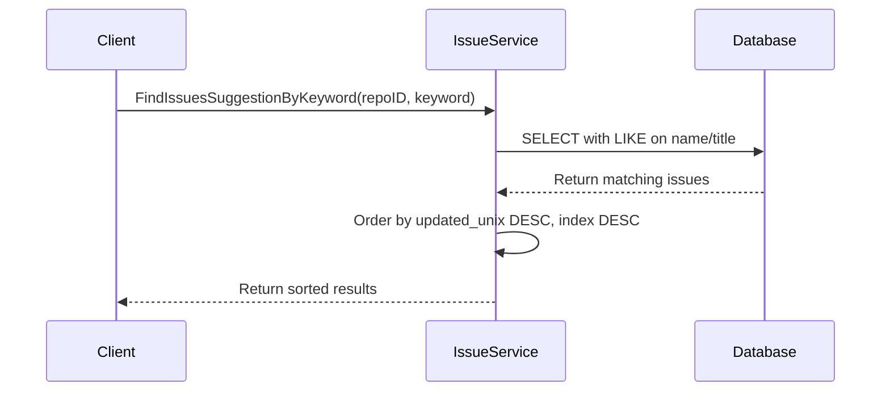

# Issue Model

<cite>
**Referenced Files in This Document**   
- [issue.go](file://models/issues/issue.go)
- [issue_label.go](file://models/issues/issue_label.go)
- [label.go](file://models/issues/label.go)
- [milestone.go](file://models/issues/milestone.go)
- [user.go](file://models/user/user.go)
</cite>

## Table of Contents
1. [Introduction](#introduction)
2. [Core Data Structure](#core-data-structure)
3. [Field Definitions](#field-definitions)
4. [Relationships](#relationships)
5. [XORM Mapping and Indexing](#xorm-mapping-and-indexing)
6. [Business Rules](#business-rules)
7. [Data Access Patterns](#data-access-patterns)
8. [Performance Considerations](#performance-considerations)

## Introduction
The Issue model in Gitea represents a fundamental unit for tracking tasks, bugs, and feature requests within repositories. This document provides comprehensive documentation of the Issue entity, detailing its structure, relationships, and operational characteristics. The model supports both regular issues and pull requests, serving as a central component for project management and collaboration. This documentation covers field definitions, database relationships, XORM tag usage, indexing strategies, business rules, data access patterns, and performance considerations essential for understanding and working with the Issue model.

## Core Data Structure
The Issue model is implemented as a Go struct that defines the core attributes and relationships of an issue within the Gitea system. The structure includes fields for identification, metadata, status tracking, and relationships to other entities such as users, labels, and milestones. The model is designed to support efficient querying and filtering operations while maintaining data integrity through proper indexing and constraints.

**Diagram sources**
- [issue.go](file://models/issues/issue.go)
- [label.go](file://models/issues/label.go)
- [milestone.go](file://models/issues/milestone.go)
- [user.go](file://models/user/user.go)

**Section sources**
- [issue.go](file://models/issues/issue.go)

## Field Definitions
The Issue model contains a comprehensive set of fields that capture essential information about each issue. These fields are categorized into identification, metadata, content, status, and relationship attributes.

### Identification Fields
- **ID**: Primary key for the issue, auto-incrementing integer (xorm: "pk autoincr")
- **RepoID**: Foreign key referencing the repository to which the issue belongs (xorm: "INDEX UNIQUE(repo_index)")
- **Index**: Sequential number for the issue within its repository, unique per repository (xorm: "UNIQUE(repo_index)")

### Metadata Fields
- **PosterID**: ID of the user who created the issue (xorm: "INDEX")
- **OriginalAuthor**: Username of the original author when the issue was migrated from another system
- **OriginalAuthorID**: ID of the original author when the issue was migrated
- **Title**: Issue title, stored as a string
- **Content**: Full issue description, stored as LONGTEXT
- **RenderedContent**: HTML representation of the rendered content (transient field)
- **ContentVersion**: Version number of the content for tracking changes

### Timestamp Fields
- **CreatedUnix**: Unix timestamp when the issue was created (xorm: "INDEX created")
- **UpdatedUnix**: Unix timestamp when the issue was last updated (xorm: "INDEX updated")
- **ClosedUnix**: Unix timestamp when the issue was closed (xorm: "INDEX")

### Status and Type Fields
- **IsClosed**: Boolean flag indicating whether the issue is closed (xorm: "INDEX")
- **IsPull**: Boolean flag indicating whether the issue is a pull request (xorm: "INDEX")
- **IsLocked**: Boolean flag indicating whether commenting is restricted to users with write access (xorm: "NOT NULL DEFAULT false")
- **Priority**: Integer value representing the issue priority
- **TimeEstimate**: Estimated time for completion in seconds (xorm: "NOT NULL DEFAULT 0")

### Relationship Fields
- **MilestoneID**: ID of the milestone to which the issue is assigned (xorm: "INDEX")
- **DeadlineUnix**: Unix timestamp for the issue deadline (xorm: "INDEX")
- **AssigneeID**: ID of the user assigned to the issue (transient field)
- **PinOrder**: Order value for pinned issues (0 = not loaded, -1 = not pinned)

**Section sources**
- [issue.go](file://models/issues/issue.go)

## Relationships
The Issue model establishes several important relationships with other entities in the Gitea system, enabling rich functionality for issue tracking and project management.

### Label Relationship (Many-to-Many)
The Issue model has a many-to-many relationship with the Label model, implemented through the issue_label junction table. This relationship allows issues to be categorized with multiple labels, supporting flexible organization and filtering.

**Diagram sources**
- [issue.go](file://models/issues/issue.go)
- [issue_label.go](file://models/issues/issue_label.go)
- [label.go](file://models/issues/label.go)

### User Relationships
The Issue model has multiple relationships with the User model, representing different roles in the issue lifecycle.

- **Poster**: The user who created the issue, referenced by PosterID
- **Assignee**: The user assigned to work on the issue, referenced by AssigneeID
- **Watchers**: Users who are watching the issue for updates (managed through issue_user table)

**Diagram sources**
- [issue.go](file://models/issues/issue.go)
- [user.go](file://models/user/user.go)

### Milestone Relationship
The Issue model has a one-to-many relationship with the Milestone model, where multiple issues can be associated with a single milestone. This relationship supports project planning and tracking progress against goals.

**Diagram sources**
- [issue.go](file://models/issues/issue.go)
- [milestone.go](file://models/issues/milestone.go)

## XORM Mapping and Indexing
The Issue model utilizes XORM tags extensively for database mapping, indexing, and relationship management. These tags define how the Go struct maps to database columns and constraints.

### XORM Field Mapping
The model employs various XORM tags to control field behavior:
- **pk autoincr**: Specifies primary key with auto-increment
- **INDEX**: Creates database index for improved query performance
- **UNIQUE(repo_index)**: Creates unique constraint combining RepoID and Index
- **NOT NULL DEFAULT**: Specifies non-null fields with default values
- **created**: Marks field as creation timestamp
- **updated**: Marks field as update timestamp

### Indexing Strategy
The Issue model implements a comprehensive indexing strategy to optimize common query patterns:

The primary composite index on (repo_id, is_closed, updated_unix) is specifically designed to optimize the most common issue listing operations, allowing efficient retrieval of open/closed issues sorted by update time within a repository.

**Section sources**
- [issue.go](file://models/issues/issue.go)

## Business Rules
The Issue model enforces several business rules to maintain data integrity and support workflow requirements.

### Issue Numbering
Issues are numbered sequentially within each repository using the Index field. This numbering is unique per repository and provides a stable identifier for referencing issues. The combination of RepoID and Index ensures global uniqueness while supporting repository-specific numbering.

### Assignment Constraints
Issue assignment follows specific rules:
- Only users with appropriate permissions can be assigned to issues
- Issues can have multiple assignees through the Assignees field
- When a label with exclusive scope is applied, other labels in the same scope are automatically removed
- The system validates that labels belong to the same repository or organization before assignment

### State Transitions
The Issue model supports the following state transitions:
- **Open to Closed**: When an issue is resolved
- **Closed to Open**: When a closed issue is reopened
- **Assignment Changes**: When responsibility for an issue is transferred
- **Label Changes**: When categorization of an issue is updated

The model includes methods to handle these transitions while maintaining audit trails through comment creation and timestamp updates.

### Full-Text Search Implementation
The Issue model supports full-text search capabilities for issue content. The search functionality is implemented using database-level LIKE operations with case-insensitive matching on the title field. For performance reasons, the current implementation focuses on title search rather than content search, as content searching tends to produce less usable results.

**Section sources**
- [issue.go](file://models/issues/issue.go)
- [issue_label.go](file://models/issues/issue_label.go)

## Data Access Patterns
The Issue model supports several common data access patterns for retrieving and manipulating issue data.

### Issue Creation
Issues are created through the InsertIssues method, which handles the insertion of the issue record along with associated labels and reactions in a transactional manner. The process ensures data consistency by creating all related records within a single database transaction.

### Issue Listing
The model provides multiple methods for listing issues based on different criteria:
- By repository (GetIssueByIndex, GetIssueWithAttrsByIndex)
- By user (GetIssuesByIDs)
- By milestone (implicit through MilestoneID filtering)
- By status (using IsClosed flag)

### Issue Searching
Issue searching is implemented through the FindIssuesSuggestionByKeyword function, which searches for issues by keyword in the title field. The search is optimized with proper indexing and returns results sorted by update time and index.

**Diagram sources**
- [issue.go](file://models/issues/issue.go)

**Section sources**
- [issue.go](file://models/issues/issue.go)

## Performance Considerations
The Issue model includes several performance optimizations to ensure efficient operation at scale.

### Query Optimization
The primary performance consideration is the optimization of issue listing queries, which are among the most common operations. The composite index on (repo_id, is_closed, updated_unix) enables efficient filtering and sorting for the most frequent query patterns.

### Composite Index Recommendations
Based on access patterns, the following composite indexes are recommended:
- (repo_id, is_closed, updated_unix): For listing issues by repository and status, sorted by update time
- (repo_id, milestone_id, is_closed): For filtering issues by milestone within a repository
- (poster_id, is_closed, updated_unix): For listing issues by creator

### Caching Strategy
The model implements a lazy loading strategy for related entities such as labels, milestone, and assignees. These relationships are only loaded when explicitly requested through the LoadAttributes method, reducing unnecessary database queries for operations that don't require the full issue context.

### Pagination
For operations that return multiple issues, the model supports pagination through the ListOptions parameter, allowing efficient retrieval of large result sets in manageable chunks.

**Section sources**
- [issue.go](file://models/issues/issue.go)