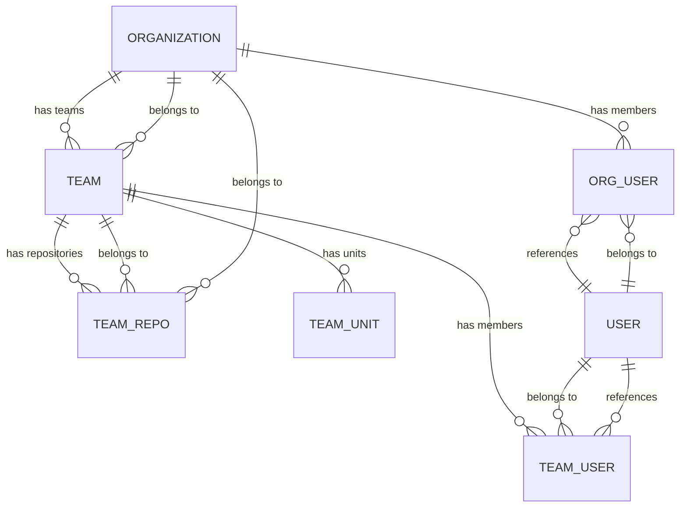
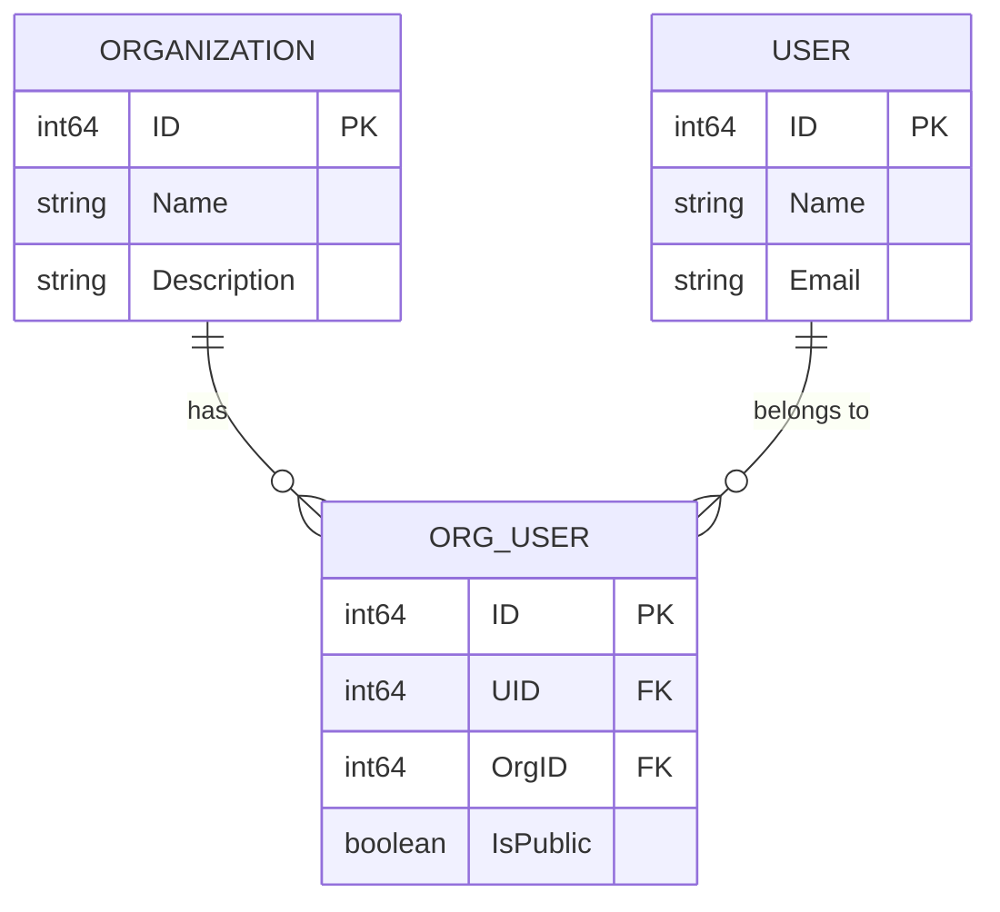
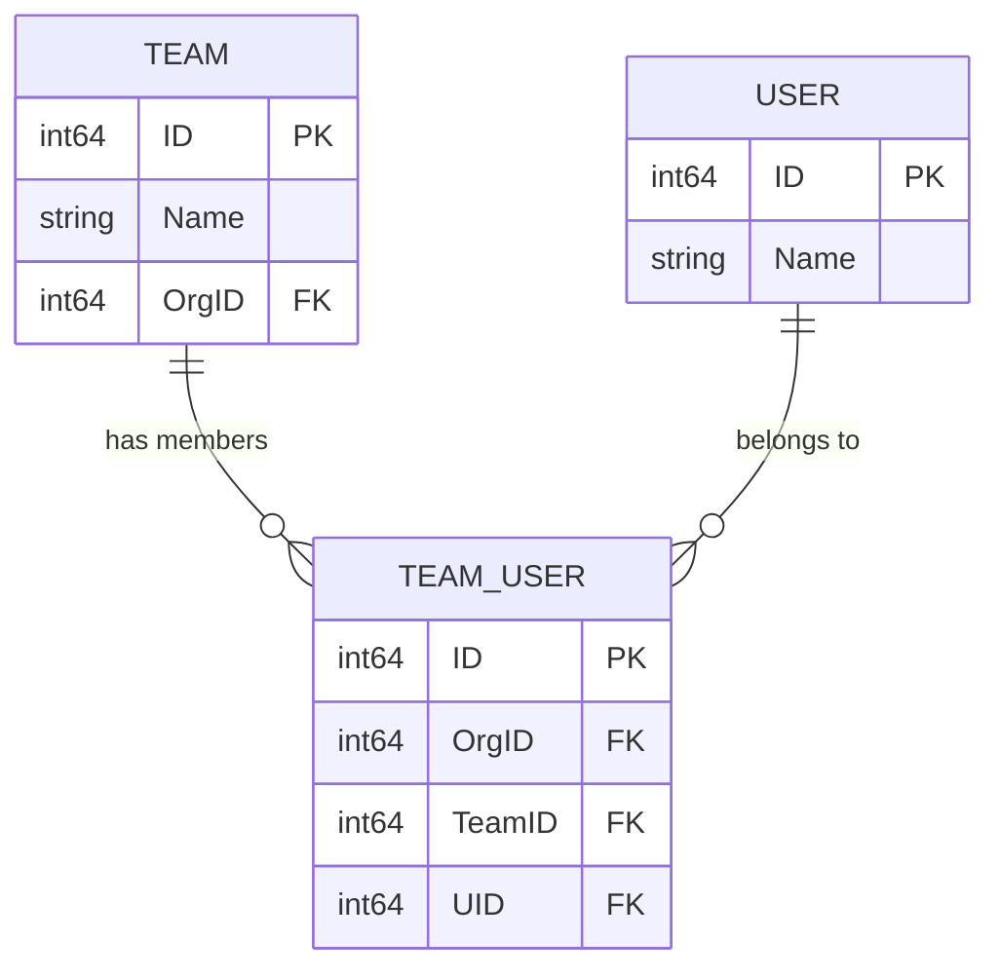

# Organization Model

<cite>
**Referenced Files in This Document**   
- [org.go](file://models/organization/org.go)
- [org_user.go](file://models/organization/org_user.go)
- [team.go](file://models/organization/team.go)
- [team_user.go](file://models/organization/team_user.go)
- [team_unit.go](file://models/organization/team_unit.go)
- [team_repo.go](file://models/organization/team_repo.go)
</cite>

## Table of Contents
1. [Introduction](#introduction)
2. [Core Data Model](#core-data-model)
3. [Field Definitions](#field-definitions)
4. [Relationships](#relationships)
5. [XORM Mapping and Database Configuration](#xorm-mapping-and-database-configuration)
6. [Business Rules and Access Control](#business-rules-and-access-control)
7. [Data Access Patterns](#data-access-patterns)
8. [Performance Considerations](#performance-considerations)

## Introduction
The Organization model in Gitea represents a user group that can own repositories and manage access through teams and members. This documentation details the data model, relationships, business rules, and access patterns for organizations within the Gitea platform. The model is implemented using XORM for database persistence and follows a relational design with multiple junction tables to manage complex many-to-many relationships between users, teams, and repositories.

**Section sources**
- [org.go](file://models/organization/org.go#L1-L50)

## Core Data Model
The Organization model is built around several interconnected entities that form a hierarchical access control system. At its core, an Organization inherits from the User model but represents a group entity rather than an individual user. The model establishes relationships through junction tables that manage membership, team assignments, and repository access.



**Diagram sources**
- [org.go](file://models/organization/org.go#L1-L599)
- [org_user.go](file://models/organization/org_user.go#L1-L199)
- [team.go](file://models/organization/team.go#L1-L250)
- [team_user.go](file://models/organization/team_user.go#L1-L82)
- [team_unit.go](file://models/organization/team_unit.go#L1-L47)
- [team_repo.go](file://models/organization/team_repo.go#L1-L77)

## Field Definitions
The Organization entity contains several key fields that define its properties and behavior within the system:

- **ID**: Unique identifier for the organization (inherited from User model)
- **Name**: Display name of the organization (inherited from User model)
- **LowerName**: Lowercase version of the name for case-insensitive lookups (inherited from User model)
- **Description**: Text description of the organization's purpose or activities
- **Visibility**: Public or private visibility setting for the organization
- **NumTeams**: Count of teams within the organization
- **NumMembers**: Count of users who are members of the organization
- **MaxRepoCreation**: Maximum number of repositories a user can create (negative value indicates unlimited)
- **UseCustomAvatar**: Flag indicating whether a custom avatar is used
- **Avatar**: Path to the organization's avatar image
- **CreatedUnix**: Timestamp of organization creation (inherited from User model)
- **UpdatedUnix**: Timestamp of last update (inherited from User model)

The model also inherits various user-related fields such as email, website, location, and other profile information that can be used to describe the organization.

**Section sources**
- [org.go](file://models/organization/org.go#L150-L170)

## Relationships
The Organization model establishes several critical relationships through junction tables and direct associations:

### Organization-User Relationship (Many-to-Many)
The `org_user` table manages the many-to-many relationship between organizations and users, with additional metadata about the membership:



**Diagram sources**
- [org.go](file://models/organization/org.go#L150-L599)
- [org_user.go](file://models/organization/org_user.go#L1-L199)

### Organization-Team Relationship (One-to-Many)
Each organization has a one-to-many relationship with teams, where teams are organizational units that can have different permission levels and repository access:

```mermaid
erDiagram
ORGANIZATION ||--o{ TEAM : "contains"
TEAM {
int64 ID PK
int64 OrgID FK
string Name
perm.AccessMode AccessMode
int NumRepos
int NumMembers
boolean IncludesAllRepositories
boolean CanCreateOrgRepo
}
ORGANIZATION {
int64 ID PK
string Name
int NumTeams
int NumMembers
}
```

**Diagram sources**
- [org.go](file://models/organization/org.go#L150-L599)
- [team.go](file://models/organization/team.go#L1-L250)

### Team-User Relationship (Many-to-Many)
The `team_user` table manages the many-to-many relationship between teams and users, allowing users to be members of multiple teams within an organization:



**Diagram sources**
- [team.go](file://models/organization/team.go#L1-L250)
- [team_user.go](file://models/organization/team_user.go#L1-L82)

## XORM Mapping and Database Configuration
The Organization model uses XORM for database mapping with specific annotations that define table structure and relationships:

- The `Organization` type is defined as an alias of `user_model.User` and uses the "user" table via the `TableName()` method
- Fields use XORM tags to specify primary keys (`pk`), auto-increment behavior (`autoincr`), indexing (`INDEX`), and uniqueness constraints (`UNIQUE`)
- The `org_user` table has a composite unique constraint on `UID` and `OrgID` to prevent duplicate memberships
- The `team_user` table has a composite unique constraint on `TeamID` and `UID` to prevent duplicate team memberships
- Indexes are created on frequently queried fields such as `OrgID` in the `team` table and `IsPublic` in the `org_user` table

The model also implements cascade behavior through application logic rather than database constraints, ensuring that when an organization is deleted, related teams and memberships are properly cleaned up.

**Section sources**
- [org.go](file://models/organization/org.go#L150-L599)
- [org_user.go](file://models/organization/org_user.go#L1-L199)
- [team.go](file://models/organization/team.go#L1-L250)

## Business Rules and Access Control
The Organization model enforces several business rules to maintain data integrity and security:

### Team Permission Inheritance
Teams inherit permissions from their organization and can be granted specific access levels to repositories. The owner team (named "Owners") has full administrative privileges, while other teams can have read, write, or admin access to specific repositories. Team permissions are stored in the `team_unit` table, which associates teams with repository units and access modes.

### User Role Hierarchies
User roles within an organization follow a hierarchical structure:
- **Owner**: Members of the owner team have full control over the organization
- **Admin**: Members of admin teams have administrative privileges for specific areas
- **Member**: Regular members have access based on team assignments

The system checks user permissions by evaluating their team memberships and the associated access modes, with the highest privilege level determining their effective permissions.

### Organization Ownership Requirements
An organization must always have at least one owner. The system prevents removal of the last owner through the `ErrLastOrgOwner` error type. When creating a new organization, the creator is automatically added as a member of the owner team, ensuring there is always at least one owner.

### Access Control Implementation
The model implements several methods for access control evaluation:
- `IsOwnedBy()`: Checks if a user is in the owner team
- `IsOrgAdmin()`: Checks if a user is in the owner team or an admin team
- `IsOrgMember()`: Checks if a user is a member of the organization
- `CanCreateOrgRepo()`: Determines if a user can create repositories in the organization
- `UnitPermission()`: Evaluates the access mode for a specific unit type

These methods use database queries to check membership and permission levels, often joining multiple tables to determine the effective access level.

**Section sources**
- [org.go](file://models/organization/org.go#L150-L599)
- [org_user.go](file://models/organization/org_user.go#L1-L199)
- [team.go](file://models/organization/team.go#L1-L250)

## Data Access Patterns
The Organization model supports several key data access patterns for common operations:

### Organization Membership Checks
To check if a user is a member of an organization, the system queries the `org_user` table with the user ID and organization ID. This operation is optimized with indexes on both `UID` and `OrgID` fields.

### Team Permission Evaluation
Evaluating team permissions involves multiple steps:
1. Retrieve all teams the user belongs to within the organization
2. Load the units associated with each team
3. Determine the maximum access mode across all relevant units
4. Return the highest permission level

This process is optimized by caching team memberships and units when possible.

### Organization Listing
When listing organizations for a user, the system considers visibility settings and membership status:
- Public organizations are visible to all users
- Private organizations are only visible to members
- Restricted users have additional limitations on visibility

The `HasOrgOrUserVisible()` function implements this logic, taking into account the user's role, the organization's visibility, and membership status.

### User Management Operations
Common user management operations include:
- Adding a user to an organization (`AddOrgUser`)
- Changing membership visibility (`ChangeOrgUserStatus`)
- Removing a user from an organization
- Retrieving all members of an organization (`GetOrgUsersByOrgID`)

These operations maintain data consistency by updating both the `org_user` table and the organization's member count.

**Section sources**
- [org.go](file://models/organization/org.go#L150-L599)
- [org_user.go](file://models/organization/org_user.go#L1-L199)
- [team.go](file://models/organization/team.go#L1-L250)

## Performance Considerations
The Organization model includes several performance optimizations for handling large organizations:

### Query Optimization for Permission Checks
Permission checks across large organizations can be expensive due to the need to join multiple tables. The system optimizes these queries by:
- Using indexed fields for all join conditions
- Limiting the scope of queries with appropriate WHERE clauses
- Caching frequently accessed data when possible

### Role-Based Access Control Caching
For frequently accessed permission evaluations, implementing a caching layer can significantly improve performance. The system could cache:
- Team memberships for active users
- Effective permission levels for commonly accessed repositories
- Organization membership lists for display purposes

### Optimized Team Membership Queries
Queries involving team membership should use the indexed fields on the `team_user` table. When retrieving members of a specific team, the query should:
- Use the `TeamID` index to find relevant `team_user` records
- Join with the `user` table to retrieve user details
- Apply pagination to limit result set size

### Indexing Strategy
The current indexing strategy includes:
- Index on `org_user.UID` and `org_user.OrgID` for membership lookups
- Index on `team.OrgID` for retrieving teams by organization
- Composite unique constraint on `team_user.TeamID` and `team_user.UID` to prevent duplicates

Additional indexes could be considered for fields frequently used in WHERE clauses or JOIN conditions, particularly for large installations with many organizations and users.

**Section sources**
- [org.go](file://models/organization/org.go#L150-L599)
- [org_user.go](file://models/organization/org_user.go#L1-L199)
- [team.go](file://models/organization/team.go#L1-L250)