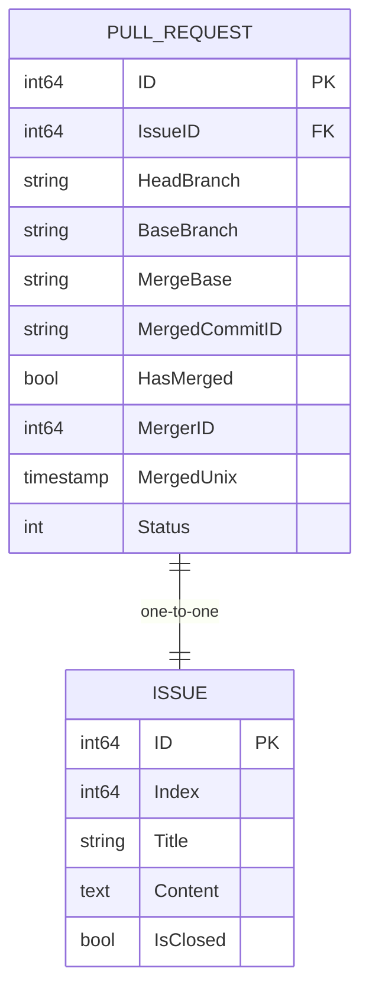
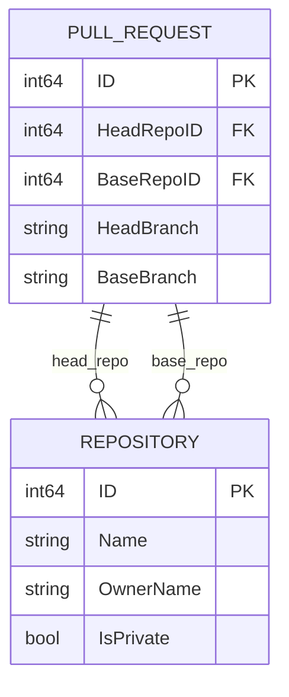
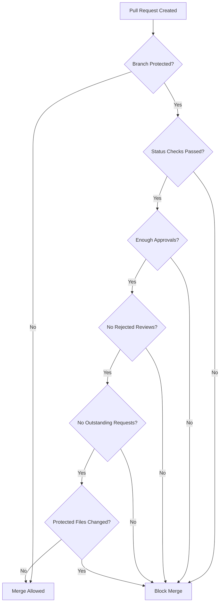

# Pull Request Model

<cite>
**Referenced Files in This Document**   
- [pull.go](file://models/issues/pull.go)
- [pull_test.go](file://models/issues/pull_test.go)
- [check.go](file://services/pull/check.go)
- [merge.go](file://services/pull/merge.go)
- [patch.go](file://services/pull/patch.go)
- [commit_status.go](file://services/pull/commit_status.go)
</cite>

## Table of Contents
1. [Introduction](#introduction)
2. [Field Definitions](#field-definitions)
3. [Relationships](#relationships)
4. [XORM Tag Usage](#xorm-tag-usage)
5. [Business Rules](#business-rules)
6. [Data Access Patterns](#data-access-patterns)
7. [Performance Considerations](#performance-considerations)

## Introduction
The PullRequest entity in Gitea represents a pull request between repositories, serving as the core model for code review and merge workflows. This document provides comprehensive documentation of the PullRequest data model, including field definitions, relationships, XORM mappings, business rules, and performance considerations. The model enables pull request creation, conflict detection, merge status tracking, and integration with repository and issue systems.

**Section sources**
- [pull.go](file://models/issues/pull.go#L93-L174)

## Field Definitions
The PullRequest model contains the following fields that define its core attributes:

- **ID**: Primary key identifier for the pull request (int64, auto-incrementing)
- **IssueID**: Foreign key linking to the corresponding Issue entity (int64, indexed)
- **HeadRepoID**: Repository ID of the source/head repository (int64, indexed)
- **BaseRepoID**: Repository ID of the target/base repository (int64, indexed)
- **HeadBranch**: Name of the source branch in the head repository (string)
- **BaseBranch**: Name of the target branch in the base repository (string)
- **MergeBase**: Common ancestor commit SHA between head and base branches (string, VARCHAR(64))
- **MergedCommitID**: Commit SHA of the merge commit when the pull request is merged (string, VARCHAR(64))
- **HasMerged**: Boolean flag indicating whether the pull request has been merged (bool, indexed)
- **MergerID**: User ID of the user who performed the merge (int64, indexed)
- **MergedUnix**: Timestamp of when the pull request was merged (timeutil.TimeStamp, indexed)
- **Status**: Current status of the pull request (PullRequestStatus enum)
- **Flow**: Pull request flow type (PullRequestFlow enum, NOT NULL DEFAULT 0)
- **AllowMaintainerEdit**: Boolean flag indicating whether maintainers can edit the pull request (bool, NOT NULL DEFAULT false)
- **CommitsAhead**: Number of commits the head branch is ahead of the base branch (int)
- **CommitsBehind**: Number of commits the head branch is behind the base branch (int)
- **ConflictedFiles**: List of files with merge conflicts (string array, TEXT JSON)
- **ChangedProtectedFiles**: List of protected files that have been modified (string array, TEXT JSON)
- **Index**: Sequential index number for the pull request within its repository (int64)

**Section sources**
- [pull.go](file://models/issues/pull.go#L93-L174)

## Relationships
The PullRequest entity maintains several critical relationships with other entities in the system:

### Composition with Issue
The PullRequest has a one-to-one composition relationship with the Issue entity, established through the IssueID field. This relationship is bidirectional, with the PullRequest containing a reference to its corresponding Issue, and the Issue containing a reference back to its PullRequest. When a pull request is deleted, its associated issue is also removed, maintaining data integrity.

**Diagram sources**
- [pull.go](file://models/issues/pull.go#L93-L174)

### Foreign Key Relationships
The PullRequest maintains foreign key relationships with repositories and branches:

- **Head Repository**: Referenced by HeadRepoID, establishing the source repository for the pull request
- **Base Repository**: Referenced by BaseRepoID, establishing the target repository for the pull request
- **Head Branch**: Referenced by HeadBranch, establishing the source branch within the head repository
- **Base Branch**: Referenced by BaseBranch, establishing the target branch within the base repository

These relationships enable pull request discovery by repository and branch, supporting common workflows like listing all pull requests targeting a specific repository or branch.

**Diagram sources**
- [pull.go](file://models/issues/pull.go#L93-L174)

## XORM Tag Usage
The PullRequest model utilizes XORM tags to define database mappings, indexing strategies, and field behaviors:

- **pk autoincr**: Applied to the ID field to designate it as the primary key with auto-incrementing behavior
- **INDEX**: Applied to critical fields for query optimization:
  - IssueID: Enables efficient lookups by issue ID for issue integration
  - HeadRepoID and BaseRepoID: Facilitates pull request discovery by repository
  - HasMerged and MergerID: Supports filtering and sorting of merged pull requests
  - MergedUnix: Enables chronological ordering of merged pull requests
- **VARCHAR(64)**: Applied to MergeBase and MergedCommitID to store SHA values with appropriate length constraints
- **NOT NULL DEFAULT false**: Applied to AllowMaintainerEdit to ensure a default value of false
- **NOT NULL DEFAULT 0**: Applied to Flow to ensure a default value of 0 (PullRequestFlowGithub)
- **updated INDEX**: Applied to MergedUnix to automatically update the timestamp when the record is modified and index it for performance
- **xorm:"-"**: Applied to transient fields like HeadRepo, BaseRepo, Issue, and Merger to exclude them from database storage while maintaining object references

These XORM tags optimize database performance for common access patterns, particularly pull request discovery by repository/branch and issue integration.

**Section sources**
- [pull.go](file://models/issues/pull.go#L93-L174)

## Business Rules
The PullRequest model enforces several business rules to maintain data integrity and support collaborative workflows:

### Branch Protection Enforcement
Pull requests are subject to branch protection rules defined for the base branch. These rules include:
- Required status checks that must pass before merging
- Required number of approvals from authorized reviewers
- Restrictions on who can merge the pull request
- Blocking of merges if there are rejected reviews
- Blocking of merges if there are outstanding review requests
- Protection of specific files that require special approval to modify

**Diagram sources**
- [merge.go](file://services/pull/merge.go#L541-L584)
- [commit_status.go](file://services/pull/commit_status.go#L39-L82)

### Merge Conflict Detection
The system automatically detects merge conflicts by attempting to merge the head branch into the base branch in a temporary repository. If conflicts are detected, the pull request status is updated to Conflict, and the conflicting files are recorded in the ConflictedFiles field. The merge base is calculated using git merge-base to determine the common ancestor of the head and base branches.

### Status Check Requirements
Pull requests must satisfy all configured status check requirements before they can be merged. The system evaluates the status of all required checks and prevents merging if any required check is pending, failing, or missing. This ensures that all automated tests and validations pass before code is integrated.

### Work-in-Progress Detection
Pull requests with titles containing work-in-progress prefixes (configurable in settings) are automatically detected as work-in-progress and cannot be merged. This prevents accidental merging of incomplete work.

**Section sources**
- [pull.go](file://models/issues/pull.go#L741-L776)
- [check.go](file://services/pull/check.go#L234-L271)
- [patch.go](file://services/pull/patch.go#L92-L136)

## Data Access Patterns
The PullRequest model supports several key data access patterns:

### Pull Request Creation
Pull requests are created through the NewPullRequest function, which generates a new issue and associates it with a pull request record. The function ensures data consistency by using a transaction to create both the issue and pull request records atomically.

### Listing by Repository/Branch
Pull requests can be listed by repository and branch using the GetUnmergedPullRequestsByBaseInfo and GetUnmergedPullRequestsByHeadInfo functions. These functions leverage indexed fields (BaseRepoID, BaseBranch, HeadRepoID, HeadBranch) to efficiently retrieve pull requests targeting or originating from specific repositories and branches.

### Merge Status Checking
The system provides several functions to check merge readiness:
- CanAutoMerge: Returns true if the pull request can be automatically merged
- Mergeable: Returns true if the pull request is in a mergeable state (not checking, not conflicted, not in error state, and not work-in-progress)
- IsWorkInProgress: Returns true if the pull request is marked as work-in-progress based on its title

These functions are used to determine whether a pull request can be merged and to provide appropriate UI feedback to users.

**Section sources**
- [pull.go](file://models/issues/pull.go#L439-L468)
- [pull.go](file://models/issues/pull.go#L531-L581)

## Performance Considerations
The PullRequest model includes several performance optimizations and considerations:

### Query Performance
Queries involving pull request diff calculations and merge readiness assessments can be resource-intensive. The model addresses this through:
- Indexing on critical fields (IssueID, HeadRepoID, BaseRepoID, HasMerged, MergedUnix) to accelerate common queries
- Use of materialized views or cached merge bases to avoid recalculating merge bases on every request
- Batch loading of related entities (repositories, issues, reviewers) to reduce database round trips

### Diff Calculation Optimization
Pull request diff calculations are optimized by:
- Using git diff --shortstat to calculate file changes, additions, and deletions efficiently
- Caching diff results when possible to avoid recalculation
- Using temporary repositories for conflict checking to isolate operations and improve performance

### Merge Readiness Assessment
Merge readiness assessments are optimized through:
- Queue-based processing of pull request checks to avoid blocking requests
- Incremental updates of merge status rather than full recalculation on every access
- Caching of branch protection rules and approval counts to reduce database queries

For high-traffic repositories, implementing materialized views for pull request statistics (e.g., number of files changed, additions, deletions) is recommended to improve query performance for pull request listing and filtering operations.

**Section sources**
- [pull.go](file://models/issues/pull.go#L93-L174)
- [convert/pull.go](file://services/convert/pull.go#L199-L245)
- [check.go](file://services/pull/check.go#L273-L308)