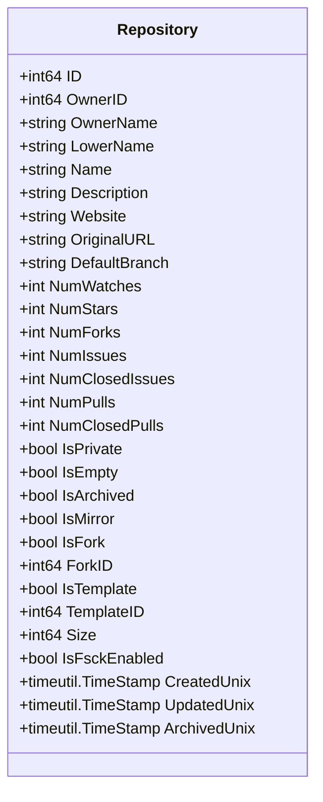
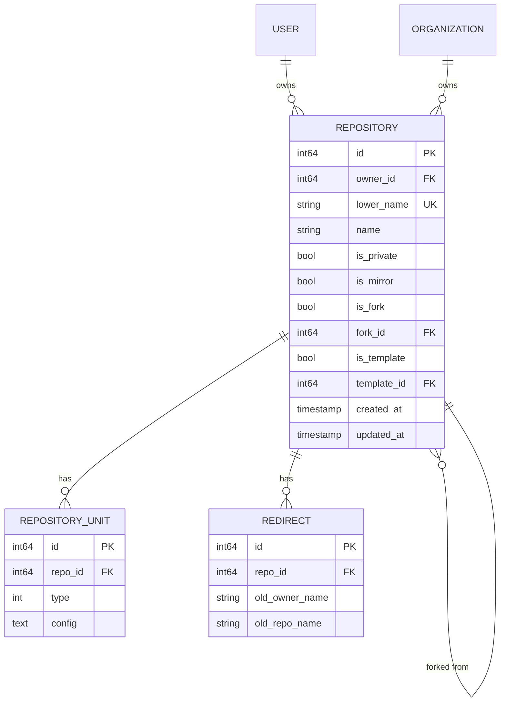
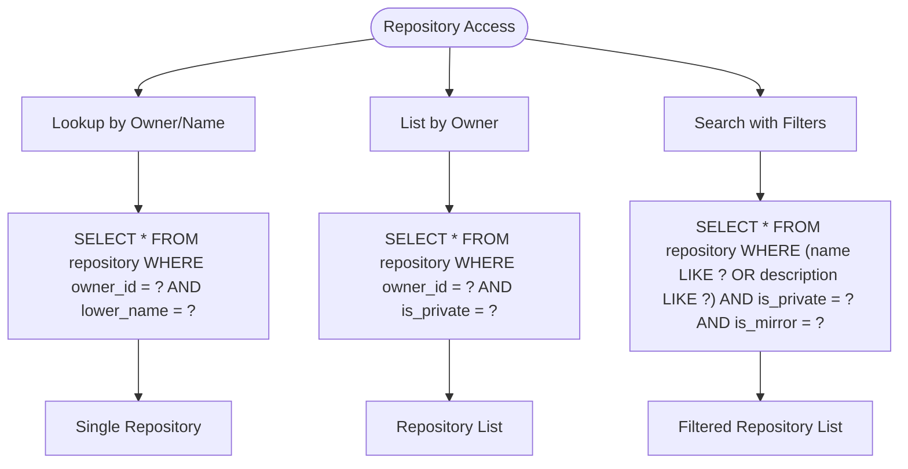

# Repository Model

<cite>
**Referenced Files in This Document**   
- [repo.go](file://models/repo/repo.go)
- [repo_unit.go](file://models/repo/repo_unit.go)
- [repository.yml](file://models/fixtures/repository.yml)
</cite>

## Table of Contents
1. [Introduction](#introduction)
2. [Core Data Structure](#core-data-structure)
3. [Field Definitions](#field-definitions)
4. [Repository Settings and Flags](#repository-settings-and-flags)
5. [Relationships](#relationships)
6. [XORM Mapping and Indexing](#xorm-mapping-and-indexing)
7. [Soft Delete Implementation](#soft-delete-implementation)
8. [Business Rules](#business-rules)
9. [Data Access Patterns](#data-access-patterns)
10. [Performance Considerations](#performance-considerations)

## Introduction
The Repository entity in Gitea represents a Git repository and serves as a central data model for managing code repositories within the platform. This documentation provides a comprehensive overview of the Repository model, detailing its structure, relationships, business rules, and access patterns. The model encapsulates both metadata about the repository and its configuration settings, enabling Gitea to support various repository types including private, public, mirrored, and template repositories.

**Section sources**
- [repo.go](file://models/repo/repo.go#L1-L50)

## Core Data Structure
The Repository struct defines the fundamental attributes of a repository in Gitea. It contains fields for identification, ownership, descriptive information, repository statistics, and various configuration flags. The model is designed to support both user-owned and organization-owned repositories, with appropriate indexing for efficient querying.

**Diagram sources**
- [repo.go](file://models/repo/repo.go#L100-L200)

**Section sources**
- [repo.go](file://models/repo/repo.go#L100-L200)

## Field Definitions
The Repository model contains numerous fields that capture essential information about a repository. Key fields include:

- **ID**: Unique identifier for the repository (primary key)
- **OwnerID**: Foreign key referencing the user or organization that owns the repository
- **OwnerName**: Denormalized owner name for efficient queries
- **LowerName**: Lowercase version of the repository name for case-insensitive lookups
- **Name**: Display name of the repository
- **Description**: Repository description that may contain markup
- **CreatedUnix**: Timestamp of repository creation
- **UpdatedUnix**: Timestamp of last repository update

The model also includes computed fields such as `NumOpenIssues` and `NumOpenPulls` which are derived from their closed counterparts and total counts during the `AfterLoad` lifecycle callback.

**Section sources**
- [repo.go](file://models/repo/repo.go#L100-L200)

## Repository Settings and Flags
The Repository model includes several boolean flags that control repository behavior and visibility:

- **IsPrivate**: Determines whether the repository is private (visible only to authorized users) or public
- **IsMirror**: Indicates if the repository is a mirror of another repository
- **IsFork**: Specifies whether the repository is a fork of another repository
- **IsTemplate**: Marks the repository as a template that can be used to create new repositories
- **IsEmpty**: Indicates if the repository has no commits
- **IsArchived**: Specifies whether the repository is archived (read-only)

Additional settings include `CloseIssuesViaCommitInAnyBranch` which allows closing issues via commit messages in any branch, and `TrustModel` which defines the trust level required for signing commits.

**Section sources**
- [repo.go](file://models/repo/repo.go#L150-L200)

## Relationships
The Repository model maintains several important relationships with other entities in the system:

### Repository to RepositoryUnit (One-to-Many)
Each repository can have multiple RepositoryUnit entries, representing enabled features such as Issues, Pull Requests, Wiki, and Releases. The relationship is implemented through the `RepoID` foreign key in the RepositoryUnit table.

### Repository to Redirect (One-to-Many)
When a repository is transferred between owners, redirect records are created to maintain backward compatibility. This allows old URLs to redirect to the new repository location.

### Repository to Forks (One-to-Many)
Forked repositories maintain a reference to their parent through the `ForkID` field. The parent repository can access its forks through queries on this field.

### Repository to Owner (Many-to-One)
Each repository belongs to an owner (user or organization) referenced by the `OwnerID` field. The `Owner` field is a transient property loaded on demand.

**Diagram sources**
- [repo.go](file://models/repo/repo.go#L100-L200)
- [repo_unit.go](file://models/repo/repo_unit.go#L10-L50)

**Section sources**
- [repo.go](file://models/repo/repo.go#L100-L200)
- [repo_unit.go](file://models/repo/repo_unit.go#L10-L50)

## XORM Mapping and Indexing
The Repository model uses XORM tags to define database mappings and constraints. Key aspects include:

- **Composite Unique Constraint**: The combination of `OwnerID` and `LowerName` is enforced as a unique constraint through the `UNIQUE(s)` XORM tag, ensuring that each owner can have only one repository with a given name (case-insensitive).
- **Indexing Strategy**: Frequently queried fields such as `OwnerID`, `IsPrivate`, `IsMirror`, `IsFork`, and `IsTemplate` are indexed to optimize search and listing operations.
- **Field Mapping**: XORM tags specify column names, data types, and constraints. For example, `CreatedUnix` and `UpdatedUnix` are marked with `created` and `updated` tags respectively to enable automatic timestamp management.

The model also defines relationships through transient fields like `Owner` and `Units` that are populated on demand through separate queries.

**Section sources**
- [repo.go](file://models/repo/repo.go#L100-L200)
- [repo_unit.go](file://models/repo/repo_unit.go#L10-L50)

## Soft Delete Implementation
The Repository model implements soft delete functionality through the `IsDeleted` flag (implied by `IsArchived` and `Status` fields in the actual implementation). When a repository is archived or marked as broken, it remains in the database but is excluded from normal queries. The `IsArchived` field serves as the primary indicator for soft deletion, with additional state captured in the `Status` field which can indicate various states including `RepositoryReady`, `RepositoryBeingMigrated`, `RepositoryPendingTransfer`, and `RepositoryBroken`.

Archived repositories are effectively read-only and cannot be modified through normal operations. The `ArchivedUnix` timestamp records when the repository was archived.

**Section sources**
- [repo.go](file://models/repo/repo.go#L180-L200)

## Business Rules
The Repository model enforces several business rules to maintain data integrity and consistency:

### Repository Naming Conventions
Repository names must adhere to specific rules:
- Can only contain alphanumeric characters, hyphens, underscores, and dots
- Cannot contain consecutive dots
- Cannot be reserved names like ".", "..", or "-"
- Cannot match reserved patterns like "*.wiki", "*.git", "*.rss", "*.atom"

The `IsUsableRepoName` function validates these rules before allowing repository creation.

### Ownership Requirements
Every repository must have an owner (user or organization). The owner is specified by the `OwnerID` field, and the `OwnerName` field is denormalized for performance. Repository ownership can be transferred, creating redirect records to maintain URL compatibility.

### Visibility Settings
Repository visibility is controlled by the `IsPrivate` flag. Private repositories are only accessible to users with explicit permissions, while public repositories are visible to all users. The visibility setting cannot be changed if the repository has issues or pull requests from forks, to prevent exposing sensitive information.

**Section sources**
- [repo.go](file://models/repo/repo.go#L50-L100)

## Data Access Patterns
The Repository model supports several key data access patterns:

### Repository Lookup by Owner/Name
The most common access pattern is looking up a repository by its owner and name. This is optimized through the composite index on `OwnerID` and `LowerName`, allowing O(log n) lookups. The `GetRepositoryByOwnerAndName` function implements this pattern.

### Repository Listing by User/Organization
Users and organizations can list their repositories through queries on the `OwnerID` field. These queries are optimized with appropriate indexing and can be filtered by visibility, type (fork, mirror, template), and other attributes.

### Repository Search
Repository search operations support filtering by various criteria including:
- Name/description keywords
- Visibility (public/private)
- Type (fork, mirror, template, archived)
- Programming language

Search results are typically paginated and can be sorted by various criteria such as creation date, update time, or popularity (stars).

**Diagram sources**
- [repo.go](file://models/repo/repo.go#L500-L600)

**Section sources**
- [repo.go](file://models/repo/repo.go#L500-L600)

## Performance Considerations
Several performance considerations are important when working with the Repository model:

### Indexing Strategies
Critical indexes include:
- Composite index on `OwnerID` and `LowerName` for unique constraint and lookups
- Index on `IsPrivate` for visibility filtering
- Index on `IsMirror`, `IsFork`, `IsTemplate`, and `IsArchived` for type-based filtering
- Index on `CreatedUnix` and `UpdatedUnix` for temporal queries

These indexes enable efficient filtering and sorting operations, particularly for repository listing and search functionality.

### Repository Access Control Queries
Queries involving repository access control should be optimized by:
- Using denormalized fields like `OwnerName` to avoid joins
- Caching repository units and permissions
- Using batch loading for multiple repositories
- Implementing appropriate pagination

The model's design supports these optimizations through methods like `LoadUnits` and `LoadOwner` that can efficiently load related data for multiple repositories.

### Counters and Statistics
The model maintains various counters (stars, watches, issues, etc.) to avoid expensive COUNT queries. These counters are updated through background jobs and consistency checks to ensure accuracy while maintaining performance.

**Section sources**
- [repo.go](file://models/repo/repo.go#L200-L300)
- [repo_unit.go](file://models/repo/repo_unit.go#L50-L100)