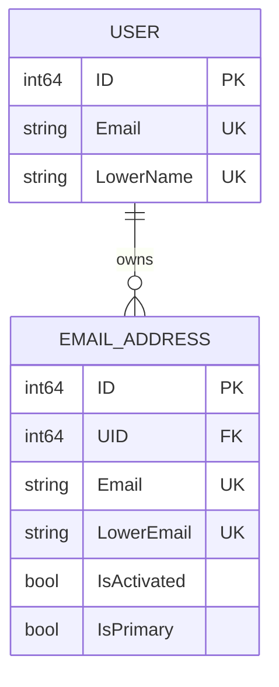
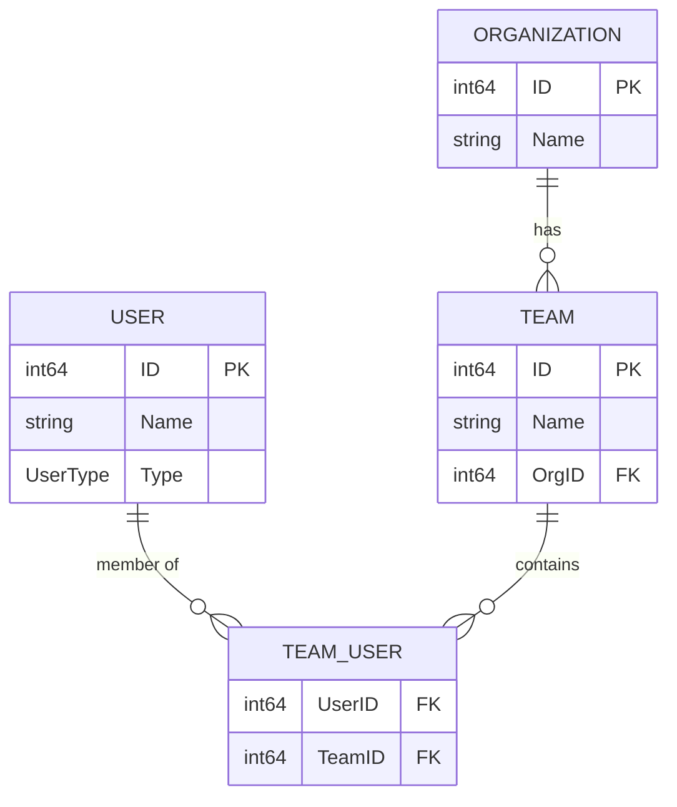
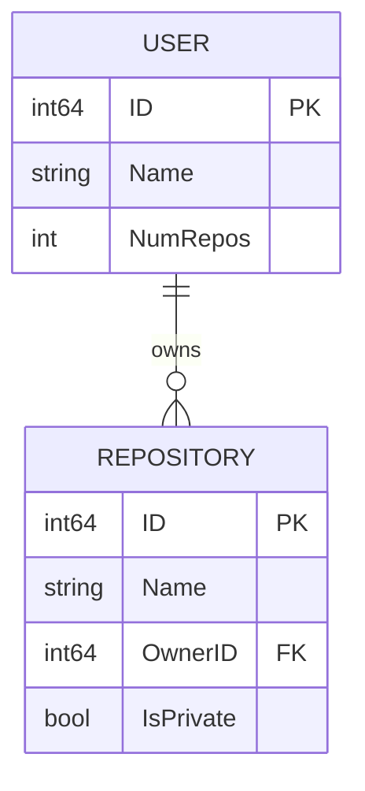
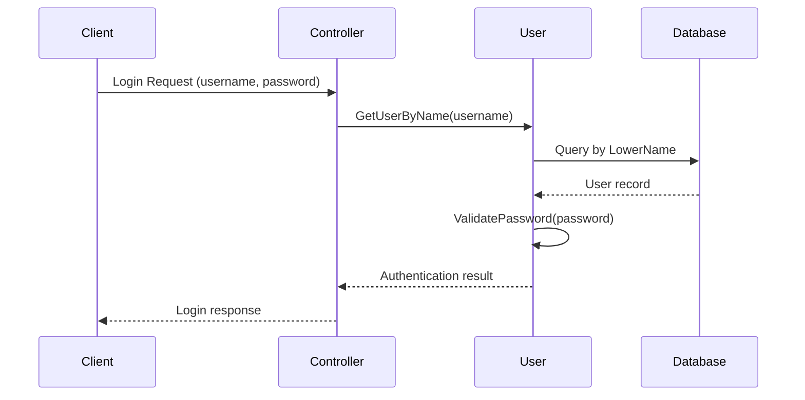
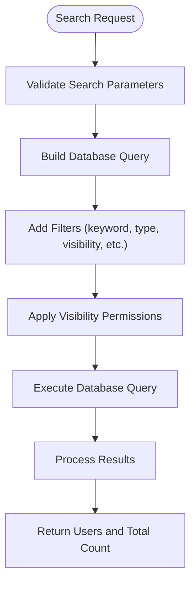
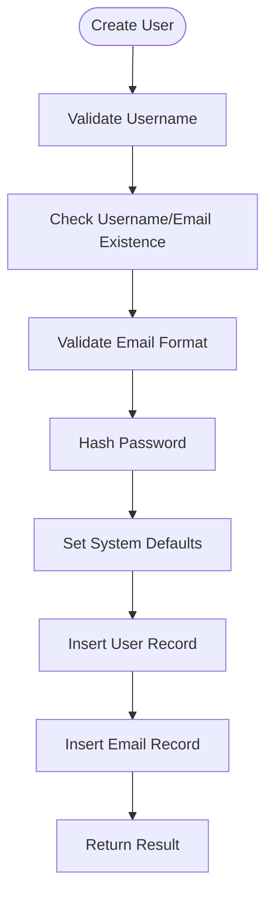

# User Model

<cite>
**Referenced Files in This Document**   
- [user.go](file://models/user/user.go)
- [access_token.go](file://models/auth/access_token.go)
- [email_address.go](file://models/user/email_address.go)
- [search.go](file://models/user/search.go)
- [password.go](file://modules/auth/password/password.go)
</cite>

## Table of Contents
1. [Introduction](#introduction)
2. [Core Data Model](#core-data-model)
3. [Relationships](#relationships)
4. [XORM Mapping and Indexing](#xorm-mapping-and-indexing)
5. [Business Rules](#business-rules)
6. [Data Access Patterns](#data-access-patterns)
7. [Performance Considerations](#performance-considerations)

## Introduction
The User model in Gitea represents the fundamental entity for both individual users and organizations. This document provides a comprehensive overview of the User entity, detailing its structure, relationships, business rules, and access patterns. The model serves as the central identity component, managing authentication, authorization, and user-specific settings within the Gitea platform. It supports both individual accounts and organizational structures, with a flexible type system that accommodates various user categories including bots and reserved names.

## Core Data Model

The User entity is defined by a comprehensive set of fields that capture identity, authentication, preferences, and metadata. The model is implemented as a Go struct with XORM annotations for database persistence.

### Field Definitions

The User struct contains the following key fields:

**Identity and Authentication**
- `ID` (int64): Primary key, auto-incrementing identifier for the user
- `LowerName` (string): Lowercase version of the username, stored with a UNIQUE constraint for case-insensitive lookups
- `Name` (string): The user's display name, also stored with a UNIQUE constraint
- `FullName` (string): The user's full name or organization name
- `Email` (string): Primary email address used for communication, stored in lowercase
- `KeepEmailPrivate` (bool): Flag indicating whether the user's email should be hidden from public view
- `Passwd` (string): Hashed password stored securely in the database
- `PasswdHashAlgo` (string): Algorithm used for password hashing, defaulting to 'argon2'
- `MustChangePassword` (bool): Flag indicating if the user must change their password after registration
- `LoginType` (auth.Type): Authentication method (e.g., plain, OAuth2, LDAP)
- `LoginSource` (int64): Reference to the external authentication source
- `LoginName` (string): Username used with the external authentication source

**User Type and Status**
- `Type` (UserType): Enumeration indicating the user category (Individual, Organization, Bot, etc.)
- `IsActive` (bool): Flag indicating whether the user account is active and can access the system
- `IsAdmin` (bool): Flag indicating whether the user has administrative privileges
- `IsRestricted` (bool): Flag indicating whether the user has limited visibility to repositories
- `ProhibitLogin` (bool): Flag preventing the user from logging into the web interface (though Git/SSH access may still be allowed)

**Profile and Preferences**
- `Location` (string): User's geographical location
- `Website` (string): User's personal website URL
- `Rands` (string): Random string used for security purposes
- `Salt` (string): Salt value used in password hashing
- `Language` (string): Preferred interface language
- `Description` (string): User's bio or organization description
- `Avatar` (string): Path or URL to the user's avatar image
- `AvatarEmail` (string): Email used to generate the default avatar (Gravatar)
- `UseCustomAvatar` (bool): Flag indicating whether a custom avatar is used

**Timestamps**
- `CreatedUnix` (timeutil.TimeStamp): Unix timestamp of account creation, indexed for performance
- `UpdatedUnix` (timeutil.TimeStamp): Unix timestamp of last update, indexed for performance
- `LastLoginUnix` (timeutil.TimeStamp): Unix timestamp of last login, indexed for activity tracking

**Counters and Limits**
- `NumFollowers` (int): Number of users following this account
- `NumFollowing` (int): Number of accounts this user is following
- `NumStars` (int): Number of repositories starred by this user
- `NumRepos` (int): Number of repositories owned by this user
- `MaxRepoCreation` (int): Maximum number of repositories the user can create (-1 for global default)

**Organization-Specific Fields**
- `NumTeams` (int): Number of teams in the organization
- `NumMembers` (int): Number of members in the organization
- `Visibility` (structs.VisibleType): Visibility level of the organization (public, limited, private)
- `RepoAdminChangeTeamAccess` (bool): Flag indicating whether repository administrators can change team access

**Email Notification Preferences**
- `EmailNotificationsPreference` (string): User's email notification preference (enabled, onmention, disabled, andyourown)

**UI Preferences**
- `DiffViewStyle` (string): Preferred diff view style
- `Theme` (string): Selected UI theme
- `KeepActivityPrivate` (bool): Flag indicating whether to keep activity private

**UserType Enumeration**
The UserType enumeration defines different categories of users:
- `UserTypeIndividual` (0): Regular individual user account
- `UserTypeOrganization` (1): Organization account
- `UserTypeUserReserved` (2): Reserved username (prevents reuse after deletion)
- `UserTypeOrganizationReserved` (3): Reserved organization name
- `UserTypeBot` (4): Bot user account
- `UserTypeRemoteUser` (5): Federated user from external systems

**EmailNotificationsPreference Constants**
The email notification preferences are defined as constants:
- `EmailNotificationsEnabled`: Receive all email notifications except your own
- `EmailNotificationsOnMention`: Receive notifications only when mentioned
- `EmailNotificationsDisabled`: Do not receive any email notifications
- `EmailNotificationsAndYourOwn`: Receive all email notifications including your own

**Section sources**
- [user.go](file://models/user/user.go#L15-L350)

## Relationships

The User entity maintains several important relationships with other entities in the Gitea system, forming the foundation of the platform's social and access control features.

### User to AccessToken (One-to-Many)

The User model has a one-to-many relationship with the AccessToken entity, allowing users to create multiple personal access tokens for API access and automation.

```mermaid
erDiagram
USER ||--o{ ACCESS_TOKEN : "has"
USER {
int64 ID PK
string LowerName UK
string Name UK
string Email
bool IsActive
int64 CreatedUnix
int64 UpdatedUnix
}
ACCESS_TOKEN {
int64 ID PK
int64 UID FK
string Name
string TokenHash UK
string TokenLastEight IDX
int64 CreatedUnix
int64 UpdatedUnix
}
```

**Diagram sources**
- [user.go](file://models/user/user.go#L15-L350)
- [access_token.go](file://models/auth/access_token.go#L15-L80)

The relationship is implemented with the following characteristics:
- **Foreign Key**: The `UID` field in the AccessToken table references the `ID` field in the User table
- **Cardinality**: One user can have multiple access tokens, but each token belongs to exactly one user
- **Cascade Behavior**: When a user is deleted, all associated access tokens are automatically removed from the database
- **Indexing**: The `UID` field is indexed for efficient lookups when retrieving all tokens for a specific user
- **Security**: The actual token value is not stored in the database; instead, a SHA-256 hash of the token is stored for verification purposes

The AccessToken model includes additional fields for security and usability:
- `TokenLastEight`: Stores the last eight characters of the token for display purposes (users can identify tokens by their suffix)
- `TokenSalt`: Random salt used when hashing the token
- `Scope`: Defines the permissions granted by the token
- `HasUsed`: Computed field indicating whether the token has been used (UpdatedUnix > CreatedUnix)
- `HasRecentActivity`: Computed field indicating whether the token has been used within the last 7 days

### User to EmailAddress (One-to-Many)

Users can have multiple email addresses associated with their account, with one designated as primary.



**Diagram sources**
- [user.go](file://models/user/user.go#L15-L350)
- [email_address.go](file://models/user/email_address.go#L15-L80)

Key aspects of this relationship:
- A user can have multiple email addresses for receiving notifications
- One email address is designated as primary and used for account communication
- Email addresses must be unique across the system
- Users can add, verify, and remove email addresses
- The primary email can be changed, with appropriate validation

### User to Organization (One-to-Many via Teams)

While organizations are also represented as User entities (with Type = UserTypeOrganization), the membership relationship is managed through the Team and TeamUser entities.



**Diagram sources**
- [user.go](file://models/user/user.go#L15-L350)
- [organization/org.go](file://models/organization/org.go#L15-L80)
- [organization/team.go](file://models/organization/team.go#L15-L80)

### User to Repository (One-to-Many)

Users (both individual and organizational) can own multiple repositories.



**Diagram sources**
- [user.go](file://models/user/user.go#L15-L350)
- [repo/repo.go](file://models/repo/repo.go#L15-L80)

## XORM Mapping and Indexing

The User model leverages XORM (a Go ORM) for database persistence, with specific annotations that define table structure, constraints, and indexing strategies.

### Field Mapping with XORM Tags

XORM tags are used extensively to control how fields are mapped to database columns:

- `xorm:"pk autoincr"`: Specifies the primary key with auto-increment (used for `ID`)
- `xorm:"UNIQUE NOT NULL"`: Creates a unique constraint and non-null constraint (used for `LowerName` and `Name`)
- `xorm:"NOT NULL"`: Ensures the field cannot be null (used for `Email`, `Passwd`, etc.)
- `xorm:"VARCHAR(32)"`: Specifies the database column type as VARCHAR with a length of 32 characters
- `xorm:"INDEX"`: Creates a database index on the field for faster queries
- `xorm:"created"`: Marks the field as a creation timestamp (automatically set on insert)
- `xorm:"updated"`: Marks the field as an update timestamp (automatically updated on save)
- `xorm:"DEFAULT false"`: Sets a default value for the field
- `xorm:"DEFAULT 'enabled'"`: Sets a default string value

### Indexing Strategy

The User model employs a comprehensive indexing strategy to optimize common query patterns:

**Primary Indexes**
- `ID`: Primary key index (automatically created)
- `LowerName`: Unique index for case-insensitive username lookups
- `Name`: Unique index for display name lookups
- `Email`: Index for email-based lookups

**Timestamp Indexes**
- `CreatedUnix`: Index for queries involving account creation date
- `UpdatedUnix`: Index for queries involving last update time
- `LastLoginUnix`: Index for queries involving user activity and login history

**Status Indexes**
- `IsActive`: Index for filtering active vs. inactive users
- `IsAdmin`: Index for identifying administrative users
- `IsRestricted`: Index for filtering restricted users
- `ProhibitLogin`: Index for identifying users who cannot log in

**Composite Indexes**
The model also benefits from composite indexes created on frequently queried field combinations, such as:
- `(Type, IsActive)`: For filtering users by type and active status
- `(Type, Visibility)`: For filtering users by type and visibility level
- `(LoginType, LoginSource)`: For queries involving external authentication

The indexing strategy is designed to support the most common access patterns in the application, including user authentication, profile retrieval, and user search operations.

**Section sources**
- [user.go](file://models/user/user.go#L15-L350)

## Business Rules

The User model enforces several critical business rules that govern user management, security, and data integrity within the Gitea system.

### Username Uniqueness and Validation

Username uniqueness is enforced at both the database and application levels:

- **Uniqueness Constraint**: The `LowerName` field has a UNIQUE constraint, ensuring that usernames are unique regardless of case
- **Validation**: Usernames must adhere to specific rules defined in the `IsUsableUsername` function:
  - Must not be empty
  - Must not contain invalid characters
  - Must not start with a hyphen
  - Must not be a reserved name (e.g., "api", "assets", "login")
  - Must not match reserved patterns (e.g., "*.keys", "*.rss")
- **Normalization**: Usernames are normalized by converting to lowercase and transforming diacritics to ASCII characters
- **Reserved Names**: Certain names are reserved to prevent conflicts with system endpoints and features

### Email Verification Requirements

Email addresses must be verified before they can be used as the primary email or for certain account operations:

- **Primary Email**: The primary email address must be verified before the user account can be fully activated
- **Additional Emails**: Users can add additional email addresses, but these must be verified before they can be used for notifications or as the primary address
- **Verification Process**: Email verification is performed through time-limited codes sent to the email address
- **Duplicate Prevention**: The system prevents the use of email addresses that are already in use by other accounts
- **Domain Restrictions**: Email domains can be restricted or allowed based on system configuration

### Password Complexity Enforcement

Password complexity is enforced through a configurable policy system:

- **Complexity Levels**: The system supports multiple complexity requirements that can be combined:
  - Lowercase letters
  - Uppercase letters
  - Digits
  - Special characters
- **Configuration**: The required complexity levels are configured in the system settings
- **Validation**: Passwords are validated against the configured complexity requirements using the `IsComplexEnough` function
- **Default Behavior**: If no specific complexity is configured, the system defaults to requiring lowercase, uppercase, and digit characters
- **Generation**: The system can generate random passwords that meet the complexity requirements
- **Error Reporting**: When a password fails complexity checks, the system provides specific feedback about which requirements were not met

The password complexity enforcement is implemented in the `modules/auth/password` package, with the following key components:

- `charComplexities`: A map defining the character sets for each complexity type
- `IsComplexEnough`: Function that checks if a password meets the configured complexity requirements
- `BuildComplexityError`: Function that generates user-friendly error messages explaining which complexity requirements were not met
- `Generate`: Function that generates random passwords meeting the complexity requirements

### Account Activation and Status Management

User accounts have a lifecycle with different status states:

- **Active Status**: The `IsActive` flag controls whether a user can access the system
  - New users may be created as inactive if email confirmation is required
  - Administrators can deactivate accounts
  - Deactivating the primary email also deactivates the account
- **Prohibited Login**: The `ProhibitLogin` flag prevents users from logging into the web interface while potentially allowing Git/SSH access
- **Restricted Access**: The `IsRestricted` flag limits a user's visibility to only repositories they have explicit access to
- **Last Admin Protection**: The system prevents deletion of the last administrative user to avoid locking out the instance

### User Type Constraints

Different user types have specific constraints and behaviors:

- **Organizations**: Cannot have passwords and are not eligible for certain user-specific features
- **Bots**: Have limited capabilities compared to regular users
- **Reserved Names**: Cannot be used to create new accounts but serve as placeholders
- **System Users**: Special users like the Ghost user and Actions user have predefined IDs and behaviors

**Section sources**
- [user.go](file://models/user/user.go#L15-L350)
- [password.go](file://modules/auth/password/password.go#L15-L80)

## Data Access Patterns

The User model supports several key data access patterns that are fundamental to the operation of the Gitea platform.

### User Authentication

Authentication is performed through the `ValidatePassword` method, which verifies a provided password against the stored hash:



**Diagram sources**
- [user.go](file://models/user/user.go#L15-L350)

The authentication process involves:
1. Looking up the user by username (case-insensitive via `LowerName`)
2. Verifying the provided password against the stored hash using the configured hashing algorithm
3. Updating the `LastLoginUnix` timestamp upon successful authentication
4. Checking account status (`IsActive`, `ProhibitLogin`) before granting access

### Profile Retrieval

User profile information is retrieved through various methods depending on the lookup criteria:

- `GetUserByID`: Retrieves a user by their numeric ID
- `GetUserByName`: Retrieves a user by their username
- `GetUserByEmail`: Retrieves a user by their email address
- `GetUserByOpenID`: Retrieves a user by their OpenID URI

These methods handle case-insensitive lookups and return appropriate error types when users are not found.

### User Search Operations

The system provides comprehensive search capabilities through the `SearchUsers` function:



**Diagram sources**
- [search.go](file://models/user/search.go#L15-L80)

The search functionality supports:
- Keyword search across username, full name, and optionally email
- Filtering by user type (individual, organization)
- Filtering by visibility level
- Filtering by account status (active, admin, restricted)
- Pagination through the `ListOptions` parameter
- Sorting by various criteria (alphabetically, by ID, etc.)

The search respects user permissions, ensuring that restricted users can only see public and limited users, while administrators can see all users.

### User Creation and Update

User creation is handled by the `CreateUser` function, which performs comprehensive validation:



**Diagram sources**
- [user.go](file://models/user/user.go#L15-L350)

The creation process includes:
- Username validation and uniqueness checking
- Email validation and duplicate checking
- Password hashing with the configured algorithm
- Setting default values for optional fields
- Creating the primary email address record
- Handling metadata for account creation (IP address, user agent)

User updates are performed through the `UpdateUserCols` function, which allows updating specific columns while respecting validation rules.

**Section sources**
- [user.go](file://models/user/user.go#L15-L350)
- [search.go](file://models/user/search.go#L15-L80)

## Performance Considerations

The User model is designed with performance in mind, particularly for high-frequency operations that are critical to the user experience.

### High-Frequency Query Optimization

Certain queries are executed frequently and require optimized performance:

**User Lookup by Name**
- This is one of the most common operations, occurring during authentication, profile views, and repository access checks
- Optimized by the UNIQUE index on `LowerName`, enabling O(log n) lookup time
- Case-insensitive lookups are efficient due to the pre-computed `LowerName` field
- The index allows the database to quickly locate users without full table scans

**Authentication Checks**
- Authentication queries must be fast to avoid login delays
- The combination of `LowerName` and `IsActive` indexes allows efficient filtering of active users
- Password verification is computationally expensive but necessary for security
- The system uses modern hashing algorithms (argon2) that balance security and performance

### Recommended Indexing Strategies

The current indexing strategy is well-designed, but additional indexes could be considered for specific use cases:

**Current Indexes**
- `LowerName` (UNIQUE): Optimal for username lookups
- `Name` (UNIQUE): Supports display name lookups
- `Email`: Supports email-based lookups
- `CreatedUnix`, `UpdatedUnix`, `LastLoginUnix`: Support time-based queries
- `IsActive`, `IsAdmin`, `IsRestricted`: Support status-based filtering

**Potential Additional Indexes**
- `(Type, IsActive)`: Could improve performance for queries that filter by user type and active status
- `(Type, Visibility)`: Could optimize organization visibility queries
- `(LoginType, LoginSource)`: Could speed up queries involving external authentication sources
- `(LastLoginUnix, IsActive)`: Could optimize queries for finding recently active users

### Caching Strategies

While not explicitly implemented in the User model, caching could significantly improve performance for read-heavy operations:

- **User Profile Caching**: Frequently accessed user profiles could be cached in memory or Redis
- **Authentication Result Caching**: Successful authentication attempts could be cached to reduce database load
- **Search Result Caching**: Common search queries could be cached, especially for public users
- **Relationship Caching**: User relationships (followers, following) could be cached to reduce JOIN operations

### Database Query Optimization

The User model employs several query optimization techniques:

- **Selective Column Loading**: When only specific fields are needed, queries can be constructed to retrieve only those columns
- **Pagination**: Search results are paginated to avoid loading large result sets into memory
- **Efficient Filtering**: The use of indexed fields in WHERE clauses ensures that queries can leverage database indexes
- **JOIN Minimization**: The model avoids unnecessary JOINs by denormalizing certain data (e.g., storing `LowerName` separately)

### Scalability Considerations

For large installations with many users, additional considerations include:

- **Partitioning**: The user table could be partitioned by creation date or user type
- **Read Replicas**: Authentication and profile queries could be directed to read replicas
- **Connection Pooling**: Efficient database connection management is critical for high-concurrency scenarios
- **Asynchronous Operations**: Non-critical operations (like updating last login time) could be performed asynchronously

The current design balances performance, security, and maintainability, with the indexing strategy effectively supporting the most common access patterns in the application.

**Section sources**
- [user.go](file://models/user/user.go#L15-L350)