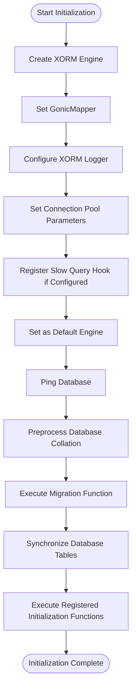
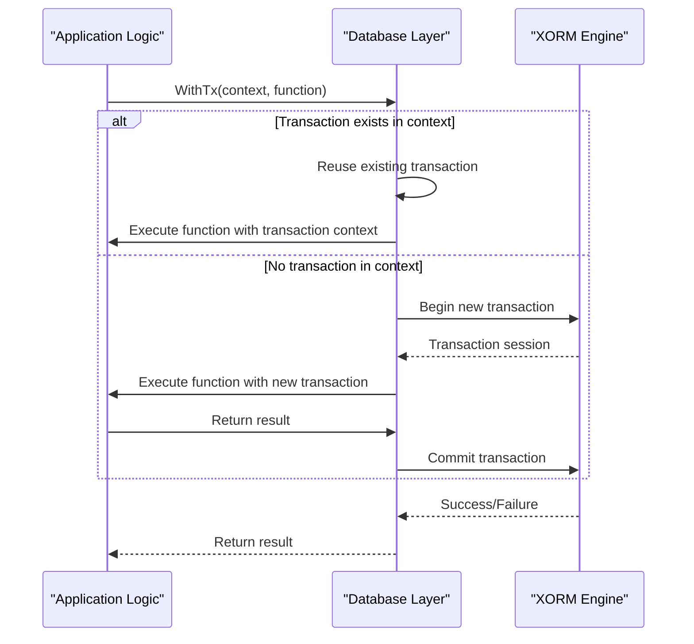
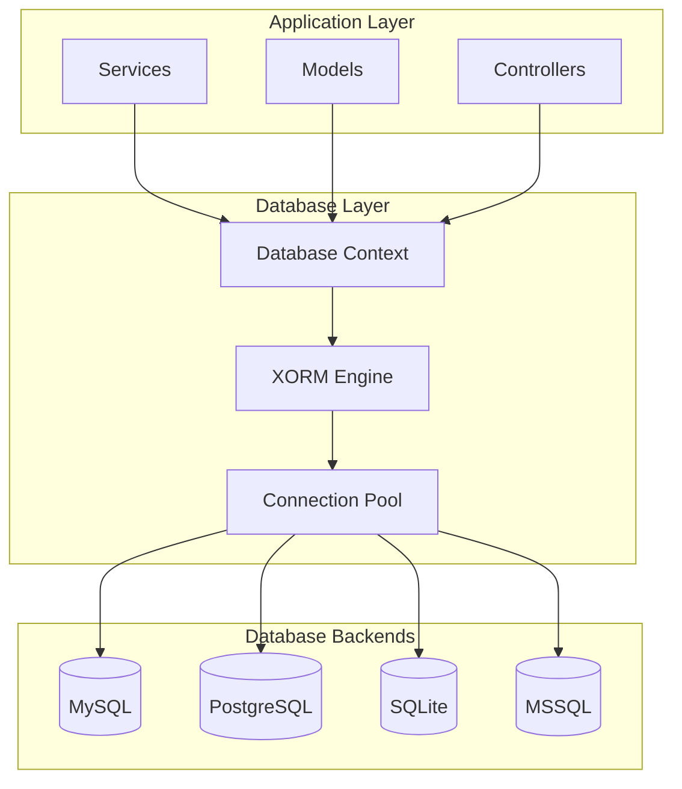

# Database Architecture Overview

<cite>
**Referenced Files in This Document**   
- [engine.go](file://models/db/engine.go)
- [engine_init.go](file://models/db/engine_init.go)
- [context.go](file://models/db/context.go)
- [log.go](file://models/db/log.go)
- [go.mod](file://go.mod)
</cite>

## Table of Contents
1. [Introduction](#introduction)
2. [Technology Stack and Dependencies](#technology-stack-and-dependencies)
3. [Database Initialization Process](#database-initialization-process)
4. [Connection Pooling and Configuration](#connection-pooling-and-configuration)
5. [Database Context and Transaction Management](#database-context-and-transaction-management)
6. [XORM ORM Abstraction Layer](#xorm-orm-abstraction-layer)
7. [Multi-Database Backend Support](#multi-database-backend-support)
8. [System Context and Integration](#system-context-and-integration)
9. [Scalability and High Load Considerations](#scalability-and-high-load-considerations)
10. [Deployment Topology Recommendations](#deployment-topology-recommendations)

## Introduction
Gitea implements a robust database layer using the XORM ORM (Object-Relational Mapping) framework to provide a consistent interface across multiple database backends. This architecture enables Gitea to support MySQL, PostgreSQL, SQLite, and MSSQL with a unified codebase while maintaining database-specific optimizations. The database layer is designed with connection pooling, transaction management, and context-aware operations to ensure data integrity and performance under various load conditions.

The architecture follows a layered approach where the database engine initialization, connection management, and transaction handling are abstracted through well-defined interfaces. This documentation provides a comprehensive overview of the database layer's design, implementation, and integration with the broader Gitea application ecosystem.

## Technology Stack and Dependencies
Gitea's database layer is built on the XORM ORM framework, which provides a powerful abstraction over SQL databases while maintaining native performance characteristics. The system supports multiple database backends through dedicated drivers that are imported as dependencies in the codebase.

The primary dependencies for database functionality are specified in the go.mod file and include:
- **xorm.io/xorm**: The core ORM framework that provides database abstraction
- **github.com/go-sql-driver/mysql**: MySQL driver for MySQL database connectivity
- **github.com/lib/pq**: PostgreSQL driver for PostgreSQL database connectivity
- **github.com/mattn/go-sqlite3**: SQLite3 driver for SQLite database connectivity
- **github.com/microsoft/go-mssqldb**: MSSQL driver for Microsoft SQL Server connectivity

These drivers are imported with blank identifiers in engine.go to ensure they are linked into the binary during compilation. The XORM framework serves as the primary interface for all database operations, providing a consistent API regardless of the underlying database backend.

**Section sources**
- [engine.go](file://models/db/engine.go#L20-L24)
- [go.mod](file://go.mod#L30-L33)

## Database Initialization Process
The database initialization process in Gitea is orchestrated through the InitEngine function in engine_init.go, which creates and configures the XORM engine based on application settings. The initialization sequence begins with creating a new XORM engine instance using the newXORMEngine function, which constructs the appropriate connection string and selects the correct database driver based on the configured database type.

The initialization process follows these key steps:
1. Create a new XORM engine with the appropriate driver based on the database type
2. Configure the engine with Gonic naming mapper for consistent table and column naming
3. Set up logging with the custom XORMLogBridge to integrate with Gitea's logging system
4. Configure connection pool parameters from application settings
5. Register slow query detection if configured
6. Set the engine as the default for the application context

The InitEngineWithMigration function extends this process by adding database connectivity verification, collation preprocessing, and migration execution to ensure database schema compatibility. This function is particularly important during application startup and database migration scenarios.

**Diagram sources **
- [engine_init.go](file://models/db/engine_init.go#L54-L88)
- [engine_init.go](file://models/db/engine_init.go#L90-L115)

**Section sources**
- [engine_init.go](file://models/db/engine_init.go#L54-L139)

## Connection Pooling and Configuration
Gitea's database layer implements comprehensive connection pooling to optimize performance and resource utilization under varying load conditions. The connection pool configuration is managed through application settings that control key parameters for database connectivity.

The connection pool is configured with the following parameters:
- **MaxOpenConns**: Maximum number of open connections to the database
- **MaxIdleConns**: Maximum number of idle connections in the pool
- **ConnMaxLifetime**: Maximum lifetime of a connection before it is recycled

These parameters are set during engine initialization using values from the application configuration. The connection pool helps prevent database connection exhaustion under high load by reusing existing connections rather than creating new ones for each database operation. This approach reduces the overhead of connection establishment and teardown, improving overall system performance.

The connection pool configuration is particularly important for deployment scenarios with high concurrent user loads, as it directly impacts the application's ability to handle multiple simultaneous database operations efficiently.

**Section sources**
- [engine_init.go](file://models/db/engine_init.go#L70-L73)

## Database Context and Transaction Management
Gitea implements a sophisticated context-based database management system that integrates with the application's lifecycle and ensures proper transaction handling. The database context system uses Go's context package to propagate database sessions through the call stack, enabling context-aware database operations.

The transaction management system provides two primary mechanisms:
1. **WithTx**: Executes database operations within a transaction, reusing existing transactions when present in the context
2. **TxContext**: Creates a transaction context that can be committed or closed explicitly

The system supports nested transactions and transaction reuse, allowing multiple components to participate in the same database transaction without requiring direct coordination. When a transaction already exists in the context, subsequent calls to transaction functions will reuse the existing transaction rather than creating a new one.

The context safety mechanism prevents common concurrency issues by detecting and preventing unsafe operations within iterators, ensuring data consistency during complex database operations.

**Diagram sources **
- [context.go](file://models/db/context.go#L129-L172)
- [context.go](file://models/db/context.go#L167-L218)

**Section sources**
- [context.go](file://models/db/context.go#L129-L218)

## XORM ORM Abstraction Layer
The XORM ORM abstraction layer in Gitea provides a unified interface for database operations across different backend databases. The Engine interface defined in engine.go serves as the primary abstraction, exposing methods for common database operations such as querying, inserting, updating, and deleting records.

Key features of the XORM abstraction include:
- **Interface-based design**: The Engine interface allows both *xorm.Engine and *xorm.Session to be used interchangeably
- **Fluent API**: Method chaining for building complex queries
- **Automatic mapping**: Struct fields are automatically mapped to database columns
- **Extensible functionality**: Custom methods can be added to extend the core functionality

The abstraction layer handles database-specific SQL generation and parameter binding, allowing the application code to remain database-agnostic. This design enables Gitea to support multiple database backends with minimal changes to the application logic.

The registeredModels slice maintains a registry of all data models used in the application, which is essential for schema synchronization and migration operations. The RegisterModel function allows components to register their data models during initialization.

**Section sources**
- [engine.go](file://models/db/engine.go#L20-L66)
- [engine.go](file://models/db/engine.go#L99-L146)

## Multi-Database Backend Support
Gitea's architecture supports multiple database backends through conditional configuration in the newXORMEngine function. The system detects the configured database type and applies backend-specific optimizations while maintaining a consistent interface.

For **PostgreSQL**, when a schema is specified, the system registers a custom "postgresschema" driver that handles schema-aware operations. This allows Gitea to organize database objects within specific schemas while maintaining compatibility with the underlying PostgreSQL database.

For **MySQL**, the system configures the engine with DYNAMIC row format to optimize storage and performance characteristics specific to MySQL's InnoDB storage engine.

For **MSSQL**, the system configures the engine to use nvarchar as the default VARCHAR type, ensuring proper Unicode support in Microsoft SQL Server environments.

The database type detection and configuration occur during engine creation, allowing the system to apply the appropriate settings for each supported database backend. This approach enables Gitea to leverage database-specific features while maintaining a consistent application interface.

**Section sources**
- [engine_init.go](file://models/db/engine_init.go#L0-L52)

## System Context and Integration
The database layer integrates with the broader Gitea application through a context-based architecture that ensures proper resource management and lifecycle coordination. The database context system uses Go's context package to propagate database sessions through the application's call stack, enabling components to access the appropriate database connection without explicit dependency injection.

The integration points include:
- **Application startup**: Database initialization occurs during application startup, with connection verification and schema synchronization
- **Request processing**: Database contexts are created for each request, ensuring proper transaction isolation
- **Background services**: Long-running services maintain their own database connections with appropriate connection lifetime management
- **Migration system**: Database migrations use the same engine interface, ensuring consistency between application code and migration scripts

The context safety mechanism prevents common concurrency issues by detecting and preventing unsafe operations within iterators, ensuring data consistency during complex database operations.

**Diagram sources **
- [context.go](file://models/db/context.go#L0-L56)
- [engine.go](file://models/db/engine.go#L20-L66)

**Section sources**
- [context.go](file://models/db/context.go#L0-L56)

## Scalability and High Load Considerations
Gitea's database architecture includes several features designed to ensure scalability and performance under high load conditions. The connection pooling configuration allows the application to efficiently manage database connections, preventing connection exhaustion during periods of high concurrent usage.

The transaction management system is optimized for performance by reusing existing transactions when possible, reducing the overhead of transaction creation and commit operations. The context-based design enables efficient propagation of database sessions through the call stack without requiring expensive connection lookups.

For high-load scenarios, the following considerations are important:
- **Connection pool sizing**: The MaxOpenConns parameter should be tuned based on the expected concurrent load and database server capacity
- **Connection lifetime**: The ConnMaxLifetime parameter helps prevent issues with stale connections in long-running applications
- **Slow query detection**: The configurable slow query threshold enables monitoring of performance bottlenecks
- **Batch operations**: The MaxBatchInsertSize function optimizes bulk insert operations based on table structure

The architecture supports horizontal scaling through read replicas and connection routing, although specific implementation details depend on the underlying database backend's capabilities.

**Section sources**
- [engine_init.go](file://models/db/engine_init.go#L70-L73)
- [engine.go](file://models/db/engine.go#L99-L146)

## Deployment Topology Recommendations
For production deployments, the following topology recommendations ensure optimal performance and reliability:

1. **Database Server Sizing**: Provision database servers with sufficient memory to cache frequently accessed data and CPU resources to handle query processing efficiently.

2. **Connection Pool Configuration**: Tune connection pool parameters based on the expected concurrent user load:
   - MaxOpenConns: Set based on database server capacity and expected concurrent connections
   - MaxIdleConns: Set to a reasonable fraction of MaxOpenConns to maintain ready connections
   - ConnMaxLifetime: Set to prevent issues with stale connections in long-running applications

3. **High Availability**: Implement database replication and failover mechanisms appropriate to the selected database backend.

4. **Monitoring**: Enable slow query logging and monitor database performance metrics to identify and address bottlenecks.

5. **Backup Strategy**: Implement regular database backups with point-in-time recovery capabilities.

6. **Network Configuration**: Ensure low-latency network connectivity between application servers and database servers to minimize query response times.

The architecture supports various deployment patterns, including single-server, clustered, and cloud-native deployments, with configuration options to optimize performance for each scenario.