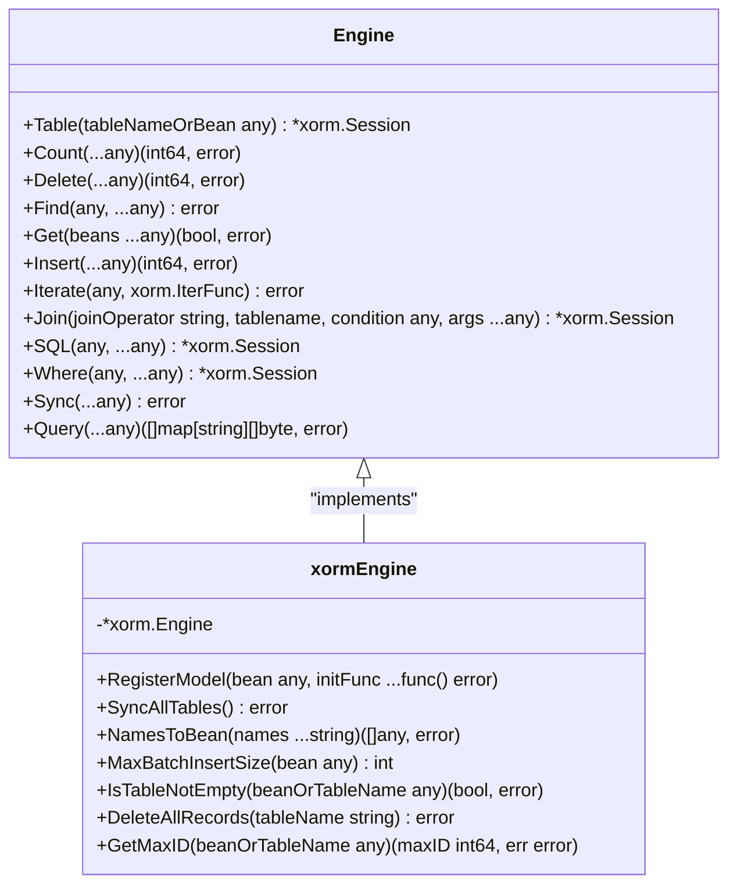
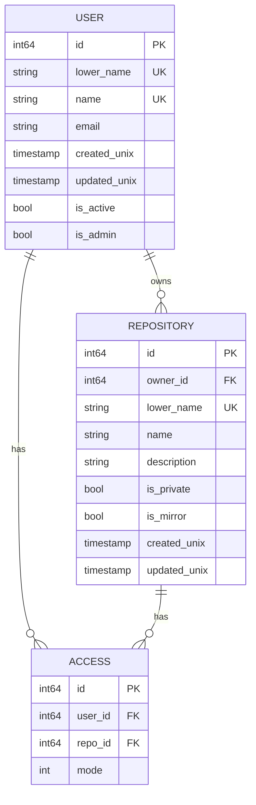

# Database Schema Design

<cite>
**Referenced Files in This Document**   
- [engine.go](file://models/db/engine.go)
- [migrations.go](file://models/migrations/migrations.go)
- [user.go](file://models/user/user.go)
- [repo.go](file://models/repo/repo.go)
- [index.go](file://models/db/index.go)
- [access.yml](file://models/fixtures/access.yml)
</cite>

## Table of Contents
1. [Introduction](#introduction)
2. [Data Persistence Architecture](#data-persistence-architecture)
3. [Database Abstraction Layer](#database-abstraction-layer)
4. [Migration System](#migration-system)
5. [Schema Design and Entity Relationships](#schema-design-and-entity-relationships)
6. [Indexes and Constraints](#indexes-and-constraints)
7. [Data Access Patterns](#data-access-patterns)
8. [Common Issues and Troubleshooting](#common-issues-and-troubleshooting)
9. [Performance Considerations](#performance-considerations)
10. [Schema Evolution Best Practices](#schema-evolution-best-practices)

## Introduction

Gitea's database schema design provides a robust foundation for storing and managing repository data, user information, and application state. The system supports multiple database backends through a unified abstraction layer, enabling flexibility in deployment scenarios. This document explores the architecture, implementation details, and best practices for working with Gitea's database schema.

**Section sources**
- [engine.go](file://models/db/engine.go#L1-L147)
- [migrations.go](file://models/migrations/migrations.go#L1-L530)

## Data Persistence Architecture

Gitea's data persistence architecture is designed to support multiple database backends while maintaining a consistent interface for application code. The system leverages XORM as an object-relational mapper to provide database-agnostic operations across supported databases including MySQL, PostgreSQL, and MSSQL. This architecture enables Gitea to maintain compatibility with various database systems without requiring database-specific code throughout the application.

The persistence layer abstracts database operations through a common interface that standardizes interactions regardless of the underlying database engine. This approach allows Gitea to support different database features while maintaining a consistent API for developers. The architecture also includes mechanisms for handling database-specific optimizations and constraints, ensuring optimal performance across different database systems.

Database connections are managed through a centralized engine that handles connection pooling, transaction management, and query execution. This centralized approach ensures consistent behavior across the application and simplifies database administration tasks. The architecture also includes built-in support for database health checks and connection monitoring, helping to maintain system reliability.

**Section sources**
- [engine.go](file://models/db/engine.go#L1-L147)
- [migrations.go](file://models/migrations/migrations.go#L1-L530)

## Database Abstraction Layer

The database abstraction layer in Gitea is implemented in models/db/engine.go and provides a unified interface for database operations across different database backends. The core component is the Engine interface, which defines common database operations such as querying, inserting, updating, and deleting records. This interface is implemented by both xorm.Engine and xorm.Session, allowing for flexible database interactions.

The abstraction layer uses XORM's built-in support for multiple database drivers, importing the necessary drivers for MySQL, PostgreSQL, and MSSQL. This enables Gitea to connect to different database systems without requiring changes to the application code. The RegisterModel function allows developers to register data models with the system, making them available for database operations and schema synchronization.

Key features of the abstraction layer include:
- Support for multiple database backends through a unified interface
- Automatic schema synchronization through the SyncAllTables function
- Flexible model registration system that supports initialization functions
- Comprehensive query interface with support for complex conditions and joins
- Built-in support for batch operations and bulk data processing

The abstraction layer also includes utility functions for common database operations such as checking table existence, counting records, and managing transactions. These functions provide a consistent API for database operations regardless of the underlying database system, simplifying application development and maintenance.



**Diagram sources **
- [engine.go](file://models/db/engine.go#L1-L147)

**Section sources**
- [engine.go](file://models/db/engine.go#L1-L147)

## Migration System

Gitea's migration system, implemented in models/migrations/migrations.go, provides a structured approach to database schema evolution. The system uses a sequential migration pattern where each migration represents a specific database change, such as adding a new column, modifying existing constraints, or creating new tables. This approach ensures that database changes are applied in a consistent and predictable manner across all deployments.

The migration system is based on a series of migration functions, each identified by a unique ID number and description. These migrations are executed in sequence, with the system tracking the current database version in a Version table. The prepareMigrationTasks function returns a slice of migration objects, each containing an ID number, description, and migration function. This design allows for easy addition of new migrations and ensures that migrations are applied in the correct order.

Key aspects of the migration system include:
- Sequential execution of migrations to ensure consistency
- Version tracking through the Version table with ID=1
- Support for both schema changes and data transformations
- Error handling and rollback prevention through careful migration design
- Compatibility checks to prevent downgrades and ensure minimum version requirements

The system also includes validation functions to ensure database integrity, such as GetCurrentDBVersion and ExpectedDBVersion, which help detect version mismatches and prevent incompatible database states. The Migrate function orchestrates the entire migration process, executing pending migrations and updating the database version after each successful migration.

```mermaid
sequenceDiagram
participant System as "Migration System"
participant DB as "Database"
participant Migration as "Migration Task"
System->>DB : GetCurrentDBVersion()
DB-->>System : Current version
System->>System : ExpectedDBVersion()
System->>System : getPendingMigrations()
loop For each pending migration
System->>Migration : Execute migration[idNumber]
Migration->>DB : Apply schema changes
DB-->>Migration : Success/Failure
Migration-->>System : Result
alt Migration successful
System->>DB : Update Version table
DB-->>System : Confirmation
else Migration failed
System->>System : Return error
break
end
end
System->>System : Migration complete
```

**Diagram sources **
- [migrations.go](file://models/migrations/migrations.go#L1-L530)

**Section sources**
- [migrations.go](file://models/migrations/migrations.go#L1-L530)

## Schema Design and Entity Relationships

Gitea's database schema is designed around core entities such as users, repositories, issues, and organizations, with well-defined relationships between them. The schema follows a relational model with appropriate normalization to minimize data redundancy while maintaining query performance. Key entities include User, Repository, Issue, and various relationship tables that manage access control and associations.

The User entity (models/user/user.go) represents both individual users and organizations, with a UserType field distinguishing between different user types. Each user has a unique LowerName for case-insensitive lookups and various attributes for user preferences, authentication, and metadata. The Repository entity (models/repo/repo.go) represents git repositories with attributes for repository metadata, access control, and statistics.

Entity relationships are established through foreign key constraints and junction tables. For example, the access table (represented by access.yml fixture) manages user access to repositories, with foreign keys to both user and repository tables. This design enables fine-grained access control and supports Gitea's collaboration features. Other relationship tables manage issues, comments, pull requests, and various repository units.

The schema also includes specialized tables for features like actions, packages, and webhooks, each with their own entity relationships. These tables are designed to support Gitea's extensibility while maintaining data integrity through proper constraints and indexing.



**Diagram sources **
- [user.go](file://models/user/user.go#L1-L799)
- [repo.go](file://models/repo/repo.go#L1-L799)
- [access.yml](file://models/fixtures/access.yml#L1-L180)

**Section sources**
- [user.go](file://models/user/user.go#L1-L799)
- [repo.go](file://models/repo/repo.go#L1-L799)
- [access.yml](file://models/fixtures/access.yml#L1-L180)

## Indexes and Constraints

Gitea's database schema includes a comprehensive set of indexes and constraints to ensure data integrity and optimize query performance. Primary keys are defined for all tables using auto-incrementing integer fields, providing unique identifiers for each record. Unique constraints are applied to fields that must maintain uniqueness across the system, such as user LowerName and repository LowerName within an owner context.

Indexes are strategically placed on frequently queried fields to improve performance. Common indexing patterns include:
- Indexes on foreign key fields to optimize join operations
- Composite indexes on frequently queried field combinations
- Indexes on timestamp fields used for sorting and filtering
- Full-text indexes on text fields requiring search capabilities

The schema also includes database-specific optimizations, such as InnoDB storage engine settings for MySQL and appropriate index types for different database backends. Constraints are used to enforce business rules and data integrity, including NOT NULL constraints on required fields and CHECK constraints where supported by the database.

Specialized indexing strategies are employed for high-volume operations. For example, the resource indexing system (models/db/index.go) uses database-specific approaches to efficiently generate sequential identifiers for issues, releases, and other resources. This system adapts to the capabilities of different database backends, using features like ON CONFLICT for PostgreSQL and ON DUPLICATE KEY for MySQL to ensure atomic operations.

**Section sources**
- [engine.go](file://models/db/engine.go#L1-L147)
- [index.go](file://models/db/index.go#L1-L172)
- [user.go](file://models/user/user.go#L1-L799)
- [repo.go](file://models/repo/repo.go#L1-L799)

## Data Access Patterns

Gitea implements several common data access patterns to efficiently retrieve and manipulate data. The repository pattern is used extensively, with dedicated functions for retrieving entities by various criteria. For example, GetUserByID and GetRepositoryByID provide direct access to user and repository entities by their primary keys.

Query composition is achieved through XORM's fluent interface, allowing developers to build complex queries incrementally. This pattern enables flexible filtering, sorting, and pagination of results. The system also supports batch operations for improved performance when processing multiple records, with functions like MaxBatchInsertSize determining optimal batch sizes based on database constraints.

Common data access patterns include:
- Direct retrieval by primary key
- Filtered queries using WHERE clauses and index optimization
- Paginated results for large datasets
- Batch operations for bulk data processing
- Transactional operations for data consistency

The system also includes specialized patterns for handling relationships, such as eager loading of related entities and lazy loading when appropriate. For example, the LoadAttributes method on the Repository entity loads associated data like the owner and primary language in a single operation, reducing the number of database queries.

**Section sources**
- [engine.go](file://models/db/engine.go#L1-L147)
- [user.go](file://models/user/user.go#L1-L799)
- [repo.go](file://models/repo/repo.go#L1-L799)

## Common Issues and Troubleshooting

Database migration failures are among the most common issues in Gitea deployments. These typically occur when upgrading from older versions or when database constraints prevent schema changes. The migration system includes safeguards to prevent partial migrations, but administrators should always backup their database before performing upgrades.

Common migration issues include:
- Insufficient database privileges for schema modifications
- Conflicting data that violates new constraints
- Timeout errors during large data migrations
- Version mismatches between Gitea and the database schema

Performance bottlenecks often arise from missing indexes on frequently queried fields or inefficient query patterns. Monitoring slow query logs and analyzing query execution plans can help identify optimization opportunities. Connection pool exhaustion is another common issue, particularly in high-traffic environments, which can be mitigated by adjusting pool size settings.

Data integrity issues may occur when foreign key constraints are not properly maintained or when application logic bypasses validation rules. Regular database health checks and constraint validation can help prevent these issues. The system includes tools like EnsureUpToDate to verify database compatibility and prevent version-related problems.

**Section sources**
- [migrations.go](file://models/migrations/migrations.go#L1-L530)
- [engine.go](file://models/db/engine.go#L1-L147)

## Performance Considerations

Optimizing database performance in Gitea involves several key strategies. Index optimization is critical, with careful consideration given to index selection based on query patterns. Composite indexes should be created for frequently used filter combinations, while avoiding excessive indexing that can slow down write operations.

Query optimization focuses on reducing the number of database round-trips and minimizing data transfer. This includes:
- Using batch operations for bulk data processing
- Implementing efficient pagination for large datasets
- Caching frequently accessed data
- Optimizing join operations and avoiding N+1 query problems

Database configuration tuning is essential for optimal performance. This includes adjusting connection pool settings, configuring appropriate memory allocation, and optimizing database-specific parameters. Regular maintenance tasks like vacuuming (for PostgreSQL) and optimizing tables (for MySQL) help maintain performance over time.

Monitoring and profiling tools should be used to identify performance bottlenecks. Slow query logs, execution plan analysis, and database performance metrics provide valuable insights for optimization. The system's built-in logging and monitoring capabilities can help track database performance and identify areas for improvement.

**Section sources**
- [engine.go](file://models/db/engine.go#L1-L147)
- [index.go](file://models/db/index.go#L1-L172)

## Schema Evolution Best Practices

Evolution of Gitea's database schema follows several best practices to ensure reliability and compatibility. Migrations should be designed to be idempotent whenever possible, allowing them to be safely re-run if needed. Each migration should focus on a single logical change to simplify testing and rollback procedures.

Version control of schema changes is essential, with migrations stored in the codebase and versioned alongside application code. This ensures that schema changes are tracked and can be reviewed as part of the development process. Automated testing of migrations helps catch issues before deployment.

When designing new schema changes, consider backward compatibility and the impact on existing data. Avoid breaking changes that would prevent downgrades or require complex data migration. Use feature flags or gradual rollout strategies for significant schema changes to minimize risk.

Documentation of schema changes is crucial for maintainability. Each migration should include a clear description of the change and its purpose. Schema diagrams and relationship documentation help developers understand the data model and make informed decisions when extending the system.

**Section sources**
- [migrations.go](file://models/migrations/migrations.go#L1-L530)
- [engine.go](file://models/db/engine.go#L1-L147)