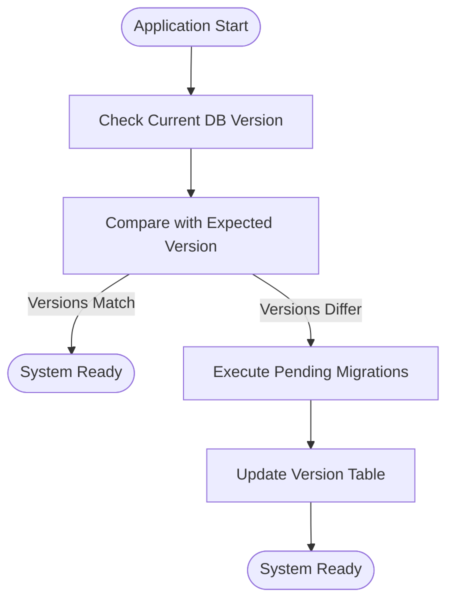
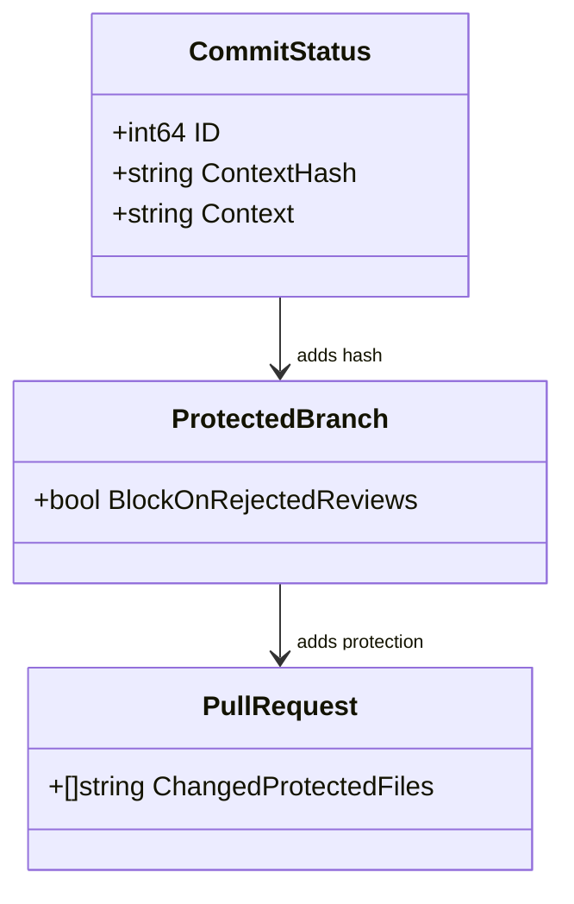

# Migration System

<cite>
**Referenced Files in This Document**   
- [models/migrations/migrations.go](file://models/migrations/migrations.go)
- [models/migrations/v1_10/v88.go](file://models/migrations/v1_10/v88.go)
- [models/migrations/v1_11/v102.go](file://models/migrations/v1_11/v102.go)
- [models/migrations/v1_12/v117.go](file://models/migrations/v1_12/v117.go)
- [models/migrations/v1_13/v140.go](file://models/migrations/v1_13/v140.go)
- [models/migrations/v1_14/v155.go](file://models/migrations/v1_14/v155.go)
- [models/migrations/v1_15/v178.go](file://models/migrations/v1_15/v178.go)
- [models/migrations/v1_16/v189.go](file://models/migrations/v1_16/v189.go)
- [models/migrations/v1_17/v211.go](file://models/migrations/v1_17/v211.go)
</cite>

## Table of Contents
1. [Introduction](#introduction)
2. [Migration Execution Process](#migration-execution-process)
3. [Version Tracking via Version Table](#version-tracking-via-version-table)
4. [Rollback Strategies](#rollback-strategies)
5. [Concrete Examples of Schema Changes](#concrete-examples-of-schema-changes)
6. [Relationship Between Migration Versions and Gitea Releases](#relationship-between-migration-versions-and-gitea-releases)
7. [Common Issues and Solutions](#common-issues-and-solutions)
8. [Best Practices for Writing and Testing Migrations](#best-practices-for-writing-and-testing-migrations)

## Introduction
Gitea employs a structured database migration system to manage schema evolution across versions. This system ensures backward compatibility, supports incremental upgrades, and maintains data integrity during version transitions. The migration framework is implemented in the `models/migrations` directory, where each migration script corresponds to a specific version increment. These scripts are executed sequentially to bring the database schema from its current state to the expected state required by the running Gitea version.

**Section sources**
- [models/migrations/migrations.go](file://models/migrations/migrations.go#L1-L530)

## Migration Execution Process
The migration process begins when Gitea starts and checks the current database version against the expected version. If a discrepancy exists, pending migrations are executed in order. Each migration is defined as a function that modifies the schema or transforms data. The `Migrate` function in `migrations.go` orchestrates this process by retrieving the list of pending migrations based on the current database version and applying them sequentially using XORM's synchronization capabilities. Before executing any migration, Git is initialized to support operations that depend on Git functionality.

**Diagram sources**
- [models/migrations/migrations.go](file://models/migrations/migrations.go#L450-L530)

**Section sources**
- [models/migrations/migrations.go](file://models/migrations/migrations.go#L450-L530)

## Version Tracking via Version Table
Gitea tracks its database schema version using a dedicated `version` table containing a single row with an ID of 1 and a `Version` field indicating the current schema version. This version number corresponds to the highest migration ID plus one. When migrations are applied, the `Version` field is updated accordingly. The `GetCurrentDBVersion` function reads this value, while `ExpectedDBVersion` calculates the target version based on the number of available migration scripts. This mechanism allows Gitea to detect whether an upgrade is needed and prevents downgrades by comparing the current version with the minimum supported version.

**Section sources**
- [models/migrations/migrations.go](file://models/migrations/migrations.go#L350-L370)

## Rollback Strategies
Gitea's migration system does not natively support automated rollback operations. Once a migration is applied, there is no built-in mechanism to revert it. This design decision emphasizes the importance of thorough testing before deployment. In practice, rollback requires restoring from a backup taken prior to migration execution. Some migrations are designed as no-ops (e.g., `noopMigration`) to accommodate changes in migration logic without affecting the schema. Developers must ensure that migrations are idempotent where possible and avoid destructive operations unless absolutely necessary.

**Section sources**
- [models/migrations/migrations.go](file://models/migrations/migrations.go#L150-L152)

## Concrete Examples of Schema Changes
Migration scripts demonstrate various types of schema modifications. For instance, `v88.go` in the v1_10 package adds a `ContextHash` field to the `commit_status` table and populates it by hashing existing `Context` values. The `v117.go` file in v1_12 introduces a `BlockOnRejectedReviews` boolean field to the `protected_branch` table with a default value of false. Another example is `v155.go` in v1_14, which adds a `ChangedProtectedFiles` JSON column to the `pull_request` table. These examples illustrate how migrations evolve the schema through additive changes, data transformations, and structural enhancements.

**Diagram sources**
- [models/migrations/v1_10/v88.go](file://models/migrations/v1_10/v88.go#L15-L25)
- [models/migrations/v1_12/v117.go](file://models/migrations/v1_12/v117.go#L10-L15)
- [models/migrations/v1_14/v155.go](file://models/migrations/v1_14/v155.go#L10-L15)

**Section sources**
- [models/migrations/v1_10/v88.go](file://models/migrations/v1_10/v88.go#L15-L25)
- [models/migrations/v1_12/v117.go](file://models/migrations/v1_12/v117.go#L10-L15)
- [models/migrations/v1_14/v155.go](file://models/migrations/v1_14/v155.go#L10-L15)

## Relationship Between Migration Versions and Gitea Releases
Each Gitea release corresponds to a specific range of database migration versions. The `migrations.go` file contains comments indicating which migration numbers mark the end of each release cycle (e.g., "Gitea 1.10.0 ends at database version 102"). This alignment ensures that when upgrading to a particular Gitea version, all necessary schema changes up to that point are applied. The `minDBVersion` constant defines the earliest supported migration version, preventing upgrades from versions that are too old. This versioning strategy enables smooth incremental upgrades while maintaining compatibility across releases.

**Section sources**
- [models/migrations/migrations.go](file://models/migrations/migrations.go#L155-L340)

## Common Issues and Solutions
Common migration issues include failed migrations during upgrades, conflicts due to manual schema modifications, and incompatible database states. Gitea addresses these by validating the migration sequence and preventing downgrades. If a migration fails, the system halts with an error message instructing administrators to resolve the issue before proceeding. To prevent conflicts, migrations should avoid assumptions about intermediate schema states and use XORM's `Sync` method to safely apply changes. For environments where migrations fail repeatedly, administrators are advised to restore from backup and test migrations in staging environments first.

**Section sources**
- [models/migrations/migrations.go](file://models/migrations/migrations.go#L470-L500)

## Best Practices for Writing and Testing Migrations
When writing new migrations, developers should follow several best practices: ensure migrations are idempotent, avoid destructive operations unless absolutely necessary, and use batch processing for large data transformations to prevent memory exhaustion. Migrations should be tested thoroughly in development environments using realistic datasets. Each migration function should focus on a single logical change and include clear documentation of its purpose. Testing should verify both successful execution and proper error handling. Additionally, migrations that modify critical data should include safeguards such as transaction boundaries and pre-migration backups.

**Section sources**
- [models/migrations/migrations.go](file://models/migrations/migrations.go#L100-L140)