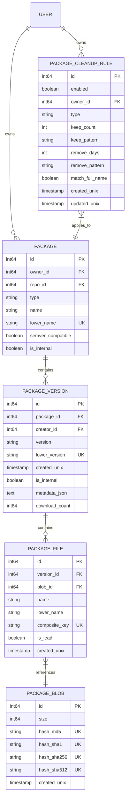
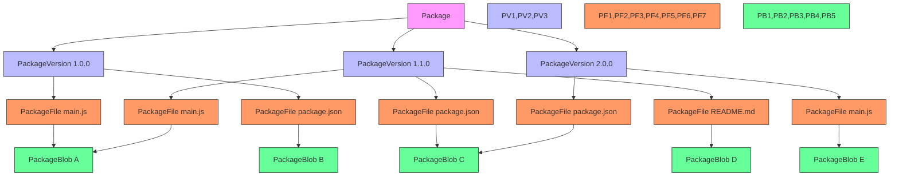
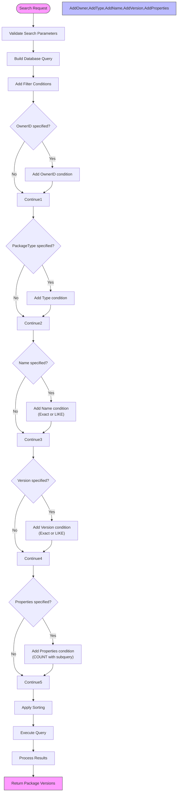
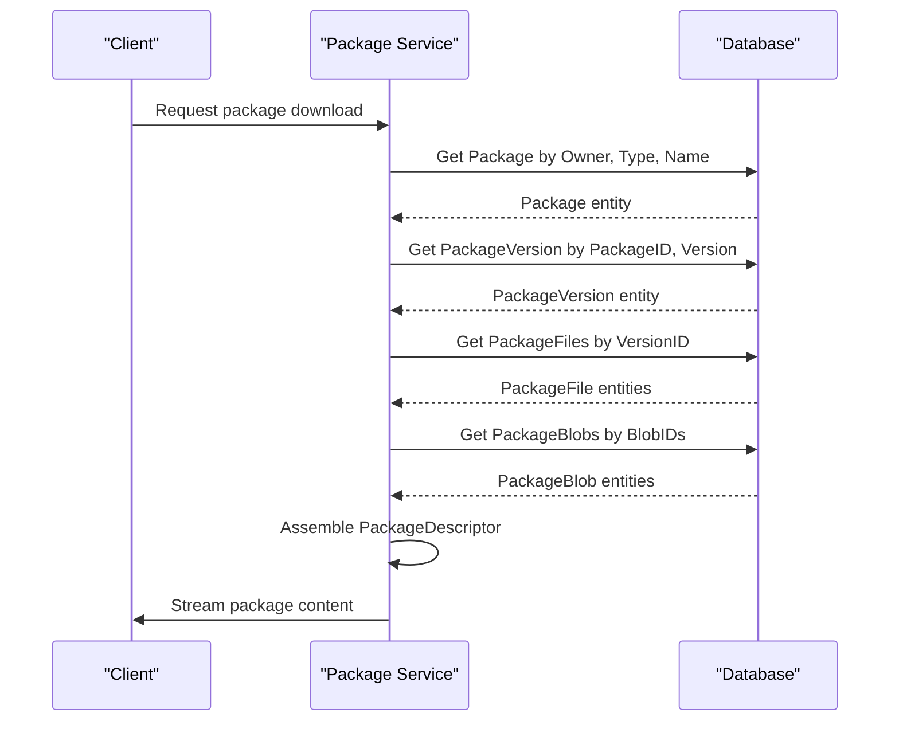
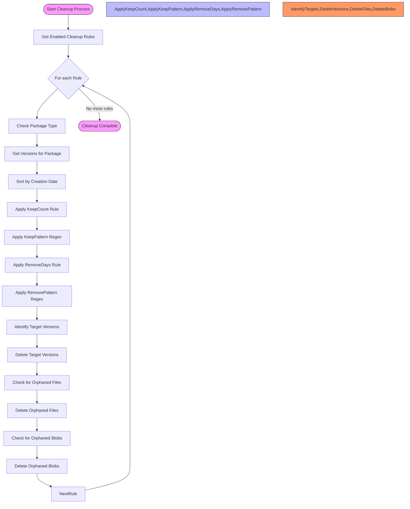

# Packages Data Model

<cite>
**Referenced Files in This Document**   
- [package.go](file://models/packages/package.go)
- [package_version.go](file://models/packages/package_version.go)
- [package_file.go](file://models/packages/package_file.go)
- [package_blob.go](file://models/packages/package_blob.go)
- [package_cleanup_rule.go](file://models/packages/package_cleanup_rule.go)
- [package_property.go](file://models/packages/package_property.go)
- [descriptor.go](file://models/packages/descriptor.go)
</cite>

## Table of Contents
1. [Introduction](#introduction)
2. [Core Entities and Relationships](#core-entities-and-relationships)
3. [Entity Field Definitions](#entity-field-definitions)
4. [Package Versioning Hierarchy](#package-versioning-hierarchy)
5. [Data Access Patterns](#data-access-patterns)
6. [Data Lifecycle Management](#data-lifecycle-management)
7. [Performance Considerations](#performance-considerations)

## Introduction
Gitea's package registry provides a comprehensive system for storing, managing, and retrieving software packages across multiple package formats. The data model is designed to support various package types while maintaining a consistent structure for metadata, versioning, and file storage. This documentation details the core entities, their relationships, field definitions, and operational patterns for the package registry system.

## Core Entities and Relationships

The package registry data model consists of five primary entities that form a hierarchical relationship structure: Package, PackageVersion, PackageFile, PackageBlob, and PackageCleanupRule. These entities work together to provide a complete package management system with version control, file deduplication, and automated cleanup capabilities.

**Diagram sources**
- [package.go](file://models/packages/package.go#L60-L85)
- [package_version.go](file://models/packages/package_version.go#L25-L50)
- [package_file.go](file://models/packages/package_file.go#L30-L55)
- [package_blob.go](file://models/packages/package_blob.go#L25-L45)
- [package_cleanup_rule.go](file://models/packages/package_cleanup_rule.go#L20-L45)

**Section sources**
- [package.go](file://models/packages/package.go#L60-L85)
- [package_version.go](file://models/packages/package_version.go#L25-L50)
- [package_file.go](file://models/packages/package_file.go#L30-L55)
- [package_blob.go](file://models/packages/package_blob.go#L25-L45)
- [package_cleanup_rule.go](file://models/packages/package_cleanup_rule.go#L20-L45)

## Entity Field Definitions

### Package Entity
The Package entity represents the root of a package and contains attributes that are fixed across all versions.

**Field Definitions**
- `ID`: Primary key, auto-incrementing integer
- `OwnerID`: Foreign key to user/organization that owns the package
- `RepoID`: Optional foreign key to repository linked with the package
- `Type`: Package type (e.g., "npm", "docker", "maven") 
- `Name`: Display name of the package
- `LowerName`: Lowercase name used for case-insensitive lookups (unique constraint with OwnerID and Type)
- `SemverCompatible`: Boolean indicating if version strings follow semantic versioning
- `IsInternal`: Boolean indicating if the package is internal to Gitea operations

**Constraints**
- Unique constraint on (OwnerID, Type, LowerName)
- Index on (OwnerID, Type, LowerName, IsInternal)

**Section sources**
- [package.go](file://models/packages/package.go#L60-L85)

### PackageVersion Entity
The PackageVersion entity represents a specific version of a package with its own metadata and files.

**Field Definitions**
- `ID`: Primary key, auto-incrementing integer
- `PackageID`: Foreign key to the parent Package
- `CreatorID`: Foreign key to user who created the version
- `Version`: Version string (e.g., "1.0.0", "latest")
- `LowerVersion`: Lowercase version string (unique constraint with PackageID)
- `CreatedUnix`: Timestamp of version creation
- `IsInternal`: Boolean indicating if the version is internal to Gitea operations
- `MetadataJSON`: JSON string containing version-specific metadata
- `DownloadCount`: Counter for number of downloads

**Constraints**
- Unique constraint on (PackageID, LowerVersion)
- Index on (PackageID, LowerVersion, IsInternal)
- Foreign key constraint on PackageID referencing Package(ID)

**Section sources**
- [package_version.go](file://models/packages/package_version.go#L25-L50)

### PackageFile Entity
The PackageFile entity represents a file within a package version, describing its content and properties.

**Field Definitions**
- `ID`: Primary key, auto-incrementing integer
- `VersionID`: Foreign key to the parent PackageVersion
- `BlobID`: Foreign key to the PackageBlob containing the file content
- `Name`: Display name of the file
- `LowerName`: Lowercase name for case-insensitive lookups
- `CompositeKey`: Additional key for disambiguating files with the same name
- `IsLead`: Boolean indicating if this is the primary file for the version
- `CreatedUnix`: Timestamp of file creation

**Constraints**
- Unique constraint on (VersionID, LowerName, CompositeKey)
- Index on (VersionID, LowerName, CompositeKey)
- Foreign key constraint on VersionID referencing PackageVersion(ID)
- Foreign key constraint on BlobID referencing PackageBlob(ID)

**Section sources**
- [package_file.go](file://models/packages/package_file.go#L30-L55)

### PackageBlob Entity
The PackageBlob entity represents the binary content of package files, enabling deduplication across packages.

**Field Definitions**
- `ID`: Primary key, auto-incrementing integer
- `Size`: Size of the blob in bytes
- `HashMD5`: MD5 hash of the blob content (unique index)
- `HashSHA1`: SHA-1 hash of the blob content (unique index)
- `HashSHA256`: SHA-256 hash of the blob content (unique index)
- `HashSHA512`: SHA-512 hash of the blob content (unique index)
- `CreatedUnix`: Timestamp of blob creation

**Constraints**
- Unique constraint on HashMD5
- Unique constraint on HashSHA1
- Unique constraint on HashSHA256
- Unique constraint on HashSHA512
- No direct foreign key relationships, referenced through PackageFile

**Section sources**
- [package_blob.go](file://models/packages/package_blob.go#L25-L45)

### PackageCleanupRule Entity
The PackageCleanupRule entity defines automated rules for cleaning up old package versions.

**Field Definitions**
- `ID`: Primary key, auto-incrementing integer
- `Enabled`: Boolean indicating if the rule is active
- `OwnerID`: Foreign key to user/organization that owns the rule
- `Type`: Package type to which the rule applies
- `KeepCount`: Number of recent versions to keep
- `KeepPattern`: Regular expression pattern for versions to always keep
- `RemoveDays`: Age threshold (in days) for removing versions
- `RemovePattern`: Regular expression pattern for versions to remove
- `MatchFullName`: Boolean indicating if patterns should match full package name
- `CreatedUnix`: Timestamp of rule creation
- `UpdatedUnix`: Timestamp of last rule update

**Constraints**
- Unique constraint on (OwnerID, Type)
- Index on (OwnerID, Type, Enabled)
- Foreign key constraint on OwnerID referencing User(ID)

**Section sources**
- [package_cleanup_rule.go](file://models/packages/package_cleanup_rule.go#L20-L45)

### PackageProperty Entity
The PackageProperty entity stores additional metadata for packages, versions, and files.

**Field Definitions**
- `ID`: Primary key, auto-incrementing integer
- `RefType`: Type of entity being referenced (Package, Version, or File)
- `RefID`: ID of the referenced entity
- `Name`: Name of the property
- `Value`: Value of the property (stored as text)

**Constraints**
- Index on (RefType, RefID, Name)
- No unique constraints, allowing multiple properties with the same name

**Section sources**
- [package_property.go](file://models/packages/package_property.go#L20-L45)

## Package Versioning Hierarchy

The package versioning system in Gitea follows a hierarchical structure that enables efficient storage and retrieval of package versions while supporting multiple package formats.

**Diagram sources**
- [package.go](file://models/packages/package.go#L60-L85)
- [package_version.go](file://models/packages/package_version.go#L25-L50)
- [package_file.go](file://models/packages/package_file.go#L30-L55)
- [package_blob.go](file://models/packages/package_blob.go#L25-L45)

**Section sources**
- [package.go](file://models/packages/package.go#L60-L85)
- [package_version.go](file://models/packages/package_version.go#L25-L50)
- [package_file.go](file://models/packages/package_file.go#L30-L55)
- [package_blob.go](file://models/packages/package_blob.go#L25-L45)

The hierarchy demonstrates several key features:
1. Each Package can have multiple PackageVersions
2. Each PackageVersion contains one or more PackageFiles
3. PackageFiles reference PackageBlobs which store the actual file content
4. PackageBlobs are shared across files when content is identical (e.g., main.js in versions 1.0.0 and 1.1.0)
5. This structure enables efficient storage through deduplication of identical file content

## Data Access Patterns

### Package Search Operations
Package search operations follow a consistent pattern using the `SearchVersions` function with `PackageSearchOptions`. The search system supports multiple filtering criteria and sorting options.

**Diagram sources**
- [package_version.go](file://models/packages/package_version.go#L200-L250)

**Section sources**
- [package_version.go](file://models/packages/package_version.go#L200-L250)

### Package Download Operations
Package download operations follow a retrieval pattern that resolves the package descriptor and associated files.

**Diagram sources**
- [descriptor.go](file://models/packages/descriptor.go#L100-L150)
- [package_file.go](file://models/packages/package_file.go#L70-L90)

**Section sources**
- [descriptor.go](file://models/packages/descriptor.go#L100-L150)
- [package_file.go](file://models/packages/package_file.go#L70-L90)

## Data Lifecycle Management

### Automated Cleanup Process
Gitea implements automated cleanup of old package versions through configurable rules that can be applied at the user or organization level.

**Diagram sources**
- [package_cleanup_rule.go](file://models/packages/package_cleanup_rule.go#L60-L100)
- [package_version.go](file://models/packages/package_version.go#L150-L170)

**Section sources**
- [package_cleanup_rule.go](file://models/packages/package_cleanup_rule.go#L60-L100)
- [package_version.go](file://models/packages/package_version.go#L150-L170)

The cleanup process evaluates versions against multiple criteria:
1. **KeepCount**: Always retain the N most recent versions
2. **KeepPattern**: Retain versions matching a regular expression pattern (e.g., "v[0-9]+\\.[0-9]+\\.[0-9]+")
3. **RemoveDays**: Remove versions older than N days
4. **RemovePattern**: Remove versions matching a regular expression pattern (e.g., "alpha|beta|rc")

When a version is deleted, the system automatically checks for orphaned PackageFiles and PackageBlobs, removing them if no other versions reference them.

## Performance Considerations

### Query Optimization
The package registry data model includes several indexing strategies to optimize common query patterns:

**Indexing Strategy Table**
| Entity | Indexed Fields | Purpose | Query Pattern |
|--------|----------------|-------|-------------|
| Package | OwnerID, Type, LowerName | Package lookup by owner and name | `GetPackageByName` |
| Package | OwnerID, Type, IsInternal | Package listing by owner and type | `GetPackagesByType` |
| PackageVersion | PackageID, LowerVersion | Version lookup by package and version | `GetVersionByNameAndVersion` |
| PackageVersion | CreatedUnix, ID | Chronological sorting of versions | `SearchVersions` with created sort |
| PackageFile | VersionID, LowerName, CompositeKey | File lookup by version and name | `GetFileForVersionByName` |
| PackageBlob | HashSHA256 | Blob lookup by content hash | `ExistPackageBlobWithSHA` |
| PackageCleanupRule | OwnerID, Type, Enabled | Rule lookup by owner and package type | `GetCleanupRulesByOwner` |

These indexes support efficient execution of common operations such as package search, version retrieval, and file access.

### Search Optimization
The search functionality is optimized through several mechanisms:

1. **Case-insensitive lookups**: All name-based searches use the `LowerName` field with appropriate indexes
2. **Composite queries**: The `SearchVersions` function combines multiple conditions efficiently using database joins
3. **Pagination support**: Search results can be paginated to limit result set size
4. **Count optimization**: The `CountVersions` function uses database COUNT operations rather than loading all entities

### Storage Optimization
The data model includes several features for storage optimization:

1. **Content deduplication**: PackageBlobs are shared across PackageFiles with identical content
2. **Efficient metadata storage**: Version metadata is stored as JSON in a single field rather than normalized across multiple tables
3. **Sparse indexing**: Indexes are created only on fields commonly used in query conditions
4. **Temporal partitioning**: While not explicitly implemented, the CreatedUnix fields enable potential time-based partitioning for large datasets

**Section sources**
- [package.go](file://models/packages/package.go#L60-L85)
- [package_version.go](file://models/packages/package_version.go#L25-L50)
- [package_file.go](file://models/packages/package_file.go#L30-L55)
- [package_blob.go](file://models/packages/package_blob.go#L25-L45)