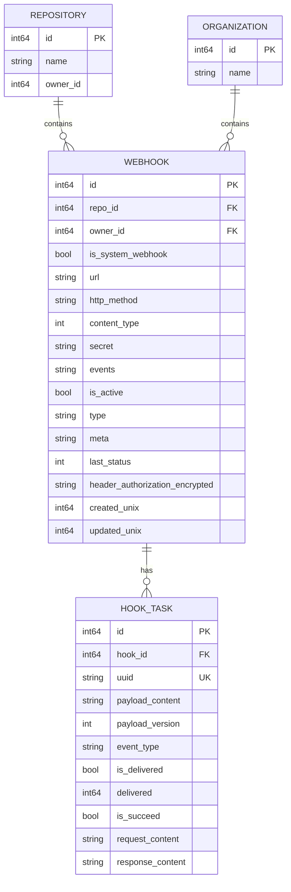
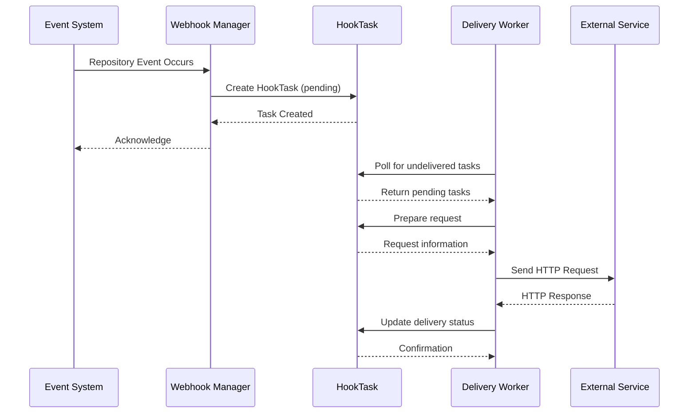

# Webhook Data Model

<cite>
**Referenced Files in This Document**   
- [webhook.go](file://models/webhook/webhook.go)
- [hooktask.go](file://models/webhook/hooktask.go)
- [webhook_system.go](file://models/webhook/webhook_system.go)
</cite>

## Table of Contents
1. [Introduction](#introduction)
2. [Core Entities and Relationships](#core-entities-and-relationships)
3. [Webhook Configuration and Business Rules](#webhook-configuration-and-business-rules)
4. [Delivery Records and Execution Flow](#delivery-records-and-execution-flow)
5. [Data Access Patterns](#data-access-patterns)
6. [Data Lifecycle Management](#data-lifecycle-management)
7. [Performance Considerations](#performance-considerations)
8. [Indexing and Monitoring](#indexing-and-monitoring)

## Introduction
This document provides comprehensive documentation of Gitea's webhook data model, detailing the structure, relationships, and operational characteristics of webhook entities. The system is designed to support event-driven integrations with external services through configurable webhooks at repository, organization, and system levels. The model emphasizes reliability, traceability, and efficient data retrieval for monitoring and troubleshooting webhook deliveries.

**Section sources**
- [webhook.go](file://models/webhook/webhook.go#L1-L50)
- [hooktask.go](file://models/webhook/hooktask.go#L1-L50)

## Core Entities and Relationships

The webhook system in Gitea consists of three primary entities: Webhooks, HookTasks, and delivery records. These entities are organized in a parent-child relationship where Webhooks represent the configuration, and HookTasks represent individual delivery attempts.



**Diagram sources**
- [webhook.go](file://models/webhook/webhook.go#L100-L150)
- [hooktask.go](file://models/webhook/hooktask.go#L50-L80)

**Section sources**
- [webhook.go](file://models/webhook/webhook.go#L100-L150)
- [hooktask.go](file://models/webhook/hooktask.go#L50-L80)

## Webhook Configuration and Business Rules

Webhook configurations in Gitea are stored in the `Webhook` entity, which contains all necessary information for defining when and how external services should be notified of repository events. The configuration supports multiple content types, event filtering, and secure communication.

### Field Definitions

| Field | Type | Constraints | Description |
|-------|------|-------------|-------------|
| ID | int64 | PRIMARY KEY, AUTO_INCREMENT | Unique identifier for the webhook |
| RepoID | int64 | INDEX, FOREIGN KEY | Repository ID (0 for system/default webhooks) |
| OwnerID | int64 | INDEX, FOREIGN KEY | Owner ID (0 for system webhooks) |
| IsSystemWebhook | bool | - | Flag indicating if webhook is system-level |
| URL | string | TEXT | Target URL for webhook delivery |
| HTTPMethod | string | - | HTTP method for delivery (typically POST) |
| ContentType | HookContentType | - | Format of payload (JSON or form-encoded) |
| Secret | string | TEXT | Shared secret for payload signature |
| Events | string | TEXT | JSON-encoded event subscription configuration |
| IsActive | bool | INDEX | Whether webhook is enabled |
| Type | HookType | VARCHAR(16) | Webhook provider type |
| Meta | string | TEXT | Provider-specific configuration attributes |
| LastStatus | HookStatus | - | Result of last delivery attempt |
| HeaderAuthorizationEncrypted | string | TEXT | Encrypted Authorization header value |
| CreatedUnix | TimeStamp | INDEX | Creation timestamp |
| UpdatedUnix | TimeStamp | INDEX | Last update timestamp |

### Business Rules

1. **Ownership Hierarchy**: Webhooks can be associated with repositories (RepoID > 0), organizations (OwnerID > 0, RepoID = 0), or system-wide (OwnerID = 0, RepoID = 0).
2. **Event Filtering**: Webhooks can subscribe to specific event types or receive all events through the `SendEverything` flag.
3. **Security**: The `Secret` field is used to generate payload signatures, and the `HeaderAuthorizationEncrypted` field stores encrypted authorization headers.
4. **System Webhooks**: System-level webhooks (IsSystemWebhook = true) are global configurations that apply across the instance.

**Section sources**
- [webhook.go](file://models/webhook/webhook.go#L150-L300)

## Delivery Records and Execution Flow

The `HookTask` entity represents individual webhook delivery attempts and contains detailed information about each execution. This entity enables tracking, replay, and debugging of webhook deliveries.

### Field Definitions

| Field | Type | Constraints | Description |
|-------|------|-------------|-------------|
| ID | int64 | PRIMARY KEY, AUTO_INCREMENT | Unique identifier for the delivery task |
| HookID | int64 | INDEX, FOREIGN KEY | Reference to parent Webhook |
| UUID | string | UNIQUE | Universally unique identifier for the task |
| PayloadContent | string | LONGTEXT | Serialized event payload |
| PayloadVersion | int | DEFAULT 1 | Version indicator for payload format |
| EventType | HookEventType | - | Type of event that triggered the delivery |
| IsDelivered | bool | - | Whether delivery attempt has been processed |
| Delivered | TimeStampNano | - | Timestamp of delivery attempt |
| IsSucceed | bool | - | Result of delivery attempt |
| RequestContent | string | LONGTEXT | Serialized request information |
| ResponseContent | string | LONGTEXT | Serialized response information |

### Execution Flow



**Diagram sources**
- [hooktask.go](file://models/webhook/hooktask.go#L80-L120)
- [webhook.go](file://models/webhook/webhook.go#L250-L280)

**Section sources**
- [hooktask.go](file://models/webhook/hooktask.go#L50-L200)

## Data Access Patterns

The webhook system supports several key data access patterns for retrieving delivery history and monitoring webhook status.

### Retrieving Delivery History

Webhook delivery history is accessed through the `History` method on the `Webhook` entity, which returns a paginated list of `HookTask` records:

```go
func (w *Webhook) History(ctx context.Context, page int) ([]*HookTask, error)
```

This method queries the `hook_task` table with the following parameters:
- Filter by `hook_id` to retrieve tasks for a specific webhook
- Limit results by `setting.Webhook.PagingNum`
- Offset by `(page-1)*setting.Webhook.PagingNum`
- Order by `id` in descending order (most recent first)

### Status Monitoring

Webhook status is tracked through the `LastStatus` field in the `Webhook` entity, which is updated after each delivery attempt. The status can be one of:
- `Succeed`: Delivery was successful (HTTP 2xx)
- `Failed`: Delivery failed (HTTP 4xx/5xx or network error)
- `Pending`: Delivery has not been attempted

The system also provides methods to query webhook configurations by various criteria, including:
- `GetWebhookByID`: Retrieve by unique identifier
- `GetWebhookByRepoID`: Retrieve by repository and webhook ID
- `GetWebhookByOwnerID`: Retrieve by owner and webhook ID
- `ListWebhookOptions`: Filter webhooks by repository, owner, and active status

**Section sources**
- [webhook.go](file://models/webhook/webhook.go#L280-L348)
- [hooktask.go](file://models/webhook/hooktask.go#L150-L180)

## Data Lifecycle Management

The webhook system implements data lifecycle management policies to control the retention of delivery logs and maintain database performance.

### Retention Policies

Two retention policies are supported for cleaning up delivery logs:

1. **OlderThan**: Removes delivery records older than a specified duration
2. **PerWebhook**: Retains a specified number of most recent deliveries per webhook

The cleanup process is implemented in the `CleanupHookTaskTable` function:

```go
func CleanupHookTaskTable(ctx context.Context, cleanupType HookTaskCleanupType, olderThan time.Duration, numberToKeep int) error
```

### Cleanup Process

For the **PerWebhook** policy, the cleanup process:
1. Identifies all webhook IDs
2. For each webhook, finds the delivery timestamp of the Nth most recent successful delivery
3. Deletes all delivered tasks with timestamps earlier than this cutoff

The cleanup process respects the `is_delivered` flag, only removing records that have completed delivery attempts.

### Default Configuration

By default, Gitea configures webhook delivery logs to be retained based on system settings in `app.ini`:
- `PAGING_NUM`: Number of delivery records per page in the UI
- Retention period or count configured through administrative settings

**Section sources**
- [hooktask.go](file://models/webhook/hooktask.go#L200-L263)

## Performance Considerations

The webhook data model is designed to handle high volumes of webhook events while maintaining system responsiveness and reliability.

### High-Volume Event Handling

The system employs several strategies to handle high volumes of webhook events:

1. **Asynchronous Processing**: Webhook deliveries are processed asynchronously through the `HookTask` queue, preventing event publishing from being blocked by delivery latency.

2. **Batched Cleanup**: The `CleanupHookTaskTable` function processes webhooks in batches, minimizing lock contention and allowing cancellation via context.

3. **Efficient Polling**: The `FindUndeliveredHookTaskIDs` function retrieves up to 100 undelivered tasks at a time, optimizing worker throughput.

4. **Indexing Strategy**: Critical fields are indexed to support efficient querying:
   - `hook_id` on `HookTask` for delivery history retrieval
   - `is_delivered` on `HookTask` for delivery processing
   - `created_unix` and `updated_unix` on `Webhook` for temporal queries

### Scalability Features

- **UUID Generation**: Each `HookTask` is assigned a UUID, enabling distributed systems to reference deliveries without coordination.
- **Payload Versioning**: The `PayloadVersion` field allows for schema evolution of serialized payloads without breaking existing deliveries.
- **Context-Aware Operations**: All database operations accept a context, enabling timeout and cancellation control.

**Section sources**
- [hooktask.go](file://models/webhook/hooktask.go#L180-L263)

## Indexing and Monitoring

The webhook system implements a comprehensive indexing strategy to support monitoring delivery success rates and troubleshooting delivery issues.

### Database Indexes

| Table | Column(s) | Index Type | Purpose |
|-------|---------|-----------|--------|
| webhook | repo_id | INDEX | Fast lookup by repository |
| webhook | owner_id | INDEX | Fast lookup by owner/organization |
| webhook | is_active | INDEX | Filter active webhooks |
| webhook | created_unix | INDEX | Temporal queries |
| webhook | updated_unix | INDEX | Temporal queries |
| hook_task | hook_id | INDEX | Delivery history retrieval |
| hook_task | is_delivered | INDEX | Delivery processing queue |
| hook_task | delivered | INDEX | Temporal analysis of deliveries |

### Monitoring Queries

The system supports several key monitoring patterns:

1. **Delivery Success Rate**: Calculate success rate by querying `HookTask` records within a time window and aggregating `IsSucceed` status.

2. **Delivery Latency**: Analyze the time between event occurrence and delivery by comparing `Delivered` timestamp with event timestamps.

3. **Error Patterns**: Identify common failure modes by grouping failed deliveries by response status codes and error messages.

4. **Throughput Monitoring**: Track webhook volume by counting `HookTask` creations over time intervals.

The `MarkTaskDelivered` function implements an atomic update pattern to prevent duplicate delivery processing:

```go
func MarkTaskDelivered(ctx context.Context, task *HookTask) (bool, error)
```

This function uses a conditional update (`WHERE is_delivered = false`) to ensure idempotency in distributed environments.

**Section sources**
- [hooktask.go](file://models/webhook/hooktask.go#L120-L150)
- [webhook.go](file://models/webhook/webhook.go#L50-L100)