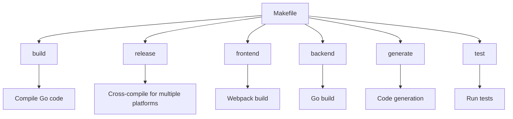
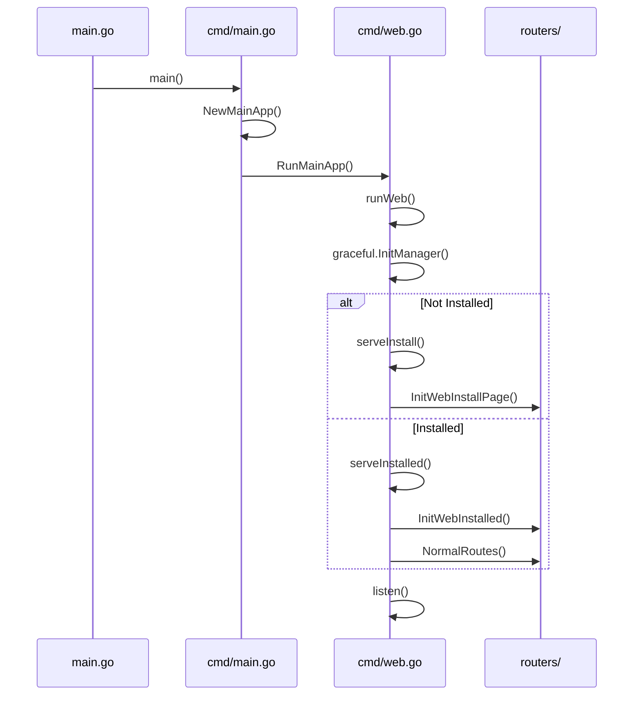
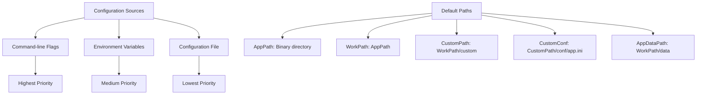

# Binary Installation

<cite>
**Referenced Files in This Document**   
- [main.go](file://main.go)
- [cmd/web.go](file://cmd/web.go)
- [cmd/main.go](file://cmd/main.go)
- [Makefile](file://Makefile)
- [routers/install/routes.go](file://routers/install/routes.go)
- [modules/graceful/manager.go](file://modules/graceful/manager.go)
</cite>

## Table of Contents
1. [Introduction](#introduction)
2. [Build Process with Makefile](#build-process-with-makefile)
3. [Binary Installation and Execution](#binary-installation-and-execution)
4. [Web Server Initialization Process](#web-server-initialization-process)
5. [Configuration System and Default Paths](#configuration-system-and-default-paths)
6. [Service Management with systemd](#service-management-with-systemd)
7. [Common Issues and Troubleshooting](#common-issues-and-troubleshooting)
8. [Conclusion](#conclusion)

## Introduction
Gitea is a painless self-hosted Git service that can be easily installed and run using pre-compiled binaries. This document provides detailed instructions for installing Gitea using binary distribution, focusing on the web server initialization process, build targets, configuration system, and service management. The implementation details of the web server initialization in `cmd/web.go` and its integration with the main application lifecycle in `main.go` are explained, along with step-by-step instructions for setting up and running the service.

**Section sources**
- [main.go](file://main.go#L1-L62)
- [cmd/web.go](file://cmd/web.go#L1-L380)

## Build Process with Makefile
The Gitea project uses a comprehensive Makefile to manage the build process, providing various targets for different purposes. The build system supports multiple operating systems and architectures, allowing for cross-compilation of binaries.

The Makefile defines several key targets:
- `build`: Builds the Gitea binary for the current platform
- `release`: Creates release packages for multiple platforms including Windows, Linux, Darwin, and FreeBSD
- `frontend`: Builds frontend assets using webpack
- `backend`: Builds the backend Go application
- `generate`: Runs code generation tasks
- `test`: Runs unit and integration tests

The build process incorporates Go modules for dependency management and supports various build tags that enable or disable specific features. The Makefile also includes targets for code quality checks, linting, and formatting to ensure code consistency.



**Diagram sources**
- [Makefile](file://Makefile#L1-L959)

**Section sources**
- [Makefile](file://Makefile#L1-L959)

## Binary Installation and Execution
Installing Gitea from pre-compiled binaries involves downloading the appropriate binary for your platform and setting up the execution environment. The binary can be downloaded from the official Gitea releases page or using the provided upgrade script in the contrib directory.

To install Gitea:
1. Download the appropriate binary for your operating system and architecture
2. Make the binary executable: `chmod +x gitea`
3. Create a dedicated user for running Gitea (recommended)
4. Set up the directory structure with appropriate permissions
5. Create a configuration file or use the default settings

The binary can be executed directly with various command-line flags to customize its behavior. The most common execution command is `./gitea web` which starts the web server with default settings.

**Section sources**
- [cmd/main.go](file://cmd/main.go#L1-L168)
- [cmd/web.go](file://cmd/web.go#L1-L380)

## Web Server Initialization Process
The web server initialization process in Gitea is implemented in `cmd/web.go` and follows a structured sequence of operations. The process begins with the `runWeb` function which serves as the entry point for the web server.

The initialization process includes:
1. Setting up the graceful shutdown manager
2. Creating a PID file if specified
3. Determining whether to serve the installation page or the main application
4. Starting the pprof server if enabled
5. Initializing the web server with the appropriate routes

When Gitea is not yet installed, the server serves the installation page which guides users through the setup process. Once installed, it serves the main application with normal routes.



**Diagram sources**
- [main.go](file://main.go#L1-L62)
- [cmd/main.go](file://cmd/main.go#L1-L168)
- [cmd/web.go](file://cmd/web.go#L1-L380)
- [routers/install/routes.go](file://routers/install/routes.go#L1-L48)

**Section sources**
- [cmd/web.go](file://cmd/web.go#L1-L380)
- [main.go](file://main.go#L1-L62)
- [cmd/main.go](file://cmd/main.go#L1-L168)

## Configuration System and Default Paths
Gitea's configuration system uses INI-style configuration files with a hierarchical structure. The default configuration file is located at `{WorkPath}/custom/conf/app.ini`, where `WorkPath` is determined by the binary location or specified via command-line flags.

Key configuration paths:
- `AppPath`: Directory containing the Gitea binary
- `WorkPath`: Working directory for Gitea (defaults to binary directory)
- `CustomPath`: Directory for custom files (defaults to `{WorkPath}/custom`)
- `CustomConf`: Path to the custom configuration file
- `AppDataPath`: Directory for application data

The configuration system allows for environment variable overrides and command-line flag overrides, with command-line flags taking precedence over configuration file values and environment variables.



**Diagram sources**
- [cmd/main.go](file://cmd/main.go#L1-L168)
- [cmd/web.go](file://cmd/web.go#L1-L380)

**Section sources**
- [cmd/main.go](file://cmd/main.go#L1-L168)
- [cmd/web.go](file://cmd/web.go#L1-L380)

## Service Management with systemd
For production deployments, Gitea should be managed as a system service using systemd or other init systems. The contrib directory contains example service files for various platforms.

To set up Gitea as a systemd service:
1. Create a dedicated user for Gitea
2. Copy the binary to a system directory (e.g., `/usr/local/bin/gitea`)
3. Create a service file at `/etc/systemd/system/gitea.service`
4. Configure the service with appropriate user, permissions, and restart policies
5. Enable and start the service

The service file should specify the working directory, configuration file path, and any additional command-line flags needed for the specific deployment.

**Section sources**
- [contrib/upgrade.sh](file://contrib/upgrade.sh#L1-L134)

## Common Issues and Troubleshooting
Several common issues may arise during Gitea binary installation and operation:

### Missing Dependencies
Gitea requires Git to be installed on the system as it relies on Git for repository operations. Ensure Git is installed and available in the system PATH.

### Permission Errors
Run Gitea with appropriate file system permissions. The Gitea process needs read and write access to:
- The working directory
- The custom directory
- The data directory
- The configuration file

### Port Conflicts
The default port for Gitea is 3000. If this port is already in use, either stop the conflicting service or start Gitea on a different port using the `--port` flag.

### Database Configuration
Ensure the database server is running and accessible. Verify database credentials and permissions in the configuration file.

### File System Permissions
Set appropriate ownership and permissions for Gitea directories:
```bash
sudo chown -R git:git /var/lib/gitea/
sudo chmod -R 750 /var/lib/gitea/
```

**Section sources**
- [cmd/web.go](file://cmd/web.go#L1-L380)
- [routers/install/install.go](file://routers/install/install.go#L246-L280)
- [contrib/upgrade.sh](file://contrib/upgrade.sh#L1-L134)

## Conclusion
Binary installation of Gitea provides a straightforward method for deploying the self-hosted Git service. The build process using the Makefile offers flexibility for different deployment scenarios, while the web server initialization process ensures proper startup and graceful shutdown. Understanding the configuration system and default paths is crucial for successful deployment, and proper service management with systemd ensures reliable operation in production environments. By following the guidelines outlined in this document, users can successfully install and run Gitea using the binary distribution method.